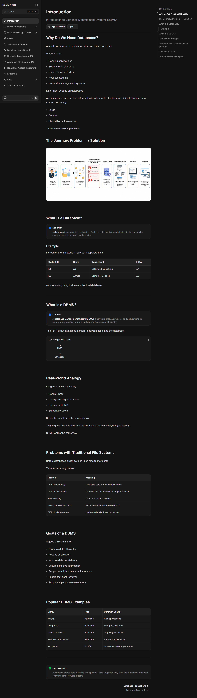
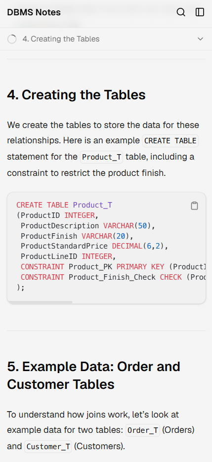
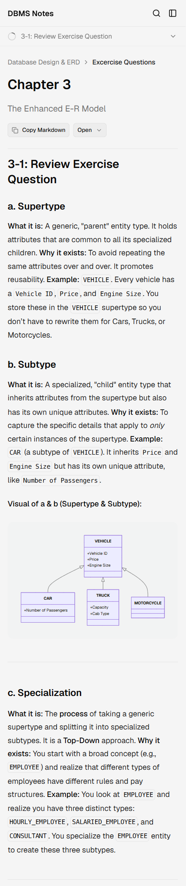

# DBMS Notes
------------------------------------------------------------
                    DBMS Notes

Modern • Interactive • Visual • Exam Focused

Built with Next.js + FumaDocs
------------------------------------------------------------

A modern, interactive documentation website for learning **Database Management Systems (DBMS)**, built with **Next.js**, **FumaDocs**, and **MDX**.

Designed for students, educators, and self-learners who want visually organized, exam-focused, and practical DBMS notes.

---

## ✨ Features

* 📖 Comprehensive DBMS lecture notes
* 🎯 Exam-oriented explanations
* 📊 Beautiful Mermaid diagrams
* 🔍 Instant full-text search
* 📱 Fully responsive design
* 🌙 Dark & Light mode
* 📝 MDX-powered documentation
* ⚡ Fast static site generation
* 📑 Automatic Table of Contents
* 📋 Copy Markdown support
* 🎨 Clean and modern UI

---

## 📸 Preview

> Add screenshots or GIFs here.

### Home Page


### Documentation



### Mobile View





---

## 🚀 Live Demo

**Website**

https://oracle-sql-notes.vercel.app/

---

## 📚 Topics Covered

* Introduction to DBMS
* Database Foundations
* ER Diagrams (ERD)
* Enhanced ERD (EERD)
* Relational Model
* SQL Fundamentals
* SQL Joins
* SQL Subqueries
* Views
* Triggers
* Normalization
* Relational Algebra
* Oracle SQL Labs

More topics are continuously being added.

---


## 🛠️ Tech Stack

| Technology   | Purpose                 |
| ------------ | ----------------------- |
| Next.js      | Framework               |
| React        | UI                      |
| TypeScript   | Type Safety             |
| FumaDocs     | Documentation Framework |
| MDX          | Content Authoring       |
| Tailwind CSS | Styling                 |
| Mermaid      | Diagrams                |
| Vercel       | Deployment              |

---

## 📂 Project Structure

```text
app/
content/
content
 ┗ docs
 ┃ ┣ databasedesign_erd
 ┃ ┃ ┣ ERD
 ┃ ┃ ┃ ┣ advancedrelationships.mdx
 ┃ ┃ ┃ ┣ attributes.mdx
 ┃ ┃ ┃ ┣ casestudies.mdx
 ┃ ┃ ┃ ┣ classification.mdx
 ┃ ┃ ┃ ┣ erdnotations.mdx
 ┃ ┃ ┃ ┣ howtodrawerd.mdx
 ┃ ┃ ┃ ┣ index.mdx
 ┃ ┃ ┃ ┣ meta.json
 ┃ ┃ ┃ ┣ relationsship.mdx
 ┃ ┃ ┃ ┗ specifications.mdx
 ┃ ┃ ┣ ExcerciseQuestions
 ┃ ┃ ┃ ┣ chapter2.mdx
 ┃ ┃ ┃ ┣ chapter3.mdx
 ┃ ┃ ┃ ┗ index.mdx
 ┃ ┃ ┣ index.mdx
 ┃ ┃ ┗ meta.json
 ┃ ┣ dbms_foundations
 ┃ ┃ ┣ 3SchemaArchitecture.mdx
 ┃ ┃ ┣ advantages.mdx
 ┃ ┃ ┣ databaselifecycle.mdx
 ┃ ┃ ┣ datadependency.mdx
 ┃ ┃ ┣ datawarehouse.mdx
 ┃ ┃ ┣ dbmscomponents.mdx
 ┃ ┃ ┣ dbmsexistense.mdx
 ┃ ┃ ┣ dbmslanguage.mdx
 ┃ ┃ ┣ definition.mdx
 ┃ ┃ ┣ erp.mdx
 ┃ ┃ ┣ filevsdbms.mdx
 ┃ ┃ ┣ index.mdx
 ┃ ┃ ┗ meta.json
 ┃ ┣ Labs
 ┃ ┃ ┣ lab10.mdx
 ┃ ┃ ┣ lab11.mdx
 ┃ ┃ ┣ lab12.mdx
 ┃ ┃ ┣ lab3.mdx
 ┃ ┃ ┣ lab4.mdx
 ┃ ┃ ┣ lab5.mdx
 ┃ ┃ ┣ lab6.mdx
 ┃ ┃ ┣ lab7.mdx
 ┃ ┃ ┣ lab8.mdx
 ┃ ┃ ┣ lab9.mdx
 ┃ ┃ ┗ meta.json
 ┃ ┣ advancedsql.mdx
 ┃ ┣ EERD.mdx
 ┃ ┣ index.mdx
 ┃ ┣ joinandsubquery.mdx
 ┃ ┣ lecture15.mdx
 ┃ ┣ lecture16.mdx
 ┃ ┣ meta.json
 ┃ ┣ normalization.mdx
 ┃ ┣ relationalModel.mdx
 ┃ ┗ sql.mdx
components/
lib/
public/
docs/
```

## 🚧 Roadmap

- [x] DBMS Foundations
- [x] ERD
- [x] EERD
- [x] SQL Joins
- [x] PL/SQL
- [ ] Transactions
- [ ] Indexing
- [ ] Query Optimization
- [ ] Interactive Quizzes
- [ ] Practice Questions
- [ ] SQL Playground

---

## ⚙️ Getting Started

Clone the repository

```bash
git clone https://github.com/yourusername/dbms-notes.git
```

Install dependencies

```bash
npm install
```

Run the development server

```bash
npm run dev
```

Open

```
http://localhost:3000
```

---

## 🎯 Purpose

This project was created to:

* Make DBMS concepts easier to understand.
* Prepare students for university exams.
* Provide practical SQL examples.
* Build an open-source learning resource.
* Document my learning journey in Software Engineering.

---

## 🤝 Contributing

Contributions are welcome.

If you'd like to improve the notes, fix errors, or add new content, feel free to open an issue or submit a pull request.

---

## ⭐ Support

If this project helps you, consider giving it a ⭐ on GitHub.


