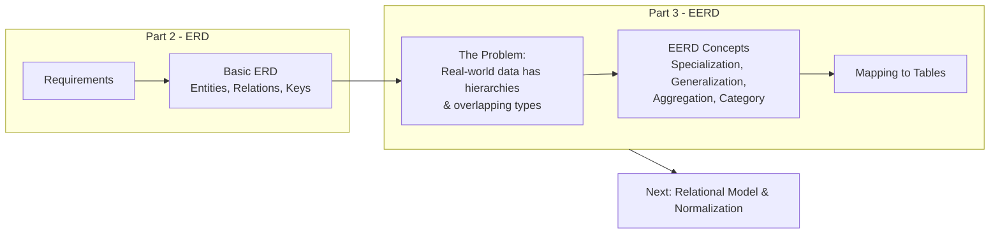
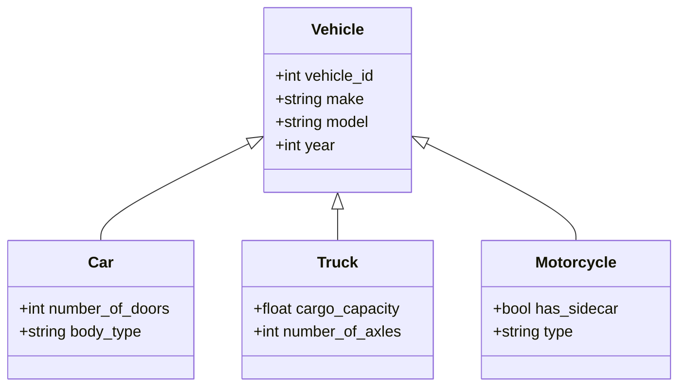
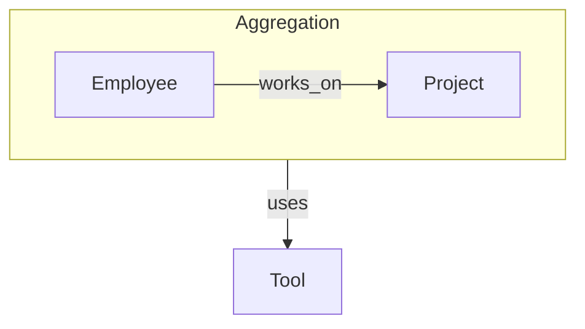
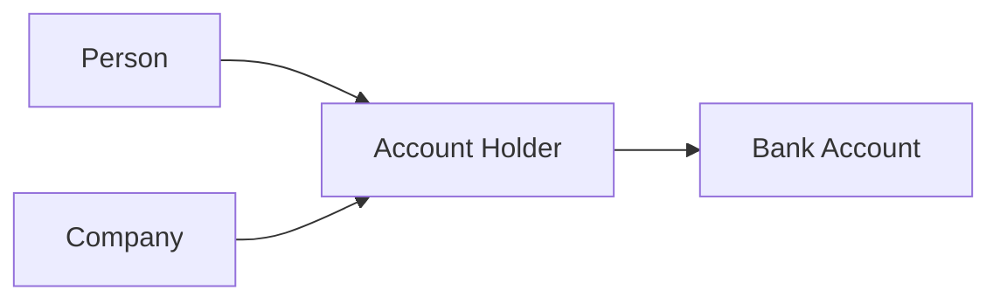
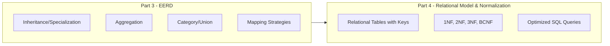

## The Big Picture Flow (Where Are We?)

**Bridge**: Basic ERD treats all entities as independent. But in reality, entities share traits. A **Manager** is an **Employee** with extra powers. A **Car** and **Truck** are both **Vehicles**. EERD gives us the tools to model **inheritance**, **polymorphism**, and **complex relationships** – exactly like OOP, but for databases.

---

## 1. What is EERD and Why Does It Exist?

### 1. Big Picture
Basic ERD cannot capture **is-a** relationships (e.g., a Customer *is a* Person). EERD (Enhanced ERD) extends the model to handle **subtypes** and **supertypes**, allowing us to design databases that mirror object-oriented domain models and reduce redundancy.

### 2. Simple Explanation
Think of EERD as adding **OOP features** to database design:
- **Supertype**: The parent class (e.g., `Vehicle`).
- **Subtype**: The child class (e.g., `Car`, `Bike`). Subtypes inherit all attributes of the supertype and add their own.

It also helps model:
- **Aggregation**: Treating a relationship as a higher-level entity (used for complex relationships).
- **Category (Union)**: An entity that is a subset of multiple supertypes (e.g., `Person` who can be either `Student` or `Employee` or both).

### 3. Key Terms
- **Supertype**: A generic entity type (higher level).
- **Subtype**: A more specific entity type (lower level).
- **Specialization**: Top-down process – splitting a supertype into subtypes.
- **Generalization**: Bottom-up process – combining subtypes into a supertype.
- **Inheritance**: Subtypes acquire all attributes/relationships of the supertype.
- **Disjointness Constraint**: Subtypes are mutually exclusive (d) vs Overlap (o).
- **Completeness Constraint**: Total (double line) – every supertype instance must be a subtype, vs Partial (single line) – some may not.

---

## 2. Specialization & Generalization (The Core of EERD)

### 1. Big Picture
These are two sides of the same coin. **Specialization** is breaking down (refining), **Generalization** is grouping up (abstracting). Both result in an inheritance hierarchy.

### 2. Simple Explanation
- **Generalization (Bottom-Up)**: You have `Car`, `Truck`, `Motorcycle`. You notice they all have `VehicleID`, `Make`, `Model`. So you create a supertype `Vehicle`.
- **Specialization (Top-Down)**: You have `Employee`. You realize some are `Developer`, some are `Manager`, some are `HR`. So you split them into subtypes.

### 3. Visualizing Inheritance (Class Diagram style – familiar to devs)

### 4. Constraints – The Rules of Inheritance

| Constraint | Symbol | Meaning | Example |
| :--- | :--- | :--- | :--- |
| **Disjoint** (d) | `d` | An instance can belong to **only one** subtype. | `Employee` is either `Developer` or `Manager`, never both. |
| **Overlap** (o) | `o` | An instance can belong to **multiple** subtypes. | `Person` can be both `Student` and `Employee`. |
| **Total** (Mandatory) | Double line | Every supertype instance **must** be in at least one subtype. | Every `Vehicle` must be either a `Car` or `Truck` (can't be just "Vehicle"). |
| **Partial** (Optional) | Single line | A supertype instance **may** not belong to any subtype. | A `Person` may not be a `Student` or `Employee` (could be a guest). |

### 5. Real World Example
- **Banking**: `Account` (supertype) → `SavingsAccount`, `CheckingAccount`, `FixedDepositAccount`.
    - **Disjoint** (an account is one type only).
    - **Total** (every account must be one of these).
- **University**: `Person` (supertype) → `Student`, `Faculty`, `Staff`.
    - **Overlap** (a student can also be staff – e.g., teaching assistant).
    - **Partial** (a visitor can be in the system but not a student/staff).

### 6. Software Engineer Perspective
This maps **directly** to OOP inheritance (extends/implements). In real projects:
- We use **ORM** (like Hibernate, Entity Framework) with `@Inheritance` strategies.
- The choice of **database mapping strategy** (Single Table, Joined Table, Table per Class) is directly driven by EERD constraints.
- We love EERD because it reduces code duplication in our domain models.

### 7. Exam Perspective
- **Define** specialization and generalization.
- **Explain** the difference between disjoint and overlap.
- **Explain** total vs partial participation in this context.
- **Identify** constraints from a given scenario.
- **Draw** an EERD with inheritance (using the `d`/`o` and double/single line notations – check your syllabus for Chen vs UML style; UML class diagrams are often accepted now).

### 8. Common Mistakes
- Confusing **disjoint** with **total** – they are independent constraints! (Total = mandatory participation; Disjoint = exclusive membership).
- Forgetting that **subtypes inherit all attributes** of the supertype – so don't repeat them in the subtype.
- Not handling the **discriminator attribute** (the attribute that tells which subtype an instance belongs to – e.g., `account_type`).

### 9. Quick Revision Box
- **Generalization** = bottom-up (combine).
- **Specialization** = top-down (split).
- **Disjoint (d)** = can't be in two subtypes.
- **Overlap (o)** = can be in multiple.
- **Total** = must be in a subtype.
- **Partial** = may not be in a subtype.

---

## 3. Aggregation – Relationship of Relationships

### 1. Big Picture
Sometimes, a **relationship itself** participates in another relationship with a third entity. Aggregation allows us to treat a relationship as a higher-level entity.

### 2. Simple Explanation
Imagine `Employee` **works on** `Project`. That relationship (`Works_On`) is complex and has attributes like `hours`. Now, suppose we want to track which **tools** were used for that specific assignment. The `Tool` is related to the `Works_On` relationship, not directly to `Employee` or `Project`. Aggregation lets us connect `Tool` to `Works_On`.

### 3. Real World Example
- **University**: `Faculty` **teaches** `Course`. This `Teaches` relationship has a `semester`. We need to assign a `Textbook` to that specific teaching assignment (i.e., which textbook is used for this particular course in this semester). The `Textbook` relates to the `Teaches` relationship.
- **Construction**: `Worker` **assigned_to** `Site`. The `Assignment` has a `date`. We want to record the `Equipment` used for that specific assignment.

### 4. Visualizing Aggregation

*(In Chen notation, you'd draw a dashed rectangle around the Works_On relationship and connect Tool to it)*

### 5. Software Engineer Perspective
Aggregation is rare but appears in complex scheduling, resource allocation, and medical systems. In relational mapping, you'd create a table for the `Works_On` relationship and then a separate table linking `Works_On` to `Tool` (i.e., a foreign key referencing the composite PK of `Works_On`).

### 6. Exam Perspective
- **Define** aggregation.
- **Provide an example** where it is necessary.
- **Explain** why we cannot just connect `Tool` directly to `Employee` or `Project` (because the `Tool` is specific to the *assignment*, not the generic employee/project).

### 7. Quick Revision Box
- Aggregation = relationship as an entity.
- Used when a relationship needs to relate to another entity.
- Implemented via composite foreign keys in tables.
- Solves "relationship of relationships".

---

## 4. Category (Union Type)

### 1. Big Picture
A subtype may be a **union** of multiple supertypes. That means the instances of the subtype can come from different sources.

### 2. Simple Explanation
A `BankAccount` owner can be either a `Person` **or** a `Company`. You cannot have a single supertype that covers both. `AccountHolder` is a **category** (union) of `Person` and `Company`.

### 3. Real World Example
- **Banking**: `Account` belongs to `Customer` which can be `Individual` or `Corporate`.
- **Healthcare**: `Test_Result` can be for a `Patient` or for a `Sample` (specimen).
- **University**: `User` in a system can be a `Student`, `Faculty`, or `External_Reviewer` – this is a category union.

### 4. Visualizing Category

### 5. Software Engineer Perspective
In OOP, this is an **interface** or a **union type** (like `String | Int` in TypeScript). In SQL, we implement this using a **shared primary key** and a **type discriminator** column, or by using a separate mapping table that references both possible parent types (with a `owner_type` flag).

### 6. Exam Perspective
- **Define** category (union type).
- **Differentiate** it from specialization/generalization (there is no common supertype).
- **Explain** how to implement it relationally (using a discriminator + FK that references different tables).

### 7. Quick Revision Box
- Category = union of multiple supertypes.
- No common parent entity.
- Implemented using a discriminator column (e.g., `owner_type`).
- Used when a relationship can refer to different types of entities.

---

## 5. Mapping EERD to Relational Tables (The "How-To")

### 1. Big Picture
An EERD is a blueprint. To build a database, we must **map** it to actual tables. Inheritance and categories offer several strategies, each with trade-offs.

### 2. Simple Explanation
For inheritance, we have **4 options**:

| Strategy | How it works | Best for | Trade-offs |
| :--- | :--- | :--- | :--- |
| **1. Single Table** | One table for supertype + all subtypes. Columns for all attributes + a discriminator column. | **Overlap** constraints, small differences, fast reads. | Wasted space (NULLs), tight coupling. |
| **2. Joined Table (Class Table)** | One table for supertype, one for each subtype. Subtype tables have FK to supertype. | **Disjoint** constraints, large differences, clean OOP mapping. | More joins (slower reads), but efficient storage. |
| **3. Table per Concrete Class** | No supertype table. One table for each subtype, repeating supertype attributes. | When supertype is abstract (never instantiated). | Data redundancy (violates DRY), hard to query across types. |
| **4. Table per Class (with inheritance)** | Similar to #2 but each subtype table has *all* columns (including inherited). | Rarely used. | Same issues as #3. |

### 3. Real World Example (Student → Graduate/Undergraduate)
- **Single Table**: `Students` table has `student_id`, `name`, `thesis_title` (NULL for undergrad), `year_of_study`.
- **Joined Table**: `Students` (id, name), `GraduateStudents` (student_id FK, thesis_title), `UndergradStudents` (student_id FK, year_of_study).

### 4. Software Engineer Perspective
We choose based on the ORM:
- **JPA/Hibernate**: `SINGLE_TABLE` (fast), `JOINED` (normalized), `TABLE_PER_CLASS` (rare).
- In microservices, we often prefer **Single Table** for simplicity and performance, even with NULLs, unless the schema is massive.
- For **categories** (union), we use a **foreign key + type column** (e.g., `owner_id` + `owner_type = 'PERSON' | 'COMPANY'`), and we cannot enforce a traditional FK constraint – we enforce it via application logic or triggers.

### 5. Exam Perspective
- **Explain** the mapping strategies.
- **Compare** Single Table vs Joined Table (advantages/disadvantages).
- **Write** the SQL DDL for a given EERD inheritance hierarchy.
- For categories, explain how to handle the "non-FK" situation.

### 6. Common Mistakes
- Forgetting the **discriminator** column in the Single Table strategy.
- Trying to enforce a standard FK constraint for a Category (you can't, because the parent table is ambiguous).
- Choosing `JOINED` when queries are extremely read-heavy and performance-critical (every query does multiple joins).

### 7. Quick Revision Box
- **Single Table**: One table, discriminator, fast, many NULLs.
- **Joined Table**: Parent + child tables, normalized, clean but slower (joins).
- **Category**: Uses a discriminator + application-level integrity.
- **No FK constraint** for category – enforced via app logic.

---

## Mindset Summary – Connecting to Part 4

- EERD gives us the **advanced tools** to model real-world complexity – hierarchies, unions, and relationship-of-relationships.
- As a software engineer, you will use EERD to design **polymorphic domain models** and then decide on the best **database mapping strategy** based on read/write patterns.
- The **mapping** step produces the actual relational schema (tables with primary and foreign keys). From here, we move to **Normalization** to refine the schema and eliminate redundancy, ensuring our beautifully designed EERD translates into a high-performance database.

---
