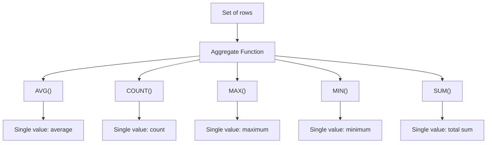

## Section 1: Concept Foundation

### What are SQL Aggregate Functions?
Aggregate functions perform calculations on a set of rows and return a single value. They are used to summarize data, such as calculating averages, totals, counts, or finding the maximum/minimum values.

### Why do they exist?
- **Data Summarization**: Business reports often require summaries (e.g., total sales per region, average salary per department).
- **Decision Making**: Aggregated data helps in identifying trends, outliers, and performance metrics.
- **Efficiency**: Instead of fetching all rows and processing them in application code, SQL aggregates directly compute results on the database server, reducing network overhead.

### Real-world Analogy
Think of a teacher grading a class:
- **AVG()** → class average score.
- **COUNT()** → number of students.
- **MAX()/MIN()** → highest/lowest score.
- **SUM()** → total points earned.

### Where are they used?
- **Reporting**: Monthly sales reports, employee performance dashboards.
- **Data Warehousing**: Aggregating fact tables into summary tables.
- **Analytics**: Finding top products, customer segments, etc.

---

## Section 2: Visual Understanding

### Aggregate Functions Flow



### GROUP BY and HAVING Execution Order


---

## Section 3: Syntax Breakdown and Oracle-Specific Rules

### 1. AVG() – Average
**Purpose**: Returns the average (mean) of a numeric column. Ignores NULL values.

**Syntax**:
```sql
SELECT AVG(column_name) FROM table_name;
```
**Example**:
```sql
SELECT AVG(OrderPrice) AS OrderAverage FROM Orders;
```

### 2. COUNT() – Count Rows
**Purpose**: Returns the number of rows that match a condition.

**Variants**:
- `COUNT(*)` → counts all rows (including NULLs).
- `COUNT(column_name)` → counts non‑NULL values in the column.
- `COUNT(DISTINCT column_name)` → counts distinct non‑NULL values.

**Syntax**:
```sql
SELECT COUNT(*) FROM table_name;
SELECT COUNT(column_name) FROM table_name;
SELECT COUNT(DISTINCT column_name) FROM table_name;
```

**Example**:
```sql
SELECT COUNT(Customer) AS CustomerNilsen FROM Orders WHERE Customer = 'Nilsen';
SELECT COUNT(DISTINCT Customer) AS NumberOfCustomers FROM Orders;
```

### 3. MAX() – Maximum
**Purpose**: Returns the largest value in a numeric, date, or text column.

**Syntax**:
```sql
SELECT MAX(column_name) FROM table_name;
```
**Example**:
```sql
SELECT MAX(OrderPrice) AS LargestOrderPrice FROM Orders;
```

### 4. MIN() – Minimum
**Purpose**: Returns the smallest value in a column.

**Syntax**:
```sql
SELECT MIN(column_name) FROM table_name;
```
**Example**:
```sql
SELECT MIN(OrderPrice) AS SmallestOrderPrice FROM Orders;
```

### 5. SUM() – Total Sum
**Purpose**: Returns the total sum of a numeric column. Ignores NULLs.

**Syntax**:
```sql
SELECT SUM(column_name) FROM table_name;
```
**Example**:
```sql
SELECT SUM(OrderPrice) AS OrderTotal FROM Orders;
```

### 6. GROUP BY Clause
**Purpose**: Groups rows that have the same values in specified columns, then applies aggregate functions to each group.

**Syntax**:
```sql
SELECT column1, aggregate_function(column2)
FROM table_name
WHERE condition
GROUP BY column1;
```

**Explanation**: All non‑aggregated columns in the `SELECT` list must appear in the `GROUP BY` clause.

**Example**:
```sql
SELECT Customer, COUNT(*) AS TotalOrders
FROM Orders
GROUP BY Customer;
```

### 7. HAVING Clause
**Purpose**: Filters groups after grouping. Used when you need to filter on aggregate values (since `WHERE` cannot contain aggregate functions).

**Syntax**:
```sql
SELECT column1, aggregate_function(column2)
FROM table_name
GROUP BY column1
HAVING aggregate_function(column2) condition;
```

**Example**:
```sql
SELECT Customer, SUM(OrderPrice) AS TotalAmount
FROM Orders
GROUP BY Customer
HAVING SUM(OrderPrice) > 250;
```

### 8. FIRST and LAST Records (Oracle Specific)

Oracle does not have a built‑in `FIRST()` or `LAST()` aggregate function. Instead, you retrieve the first or last row using:

- **ROWNUM** (before sorting) – but careful: ROWNUM is assigned before sorting.
  ```sql
  SELECT * FROM (SELECT * FROM orders ORDER BY OrderPrice DESC) WHERE ROWNUM <= 1;
  ```
- **FETCH FIRST** (Oracle 12c+) – more reliable.
  ```sql
  SELECT * FROM orders ORDER BY OrderPrice DESC FETCH FIRST 1 ROW ONLY;
  ```

**Important**: Always use `ORDER BY` to define what "first" or "last" means.

---

## Section 4: Query Thinking Process (Professional Approach)

**Requirement**: "Find the average order price for each customer, but only show customers whose total orders exceed $250."

**Step 1: Identify table** → `Orders`
**Step 2: Identify groups** → `Customer`
**Step 3: Identify aggregate** → `SUM(OrderPrice)`
**Step 4: Filter groups** → `HAVING SUM(OrderPrice) > 250`
**Step 5: Write query**:
```sql
SELECT Customer, SUM(OrderPrice) AS TotalAmount
FROM Orders
GROUP BY Customer
HAVING SUM(OrderPrice) > 250;
```
**Step 6: Validate** → Ensure only customers with total > 250 appear.

---

## Section 5: Multiple Examples

### Example 1: Easy (Count rows)
**Requirement**: Count total number of orders in the `Orders` table.
**Query**:
```sql
SELECT COUNT(*) AS NumberOfOrders FROM Orders;
```

### Example 2: Medium (Average with condition)
**Requirement**: Find the average order price for orders placed after 1-Sep-2008.
**Query**:
```sql
SELECT AVG(OrderPrice) AS AvgAfterSept FROM Orders WHERE OrderDate > '01-SEP-2008';
```

### Example 3: Exam-style (GROUP BY with HAVING)
**Requirement**: For each customer, count how many orders they placed, but only show those with more than 2 orders.
**Query**:
```sql
SELECT Customer, COUNT(*) AS OrderCount
FROM Orders
GROUP BY Customer
HAVING COUNT(*) > 2;
```

### Example 4: Real-world (MAX and MIN per group)
**Requirement**: List each customer's highest and lowest order amount.
**Query**:
```sql
SELECT Customer, MAX(OrderPrice) AS MaxOrder, MIN(OrderPrice) AS MinOrder
FROM Orders
GROUP BY Customer;
```

### Example 5: Tricky (WHERE vs HAVING combined)
**Requirement**: For customers named 'Hansen' or 'Jensen', show their total order amount, but only if the total > 1500.
**Query**:
```sql
SELECT Customer, SUM(OrderPrice) AS TotalAmount
FROM Orders
WHERE Customer IN ('Hansen', 'Jensen')
GROUP BY Customer
HAVING SUM(OrderPrice) > 1500;
```

---

## Section 6: Pattern Recognition

| Requirement Keyword | Think of | SQL Feature |
|---------------------|----------|-------------|
| "Average" | AVG() | `AVG(column)` |
| "Count", "Number of" | COUNT() | `COUNT(*)` or `COUNT(column)` |
| "Distinct values" | COUNT(DISTINCT) | `COUNT(DISTINCT column)` |
| "Highest", "Maximum" | MAX() | `MAX(column)` |
| "Lowest", "Minimum" | MIN() | `MIN(column)` |
| "Total", "Sum" | SUM() | `SUM(column)` |
| "Per group", "For each" | GROUP BY | `GROUP BY column` |
| "Filter after grouping" | HAVING | `HAVING aggregate condition` |
| "First row", "Top" | ORDER BY + FETCH/ROWNUM | `FETCH FIRST 1 ROW ONLY` |

---

## Section 7: Common Mistakes

| Mistake | Wrong Query | Why Wrong | Correct Query |
|---------|-------------|-----------|---------------|
| Using aggregate in WHERE | `SELECT Customer FROM Orders WHERE SUM(OrderPrice) > 500;` | WHERE cannot use aggregate functions. | Use HAVING instead. |
| Forgetting GROUP BY with non‑aggregated columns | `SELECT Customer, OrderPrice FROM Orders GROUP BY Customer;` | OrderPrice is not in GROUP BY and not aggregated; Oracle will error. | Include OrderPrice in GROUP BY or aggregate it (e.g., MAX(OrderPrice)). |
| Using COUNT(column) and expecting NULLs to count | `SELECT COUNT(OrderPrice) FROM Orders WHERE OrderPrice IS NULL;` | COUNT(column) ignores NULLs; result will be 0. | Use COUNT(*) if you want to count NULL rows. |
| Using HAVING without GROUP BY | `SELECT SUM(OrderPrice) FROM Orders HAVING SUM(OrderPrice) > 1000;` | HAVING requires GROUP BY unless you are filtering the whole table; but it's better to use WHERE when no grouping. | Use `WHERE` if no grouping. |
| Using ROWNUM incorrectly for top row | `SELECT * FROM Orders WHERE ROWNUM <= 1 ORDER BY OrderPrice DESC;` | ROWNUM assigned before sorting, so you get the first unsorted row. | Use subquery: `SELECT * FROM (SELECT * FROM Orders ORDER BY OrderPrice DESC) WHERE ROWNUM <= 1;` |
| Using DISTINCT inside COUNT with wrong syntax | `SELECT COUNT(DISTINCT Customer) AS UniqueCustomers FROM Orders;` | Correct in Oracle. (Works fine.) | – |

---

## Section 8: Exam Perspective

### Frequently Asked Questions
1. Write a query to count the number of employees in each department.
2. Find the average salary per job role, but only for jobs with an average salary > 5000.
3. What is the difference between `WHERE` and `HAVING`?
4. How do you retrieve the second highest salary using aggregate functions?
5. Explain the use of `COUNT(DISTINCT column)`.

### Viva Questions
- Can you use `MAX()` on a date column? (Yes, returns the most recent date.)
- What does `COUNT(*)` count? (All rows, including those with NULLs.)
- Does `AVG()` include NULLs? (No, NULLs are ignored.)
- Why is `HAVING` necessary? (Because aggregate functions cannot be used in the WHERE clause.)
- How do you get the first and last record in Oracle? (Use `ORDER BY` with `FETCH FIRST` or `ROWNUM` in a subquery.)

### MCQ
1. Which function returns the number of non‑NULL values in a column?
   a) COUNT(*)   b) COUNT(column)   c) SUM()   d) AVG()
   **Answer: b**

2. The `GROUP BY` clause is used to:
   a) Filter rows   b) Sort rows   c) Group rows for aggregation   d) Join tables
   **Answer: c**

3. Which clause is used to filter groups after aggregation?
   a) WHERE   b) GROUP BY   c) HAVING   d) ORDER BY
   **Answer: c**

---

## Section 9: Industry Perspective

### How professionals use aggregates
- **Business Intelligence**: Aggregates are the core of dashboards and KPI reports.
- **Data Warehousing**: ETL processes often create aggregate tables (materialized views) to speed up queries.
- **Performance Tuning**: Aggregating on indexed columns can be efficient, but using functions like `AVG` on large tables may require full table scans. Professionals often use summary tables.
- **Window Functions**: For advanced analytics, professionals use window functions (e.g., `SUM() OVER(PARTITION BY ...)`) instead of simple aggregates for running totals.

### Best Practices
- **Always include non‑aggregated columns in `GROUP BY`**.
- **Use `HAVING` for filter on aggregates; use `WHERE` for row filters**.
- **Avoid `SELECT *` with aggregates**; specify columns explicitly.
- **When using `COUNT(DISTINCT)`, be mindful of performance**; it can be expensive on large tables.
- **Use `FETCH FIRST` instead of `ROWNUM` for Oracle 12c+**.

---

## Section 10: Query Construction Framework

For any aggregation task:

1. **Identify the table** and columns needed.
2. **Determine the grouping** (if any) – which columns define the groups?
3. **Identify aggregate functions** needed.
4. **Add `WHERE` clause** for row‑level filtering.
5. **Write `GROUP BY` clause** with grouping columns.
6. **Add `HAVING` clause** for group‑level filtering.
7. **Add `ORDER BY`** if sorting is required.
8. **Validate** with sample data.

---

## Section 11: Practice Section

### Beginner Exercises
1. Count the total number of products in `Product_T`.
2. Find the average `ProductStandardPrice` in `Product_T`.
3. Find the highest and lowest `ProductStandardPrice`.
4. Calculate the total `ProductStandardPrice` for all products.
5. Find the number of distinct `ProductFinish` values.

### Intermediate Exercises
1. For each `ProductFinish`, count how many products have that finish.
2. For each `ProductFinish`, find the average price, but only for finishes with an average price > 400.
3. Find the maximum price for each `ProductLineID`.
4. Find the total price of all products grouped by `ProductFinish`, sorted by total descending.
5. List all `ProductFinish` values that have at least 2 products.

### Advanced Exercises
1. Write a query to find the second highest price in `Product_T` (use subquery and MAX).
2. For each `ProductFinish`, count the number of products and their average price, but only include finishes where the average price is between 300 and 500.
3. Using the `Orders` table, find the customer with the highest total order amount.
4. Write a query to show the number of orders per day (group by `OrderDate`), but only for days with more than 1 order.
5. Find the product with the highest price in each `ProductLineID`.

---

## Section 12: Challenge Section – Real-world Scenarios

### Scenario 1: E-commerce Sales
- Table `Sales` with columns `sale_id`, `product_id`, `sale_amount`, `sale_date`.
- Write a query to find the total sales per month, and only show months with total > 5000.

### Scenario 2: Employee Analytics
- Table `Employees` with `department_id`, `salary`, `job_id`.
- Write a query to find the average salary per department, but only for departments with more than 5 employees.

### Scenario 3: Inventory
- Table `Inventory` with `warehouse_id`, `product_id`, `quantity`.
- Write a query to find the warehouse with the highest total quantity of products.

---

## Section 13: Interview Preparation

### Conceptual Questions

1. **Explain the difference between `WHERE` and `HAVING`.**
   - `WHERE` filters rows before grouping; `HAVING` filters groups after grouping. `WHERE` cannot use aggregate functions; `HAVING` can.

2. **What does `COUNT(DISTINCT column)` do?**
   - It counts the number of unique non‑NULL values in the column.

3. **Can you use `MAX()` on a character column?**
   - Yes, it returns the last value in alphabetical order (based on collation).

4. **How do you find the top N rows in Oracle?**
   - Use `FETCH FIRST N ROWS ONLY` (Oracle 12c+) or `ROWNUM` in a subquery.

5. **What happens if you use `GROUP BY` without an aggregate function?**
   - It returns one row per distinct combination of the grouped columns, which is equivalent to `SELECT DISTINCT`.

### Practical SQL Interview Questions

**Q1:** Write a query to find the total salary paid per department.
**Answer:**
```sql
SELECT department_id, SUM(salary) AS total_salary
FROM employees
GROUP BY department_id;
```

**Q2:** Write a query to find departments where the average salary is greater than 5000.
**Answer:**
```sql
SELECT department_id, AVG(salary) AS avg_salary
FROM employees
GROUP BY department_id
HAVING AVG(salary) > 5000;
```

**Q3:** Write a query to count the number of employees in each job role.
**Answer:**
```sql
SELECT job_id, COUNT(*) AS employee_count
FROM employees
GROUP BY job_id;
```

**Q4:** Write a query to find the maximum salary, minimum salary, and average salary for each job, sorted by average descending.
**Answer:**
```sql
SELECT job_id, MAX(salary) AS max_sal, MIN(salary) AS min_sal, AVG(salary) AS avg_sal
FROM employees
GROUP BY job_id
ORDER BY avg_sal DESC;
```

**Q5:** Write a query to find the department with the highest total salary (assume one department).
**Answer:**
```sql
SELECT department_id, SUM(salary) AS total_salary
FROM employees
GROUP BY department_id
ORDER BY total_salary DESC
FETCH FIRST 1 ROW ONLY;
```

---

## Section 14: Topic Summary – Cheat Sheet

### Aggregate Functions (Oracle)

| Function | Description | Example |
|----------|-------------|---------|
| `AVG(column)` | Average of non‑NULL values | `AVG(salary)` |
| `COUNT(*)` | Total rows (including NULLs) | `COUNT(*)` |
| `COUNT(column)` | Non‑NULL values count | `COUNT(salary)` |
| `COUNT(DISTINCT column)` | Distinct non‑NULL values count | `COUNT(DISTINCT department_id)` |
| `MAX(column)` | Maximum value | `MAX(salary)` |
| `MIN(column)` | Minimum value | `MIN(salary)` |
| `SUM(column)` | Total sum | `SUM(salary)` |

### GROUP BY & HAVING

- **GROUP BY**: groups rows by column(s). All non‑aggregated columns in SELECT must appear in GROUP BY.
- **HAVING**: filters groups after aggregation. Can use aggregate functions.
- **Order of clauses**: `FROM` → `WHERE` → `GROUP BY` → `HAVING` → `SELECT` → `ORDER BY`

### FIRST/LAST Records in Oracle
- Use `ORDER BY` + `FETCH FIRST 1 ROW ONLY` (preferred).
- Alternatively, use subquery with `ROWNUM`.

---

### Final Professional Advice
Aggregate functions and grouping are the backbone of data analysis. Always think in terms of groups: "For each X, what is the Y?" Then write the query accordingly. Practice with the lab tasks below to solidify your understanding.

---

## Lab Tasks from the PDF (with solutions)

### Task 1: Count the number of customers with addresses in each state.
```sql
SELECT CustomerState, COUNT(*) AS CustomerCount
FROM Customer_T
GROUP BY CustomerState;
```

### Task 2: Count the number of customers with addresses in each city. List the cities by state.
```sql
SELECT CustomerState, CustomerCity, COUNT(*) AS CustomerCount
FROM Customer_T
GROUP BY CustomerState, CustomerCity
ORDER BY CustomerState, CustomerCity;
```

### Task 3: Find only states with more than one customer.
```sql
SELECT CustomerState, COUNT(*) AS CustomerCount
FROM Customer_T
GROUP BY CustomerState
HAVING COUNT(*) > 1;
```

### Task 4: List, in alphabetical order, the product finish and the average standard price for each finish for selected finishes having an average standard price less than 750.
```sql
SELECT ProductFinish, AVG(ProductStandardPrice) AS AvgPrice
FROM Product_T
GROUP BY ProductFinish
HAVING AVG(ProductStandardPrice) < 750
ORDER BY ProductFinish;
```

### Task 5: Determine validity.
1. Group functions work across many rows to produce one result per group. **True**
2. Group functions include nulls in calculations. **False** (they ignore NULLs except COUNT(*)).
3. The WHERE clause restricts rows before inclusion in a group calculation. **True**

### Task 6 (Employee table):

**Q1: Find the highest, lowest, sum, and average salary of all employees.**
```sql
SELECT MAX(salary) AS Maximum, MIN(salary) AS Minimum, SUM(salary) AS Sum, AVG(salary) AS Average
FROM employees;
```

**Q2: Modify the query above to display the minimum, maximum, sum, and average salary for each job type.**
```sql
SELECT job, MIN(salary) AS Minimum, MAX(salary) AS Maximum, SUM(salary) AS Sum, AVG(salary) AS Average
FROM employees
GROUP BY job;
```

**Q3: Write a query to display the number of people with the same job.**
```sql
SELECT job, COUNT(*) AS EmployeeCount
FROM employees
GROUP BY job;
```

**Q4: List the department details where at least two employees are working.**
```sql
SELECT deptno, COUNT(*) AS EmployeeCount
FROM employees
GROUP BY deptno
HAVING COUNT(*) >= 2;
```

---
