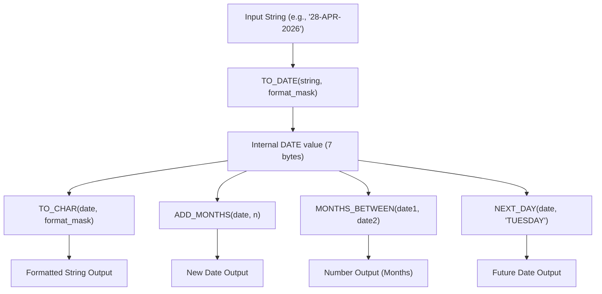
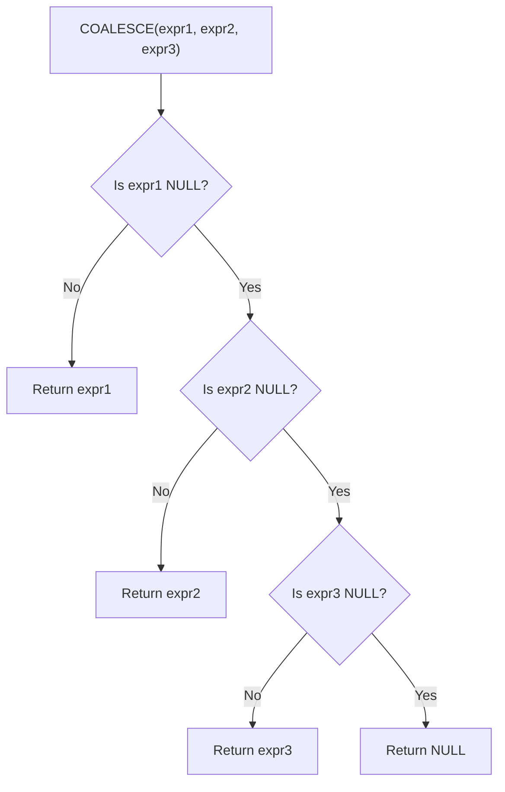

## Section 1: Concept Foundation

### What are Date, String, and Conversion Functions?
Oracle SQL provides a rich set of built-in functions to manipulate **date/time values**, perform **string operations**, and convert data **between different data types** (such as strings to numbers, strings to dates, and dates to formatted strings).

### Why do they exist?
- **Data Manipulation**: Raw data in tables is rarely in the exact format needed for reports or calculations.
- **Business Logic**: Date functions allow calculations like "how many months have passed" or "find the next Tuesday".
- **User Readability**: Conversion functions (like `TO_CHAR`) transform internal database formats into human-readable strings for application displays.
- **Data Integrity**: Conversion functions (like `TO_DATE`) ensure that string inputs are correctly interpreted as proper DATE values, avoiding ambiguity.

### Real-world Analogy
- **TO_DATE** is like a translator converting a written date "April 28, 2026" into a proper calendar entry on a system.
- **TO_CHAR** is like formatting a calendar date to write it on a sticky note as "28-APR-2026" or "April 28, 2026".
- **MONTHS_BETWEEN** is like calculating the age of a person in months.
- **COALESCE** is like a traffic cop checking multiple phone numbers and picking the first one that actually exists.

### Where are they used?
- **Data Warehousing**: Transforming date formats for ETL processes.
- **Reporting**: Formatting financial figures with dollar signs and commas (`TO_CHAR`).
- **Backend Validation**: Converting user input (strings) into database-storable dates.
- **HR/Analytics**: Calculating tenure (duration of employment), finding employees hired in specific decades.

---

## Section 2: Visual Understanding

### Date Function Execution Flow



### COALESCE Logic Flow



---

## Section 3: Syntax Breakdown and Oracle-Specific Rules

### 1. The DATE Data Type
**Purpose**: Stores date and time (year, month, day, hour, minute, second) in a fixed 7-byte internal format.
**Important**: Display format by default is `DD-MON-YY` (e.g., `13-NOV-92`). Time defaults to `00:00:00` (midnight) if not specified.

### 2. TO_DATE Function
**Purpose**: Converts a string to a DATE data type.

**Syntax**:
```sql
TO_DATE(string1, [format_mask])
```

**Explanation**:
- `string1`: The textual representation of the date.
- `format_mask`: Optional, but highly recommended. Describes how `string1` is structured (e.g., `'DD-MON-YYYY'`, `'YYYY/MM/DD'`). If omitted, Oracle uses the default session format, which can cause errors (`ORA-01843`).

**Example**:
```sql
SELECT TO_DATE('28-04-2026', 'DD-MM-YYYY') FROM dual;
```

### 3. The DUAL Table
**Purpose**: A dummy table in Oracle used when a `SELECT` statement must have a `FROM` clause but no actual table data is needed.
**Usage**: Used for evaluating expressions, functions, or calculations. It always contains exactly one row and one column.

### 4. NEXT_DAY Function
**Purpose**: Returns the date of the *first* instance of a specified day of the week that occurs *after* the given date. Always moves forward, never returns the same day.

**Syntax**:
```sql
NEXT_DAY(date_expression, 'day_of_week')
```

**Example**:
```sql
SELECT NEXT_DAY(SYSDATE, 'TUESDAY') FROM dual;
```

### 5. ADD_MONTHS Function
**Purpose**: Adds or subtracts a specified number of months to/from a date.

**Syntax**:
```sql
ADD_MONTHS(date, number_of_months)
```
- Positive `number_of_months` adds months.
- Negative `number_of_months` subtracts months.

**Example**:
```sql
SELECT ADD_MONTHS(SYSDATE, 3) FROM dual;  -- Adds 3 months
SELECT ADD_MONTHS(SYSDATE, -2) FROM dual; -- Subtracts 2 months
```

### 6. MONTHS_BETWEEN Function
**Purpose**: Returns the number of months between two dates.

**Syntax**:
```sql
MONTHS_BETWEEN(date1, date2)
```
- Result is `date1 - date2` (in months).
- Result can be positive (if `date1` is later), negative (if `date1` is earlier), or fractional (partial months).

**Example**:
```sql
SELECT MONTHS_BETWEEN(TO_DATE('28-APR-2026','DD-MON-YYYY'), TO_DATE('28-JAN-2026','DD-MON-YYYY')) FROM dual; -- Result: 3
```

### 7. String Functions

- **UPPER() / LOWER()**: Converts a string to all uppercase or all lowercase.
  ```sql
  SELECT UPPER(CustomerName) FROM Customers;
  ```

- **CONCAT()**: Concatenates exactly two strings. To join more, nest the function.
  ```sql
  CONCAT(string1, string2)
  CONCAT(CONCAT(string1, string2), string3)
  ```
  *Note*: The `||` concatenation operator (e.g., `string1 || string2`) is more commonly used in Oracle for multiple strings.

- **INITCAP()**: Capitalizes the first letter of each word in a string and makes the rest lowercase.
  ```sql
  SELECT INITCAP('hello world') FROM dual; -- Result: 'Hello World'
  ```

### 8. COALESCE Function
**Purpose**: Evaluates a list of expressions from left to right and returns the first non-NULL expression. If all are NULL, it returns NULL.

**Syntax**:
```sql
COALESCE(expr1, expr2, expr3, ...)
```
**Note**: This is equivalent to a `CASE` statement where `expr1` is checked for NOT NULL first.

### 9. Conversion Functions

- **TO_CHAR (Number)**: Converts a number to a string with a specified format.
  ```sql
  TO_CHAR(number, [format_mask])
  ```
  Example: `TO_CHAR(1210.73, '9,999.99')` → `'1,210.73'`; `TO_CHAR(1210.73, '$9,999.00')` → `'$1,210.73'`.

- **TO_CHAR (Date)**: Converts a date to a formatted string.
  ```sql
  TO_CHAR(date, [format_mask])
  ```
  Common format masks: `YYYY`, `MM`, `DD`, `MON`, `MONTH`, `HH24:MI`, `AM/PM`.
  Example: `TO_CHAR(SYSDATE, 'Month DD, YYYY HH:MI AM')` → `'April 28, 2026 10:30 AM'`.

- **TO_NUMBER**: Converts a string to a number.
  ```sql
  TO_NUMBER(string1, [format_mask])
  ```
  Example: `TO_NUMBER('1210.73', '9999.99')` → `1210.73`.

---

## Section 4: Query Thinking Process (Professional Approach)

**Requirement**: "Display all employees who were hired in January (any year) from the `EMPLOYEE` table."

**Step 1: Identify the table** → `EMPLOYEE`
**Step 2: Identify the column** → `HIREDATE` (Date type)
**Step 3: Extract the month component** → Since we need to filter by month, we must convert the internal DATE to a string representing the month. Use `TO_CHAR` with format `'MON'` or `'MM'`.
**Step 4: Write the filter condition** → `TO_CHAR(HIREDATE, 'MON') = 'JAN'` (or `'MM' = '01'`).
**Step 5: Write query**:
```sql
SELECT * FROM EMPLOYEE WHERE TO_CHAR(HIREDATE, 'MON') = 'JAN';
```
**Step 6: Validate** → Check if the result set only contains employees hired in January.

---

## Section 5: Multiple Examples

### Example 1: Easy (String Conversion)
**Requirement**: Display the `CustomerName` in all capital letters.
**Query**:
```sql
SELECT UPPER(CustomerName) AS NAME_IN_CAPS FROM Customers;
```

### Example 2: Medium (Date Arithmetic)
**Requirement**: Calculate the date exactly 6 months after today.
**Query**:
```sql
SELECT ADD_MONTHS(SYSDATE, 6) AS SixMonthsFromNow FROM dual;
```

### Example 3: Exam-style (Date Difference)
**Requirement**: Find the number of months between the current system date and a specific date '01-JAN-2000'.
**Query**:
```sql
SELECT MONTHS_BETWEEN(SYSDATE, TO_DATE('01-JAN-2000', 'DD-MON-YYYY')) AS Months_Passed FROM dual;
```

### Example 4: Real-world (COALESCE for Contact Info)
**Requirement**: Return the first available phone number from Business, Mobile, or Home column for each contact.
**Query**:
```sql
SELECT Name, COALESCE(Business_Phone, Cell_Phone, Home_Phone) AS Contact_Phone FROM Contact_Info;
```

### Example 5: Tricky (Combining Date and String Functions)
**Requirement**: List employee names and their hire date in the format "NAME joined on 17th December Nineteen Eighty".
**Query**:
```sql
SELECT ENAME || ' joined on ' || TO_CHAR(HIREDATE, 'DDth Month YYYY') AS Join_Date
FROM EMP;
```
*Note*: `DDth` adds "th" (e.g., 17th, 2nd, 3rd depending on Oracle's `TH` format element, which might need `SP` or `TH` modifications). An even more professional approach for the specific text requirement: `TO_CHAR(HIREDATE, 'DDth "of" Month "Nineteen" YYYY')` - depending on the exact requirement.

### Example 6: Date Filtering with TO_CHAR
**Requirement**: List employees hired in the year 1986.
**Query**:
```sql
SELECT * FROM EMP WHERE TO_CHAR(HIREDATE, 'YYYY') = '1986';
```

---

## Section 6: Pattern Recognition

| Requirement Keyword | Think of | SQL Feature |
|---------------------|----------|-------------|
| "Convert string to date" | TO_DATE | `TO_DATE(string, format)` |
| "Format date as string" | TO_CHAR (date) | `TO_CHAR(date, format)` |
| "Format number as string" | TO_CHAR (number) | `TO_CHAR(number, format)` |
| "Convert string to number" | TO_NUMBER | `TO_NUMBER(string)` |
| "Next Tuesday", "First Monday" | NEXT_DAY | `NEXT_DAY(date, 'MONDAY')` |
| "Add months", "Subtract months" | ADD_MONTHS | `ADD_MONTHS(date, n)` |
| "Duration in months", "Age in months" | MONTHS_BETWEEN | `MONTHS_BETWEEN(date1, date2)` |
| "Uppercase", "Lowercase" | UPPER / LOWER | `UPPER(col)` |
| "First letter capital" | INITCAP | `INITCAP(col)` |
| "First non-NULL value" | COALESCE | `COALESCE(col1, col2, col3)` |
| "Concatenate" | CONCAT (or \|\|) | `CONCAT(str1, str2)` |

---

## Section 7: Common Mistakes

| Mistake | Wrong Query | Why Wrong | Correct Query |
|---------|-------------|-----------|---------------|
| Using `TO_DATE` without a format mask | `SELECT TO_DATE('28-04-2026') FROM dual;` | Relies on system default formats, which may differ. If format does not match the system mask, it fails. | `SELECT TO_DATE('28-04-2026', 'DD-MM-YYYY') FROM dual;` |
| Using `=` to compare a date to a string | `WHERE HIREDATE = '17-DEC-80'` | Oracle may perform implicit conversion, but it is ambiguous and unreliable. | `WHERE HIREDATE = TO_DATE('17-DEC-80', 'DD-MON-YY')` |
| Using `CONCAT` for multiple strings | `CONCAT('A', 'B', 'C')` | CONCAT only takes 2 arguments. | `CONCAT(CONCAT('A', 'B'), 'C')` or `'A' || 'B' || 'C'` |
| Trying to use `MONTHS_BETWEEN` with strings | `MONTHS_BETWEEN('28-APR-2026', '28-JAN-2026')` | Arguments must be DATE type. | `MONTHS_BETWEEN(TO_DATE('28-APR-2026','DD-MON-YYYY'), TO_DATE('28-JAN-2026','DD-MON-YYYY'))` |
| Format mask mismatch in TO_DATE | `TO_DATE('28-APR-2026', 'MM-DD-YYYY')` | Mask `MM-DD-YYYY` expects day 28 as month (invalid month). | Match the mask exactly to the string: `'DD-MON-YYYY'` |
| Confusing TO_CHAR and TO_DATE | `TO_DATE(HIREDATE, 'YYYY')` | HIREDATE is already a date. `TO_DATE` expects a string. | `TO_CHAR(HIREDATE, 'YYYY')` |

---

## Section 8: Exam Perspective

### Frequently Asked Questions
1. Write a query to convert a string `'2023-12-25'` into a DATE.
2. Write a query to display employee names and their hire dates in the format `'10th June 1998'`.
3. How do you find the number of months between two dates in Oracle?
4. Write a query to find all employees hired in the month of December.
5. What is the difference between `TO_DATE` and `TO_CHAR`?

### Viva Questions
- Explain the `DUAL` table and why it is used.
- What are the 7 bytes stored in an Oracle DATE field?
- How does `COALESCE` differ from `NVL`?
- What happens if you omit the format mask in `TO_DATE`?
- How do you find the next Monday after a given date? (Use `NEXT_DAY`)

### MCQ
1. Which function converts a string to a date?
   a) TO_CHAR   b) TO_DATE   c) TO_NUMBER   d) CONVERT
   **Answer: b**

2. Which function returns the first non-NULL value from a list?
   a) NVL   b) COALESCE   c) ISNULL   d) NULLIF
   **Answer: b**

3. `TO_CHAR(SYSDATE, 'YYYY')` returns:
   a) The current date   b) The current time   c) The current year as a string   d) The current month
   **Answer: c**

---

## Section 9: Industry Perspective

### How professionals use Date and Conversion Functions
- **Data Warehousing**: Professionals use `TO_DATE` with explicit format masks to safely load data from flat files into Oracle databases, ensuring date integrity regardless of the source format.
- **Reporting Dashboards**: `TO_CHAR` is heavily used to format financial figures (e.g., `'$9,999,999.00'`) and dates (e.g., `'MM/DD/YYYY'`) for UI components.
- **Temporal Analytics**: `MONTHS_BETWEEN` and `ADD_MONTHS` are essential for calculating loan interest, subscription renewal dates, and employee tenure.
- **Legacy Data Migration**: When migrating data from older systems, `TO_DATE` with custom masks handles varied date formats (e.g., 'yyyy-dd-mm').

### Best Practices
- **Always use explicit format masks** with `TO_DATE` and `TO_CHAR` to avoid ambiguity and dependency on NLS (National Language Support) settings.
- **Prefer the `||` concatenation operator** over `CONCAT`, as it is more readable and supports multiple strings directly without nesting.
- **Use `COALESCE` over `NVL`** because `COALESCE` is ANSI standard and can handle more than two arguments, making it more flexible.
- **Index on dates**: Consider function-based indexes (e.g., `CREATE INDEX idx_emp_yr ON EMP(TO_CHAR(HIREDATE, 'YYYY'))`) if you frequently filter by formatted year in large tables.

---

## Section 10: Query Construction Framework

For any problem involving date, string, or conversion functions:

1. **Identify the target data type** (Date, Number, or String).
2. **Determine the required output format** or calculation.
3. **Choose the appropriate function**:
   - Convert string to date → `TO_DATE`.
   - Convert date to string → `TO_CHAR`.
   - Perform date arithmetic → `ADD_MONTHS` or `MONTHS_BETWEEN`.
   - Handle NULLs → `COALESCE`.
4. **Write the function call** with explicit format masks where applicable.
5. **Test the logic** in a `SELECT` statement against `DUAL` or a sample row.

---

## Section 11: Practice Section

### Beginner Exercises
1. Convert the string `'2026-12-31'` to a DATE using `TO_DATE`.
2. Convert the current date to the format `'DD Month YYYY'`.
3. Convert the number `1234567.89` to a string with commas and two decimal places.
4. Uppercase the string `'oracle sql'`.
5. Concatenate `'Hello'` and `'World'` using the `CONCAT` function.

### Intermediate Exercises
1. Find the date exactly 3 months before today's date.
2. Find the number of days between `'01-JAN-2025'` and `'01-JAN-2026'` (using `MONTHS_BETWEEN` and multiplying by 30).
3. List employee names where the first letter of the name is capitalized and the rest is lower (using `INITCAP`).
4. Use `COALESCE` to return the first non-NULL value from columns `A`, `B`, `C` where `A=5, B=NULL, C=10`.
5. Display the current date and time in the format `'HH:MI AM'`.

### Advanced Exercises
1. Write a query to display employees hired in the first quarter of any year (January, February, March) using `TO_CHAR`.
2. Write a query to calculate the exact number of months an employee has worked (round down using `FLOOR`).
3. Write a query to format a salary column to show `'$12,345.00'`.
4. Write a query to find employees whose hire date falls on a Wednesday (use `TO_CHAR(HIREDATE, 'DY') = 'WED'`).
5. Write a query that concatenates `FirstName`, a space, and `LastName`, but if `FirstName` is NULL, return only `LastName` (use `COALESCE` or `NVL`).

---

## Section 12: Challenge Section – Real-world Scenarios

### Scenario 1: HR Analytics
You have an `EMPLOYEES` table with `HIRE_DATE` and `SALARY`. Write a query to:
- Display employee name, hire date in `'DDth Month YYYY'` format.
- Calculate their tenure in years and months.
- Find the average salary of employees hired in the year 2020.

### Scenario 2: Financial Reporting
A banking system has a `TRANSACTIONS` table with `TRANSACTION_DATE` (DATE) and `AMOUNT` (NUMBER). Write a query to:
- Display the transaction date in the format `'DD-MON-YYYY HH24:MI'`.
- Display the amount with a leading dollar sign and commas.
- Calculate the interest if the transaction is 6 months old, adding `SYSDATE` plus 6 months to the `TRANSACTION_DATE` for the maturity date.

### Scenario 3: E-commerce Customer Contact
An e-commerce site stores `HOME_PHONE`, `MOBILE_PHONE`, and `WORK_PHONE`. Write a query to select the `CUSTOMER_NAME` and the **first available phone number**, preferring `MOBILE_PHONE` if `HOME_PHONE` is NULL, and `WORK_PHONE` if both previous are NULL.

---

## Section 13: Interview Preparation

### Conceptual Questions

1. **Explain the difference between `TO_DATE` and `TO_CHAR`.**
   - `TO_DATE` converts a string to a DATE object (for storage/filtering). `TO_CHAR` converts a date or number to a formatted string (for display/reporting).

2. **Why is it critical to provide a format mask with `TO_DATE`?**
   - To avoid ambiguity and dependency on session NLS settings. Without a mask, Oracle relies on the default `NLS_DATE_FORMAT`, which varies by environment and can cause runtime errors (`ORA-01843`) or incorrect date interpretation.

3. **How does `COALESCE` handle NULLs?**
   - It scans the arguments from left to right and returns the first expression that is NOT NULL. If all expressions are NULL, it returns NULL.

4. **What does `ADD_MONTHS` return if the input date is the last day of a month and the target month has fewer days?**
   - It returns the last day of the target month. For example, `ADD_MONTHS('28-FEB-2026', 1)` returns `31-MAR-2026` (if 2026 is leap year, it would handle differently), but generally, Oracle adjusts to the last valid day of the target month.

5. **Explain how to find employees hired in a specific decade (e.g., the 1980s).**
   - Use `TO_CHAR(HIREDATE, 'YYYY') BETWEEN '1980' AND '1989'`.

### Practical SQL Interview Questions

**Q1:** Write a query to display the date of the first Monday after today.
**Answer:**
```sql
SELECT NEXT_DAY(SYSDATE, 'MONDAY') FROM dual;
```

**Q2:** Convert the string `'2026-05-15 14:30:00'` to an Oracle DATE.
**Answer:**
```sql
SELECT TO_DATE('2026-05-15 14:30:00', 'YYYY-MM-DD HH24:MI:SS') FROM dual;
```

**Q3:** Write a query to display employee names and the number of months they have worked (assuming they are currently employed, use `SYSDATE`).
**Answer:**
```sql
SELECT ENAME, FLOOR(MONTHS_BETWEEN(SYSDATE, HIREDATE)) AS MONTHS_WORKED FROM EMP;
```

**Q4:** Write a query that returns the first non-NULL phone number from `PHONE1`, `PHONE2`, and `PHONE3`.
**Answer:**
```sql
SELECT COALESCE(PHONE1, PHONE2, PHONE3) AS PRIMARY_PHONE FROM CONTACTS;
```

**Q5:** Format the salary `12345` to display as `$12,345.00`.
**Answer:**
```sql
SELECT TO_CHAR(12345, '$99,999.00') FROM dual;
```
*Note*: The proper mask might be `'$99,999.00'` or `'$9,999.00'` depending on the exact requirement.

---

## Section 14: Topic Summary – Cheat Sheet

### Quick Reference Table

| Category | Function | Syntax | Example |
|----------|----------|--------|---------|
| **Date to String** | `TO_CHAR(date, mask)` | `TO_CHAR(SYSDATE, 'DD-MON-YYYY')` |
| **String to Date** | `TO_DATE(string, mask)` | `TO_DATE('28-APR-2026','DD-MON-YYYY')` |
| **String to Number** | `TO_NUMBER(string, mask)` | `TO_NUMBER('1,210.73','9,999.99')` |
| **Date Arithmetic** | `ADD_MONTHS(date, n)` | `ADD_MONTHS(SYSDATE, 3)` |
| | `MONTHS_BETWEEN(date1, date2)` | `MONTHS_BETWEEN(SYSDATE, HIREDATE)` |
| | `NEXT_DAY(date, 'day')` | `NEXT_DAY(SYSDATE, 'MONDAY')` |
| **String Manipulation** | `UPPER(str)` | `UPPER('hello')` |
| | `LOWER(str)` | `LOWER('WORLD')` |
| | `INITCAP(str)` | `INITCAP('hello world')` |
| | `CONCAT(str1, str2)` | `CONCAT('A', 'B')` |
| **NULL Handling** | `COALESCE(expr1, expr2, ...)` | `COALESCE(NULL, 5, 10)` |
| **Date Format Masks** | `YYYY` (4-digit year), `MM` (month), `DD` (day), `MON` (abbr month), `MONTH` (full month), `HH24` (24h), `MI` (min), `SS` (sec), `AM`/`PM`, `TH` (ordinal suffix) | `TO_CHAR(SYSDATE, 'DDth "of" MONTH YYYY')` |

### Key Takeaways for Date Functions
- **Implicit conversion is dangerous**: Always use explicit `TO_DATE` and `TO_CHAR` with format masks.
- **Date is 7 bytes**: Contains century, year, month, day, hour, minute, second.
- **DUAL**: A dummy table for evaluating expressions.
- **COALESCE over NVL**: COALESCE is standard and flexible.
- **`||` over `CONCAT`**: The pipe operator is more readable for multiple concatenations.

### Final Professional Advice
Mastering these functions transforms a basic SQL user into a professional developer. You can now handle complex date ranges, format output for business reports, and safely convert user inputs. Always test date logic thoroughly, as time zone and NLS settings can produce unexpected results. Practice the lab tasks below to solidify your skills.

---

## Lab Tasks from the PDF (with solutions)

### Task 01: Duration of Employment
**Requirement**: For each employee, display the `Emp name` and the number of months between `SYSDATE` and `HIREDATE`, labeling the column `MONTHS_WORKED`.
**Query**:
```sql
SELECT ENAME, MONTHS_BETWEEN(SYSDATE, HIREDATE) AS MONTHS_WORKED
FROM EMP;
```
*(Note: In the lab manual, the table name might be `EMP` or `EMPLOYEE`. Adjust accordingly.)*

### Task 02: Employees Joined in JAN
**Requirement**: List employees who have `HIREDATE` in JAN.
**Query**:
```sql
SELECT * FROM EMP WHERE TO_CHAR(HIREDATE, 'MON') = 'JAN';
```

### Task 03: Employees Joined in Year 1986
**Requirement**: List employees who have `HIREDATE` in the year 1986.
**Query**:
```sql
SELECT * FROM EMP WHERE TO_CHAR(HIREDATE, 'YYYY') = '1986';
```

### Task 04: Employees Joined in the 1950s
**Requirement**: List employees who were hired during the 1950s.
**Query**:
```sql
SELECT * FROM EMP WHERE TO_CHAR(HIREDATE, 'YYYY') BETWEEN '1950' AND '1959';
```

### Task 05: Specific Years (86, 13, 14)
**Requirement**: List names and salary of those who joined in 86, 13, and 14.
*Interpretation*: These likely mean the years 1986, 2013, and 2014.
**Query**:
```sql
SELECT ENAME, SAL FROM EMP
WHERE TO_CHAR(HIREDATE, 'YYYY') IN ('1986', '2013', '2014');
```

### Task 06: Formatted Hire Dates
**Requirement**: List employee names and their `HIREDATE` in specific formats.
- A. `ALI 17th DEC NINETEEN EIGHTY`
  ```sql
  SELECT ENAME || ' ' || TO_CHAR(HIREDATE, 'DDth MON "NINETEEN" YYYY') AS FORMATTED_DATE
  FROM EMP;
  ```
  *Note*: The words 'NINETEEN' and 'EIGHTY' are hardcoded text representing the year in words. In a real scenario, you would use `TO_CHAR(HIREDATE, 'YYYY SP')` for a fully written year, but the lab specifically asks for "NINETEEN EIGHTY" for a specific date.
- B. `ALI SEVENTEENTH DEC NINETEEN EIGHTY`
  ```sql
  SELECT ENAME || ' ' || TO_CHAR(HIREDATE, 'DDth MON "NINETEEN" YYYY') FROM EMP; -- Similar, but note the exact spelling.
  ```
- C. `ALI week day of joining`
  ```sql
  SELECT ENAME, TO_CHAR(HIREDATE, 'DAY') AS WEEKDAY FROM EMP;
  ```
- D. `ALI 17/12/80`
  ```sql
  SELECT ENAME, TO_CHAR(HIREDATE, 'DD/MM/YY') AS FORMATTED_DATE FROM EMP;
  ```

### Short Quiz (Employee Data)
**Q#01**: Display `Emp name` and calculate the number of months between `SYSDATE` and `HIREDATE`.
**Answer**:
```sql
SELECT ENAME, ROUND(MONTHS_BETWEEN(SYSDATE, HIREDATE), 1) AS MONTHS_WORKED FROM EMP;
```

**Q#02**: List employees who joined in the year 81.
**Answer**:
```sql
SELECT * FROM EMP WHERE TO_CHAR(HIREDATE, 'YYYY') = '1981';
```

**Q#03**: List employees who joined in any year but not in the month of March.
**Answer**:
```sql
SELECT * FROM EMP WHERE TO_CHAR(HIREDATE, 'MM') != '03';
```

---