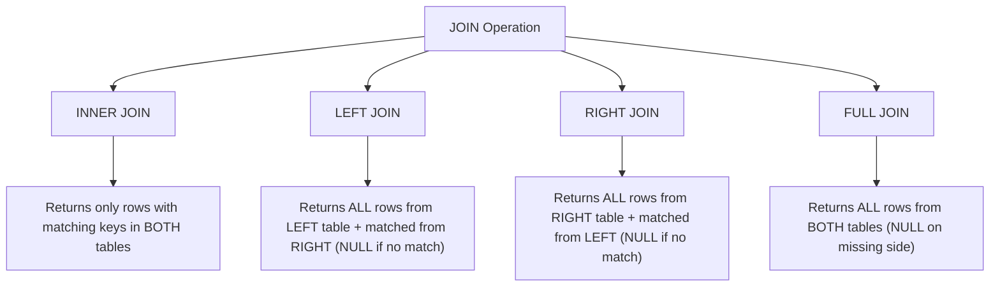
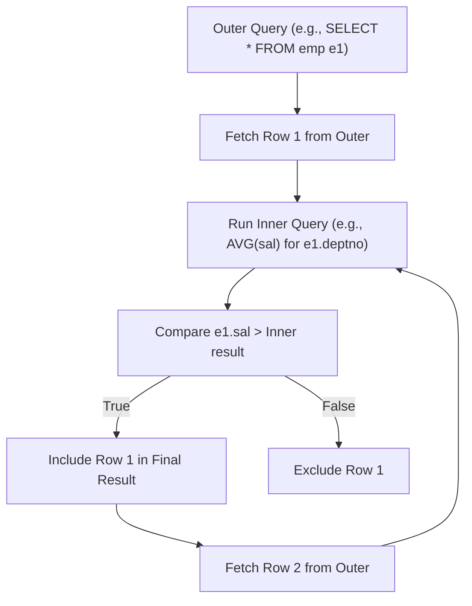

## Section 1: Concept Foundation

### What are Joins and Subqueries?
In a relational database, data is normalized across multiple tables. To answer business questions, you often need to combine data from two or more tables.
- **SQL JOIN**: A relational operation that combines rows from two or more tables based on a related column (common domain). The result is a single temporary table containing columns from all joined tables.
- **Subquery (Nested Query)**: A query nested inside another SQL query. It can be used in the `SELECT`, `FROM`, `WHERE`, or `HAVING` clause. The inner query executes before or depends on the outer query, providing a value or a set of values for filtering or calculation.

### Why do they exist?
- **Data Normalization**: Instead of storing all data in one giant flat table, databases split data into smaller, normalized tables (e.g., `Employees` and `Departments`). Joins reconstruct the complete picture.
- **Complex Business Logic**: Subqueries enable dynamic filtering based on aggregated data (e.g., "Find employees earning more than the department average").
- **Data Integrity**: They allow you to query across relationships without duplicating data.

### Real-world Analogy
- **JOIN** is like merging two separate spreadsheets (e.g., Spreadsheet A: Employee IDs and Names; Spreadsheet B: Employee IDs and Department Names) by matching the Employee ID to get a complete view.
- **Subquery** is like asking a two-part question: First, calculate the average salary (inner query). Second, find employees earning more than that average (outer query).

### Where are they used?
- **Reporting & Dashboards**: Generating consolidated reports from transactional databases.
- **Data Analysis**: Identifying trends, exceptions, and correlations across multiple dimensions.
- **Application Backend**: Fetching complex object graphs (e.g., an Order with its Customer and Line Items) in a single database round-trip.

---

## Section 2: Visual Understanding

### Execution Flow of SQL Joins



### Execution Flow of Correlated Subquery



---

## Section 3: Syntax Breakdown and Oracle-Specific Rules

### 1. INNER JOIN
**Purpose**: Returns only rows where there is a match in *both* tables (the intersection).
**Syntax**:
```sql
SELECT t1.column, t2.column
FROM table1 t1
INNER JOIN table2 t2 ON t1.common_column = t2.common_column;
```
**Explanation**:
- `INNER JOIN`: Combines rows.
- `ON`: Defines the matching condition (usually `Table1.PrimaryKey = Table2.ForeignKey`). Non-matching rows are excluded.

### 2. LEFT JOIN (LEFT OUTER JOIN)
**Purpose**: Returns **all** rows from the left table (`table1`), and the matched rows from the right table (`table2`). If no match exists, `NULL` is returned for right table columns.
**Syntax**:
```sql
SELECT t1.column, t2.column
FROM table1 t1
LEFT JOIN table2 t2 ON t1.common_column = t2.common_column;
```
**Explanation**: The `LEFT` table is the one defined in the `FROM` clause. It is the "parent" table that dictates the result set size.

### 3. RIGHT JOIN (RIGHT OUTER JOIN)
**Purpose**: Returns **all** rows from the right table (`table2`), and the matched rows from the left table (`table1`). If no match exists, `NULL` is returned for left table columns.
**Syntax**:
```sql
SELECT t1.column, t2.column
FROM table1 t1
RIGHT JOIN table2 t2 ON t1.common_column = t2.common_column;
```

### 4. FULL JOIN (FULL OUTER JOIN)
**Purpose**: Returns **all** rows from both tables. Matched rows are combined; unmatched rows from either side show `NULL` for the missing side's columns.
**Syntax**:
```sql
SELECT t1.column, t2.column
FROM table1 t1
FULL JOIN table2 t2 ON t1.common_column = t2.common_column;
```

### 5. Single-Row Subqueries
**Purpose**: Returns exactly **one row** (one value). Used with comparison operators `=`, `>`, `<`, `>=`, `<=`, `<>`.
**Syntax**:
```sql
SELECT column1
FROM table1
WHERE column1 > (SELECT AGGREGATE(column2) FROM table2 WHERE condition);
```
**Example**: Find employees earning more than the global average salary.

### 6. Multi-Row Subqueries
**Purpose**: Returns multiple rows. Used with operators `IN`, `ANY`, `ALL`, `EXISTS`.
**Syntax (with IN)**:
```sql
SELECT column1
FROM table1
WHERE column1 IN (SELECT column2 FROM table2 WHERE condition);
```
**Explanation**: `IN` checks if the outer value matches any value in the list returned by the subquery.

### 7. Correlated Subqueries
**Purpose**: The inner query depends on the outer query. It executes **once for every row** processed by the outer query.
**Syntax**:
```sql
SELECT e1.ename, e1.sal
FROM emp e1
WHERE e1.sal > (SELECT AVG(e2.sal) FROM emp e2 WHERE e2.deptno = e1.deptno);
```
**Explanation**: For each employee (`e1`), Oracle runs the inner query to calculate the average salary of that employee's specific department (`e1.deptno`), then compares it.

### 8. Subquery in FROM Clause (Derived Table / Inline View)
**Purpose**: Treat the result of the subquery as a temporary table, allowing you to join against it or select from it.
**Syntax**:
```sql
SELECT deptno, avg_sal
FROM (SELECT deptno, AVG(sal) AS avg_sal FROM emp GROUP BY deptno) temp;
```
**Explanation**: The inner query creates a virtual table named `temp`, which the outer query reads.

### 9. Subquery Operators: ANY, ALL, EXISTS

| Operator | Meaning | Logic Example |
| :--- | :--- | :--- |
| **IN** | Matches any value in the list | `sal IN (1000, 2000)` |
| **EXISTS** | Checks if at least one row is returned | `WHERE EXISTS (SELECT 1 FROM emp)` |
| **ANY** | Compares with at least one value in the subquery | `sal > ANY (SELECT sal FROM emp)` (Equivalent to `sal > MIN(sal)`) |
| **ALL** | Compares with **every** value in the subquery | `sal > ALL (SELECT sal FROM emp)` (Equivalent to `sal > MAX(sal)`) |

---

## Section 4: Query Thinking Process (Professional Approach)

**Requirement**: "Which customers have not placed any orders for writer's desks?"

**Step 1: Identify the tables involved** -> `Customer_T`, `Order_T`, `OrderLine_T`, `Product_T`.
**Step 2: Identify the target** -> Customer Names.
**Step 3: Determine relationships** -> `Customer_T` -> `Order_T` (via `CustomerID`), `Order_T` -> `OrderLine_T` (via `OrderID`), `OrderLine_T` -> `Product_T` (via `ProductID`).
**Step 4: Determine the filtering logic** -> We need customers who *do NOT* exist in a subquery that filters customers who *did* order writer's desks.
**Step 5: Write the Query**:
1. Find all customers who ordered writer's desk.
2. Find customers not in that list.
```sql
SELECT CustomerName
FROM Customer_T
WHERE CustomerID NOT IN (
    SELECT o.CustomerID
    FROM Order_T o
    JOIN OrderLine_T ol ON o.OrderID = ol.OrderID
    JOIN Product_T p ON ol.ProductID = p.ProductID
    WHERE p.ProductDescription = 'Writer''s Desk'
);
```
**Step 6: Validate** -> Test with sample data. Ensure `Writer's Desk` is the exact product name string.

---

## Section 5: Multiple Examples

### Example 1: Easy (INNER JOIN)
**Requirement**: List all employees and their corresponding department names.
**Query**:
```sql
SELECT e.Name, d.DepartmentName
FROM Employees e
INNER JOIN Departments d ON e.DeptID = d.DeptID;
```
*Observation*: Employee `Usman` (DeptID 5) is excluded because DeptID 5 does not exist in the `Departments` table.

### Example 2: Medium (LEFT JOIN)
**Requirement**: List all employees and their department names. Include employees even if they do not have a valid department.
**Query**:
```sql
SELECT e.Name, d.DepartmentName
FROM Employees e
LEFT JOIN Departments d ON e.DeptID = d.DeptID;
```
*Observation*: `Usman` is included, with `DepartmentName` showing `NULL`.

### Example 3: Exam-style (FULL JOIN)
**Requirement**: List all employees and all departments. Show all combinations, and include unmatched rows from both sides.
**Query**:
```sql
SELECT e.Name, d.DepartmentName
FROM Employees e
FULL JOIN Departments d ON e.DeptID = d.DeptID;
```
*Observation*: Returns `Usman` (no department), `Marketing` (no employee), and all matched rows.

### Example 4: Real-world (Subquery with EXISTS)
**Requirement**: Find all departments that have at least one employee.
**Query**:
```sql
SELECT DepartmentName
FROM Departments d
WHERE EXISTS (SELECT 1 FROM Employees e WHERE e.DeptID = d.DeptID);
```
*Performance Note*: `EXISTS` stops scanning once the first match is found, making it very efficient for checking existence.

### Example 5: Tricky (Correlated Subquery vs JOIN)
**Requirement**: Find employees who earn more than the average salary of their own department.
**Query (Correlated Subquery)**:
```sql
SELECT e1.ename, e1.sal
FROM emp e1
WHERE e1.sal > (SELECT AVG(e2.sal) FROM emp e2 WHERE e2.deptno = e1.deptno);
```
**Query (JOIN version - faster)**:
```sql
SELECT e.ename, e.sal
FROM emp e
JOIN (SELECT deptno, AVG(sal) AS avg_sal FROM emp GROUP BY deptno) d
ON e.deptno = d.deptno
WHERE e.sal > d.avg_sal;
```
*Explanation*: The JOIN version runs the aggregate subquery *once* to create a derived table, then joins and filters. The correlated subquery runs the aggregate query for every single employee row.

---

## Section 6: Pattern Recognition

| Requirement Keyword | Think of | SQL Feature |
|---------------------|----------|-------------|
| "List... and their..." (both sides) | INNER JOIN | Join where `ON` condition matches |
| "Include even if no..." | LEFT JOIN (if preserving left) / RIGHT JOIN (if preserving right) | Outer Join to preserve all rows on one side |
| "All from both tables" | FULL JOIN | Full Outer Join |
| "Greater than the average" | Single-row Subquery | `WHERE col > (SELECT AVG(...))` |
| "In a specific list" | Multi-row Subquery with IN | `WHERE col IN (SELECT ...)` |
| "If a record exists" | EXISTS | `WHERE EXISTS (SELECT 1 ...)` |
| "More than at least one" | ANY | `WHERE col > ANY (SELECT ...)` (compare with MIN) |
| "More than all" | ALL | `WHERE col > ALL (SELECT ...)` (compare with MAX) |
| "Per group/Per department" | Correlated Subquery or JOIN with Derived Table | Inner query depends on outer alias |

---

## Section 7: Common Mistakes

| Mistake | Wrong Query | Why Wrong | Correct Query |
|---------|-------------|-----------|---------------|
| Forgetting the JOIN condition | `SELECT * FROM Employees e, Departments d;` | Creates a Cartesian Product (every employee matched with every department, resulting in a huge, incorrect result set). | Always use `ON e.DeptID = d.DeptID`. |
| Ambiguous column names | `SELECT DeptID FROM Employees e JOIN Departments d ON ...;` | `DeptID` exists in both tables, causing error "ORA-00918: column ambiguously defined". | Use table aliases: `e.DeptID` or `d.DeptID`. |
| Using `= ` for multi-row subqueries | `WHERE sal = (SELECT sal FROM emp WHERE deptno=10);` | If `deptno=10` has multiple employees, the subquery returns more than one row, causing error `ORA-01427: single-row subquery returns more than one row`. | Use `IN` for multiple rows: `WHERE sal IN (SELECT ...)`. |
| Incorrect JOIN direction | `Employees e RIGHT JOIN Departments d` (expecting all employees). | RIGHT JOIN preserves all Departments, not all Employees. | Use `LEFT JOIN` if you want to keep all Employees. |
| Correlated Subquery alias confusion | `SELECT e1.ename FROM emp e1 WHERE sal > (SELECT AVG(sal) FROM emp e2 WHERE e2.deptno = e1.deptno);` (missing `e2.` in the average). | The inner query needs a reference to the outer alias (`e1`). Without it, it may calculate the wrong average. | Ensure the correlation condition references the outer alias (`e1.deptno`). |
| `NOT IN` with NULL values | `WHERE deptno NOT IN (SELECT deptno FROM departments)` (if subquery contains NULL). | If the subquery contains a NULL, the result of `NOT IN` is unknown (NULL) for all rows, returning an empty result set. | Use `NOT EXISTS` instead, or filter out NULLs: `WHERE deptno NOT IN (SELECT deptno FROM departments WHERE deptno IS NOT NULL)`. |

---

## Section 8: Exam Perspective

### Frequently Asked Questions
1. Write a query to list all orders with their customer names.
2. List all products that have never been ordered (use a subquery or LEFT JOIN).
3. What is the difference between `INNER JOIN` and `LEFT JOIN`?
4. Explain the difference between a correlated and non-correlated subquery.
5. Write a query to find the second highest salary using a subquery.

### Viva Questions
- What happens if you omit the `ON` clause in a JOIN? (You get a Cartesian product).
- Why are JOINs generally faster than correlated subqueries for large datasets? (Correlated subqueries execute once for every outer row; JOINs process sets).
- When should you use `EXISTS` instead of `IN`? (When checking existence, `EXISTS` is more efficient and safer with NULLs).
- What is the difference between `ANY` and `ALL`? (ANY matches if at least one value meets the condition (OR); ALL matches only if all values meet the condition (AND)).
- Explain the logic of a derived table (inline view). (It is a subquery in the FROM clause that acts as a temporary table for the outer query).

### MCQ
1. Which JOIN returns all rows from the left table and only matched rows from the right?
   a) INNER JOIN   b) LEFT JOIN   c) RIGHT JOIN   d) FULL JOIN
   **Answer: b**

2. Which operator is used to check if a value matches at least one value from a subquery?
   a) ALL   b) EXISTS   c) ANY   d) IN
   **Answer: c**

3. A subquery that depends on the outer query and executes once per outer row is called:
   a) Single-row subquery   b) Multi-row subquery   c) Correlated subquery   d) Derived table
   **Answer: c**

---

## Section 9: Industry Perspective

### How professionals use JOINS and Subqueries
- **Performance Tuning**: Professionals analyze execution plans. They often rewrite correlated subqueries into `JOIN`s with derived tables because join operations are executed by the optimizer as set-based operations, which are generally faster than row-by-row operations.
- **Data Warehousing**: Star schemas (Fact tables and Dimension tables) rely heavily on `INNER JOIN`s. `LEFT JOIN`s are used when dimension data is missing (e.g., customers without orders) to ensure completeness.
- **Application Development**: ORMs (Object-Relational Mappers) often generate JOIN queries to load associated entities. Professionals avoid N+1 query problems by using explicit JOINs and eager loading.

### Best Practices
- **Prefilter using WHERE before joining**: `WHERE` filters rows after joining in some SQL engines, but in Oracle, the optimizer usually handles it well. However, always ensure your `ON` condition is the most selective.
- **Use `EXISTS` over `IN`**: When checking existence, `EXISTS` is typically more efficient as it stops scanning as soon as a match is found, and it handles `NULL` values gracefully.
- **Avoid `SELECT *` with JOINS**: Specifying columns reduces network traffic and prevents ambiguity.
- **Index Foreign Keys**: Always create indexes on foreign key columns. This drastically speeds up join operations (`ON e.DeptID = d.DeptID`).
- **Use Table Aliases**: Always use meaningful, short aliases (e.g., `e` for employees, `d` for departments) to make queries readable and prevent column ambiguity.

---

## Section 10: Query Construction Framework (Multi-Table Queries)

For any problem requiring data from multiple tables:
1. **Identify all tables** needed to satisfy the requirement.
2. **Determine the relationship** between tables (Foreign Key to Primary Key connections).
3. **Decide on the JOIN type** based on the requirement:
   - If you need matching records only -> `INNER JOIN`.
   - If you need all records from a specific table -> `LEFT JOIN` or `RIGHT JOIN`.
   - If you need all records from all tables -> `FULL JOIN`.
4. **Formulate the JOIN condition** using `ON` and the matching keys.
5. **Filter the rows** using `WHERE` (if needed).
6. **Group and Aggregate** using `GROUP BY` and `HAVING` if aggregates are requested.
7. **Write the query** step-by-step, starting with `FROM` and `JOIN`s.
8. **Validate** the result set size and data accuracy.

---

## Section 11: Practice Section

### Beginner Exercises
1. List all orders with their respective customer names (use `Order_T` and `Customer_T`).
2. List all products and their total quantities ordered (join `OrderLine_T` and `Product_T`).
3. List all departments and the count of employees in each (join `Employees` and `Departments`, group by department).
4. Find all customers who have placed orders (use `INNER JOIN` or a subquery with `IN`).
5. List all products with their finish and standard price, but only those that have been ordered at least once.

### Intermediate Exercises
1. List all customers and their order IDs. Include customers who have not placed any orders (use `LEFT JOIN`).
2. List all products and the order IDs they appear in. Include products that have never been ordered.
3. Find the total value (Quantity * StandardPrice) for each order in the `OrderLine_T` table.
4. List the names of customers who have ordered 'End Table'.
5. Write a query to find the customer(s) who placed the order with the highest total value (requires a subquery or `MAX`).

### Advanced Exercises
1. Using a correlated subquery, find all products whose standard price is greater than the average standard price of all products in their `ProductLineID`.
2. Using the `EMP` table, find all employees who earn more than the average salary of their department (use a derived table or a correlated subquery).
3. Write a query using `NOT EXISTS` to find customers who have never placed an order.
4. Write a query that uses `ANY` to find all products priced greater than the price of at least one product in line 3.
5. Write a query that uses `ALL` to find the product with the highest price in the entire `Product_T` table (or equivalent to `MAX`).

---

## Section 12: Challenge Section – Real-world Scenarios

### Scenario 1: E-commerce Order Fulfillment
A warehouse wants to identify all orders that contain products that are currently out of stock. Tables: `Order_T`, `OrderLine_T`, `Inventory`.
Write a query to list the `OrderID`s and `ProductID`s where the `Quantity` ordered is greater than the `Stock` available for that product.

### Scenario 2: HR Departmental Analysis
Using the standard `EMP` and `DEPT` tables, the HR Director wants a report showing the department name, the number of employees, the average salary, and the maximum salary for each department, but only for departments where the average salary is greater than 3000.

### Scenario 3: Banking Anomaly Detection
The Bank wants to identify accounts where the transaction amount is greater than the average transaction amount of *all accounts*. Write a query to list the `AccountID`, `TransactionAmount`, and the `Average_Transaction_Amount` (calculate `AVG` globally) to highlight the high-value transactions. (Use a derived table to compute the global average).

---

## Section 13: Interview Preparation

### Conceptual Questions

1. **Explain the difference between an INNER JOIN and a LEFT JOIN.**
   - INNER JOIN returns only rows that have a matching key in both tables. LEFT JOIN returns all rows from the left table, and matched rows from the right table; if there is no match, the right table columns are NULL.

2. **When would you use a FULL OUTER JOIN?**
   - When you need to see all records from both tables, regardless of whether they have a matching record in the other table. This is common in data reconciliation or comparing two lists.

3. **What is the fundamental difference between a correlated subquery and a non-correlated subquery?**
   - A non-correlated subquery executes once and provides a static result (e.g., a list of IDs) to the outer query. A correlated subquery executes repeatedly, once for every row selected by the outer query, because the inner query references a column from the outer query.

4. **Why would a developer prefer a JOIN over a correlated subquery?**
   - JOINs are typically optimized by the query optimizer as set-based operations. Correlated subqueries can be significantly slower on large datasets due to their row-by-row execution.

5. **What does `NOT IN` do, and why is it dangerous if the subquery returns NULL?**
   - `NOT IN` excludes values that are in the subquery's result set. If the subquery returns any `NULL`, the entire `NOT IN` condition evaluates to `UNKNOWN` for every row, resulting in an empty result set.

### Practical SQL Interview Questions

**Q1:** Write a query to list all employees (Name and Department Name) using a JOIN.
**Answer**:
```sql
SELECT e.Name, d.DepartmentName
FROM Employees e
JOIN Departments d ON e.DeptID = d.DeptID;
```

**Q2:** Write a query to find all customers who have not placed any orders.
**Answer**:
```sql
SELECT c.CustomerName
FROM Customer_T c
LEFT JOIN Order_T o ON c.CustomerID = o.CustomerID
WHERE o.OrderID IS NULL;
```
*Alternative*:
```sql
SELECT CustomerName FROM Customer_T WHERE CustomerID NOT IN (SELECT CustomerID FROM Order_T);
```

**Q3:** How would you find employees earning more than the average salary of all employees?
**Answer**:
```sql
SELECT ename, sal FROM emp
WHERE sal > (SELECT AVG(sal) FROM emp);
```

**Q4:** Using `ANY`, find all employees who earn more than the lowest salary in department 10.
**Answer**:
```sql
SELECT ename, sal FROM emp
WHERE sal > ANY (SELECT sal FROM emp WHERE deptno = 10);
```
*Logic*: `sal > MIN(sal in dept 10)`.

**Q5:** Write a query to find the product with the highest standard price.
**Answer**:
```sql
SELECT * FROM Product_T
WHERE ProductStandardPrice = (SELECT MAX(ProductStandardPrice) FROM Product_T);
```

---

## Section 14: Topic Summary – Cheat Sheet

### JOINs Cheat Sheet

| Join Type | Keep Left | Keep Right | Rows Included |
| :--- | :--- | :--- | :--- |
| **INNER JOIN** | Only matched | Only matched | Matching rows only (Intersection) |
| **LEFT JOIN** | **All** | Only matched | All Left, NULLs for missing Right |
| **RIGHT JOIN** | Only matched | **All** | All Right, NULLs for missing Left |
| **FULL JOIN** | **All** | **All** | All Left + All Right |

### Subquery Cheat Sheet

| Subquery Type | Execution Style | Output | Common Operators |
| :--- | :--- | :--- | :--- |
| **Single-row** | Executes once, returns one row | Single value | `=` , `>`, `<`, `>=`, `<=`, `<>` |
| **Multi-row** | Executes once, returns multiple rows | List of values | `IN`, `ANY`, `ALL`, `EXISTS` |
| **Correlated** | Executes per outer row (row-by-row) | Single value per row | `=` , `>`, `<` (compared with outer alias) |
| **Derived Table** | Executes once, stored temporarily as a table | Table | Used in `FROM` clause, can be Joined |

### Key Operator Interpretation
- **IN**: Member of a list.
- **EXISTS**: True if at least one row is found.
- **ANY**: Greater than at least one (min).
- **ALL**: Greater than all (max).

---

### Final Professional Advice (Lab Solutions for specific tasks in PDF)

**Task 1**: List customer name, ID, and order number. Include order even if no customer.
```sql
SELECT c.CustomerName, c.CustomerID, o.OrderID
FROM Customer_T c
RIGHT JOIN Order_T o ON c.CustomerID = o.CustomerID;
```

**Task 2**: *(Already covered in examples)*.

**Task 3**: List customer name, ID, and order number. Include customer even if no order.
```sql
SELECT c.CustomerName, c.CustomerID, o.OrderID
FROM Customer_T c
LEFT JOIN Order_T o ON c.CustomerID = o.CustomerID;
```

**Task 4**: List customer name, ID, and order number for all orders. Include order even if no customer.
```sql
SELECT c.CustomerName, c.CustomerID, o.OrderID
FROM Customer_T c
RIGHT JOIN Order_T o ON c.CustomerID = o.CustomerID;
```
*(Note: Task 2, 3, and 4 are fundamental joins. Task 3 is LEFT, Task 4 is RIGHT, Task 1 is RIGHT but focusing on orders).*

**Task 5**: Which customers have not placed any orders for writer's desks?
*(Solution provided in Section 4 - Query Thinking Process)*.

**Task 6**: What is the name and address of the customer who placed order number 1001?
```sql
SELECT c.CustomerName, c.CustomerAddress
FROM Customer_T c
JOIN Order_T o ON c.CustomerID = o.CustomerID
WHERE o.OrderID = 1001;
```

**Task 7**: What is the total value of orders placed for each furniture product?
```sql
SELECT p.ProductDescription, SUM(ol.OrderedQuantity * p.ProductStandardPrice) AS Total_Value
FROM Product_T p
JOIN OrderLine_T ol ON p.ProductID = ol.ProductID
GROUP BY p.ProductDescription;
```

Mastering multi-table queries is the single most important skill for a database professional. Practice writing JOINs and Subqueries by hand, and always ask yourself: "Which tables do I need, and how are they connected?"