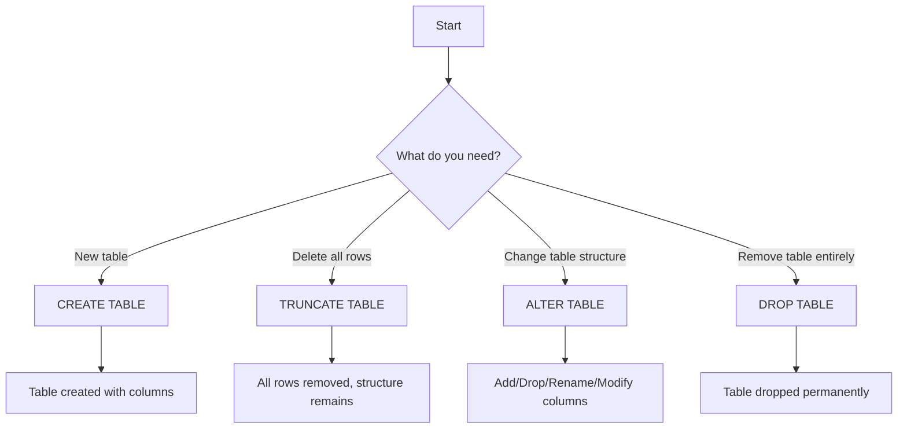
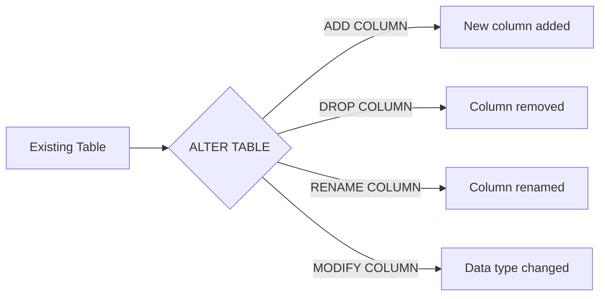

##  Topic Overview

This set of notes covers the **Data Definition Language (DDL)** subset of SQL, focusing on:

- **CREATE TABLE** (including copying tables)
- **TRUNCATE TABLE**
- **ALTER TABLE** (ADD, DROP, RENAME, MODIFY columns)
- **Oracle-specific data types**

All examples are written in **Oracle SQL** syntax as used in SQL Developer.

---

## 🔹 Concept Foundation

### 1. What is SQL?
**Structured Query Language (SQL)** is the standard language for managing relational databases. It is used to:
- Define database structure (DDL)
- Manipulate data (DML)
- Query data (DQL/DRL)
- Control transactions (TCL)
- Control access (DCL)

In this experiment, we focus on **DDL** – commands that define or modify the database schema.

### 2. Why DDL matters
- Tables are the fundamental storage units in a relational database.
- **CREATE** builds the schema; **ALTER** evolves it; **DROP** removes it.
- Without DDL, you cannot store data.
- In real-world projects, schema changes are frequent due to new requirements. Mastering ALTER is essential for maintenance.

### 3. Real-world analogy
Think of a table as a **spreadsheet**:
- **CREATE TABLE**: Designing a new spreadsheet with column headers.
- **ALTER TABLE**: Adding a new column, renaming a header, or changing column format.
- **TRUNCATE**: Clearing all rows while keeping the spreadsheet structure.
- **DROP**: Deleting the whole spreadsheet permanently.

### 4. Where used
- Database administration (schema creation)
- Application development (initial setup)
- Database migration and maintenance (schema upgrades)
- Data warehousing (staging tables)

---

## 🔹 Visual Understanding: DDL Command Flow



**Execution flow for ALTER TABLE commands:**



---

## 🔹 Data Types in Oracle (Detailed)

| Data Type | Description | Max Size | Use Case |
|-----------|-------------|----------|----------|
| `CHAR(n)` | Fixed-length character string | 255 bytes | Codes, fixed-length IDs (e.g., country codes) |
| `VARCHAR2(n)` | Variable-length character string | 4000 bytes (Oracle 12c+) | Names, addresses, descriptions |
| `NUMBER(p,s)` | Numeric with precision (p) and scale (s) | Up to 38 digits | Salary, quantity, price |
| `DATE` | Date and time (24‑hour) | – | Birthdates, order dates |
| `LONG` | Variable-length character (deprecated) | 2 GB | Legacy; use CLOB instead |
| `RAW` | Binary data | 255 bytes | Small images, binary files |

**Oracle-specific notes:**
- `VARCHAR2` is preferred over `VARCHAR` (both exist, but `VARCHAR2` is Oracle’s native).
- `NUMBER` without precision stores values with original precision.
- `DATE` contains both date and time; default time is 00:00:00.

---

## 🔹 CREATE TABLE – Syntax & Usage

### 🔸 General Syntax
```sql
CREATE TABLE table_name (
    column1 datatype [constraints],
    column2 datatype [constraints],
    ...
);
```

### 🔸 Example: Persons Table
```sql
CREATE TABLE Persons (
    PersonID   NUMBER(10),
    LastName   VARCHAR2(255),
    FirstName  VARCHAR2(255),
    Address    VARCHAR2(255),
    City       VARCHAR2(255)
);
```

### 🔸 What happens
- The table is created with the specified columns.
- No data is inserted.
- You can verify with `DESC Persons;` (Oracle SQL*Plus command) or `SELECT * FROM Persons;` (will return empty).

### 🔸 Inserting Data
```sql
INSERT INTO Persons VALUES (1, 'Malik', 'Saba', 'Street 10', 'Lahore');
COMMIT;
SELECT * FROM Persons;
```

**Output:**
```
PERSONID LASTNAME FIRSTNAME ADDRESS    CITY
-------- -------- --------- ---------- ----------
1        Malik    Saba      Street 10  Lahore
```

---

## 🔹 Copying Tables

### 1. Copy Entire Table (Structure + Data)
```sql
CREATE TABLE Persons_Copy AS
SELECT * FROM Persons;
```
- Creates a new table with same columns and all rows.

### 2. Copy Only Structure (Empty Table)
```sql
CREATE TABLE Persons_Empty AS
SELECT * FROM Persons
WHERE 1 = 0;
```
- The condition `WHERE 1 = 0` is always false, so no rows are copied.
- Table structure is identical to source.

### 3. Copy Specific Columns
```sql
CREATE TABLE Persons_Names AS
SELECT PersonID, LastName, FirstName
FROM Persons;
```
- Only three columns are copied; data included.

### 4. Copy Structure + Data with Filter
```sql
CREATE TABLE Persons_Lahore AS
SELECT * FROM Persons
WHERE City = 'Lahore';
```
- Copies only rows where city is Lahore.

---

## 🔹 TRUNCATE TABLE – Delete All Rows Fast

### 🔸 Syntax
```sql
TRUNCATE TABLE table_name;
```

### 🔸 Example
```sql
TRUNCATE TABLE Persons;
```

### 🔸 Key Differences: TRUNCATE vs DELETE

| Feature | TRUNCATE | DELETE |
|---------|----------|--------|
| **SQL Type** | DDL (Data Definition) | DML (Data Manipulation) |
| **WHERE clause** | Not allowed | Allowed |
| **Performance** | Very fast | Slower (row-by-row) |
| **Rollback** | Cannot be rolled back (auto-commit) | Can be rolled back if not committed |
| **Space release** | Releases storage space immediately | Does not release space |
| **Triggers** | Does not fire triggers | Fires triggers |

### 🔸 When to use TRUNCATE
- When you need to quickly empty a table for reloading data.
- In staging or temporary tables.
- When you are sure you want to remove all data permanently.

### 🔸 When NOT to use TRUNCATE
- If you need to keep a subset of rows (use DELETE with WHERE).
- If you need to rollback the operation.
- If you need to fire triggers.

---

## 🔹 ALTER TABLE – Modify Table Structure

### 1. ADD Column

**Purpose:** Add a new column to an existing table.

**Syntax:**
```sql
ALTER TABLE table_name
ADD column_name datatype;
```

**Example:**
```sql
ALTER TABLE Customers
ADD Email VARCHAR2(255);
```
- New column `Email` is added at the end of the table.
- Existing rows get `NULL` for the new column.

### 2. DROP Column

**Purpose:** Permanently remove a column and all its data.

**Syntax:**
```sql
ALTER TABLE table_name
DROP COLUMN column_name;
```

**Example:**
```sql
ALTER TABLE Customers
DROP COLUMN Email;
```
- Column and all its data are removed.
- Cannot be undone.

### 3. RENAME Column

**Purpose:** Change the name of an existing column.

**Syntax:**
```sql
ALTER TABLE table_name
RENAME COLUMN old_name TO new_name;
```

**Example:**
```sql
ALTER TABLE Customers
RENAME COLUMN Email TO EmailAddress;
```

### 4. MODIFY Column Datatype

**Purpose:** Change the data type or size of a column.

**Syntax:**
```sql
ALTER TABLE table_name
MODIFY column_name new_datatype;
```
(Note: In Oracle, you can also use `MODIFY (column_name datatype)`)

**Example:**
```sql
ALTER TABLE Customers
MODIFY ContactName VARCHAR2(100);
```
- Shrinks the column from 255 to 100 characters.
- **Caution:** If existing data exceeds new size, the command will fail.
- You can also enlarge a column safely.

---

## 🔹 ALTER TABLE – Combined Example

```sql
-- Create Customers table
CREATE TABLE Customers (
    CustomerID   NUMBER,
    CustomerName VARCHAR2(255),
    ContactName  VARCHAR2(255)
);

-- Add Email column
ALTER TABLE Customers ADD Email VARCHAR2(255);

-- Rename Email to EmailAddress
ALTER TABLE Customers RENAME COLUMN Email TO EmailAddress;

-- Modify ContactName size to 100
ALTER TABLE Customers MODIFY ContactName VARCHAR2(100);

-- Drop EmailAddress column
ALTER TABLE Customers DROP COLUMN EmailAddress;

-- Verify structure
DESC Customers;
```

---

## 🔹 Query Thinking Process (Professional Approach)

When you see a requirement involving table structure changes, follow this framework:

**Requirement:** *Add a column `DateOfBirth` to the `Persons` table.*

**Step 1: Identify table** → `Persons`

**Step 2: Identify operation** → ADD column

**Step 3: Identify column details** → `DateOfBirth`, data type `DATE`

**Step 4: Choose appropriate SQL command** → `ALTER TABLE ... ADD`

**Step 5: Write query** → `ALTER TABLE Persons ADD DateOfBirth DATE;`

**Step 6: Validate** → `DESC Persons;` to confirm column exists.

---

## 🔹 Pattern Recognition

| Question keywords | Think of | SQL Feature |
|-------------------|----------|-------------|
| “Create a table” | CREATE TABLE | `CREATE TABLE ...` |
| “Add a new column” | ALTER TABLE ADD | `ALTER TABLE ... ADD ...` |
| “Remove a column” | ALTER TABLE DROP | `ALTER TABLE ... DROP COLUMN ...` |
| “Change column name” | ALTER TABLE RENAME | `ALTER TABLE ... RENAME COLUMN ...` |
| “Change data type” | ALTER TABLE MODIFY | `ALTER TABLE ... MODIFY ...` |
| “Delete all rows but keep table” | TRUNCATE | `TRUNCATE TABLE ...` |
| “Copy table” | CREATE … AS SELECT | `CREATE TABLE ... AS SELECT ...` |
| “Copy only structure” | WHERE 1=0 | `CREATE TABLE ... AS SELECT ... WHERE 1=0` |

---

## 🔹 Common Mistakes & How to Avoid Them

| Mistake | Wrong Query | Why Wrong | Correct |
|---------|-------------|-----------|---------|
| Using `DROP COLUMN` without specifying table | `DROP COLUMN Email;` | Must specify table | `ALTER TABLE Customers DROP COLUMN Email;` |
| Using `DELETE` instead of `TRUNCATE` for full table | `DELETE FROM Persons;` | Slower, can be rolled back, not DDL | `TRUNCATE TABLE Persons;` |
| Changing column size to smaller than existing data | `ALTER TABLE Persons MODIFY LastName VARCHAR2(10);` | If any existing value >10 characters, error | Check data length first or enlarge size |
| Forgetting to commit after INSERT | `INSERT INTO ...` | Data not saved until commit | Use `COMMIT;` |
| Using `VARCHAR` instead of `VARCHAR2` | `CREATE TABLE ... (col VARCHAR(255))` | In Oracle, `VARCHAR` is synonymous but `VARCHAR2` is preferred | Use `VARCHAR2` |

---

## 🔹 Exam Perspective

### Frequently Asked Questions

1. **What is the difference between TRUNCATE and DELETE?** (See above)
2. **Write a SQL statement to add a column `Salary` of type NUMBER(10,2) to the `Employees` table.**
3. **How do you copy only the structure of a table without data?**
4. **Can you rollback a TRUNCATE command?** (No, because it is DDL and auto-commits)
5. **Write a query to rename the column `EmpName` to `EmployeeName` in the `Employee` table.**

### Lab Task (From Manual)
> Perform all examples covered in the Lab manual and prepare the Lab Report.

**Suggested approach for lab report:**
- Create each table as described.
- Insert sample data.
- Execute each ALTER command.
- Take screenshots of output (DESC, SELECT).
- Compare before/after.

### Viva Questions
- What is DDL? Give examples.
- Explain the data types CHAR, VARCHAR2, NUMBER.
- Why is TRUNCATE faster than DELETE?
- What happens to the data when you DROP a column?
- Can you modify a column that contains data? What are the risks?

### MCQ
1. Which command removes all rows from a table but keeps the table structure?
   a) DELETE  
   b) DROP  
   c) TRUNCATE  
   d) REMOVE  
   **Answer: c**

2. Which of the following is NOT a DDL command?
   a) CREATE  
   b) ALTER  
   c) TRUNCATE  
   d) INSERT  
   **Answer: d**

3. To add a column to an existing table, you use:
   a) ALTER TABLE … ADD  
   b) ALTER TABLE … MODIFY  
   c) UPDATE TABLE … ADD  
   d) CREATE TABLE … ADD  
   **Answer: a**

---

## 🔹 Industry Perspective

### How Professionals Use DDL

1. **Schema Migration:** When deploying new features, DBAs write ALTER scripts to add columns. They always test on a staging environment first.
2. **Performance Tuning:** Tables that are temporary (e.g., staging tables for ETL) are often truncated before loading new data. TRUNCATE is used for speed.
3. **Database Versioning:** Changes to table structure are versioned and applied via deployment scripts.
4. **Constraints:** In real-world, ALTER TABLE is often used to add constraints (like PRIMARY KEY, FOREIGN KEY) after data is loaded.

### Best Practices

- **Backup before ALTER:** Always take a backup or test on a copy before dropping columns or changing data types.
- **Use `VARCHAR2` over `VARCHAR`** in Oracle.
- **Prefer `NUMBER(10,2)` for monetary values** to avoid rounding errors.
- **Consider data volume:** TRUNCATE is a DDL command and cannot be rolled back; use it only when you are sure.
- **Write ALTER scripts with error handling** (e.g., check if column exists before dropping) using PL/SQL if needed.

### Performance Considerations

- TRUNCATE is a **DDL** command and does **not** generate undo logs, so it is much faster than DELETE.
- ALTER TABLE commands can be **resource-intensive** on large tables. For big tables, consider online operations or scheduled maintenance.

---

## 🔹 Query Construction Framework (Practice)

Use this framework for every problem:

| Step | Action | Example |
|------|--------|---------|
| 1. | **Read requirement** carefully | *Add a column `Phone` to the `Customers` table.* |
| 2. | **Identify table** | `Customers` |
| 3. | **Identify columns involved** | `Phone` (new), data type `VARCHAR2(20)` |
| 4. | **Identify operation needed** | ADD column |
| 5. | **Select SQL command** | `ALTER TABLE ... ADD` |
| 6. | **Write query** | `ALTER TABLE Customers ADD Phone VARCHAR2(20);` |
| 7. | **Validate** | `DESC Customers;` or `SELECT * FROM Customers;` |

---

## 🔹 Practice Section

### Beginner Exercises

1. Create a table `Student` with columns: `StudentID` (NUMBER), `Name` (VARCHAR2(100)), `Age` (NUMBER), `Grade` (VARCHAR2(2)).
2. Add a column `Email` to the `Student` table.
3. Change the `Grade` column to `VARCHAR2(5)`.
4. Rename the column `Age` to `StudentAge`.
5. Truncate the `Student` table.

### Intermediate Exercises

1. Create a copy of the `Student` table named `Student_Backup` including all data.
2. Create a copy of the `Student` table named `Student_Empty` with only the structure (no data).
3. Drop the `Email` column from the `Student` table.
4. Create a table `Employee` with columns: `EmpID`, `EmpName`, `Salary`, `DeptID`. Then add a `HireDate` column.
5. Delete all rows from `Employee` using the **fastest** method.

### Advanced Exercises

1. Write a single ALTER statement to rename the `Employee` table’s column `DeptID` to `DepartmentID` and change its data type to `VARCHAR2(10)` (hint: you need two separate ALTER statements, or combine with MODIFY after rename).
2. Create a table `Orders` with columns: `OrderID`, `CustomerID`, `OrderDate`, `Amount`. Then create a new table `Orders_HighValue` containing only orders with `Amount > 1000`.
3. Copy the structure of `Orders` but include only columns `OrderID`, `OrderDate`, `Amount` into a new table `Orders_Summary`.
4. Write a query to check if the `CustomerID` column exists in `Orders` before dropping it (using `USER_TAB_COLUMNS`). This is a real-world DBA task.
5. Change the data type of `Amount` from `NUMBER` to `NUMBER(12,2)`. Explain what precautions you would take.

---

## 🔹 Solutions (Separate)

**Beginner Solutions:**

1. `CREATE TABLE Student (StudentID NUMBER, Name VARCHAR2(100), Age NUMBER, Grade VARCHAR2(2));`
2. `ALTER TABLE Student ADD Email VARCHAR2(255);`
3. `ALTER TABLE Student MODIFY Grade VARCHAR2(5);`
4. `ALTER TABLE Student RENAME COLUMN Age TO StudentAge;`
5. `TRUNCATE TABLE Student;`

**Intermediate Solutions:**

1. `CREATE TABLE Student_Backup AS SELECT * FROM Student;`
2. `CREATE TABLE Student_Empty AS SELECT * FROM Student WHERE 1=0;`
3. `ALTER TABLE Student DROP COLUMN Email;`
4. `CREATE TABLE Employee (EmpID NUMBER, EmpName VARCHAR2(100), Salary NUMBER, DeptID NUMBER); ALTER TABLE Employee ADD HireDate DATE;`
5. `TRUNCATE TABLE Employee;`

**Advanced Solutions:**

1. 
   ```sql
   ALTER TABLE Employee RENAME COLUMN DeptID TO DepartmentID;
   ALTER TABLE Employee MODIFY DepartmentID VARCHAR2(10);
   ```

2. 
   ```sql
   CREATE TABLE Orders_HighValue AS
   SELECT * FROM Orders
   WHERE Amount > 1000;
   ```

3. 
   ```sql
   CREATE TABLE Orders_Summary AS
   SELECT OrderID, OrderDate, Amount
   FROM Orders;
   ```

4. 
   ```sql
   SELECT COUNT(*) FROM USER_TAB_COLUMNS
   WHERE TABLE_NAME = 'ORDERS' AND COLUMN_NAME = 'CUSTOMERID';
   ```
   If count > 0, then drop.

5. 
   ```sql
   ALTER TABLE Orders MODIFY Amount NUMBER(12,2);
   ```
   **Precautions:** Ensure no existing value exceeds 12 digits total (including decimals). Test on a backup first.

---

## 🔹 Challenge Section – Real-world Scenarios

### Scenario 1: E-commerce Database

You are maintaining an e-commerce database. The `Products` table has columns:
- `ProductID` (NUMBER)
- `ProductName` (VARCHAR2(100))
- `Price` (NUMBER)
- `StockQuantity` (NUMBER)

**Tasks:**
1. Add a column `Category` to group products.
2. Rename `StockQuantity` to `Inventory`.
3. Change `Price` data type to `NUMBER(10,2)`.
4. The marketing team wants a new table `ProductDiscounts` that contains only products with `Price > 500`, and includes columns `ProductID`, `ProductName`, and `DiscountPrice` (which is 10% off). Write the query.
5. After a sale, all products have been sold out. Empty the `Products` table quickly.

### Scenario 2: University Database

The `Students` table contains:
- `StudentID`, `FirstName`, `LastName`, `Major`, `GPA`

**Tasks:**
1. Create a backup of `Students` called `Students_Backup`.
2. Add a `GraduationDate` column.
3. Delete the `Major` column (but keep the backup!).
4. Create a new table `HonorStudents` that copies only students with GPA >= 3.5.
5. The university wants to rename `GPA` to `GradePointAverage`. Write the query.

### Scenario 3: Banking System

The `Accounts` table:
- `AccountID`, `CustomerName`, `Balance`, `AccountType`

**Tasks:**
1. Add a column `InterestRate` (NUMBER(5,2)).
2. Modify `AccountType` to VARCHAR2(20).
3. Create a table `SavingsAccounts` containing only accounts with `AccountType = 'Savings'` and columns `AccountID`, `CustomerName`, `Balance`.
4. Rename `CustomerName` to `AccountHolder`.
5. After a year, the bank wants to archive all accounts with `Balance < 100`. They will be moved to an archive table. Write the queries to create the archive table (structure only) and then insert the rows (you can use `INSERT INTO ... SELECT` – but that’s DML, not DDL). This tests your understanding of combining DDL and DML.

---

## 🔹 Interview Preparation

### Conceptual Questions

1. **Explain the difference between DDL, DML, DCL, and TCL with examples.**
   - DDL: CREATE, ALTER, DROP, TRUNCATE – defines schema.
   - DML: INSERT, UPDATE, DELETE – manipulates data.
   - DCL: GRANT, REVOKE – controls access.
   - TCL: COMMIT, ROLLBACK, SAVEPOINT – manages transactions.

2. **Why is TRUNCATE a DDL command, while DELETE is DML?**
   - TRUNCATE is DDL because it alters the table’s storage (reinitializes the table) and is auto-committed. DELETE is DML because it removes rows and can be rolled back.

3. **What happens to indexes and constraints when you TRUNCATE a table?**
   - Indexes are truncated (emptied) but remain; constraints remain. The table structure persists.

4. **Can you rename a table using ALTER TABLE?**
   - Yes, but it’s `ALTER TABLE old_name RENAME TO new_name;` (not covered in lab but useful). The lab only covered renaming columns.

5. **What is the difference between `DROP COLUMN` and `SET UNUSED COLUMN` in Oracle?**
   - `DROP COLUMN` physically removes column and frees space. `SET UNUSED COLUMN` marks column as unused but doesn’t free space until `DROP UNUSED COLUMNS` is issued; useful for large tables to avoid long locks.

### Practical SQL Interview Questions

**Q1:** You are asked to add a new column `Mobile` to the `Employee` table. Write the query.
**Answer:** `ALTER TABLE Employee ADD Mobile VARCHAR2(15);`

**Q2:** The `Employee` table has a column `Salary` of type NUMBER. The business wants to increase the precision to `NUMBER(12,2)`. Write the query.
**Answer:** `ALTER TABLE Employee MODIFY Salary NUMBER(12,2);`

**Q3:** How would you copy a table `Employee` to `Employee_New` but only include employees from department 10?
**Answer:** `CREATE TABLE Employee_New AS SELECT * FROM Employee WHERE DeptID = 10;`

**Q4:** You need to delete all data from `Logs` table, but you want to be able to rollback in case of mistake. What command would you use?
**Answer:** `DELETE FROM Logs;` (with a `ROLLBACK` available before committing). Not TRUNCATE.

**Q5:** Write a script that renames column `Addr` to `Address` in table `Customers`.
**Answer:** `ALTER TABLE Customers RENAME COLUMN Addr TO Address;`

---

## 🔹 Topic Summary – Cheat Sheet

### DDL Commands (Oracle)

| Command | Syntax | Effect |
|---------|--------|--------|
| CREATE TABLE | `CREATE TABLE t (col datatype);` | Create new table |
| CREATE TABLE … AS | `CREATE TABLE t2 AS SELECT * FROM t1;` | Copy table (structure + data) |
| CREATE TABLE … AS … WHERE 1=0 | `CREATE TABLE t2 AS SELECT * FROM t1 WHERE 1=0;` | Copy only structure |
| TRUNCATE | `TRUNCATE TABLE t;` | Delete all rows, keep structure |
| ALTER TABLE … ADD | `ALTER TABLE t ADD col datatype;` | Add a column |
| ALTER TABLE … DROP COLUMN | `ALTER TABLE t DROP COLUMN col;` | Remove column permanently |
| ALTER TABLE … RENAME COLUMN | `ALTER TABLE t RENAME COLUMN old TO new;` | Rename column |
| ALTER TABLE … MODIFY | `ALTER TABLE t MODIFY col datatype;` | Change column datatype/size |
| DROP TABLE | `DROP TABLE t;` | Remove entire table (not covered but good to know) |

### Key Rules to Remember

- **TRUNCATE** is DDL, cannot be rolled back, faster than DELETE.
- **ALTER TABLE** changes the table structure; changes are permanent.
- When modifying a column, ensure existing data fits the new constraints.
- Copying tables using `CREATE TABLE … AS SELECT` is a common technique for backups and transformation.
- Use `DESC` to view table structure.

---


