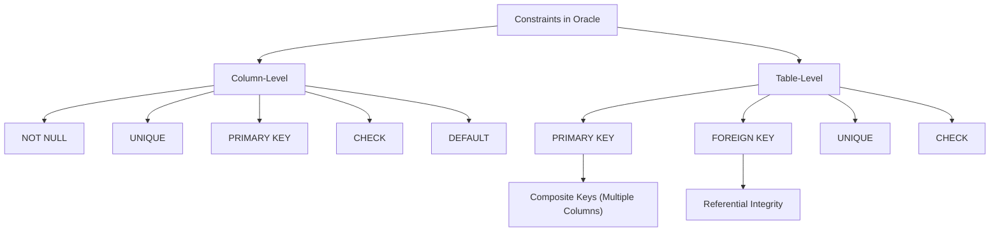
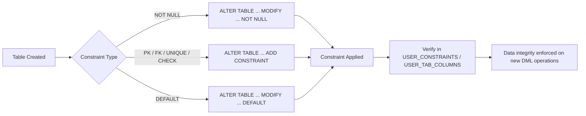

## Section 1: Concept Foundation

### What are SQL Constraints?
Constraints are rules applied to table columns to enforce data integrity. They limit the type of data that can be entered into a table, ensuring accuracy and reliability of the database.

### Why do constraints exist?
- **Prevent data corruption**: They stop invalid data (e.g., negative age, duplicate IDs) from entering the database.
- **Enforce business rules**: They translate real-world policies (e.g., "Every order must have a customer") into database enforcement.
- **Maintain relationships**: They connect tables (Foreign Keys) so orphaned records do not exist.

### Real-world Analogy
Think of constraints as the rules of a form:
- **NOT NULL**: "You cannot leave this field blank."
- **UNIQUE**: "You cannot have two people with the same passport number."
- **PRIMARY KEY**: "Each person must have a unique, non-blank identification card."
- **FOREIGN KEY**: "You cannot order a product that does not exist in the catalog."
- **CHECK**: "Your age must be above 18."
- **DEFAULT**: "If you don't select a country, default to 'USA'."

### Where are constraints used in databases?
- **Schema design**: Defining tables during initial database setup.
- **Database maintenance**: Adding rules to existing tables to clean up or secure legacy data.
- **Application development**: Offloading validation logic from the application layer to the database layer for performance and security.

---

## Section 2: Visual Understanding

### Constraint Hierarchy and Relation



### Execution Flow when Adding Constraints



---

## Section 3: Syntax Breakdown and Oracle-Specific Rules

### 1. NOT NULL Constraint
**Purpose**: Ensures a column cannot contain `NULL` (empty) values.

**Oracle-specific syntax** (Cannot use `ADD CONSTRAINT`):
- **CREATE TABLE**:
  ```sql
  CREATE TABLE table_name (
      column_name datatype NOT NULL
  );
  ```
- **ALTER TABLE (Add)**:
  ```sql
  ALTER TABLE table_name MODIFY column_name datatype NOT NULL;
  ```
- **ALTER TABLE (Drop)**:
  ```sql
  ALTER TABLE table_name MODIFY column_name datatype NULL;
  ```

**Explanation**:
- `MODIFY` is mandatory in Oracle to change a column's attribute.
- Dropping NOT NULL does not remove the column; it simply allows NULLs going forward.

---

### 2. UNIQUE Constraint
**Purpose**: Ensures all values in a column (or combination of columns) are distinct.

**CREATE TABLE (Column Level)**:
```sql
CREATE TABLE Persons (LastName VARCHAR2(255) UNIQUE);
```

**CREATE TABLE (Table Level with name)**:
```sql
CREATE TABLE Persons (
    CONSTRAINT UQ_LastName UNIQUE (LastName)
);
```

**ALTER TABLE (Add)**:
```sql
ALTER TABLE Persons ADD CONSTRAINT UQ_LastName UNIQUE (LastName);
```

**ALTER TABLE (Drop)**:
```sql
ALTER TABLE Persons DROP CONSTRAINT UQ_LastName;
```

**Composite UNIQUE**:
```sql
ALTER TABLE Persons ADD CONSTRAINT UQ_NameCity UNIQUE (FirstName, LastName, City);
```
*Explanation*: The combination of the three columns must be unique. Individual columns may duplicate.

---

### 3. PRIMARY KEY Constraint
**Purpose**: Uniquely identifies each row. Cannot be NULL. Only one per table.

**CREATE TABLE (Column Level)**:
```sql
CREATE TABLE Persons (PersonID NUMBER PRIMARY KEY);
```

**CREATE TABLE (Table Level with name)**:
```sql
CREATE TABLE Persons (
    CONSTRAINT PK_Person PRIMARY KEY (PersonID)
);
```

**ALTER TABLE**:
```sql
ALTER TABLE Persons ADD CONSTRAINT PK_Person PRIMARY KEY (PersonID);
```

**Composite Primary Key**:
```sql
ALTER TABLE Orders ADD CONSTRAINT PK_Order_Detail PRIMARY KEY (OrderID, ProductID);
```

**Drop**:
```sql
ALTER TABLE Persons DROP CONSTRAINT PK_Person;
```

**Important note**: When adding a PRIMARY KEY via ALTER TABLE, the column(s) must have been declared NOT NULL beforehand; otherwise, Oracle will raise an error.

---

### 4. FOREIGN KEY Constraint
**Purpose**: Ensures values in one table match a PRIMARY KEY in another table (Referential Integrity).

**CREATE TABLE**:
```sql
CREATE TABLE Orders (
    OrderID NUMBER PRIMARY KEY,
    P_Id NUMBER,
    CONSTRAINT FK_Person FOREIGN KEY (P_Id) REFERENCES Persons(P_Id)
);
```

**ALTER TABLE**:
```sql
ALTER TABLE Orders ADD CONSTRAINT FK_Person FOREIGN KEY (P_Id) REFERENCES Persons(P_Id);
```

**Composite FOREIGN KEY** (Parent must have composite PK/UNIQUE):
```sql
ALTER TABLE Orders ADD CONSTRAINT FK_Person_Order 
    FOREIGN KEY (P_Id, LastName) REFERENCES Persons(P_Id, LastName);
```

**Drop**:
```sql
ALTER TABLE Orders DROP CONSTRAINT FK_Person_Order;
```

---

### 5. CHECK Constraint
**Purpose**: Limits the values that can be placed in a column based on a logical expression.

**CREATE TABLE**:
```sql
CREATE TABLE Persons (
    P_Id NUMBER,
    CONSTRAINT CHK_PId_Positive CHECK (P_Id > 0)
);
```

**Multiple columns CHECK**:
```sql
ALTER TABLE Persons ADD CONSTRAINT chk_Person CHECK (P_Id > 0 AND City = 'Sandnes');
```

**ALTER TABLE**:
```sql
ALTER TABLE Persons ADD CONSTRAINT CHK_PId_Positive CHECK (P_Id > 0);
```

**Drop**:
```sql
ALTER TABLE Persons DROP CONSTRAINT CHK_PId_Positive;
```

---

### 6. DEFAULT Constraint
**Purpose**: Provides a default value for a column if no value is explicitly supplied during INSERT.

**CREATE TABLE**:
```sql
CREATE TABLE Persons (City VARCHAR2(255) DEFAULT 'Sandnes');
```

**ALTER TABLE (Add)**:
```sql
ALTER TABLE Persons MODIFY City DEFAULT 'Sandnes';
```

**ALTER TABLE (Drop)**:
```sql
ALTER TABLE Persons MODIFY City DEFAULT NULL;
```

**System values (Oracle specific)**:
```sql
CREATE TABLE Orders (CreatedDate DATE DEFAULT SYSDATE);
```

---

### 7. CREATE DOMAIN (Note for Oracle 23c and above)
**Purpose**: Define a reusable data type with constraints, reducing redundancy.

**Syntax (Standard / Oracle 23c)**:
```sql
CREATE DOMAIN CPI_DATA AS REAL CHECK (value >= 0 AND value <= 10);
```

**Usage**:
```sql
CREATE TABLE student (cpi CPI_DATA);
```

**Oracle 11g/12c/19c alternative**: This feature is not natively supported in older Oracle versions. Professionals use a combination of user-defined types or reusable CHECK constraints.

---

## Section 4: Query Thinking Process (Professional Approach)

**Requirement**: "Ensure that an employee's salary cannot be negative."

**Step 1: Identify the table** -> Employees
**Step 2: Identify the column** -> Salary
**Step 3: Identify the requirement** -> Salary >= 0
**Step 4: Select the appropriate SQL feature** -> CHECK constraint
**Step 5: Determine syntax**
- If table exists -> `ALTER TABLE Employees ADD CONSTRAINT CHK_Salary CHECK (Salary >= 0);`
- If creating new -> `... CONSTRAINT CHK_Salary CHECK (Salary >= 0)`
**Step 6: Validate** -> Try inserting negative value; verify in `USER_CONSTRAINTS`.

---

## Section 5: Multiple Examples

### Example 1: Easy (Single Column NOT NULL)
**Requirement**: Create a table `Customers` where `CustomerID` and `Email` cannot be NULL.
**Query**:
```sql
CREATE TABLE Customers (
    CustomerID NUMBER NOT NULL,
    CustomerName VARCHAR2(100),
    Email VARCHAR2(255) NOT NULL
);
```

### Example 2: Medium (Composite UNIQUE)
**Requirement**: In a `Bookings` table, ensure the combination of `RoomID` and `BookingDate` is unique.
**Query**:
```sql
CREATE TABLE Bookings (
    BookingID NUMBER PRIMARY KEY,
    RoomID NUMBER,
    BookingDate DATE,
    CONSTRAINT UQ_Room_Date UNIQUE (RoomID, BookingDate)
);
```

### Example 3: Exam-style (Foreign Key with ON DELETE rules)
**Requirement**: Create an `Orders` table that links to a `Customers` table. If a customer is deleted, the orders should also be deleted.
**Query**:
```sql
CREATE TABLE Orders (
    OrderID NUMBER PRIMARY KEY,
    CustomerID NUMBER,
    CONSTRAINT FK_Customer FOREIGN KEY (CustomerID) 
        REFERENCES Customers(CustomerID) ON DELETE CASCADE
);
```
*Explanation*: `ON DELETE CASCADE` is an Oracle-specific feature for foreign keys to automate deletion.

### Example 4: Real-world industry (Audit tables)
**Requirement**: Create an `AuditLog` table where `LogDate` defaults to system time, and `LogLevel` must be 'INFO', 'WARN', or 'ERROR'.
**Query**:
```sql
CREATE TABLE AuditLog (
    LogID NUMBER PRIMARY KEY,
    LogMessage VARCHAR2(1000),
    LogDate DATE DEFAULT SYSDATE,
    LogLevel VARCHAR2(10),
    CONSTRAINT CHK_LogLevel CHECK (LogLevel IN ('INFO', 'WARN', 'ERROR'))
);
```

### Example 5: Tricky (Adding NOT NULL to existing column)
**Requirement**: The `Employees` table already has `HireDate`. We want to enforce it cannot be NULL. However, some existing rows have NULL. What happens?
**Query**:
```sql
ALTER TABLE Employees MODIFY HireDate DATE NOT NULL;
```
*Issue*: Oracle throws error `ORA-02296: cannot enable (..) - null values found` if existing rows contain NULL. 
**Solution**: Update NULLs to a default value first:
```sql
UPDATE Employees SET HireDate = SYSDATE WHERE HireDate IS NULL;
COMMIT;
ALTER TABLE Employees MODIFY HireDate DATE NOT NULL;
```

---

## Section 6: Pattern Recognition

| Requirement Keyword | Think of | SQL Feature |
|---------------------|----------|-------------|
| "Cannot be empty", "Must have a value" | NOT NULL | `MODIFY column NOT NULL` |
| "No duplicates", "Unique identifier" | UNIQUE or PRIMARY KEY | `ADD CONSTRAINT ... UNIQUE` / `PRIMARY KEY` |
| "Each row must be uniquely identified" | PRIMARY KEY | `ADD CONSTRAINT ... PRIMARY KEY` |
| "References", "Links to", "Relation" | FOREIGN KEY | `ADD CONSTRAINT ... FOREIGN KEY REFERENCES` |
| "Must be greater than", "Between", "Only allowed" | CHECK | `ADD CONSTRAINT ... CHECK (condition)` |
| "If not supplied", "Default to" | DEFAULT | `MODIFY column DEFAULT value` |
| "Combination must be unique" | Composite UNIQUE / PK | List multiple columns in parentheses |
| "Identity" (Oracle 12c+) | Identity columns | `GENERATED BY DEFAULT AS IDENTITY` |

---

## Section 7: Common Mistakes

| Mistake | Wrong Query | Why Wrong | Correct Query |
|---------|-------------|-----------|---------------|
| Using `ADD CONSTRAINT` for NOT NULL | `ALTER TABLE Persons ADD CONSTRAINT NN_ID NOT NULL (PersonID);` | NOT NULL is not a named constraint in standard Oracle ADD syntax. | `ALTER TABLE Persons MODIFY PersonID NUMBER NOT NULL;` |
| Adding PRIMARY KEY to column with NULLs | `ALTER TABLE Persons ADD CONSTRAINT PK_ID PRIMARY KEY (PersonID);` | Fails because `PersonID` has NULLs. | Verify all rows have non-null IDs, then apply. |
| Adding FOREIGN KEY without matching data types | `ALTER TABLE Orders ADD CONSTRAINT FK_Person FOREIGN KEY (P_Id) REFERENCES Persons(P_Id);` | Parent and child column data types MUST match. | Ensure both are `NUMBER(10)` or identical. |
| Duplicate UNIQUE constraint | `ALTER TABLE Persons ADD CONSTRAINT UQ_Name UNIQUE (LastName);` (when duplicates exist) | Fails with `ORA-02299`. | Use `SELECT ... GROUP BY ... HAVING COUNT(*) > 1` to find duplicates first. |
| Dropping DEFAULT with `DROP CONSTRAINT` | `ALTER TABLE Persons DROP CONSTRAINT DEFAULT_City;` | DEFAULT is not a constraint in the `USER_CONSTRAINTS` table. | `ALTER TABLE Persons MODIFY City DEFAULT NULL;` |

---

## Section 8: Exam Perspective

### Frequently Asked Questions
1. What is the difference between PRIMARY KEY and UNIQUE?
2. Write a SQL statement to add a CHECK constraint on the `Age` column to ensure age >= 18.
3. How do you enforce a NOT NULL constraint on an existing column in Oracle?
4. Explain the concept of referential integrity with an example.
5. Can a FOREIGN KEY column contain NULL values?

### Viva Questions
- What happens if you try to delete a parent row that is referenced by a child row? (Oracle prevents it by default, unless `ON DELETE CASCADE` is used).
- What is a composite PRIMARY KEY? Give an example.
- How can you verify all constraints on a specific table? (Using `USER_CONSTRAINTS` and `USER_TAB_COLUMNS`).
- Why does Oracle require `MODIFY` for NOT NULL and `ADD CONSTRAINT` for other constraints?

### MCQ
1. Which constraint ensures unique values and allows NULLs?
   a) PRIMARY KEY   b) UNIQUE   c) NOT NULL   d) FOREIGN KEY
   **Answer: b**

2. Which dictionary view shows constraint types?
   a) USER_TAB_COLUMNS   b) USER_CONSTRAINTS   c) USER_TABLES   d) USER_INDEXES
   **Answer: b**

3. To add a DEFAULT value to an existing column in Oracle, you use:
   a) ALTER TABLE ... ADD CONSTRAINT ...
   b) ALTER TABLE ... MODIFY ...
   c) ALTER TABLE ... SET DEFAULT ...
   d) UPDATE TABLE ... SET DEFAULT ...
   **Answer: b**

---

## Section 9: Industry Perspective

### How professionals use constraints
- **Naming conventions**: Always name constraints explicitly. Use prefixes: `PK_` (Primary Key), `FK_` (Foreign Key), `UQ_` (Unique), `CHK_` (Check). This makes maintenance easier (e.g., `DROP CONSTRAINT PK_Employee`).
- **Schema design**: Constraints are designed during the logical and physical schema phase, not as an afterthought.
- **Performance**: Foreign keys enforce integrity but can slightly slow down inserts/updates. DBAs weigh the integrity benefit vs. the performance cost.
- **ETL pipelines**: In data warehousing, constraints are often disabled (using `ALTER TABLE ... DISABLE CONSTRAINT`) during bulk loads and re-enabled afterward to improve performance.
- **Backup**: Before dropping constraints, document them. If you drop a PRIMARY KEY, all dependent FOREIGN KEYs must be dropped first.

### Best Practices
- **Avoid implicit defaults**: Always use explicit constraint naming.
- **Use CHECK constraints for business logic** (e.g., `CHECK (Status IN ('Active', 'Inactive'))`) instead of relying on application code.
- **Use `ON DELETE CASCADE` with caution**: It deletes child records automatically. Great for audit logs, dangerous for critical business data.
- **Verify existing data** before adding constraints (via `SELECT` counts and grouping) to avoid failed migrations.

---

## Section 10: Query Construction Framework

Use this framework for any constraint-related task:

1. **Identify the business rule** (e.g., "Every product must have a name").
2. **Identify the table and column** (`Products`, `ProductName`).
3. **Map to a constraint type** (NOT NULL).
4. **Check if the table exists**:
   - Yes -> Use `ALTER TABLE`.
   - No -> Use `CREATE TABLE`.
5. **Determine Oracle syntax**:
   - NOT NULL -> `MODIFY`.
   - Others -> `ADD CONSTRAINT`.
6. **Verify existing data** (Check for NULLs, duplicates, or violations).
7. **Write the query** (include meaningful constraint name).
8. **Execute and verify** using `DESC` or `USER_TAB_COLUMNS`.

---

## Section 11: Practice Section ❤️

### Beginner Exercises
1. Create a table `Student` with `StudentID` PRIMARY KEY, `FirstName` NOT NULL, and `LastName` NOT NULL.
2. Add a UNIQUE constraint to the `Email` column in the `Student` table.
3. Add a CHECK constraint to ensure `Age` is between 0 and 100.
4. Modify the `EnrollmentDate` column to have a DEFAULT value of `SYSDATE`.
5. Drop the NOT NULL constraint from `LastName`.

### Intermediate Exercises
1. Create a table `Department` with `DeptID` PRIMARY KEY and `DeptName` UNIQUE.
2. Create a table `Employee` with `EmpID` PRIMARY KEY, `DeptID` FOREIGN KEY referencing `Department(DeptID)`, and `Salary` CHECK (Salary > 0).
3. Add a composite FOREIGN KEY constraint to `Employee` referencing a composite PRIMARY KEY in `Department` (assuming `Department` has a composite PK on `DeptID, Location`).
4. Rename the CHECK constraint `CHK_Age` to `CHK_Student_Age`.
5. Disable the FOREIGN KEY constraint temporarily to load data, then re-enable it.

### Advanced Exercises
1. Write a script to drop all constraints on a table `Orders` (assuming you know their names) using `ALTER TABLE ... DROP CONSTRAINT`.
2. Add a CHECK constraint to ensure `ProductPrice` is not only `> 0` but also `<= 10000`.
3. Write a query that lists all tables in your schema that have a PRIMARY KEY.
4. Create a view `Constraint_Report` based on `USER_CONSTRAINTS` and `USER_CONS_COLUMNS` to show the constraint name, type, table name, and column names involved.
5. Add a UNIQUE constraint to the combination of `FirstName, LastName, BirthDate` in the `Persons` table.

---

## Section 12: Challenge Section – Real-world Scenarios

### Scenario 1: E-commerce Database
You are creating a new database for an e-commerce platform.
- Create a `Products` table with `ProductID` as PK and `StockQuantity` CHECK (`StockQuantity >= 0`).
- Add a `Category` column that defaults to 'General'.
- Create an `Orders` table with `OrderID` PK and `CustomerID` FK referencing a `Customers` table.
- Ensure that `OrderDate` defaults to `SYSDATE`.
- Add a UNIQUE constraint on `ProductName`.

### Scenario 2: University Database
The university wants to enforce stricter rules:
- `Student` table: `GPA` must be between 0 and 4.0.
- `Course` table: `Credits` must be 1, 2, or 3.
- `Enrollment` table: Composite PRIMARY KEY on `StudentID` and `CourseID`.
- Add a FOREIGN KEY on `Enrollment` referencing `Student` and `Course`.
- Add a NOT NULL constraint on `Grade` in `Enrollment`.

### Scenario 3: Banking System
- `Accounts` table: `AccountID` PK, `Balance` CHECK (`Balance >= 0`).
- `Transactions` table: `TransactionID` PK, `FromAccount` and `ToAccount` foreign keys referencing `Accounts`.
- Add a CHECK constraint to ensure `TransactionAmount` > 0.
- Add a DEFAULT `TransactionDate` of `SYSDATE`.
- Ensure that the combination of `FromAccount` and `TransactionDate` is unique (preventing duplicate submissions).

---

## Section 13: Interview Preparation

### Conceptual Questions

1. **What is the difference between PRIMARY KEY and UNIQUE constraint?**
   - PRIMARY KEY: Cannot be NULL, only one per table, automatically creates a clustered index (in SQL Server) or unique index (in Oracle).
   - UNIQUE: Allows NULL, multiple per table, creates a unique index. Oracle treats NULL in UNIQUE as allowed and multiple NULLs are allowed (since NULL != NULL).

2. **Can a FOREIGN KEY reference a UNIQUE constraint instead of a PRIMARY KEY?**
   Yes, a FOREIGN KEY can reference any column(s) that have a UNIQUE constraint (or PRIMARY KEY) in the parent table.

3. **What happens when you drop a PRIMARY KEY?**
   - The unique index is dropped.
   - If there are dependent FOREIGN KEYs, they must be dropped first, or you will get an error.

4. **Explain the `ON DELETE CASCADE` clause.**
   - When a parent row is deleted, all child rows referencing it are automatically deleted.
   - Used for strong parent-child relationships (e.g., Orders -> OrderItems).

5. **How do you handle the error "ORA-02296: cannot enable (..) - null values found"?**
   - This occurs when adding a NOT NULL constraint to a column containing NULLs.
   - Update the NULLs to a default value, then apply the constraint.

### Practical SQL Interview Questions

**Q1:** You have a table `Employees` with `EmpID`, `FirstName`, `LastName`, `Salary`. Write a query to add a constraint ensuring `Salary` is between 500 and 10000.
**Answer:** `ALTER TABLE Employees ADD CONSTRAINT CHK_Salary CHECK (Salary BETWEEN 500 AND 10000);`

**Q2:** You are hired to clean up a database. The `Orders` table has a column `OrderStatus`. Write a query to enforce that `OrderStatus` must be one of: 'Pending', 'Shipped', 'Delivered', 'Cancelled'.
**Answer:** `ALTER TABLE Orders ADD CONSTRAINT CHK_OrderStatus CHECK (OrderStatus IN ('Pending', 'Shipped', 'Delivered', 'Cancelled'));`

**Q3:** The `Products` table has `ProductID`, `ProductName`. The business wants `ProductName` to be unique. Write the query, but first check if there are duplicates.
**Answer:**
```sql
-- Check duplicates
SELECT ProductName, COUNT(*) FROM Products GROUP BY ProductName HAVING COUNT(*) > 1;
-- If no duplicates, apply constraint
ALTER TABLE Products ADD CONSTRAINT UQ_ProductName UNIQUE (ProductName);
```

**Q4:** Write a SQL statement to disable and then re-enable a constraint named `FK_Department` on the `Employees` table.
**Answer:**
```sql
ALTER TABLE Employees DISABLE CONSTRAINT FK_Department;
-- Load data here
ALTER TABLE Employees ENABLE CONSTRAINT FK_Department;
```

**Q5:** Explain how you would create a composite foreign key if the parent table has a composite primary key on `(StoreID, ProductID)`.
**Answer:** The child table must have both columns, and the foreign key must reference both:
`ALTER TABLE Sales ADD CONSTRAINT FK_Sales_Store_Product FOREIGN KEY (StoreID, ProductID) REFERENCES Inventory(StoreID, ProductID);`

---

## Section 14: Topic Summary – Cheat Sheet

### Oracle Constraint Syntax Summary

| Constraint | Created during CREATE | Added with ALTER | Removed with | Verification View |
|------------|----------------------|------------------|--------------|-------------------|
| NOT NULL | `column_name datatype NOT NULL` | `MODIFY column_name datatype NOT NULL` | `MODIFY column_name datatype NULL` | `USER_TAB_COLUMNS.nullable = 'N'` |
| UNIQUE | `CONSTRAINT UQ_name UNIQUE (col)` | `ADD CONSTRAINT UQ_name UNIQUE (col)` | `DROP CONSTRAINT UQ_name` | `USER_CONSTRAINTS.constraint_type = 'U'` |
| PRIMARY KEY | `CONSTRAINT PK_name PRIMARY KEY (col)` | `ADD CONSTRAINT PK_name PRIMARY KEY (col)` | `DROP CONSTRAINT PK_name` | `USER_CONSTRAINTS.constraint_type = 'P'` |
| FOREIGN KEY | `CONSTRAINT FK_name FOREIGN KEY (col) REFERENCES parent(col)` | `ADD CONSTRAINT FK_name FOREIGN KEY (col) REFERENCES parent(col)` | `DROP CONSTRAINT FK_name` | `USER_CONSTRAINTS.constraint_type = 'R'` |
| CHECK | `CONSTRAINT CHK_name CHECK (condition)` | `ADD CONSTRAINT CHK_name CHECK (condition)` | `DROP CONSTRAINT CHK_name` | `USER_CONSTRAINTS.constraint_type = 'C'` |
| DEFAULT | `column_name datatype DEFAULT value` | `MODIFY column_name DEFAULT value` | `MODIFY column_name DEFAULT NULL` | `USER_TAB_COLUMNS.data_default` |

### Key Takeaways
- Use `MODIFY` for NOT NULL and DEFAULT in Oracle.
- Use `ADD CONSTRAINT` for PK, FK, UNIQUE, and CHECK.
- Always name your constraints explicitly.
- Validate existing data before adding constraints to avoid migration failures.
- Foreign keys enforce referential integrity but can impact performance; use them wisely.

---

### Final Professional Advice

Constraints are the foundation of a robust database. They protect data integrity at the lowest possible layer, ensuring that no application bug can corrupt your data. Mastering constraints is not just about writing SQL; it is about understanding the data model and the business rules that govern it.

Practice by writing the DDL for a small project (e.g., a library management system or a retail store) from scratch. Define all constraints clearly. Use `USER_CONSTRAINTS` to audit your work.

You are now fully prepared to tackle university exams, lab exams, technical interviews, and real-world Oracle development tasks related to constraints.