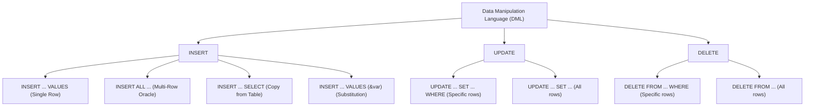
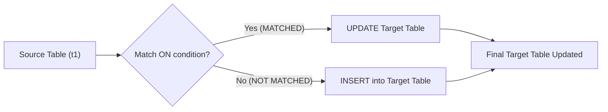

## Section 1: Concept Foundation

### What is Data Manipulation Language (DML)?
Data Manipulation Language (DML) is the subset of SQL used to **retrieve, insert, update, and delete** data within database tables. While DDL (Data Definition Language) defines the schema (structure), DML handles the **actual data** stored inside that structure.

### Why does DML exist?
- **Data Persistence**: It allows users to add new records (INSERT), change existing records (UPDATE), and remove obsolete records (DELETE).
- **Application Interfacing**: Every web application, mobile app, or backend service uses DML to reflect user actions (e.g., registering a user, placing an order) into the database.
- **Data Migration**: DML is essential for moving data between environments (e.g., copying staging data to production).

### Real-world Analogy
Think of a database as a physical filing cabinet:
- **INSERT**: Placing a new file folder into the cabinet.
- **UPDATE**: Pulling out a file and correcting a mistake in it.
- **DELETE**: Removing an outdated or obsolete file and throwing it away.

### Where is DML used?
- **OLTP (Online Transaction Processing)**: Inserting customer orders, updating inventory, deleting abandoned carts.
- **ETL (Extract, Transform, Load)**: Using `INSERT INTO ... SELECT` to populate data warehouses.
- **Data Cleansing**: Using `UPDATE` and `DELETE` to fix corrupt or duplicate records.

---

## Section 2: Visual Understanding

### DML Command Flow



### MERGE (UPSERT) Execution Logic



---

## Section 3: Syntax Breakdown and Oracle-Specific Rules

### 1. INSERT INTO Commands

#### a) INSERT INTO ... VALUES (Single Row)
**Purpose**: Insert exactly one record into a table.

**General Syntax:**
```sql
INSERT INTO table_name (column1, column2, ...)
VALUES (value1, value2, ...);
```

**Explanation:**
- `INSERT INTO table_name`: Specifies the target table.
- `(column1, column2, ...)`: Lists the columns to insert data into. If omitted, all columns are assumed in the order they were defined.
- `VALUES (...)` : Provides the actual data corresponding to the columns.

**Oracle Example:**
```sql
INSERT INTO student (sno, sname, class, address)
VALUES (1, 'Raheel', 'Tenth', 'RWP');
```

#### b) INSERT ALL ... INTO ... SELECT * FROM dual (Multi-Row Insert)
**Purpose**: Insert multiple rows in a single statement (Oracle-specific optimization).

**Syntax:**
```sql
INSERT ALL
    INTO table_name (col1, col2) VALUES (val1, val2)
    INTO table_name (col1, col2) VALUES (val3, val4)
    ...
SELECT * FROM dual;
```

**Explanation:**
- `INSERT ALL`: Tells Oracle to execute multiple insert operations.
- `INTO ... VALUES ...`: Each line is a separate row insertion.
- `SELECT * FROM dual`: `dual` is a dummy table in Oracle that always has one row. It is required to complete the syntax.

**Example:**
```sql
INSERT ALL
    INTO student (sno, sname, class, address) VALUES (103, 'Ahmad', 'BSIT', 'Lahore')
    INTO student (sno, sname, class, address) VALUES (104, 'Sara', 'BSCS', 'Islamabad')
SELECT * FROM dual;
```

#### c) INSERT INTO ... SELECT (Copy from Existing Table)
**Purpose**: Copy records from a source table to a destination table.

**Syntax:**
```sql
INSERT INTO destination_table (col1, col2, ...)
SELECT col1, col2, ...
FROM source_table
WHERE condition;
```

**Explanation:**
- Destination table must exist.
- Data types and column order must match between `INSERT` clause and `SELECT` clause.
- `WHERE` condition filters which records are copied.

**Example:**
```sql
-- Copy only students named 'Rohail'
INSERT INTO std (sno, sname)
SELECT sno, sname
FROM student
WHERE sname = 'Rohail';
```

#### d) INSERT INTO ... VALUES (&var) (Substitution Variables)
**Purpose**: Insert data interactively using user input in Oracle SQL Developer.

**Syntax:**
```sql
INSERT INTO table_name (col1, col2, ...)
VALUES (&col1, '&col2', ...);
```

**Explanation:**
- `&variable`: Tells Oracle to prompt the user for a value at runtime.
- Text and date values should be enclosed in single quotes (`'&text_var'`).
- Each execution inserts exactly one record.

**Example:**
```sql
INSERT INTO student (sno, sname, class, address)
VALUES (&sno, '&sname', '&class', '&address');
```

---

### 2. UPDATE – SET – WHERE
**Purpose**: Modify existing records in a table.

**General Syntax:**
```sql
UPDATE table_name
SET column1 = new_value1, column2 = new_value2
WHERE condition;
```

**Explanation:**
- `UPDATE table_name`: Specifies the table to modify.
- `SET column = value`: Assigns the new value to the column.
- `WHERE condition`: Determines which rows are updated. **If omitted, all rows are updated.**

**Example:**
```sql
UPDATE student
SET sname = 'Ali'
WHERE sno = 1;
```

---

### 3. DELETE – FROM – WHERE
**Purpose**: Remove existing records from a table. Retains the table structure.

**a) DELETE FROM (All Rows):**
```sql
DELETE FROM table_name;
```
**b) DELETE FROM ... WHERE (Specific Rows):**
```sql
DELETE FROM table_name
WHERE condition;
```

**Important Note**: `DELETE` is a DML command, so it can be rolled back if not committed. It is slower than `TRUNCATE` (DDL) because it removes rows one by one and fires triggers.

**Example:**
```sql
DELETE FROM student WHERE sno = 2;
DELETE FROM student; -- Deletes all rows, but can be rolled back!
```

---

### 4. SQL Aliases
**Purpose**: Give a temporary name to a column or table within a query. Does not change the actual schema.

#### Column Alias
```sql
SELECT column_name AS alias_name
FROM table_name;
```
- If the alias contains spaces, use double quotes: `AS "Annual Salary"`.

#### Table Alias
```sql
SELECT t.column_name
FROM table_name t;
```
- Used to shorten the SQL statement.
- Essential for self-joins (joining a table to itself).

**Oracle Example (Concatenation with Alias):**
```sql
SELECT PERSONID, FIRSTNAME || ' ' || LASTNAME AS "CONTACT NAME"
FROM persons_copy
WHERE LASTNAME = 'Malik';
```
- `||` is the Oracle concatenation operator.
- `AS "CONTACT NAME"` creates a column heading in the result.

---

### 5. MERGE (UPSERT)
**Purpose**: Perform an "UPSERT" – **UP**date if the record exists, or in**SERT** it if it does not. Oracle provides the `MERGE` statement for this.

**General Syntax:**
```sql
MERGE INTO target_table tgt
USING source_table src
ON (tgt.key_column = src.key_column)
WHEN MATCHED THEN
    UPDATE SET tgt.column1 = src.column1, tgt.column2 = src.column2
WHEN NOT MATCHED THEN
    INSERT (key_column, column1, column2)
    VALUES (src.key_column, src.column1, src.column2);
```

**Explanation:**
- `MERGE INTO target_table`: The table to be updated or inserted into.
- `USING source_table`: The data source that determines the updates/inserts.
- `ON (...)` : The match condition (primary key or unique column).
- `WHEN MATCHED`: If the key exists in target, execute the `UPDATE` block.
- `WHEN NOT MATCHED`: If the key does not exist in target, execute the `INSERT` block.

**Complete Example Workflow:**
```sql
-- Step 1: Create tables
CREATE TABLE t1 (id VARCHAR2(5), value VARCHAR2(5), value2 VARCHAR2(5));
CREATE TABLE t2 (id VARCHAR2(5), value VARCHAR2(5), value2 VARCHAR2(5));

-- Step 2: Insert data
INSERT INTO t1 VALUES ('a', '1', '1');
INSERT INTO t1 VALUES ('b', '4', '5');
INSERT INTO t2 VALUES ('b', '2', '2');
INSERT INTO t2 VALUES ('c', '3', '3');

-- Step 3: Perform MERGE
MERGE INTO t2 tgt
USING t1 src
ON (tgt.id = src.id)
WHEN MATCHED THEN
    UPDATE SET tgt.value = src.value, tgt.value2 = src.value2
WHEN NOT MATCHED THEN
    INSERT (id, value, value2) VALUES (src.id, src.value, src.value2);
```

**Execution Result:**
- Source row `a` does not exist in target `t2` → **INSERT** (`a, 1, 1`).
- Source row `b` exists in target `t2` → **UPDATE** (`b` becomes `4, 5` instead of `2, 2`).
- Target row `c` has no matching source row → remains unchanged (`c, 3, 3`).

---

## Section 4: Query Thinking Process (Professional Approach)

**Requirement**: "Update the `Employees` table to increase the salary of all employees in department 10 by 10%."

**Step 1: Identify the table** → `Employees`
**Step 2: Identify the operation** → UPDATE
**Step 3: Identify the condition** → `department_id = 10`
**Step 4: Identify the calculation** → `salary = salary * 1.10`
**Step 5: Write the query**:
```sql
UPDATE Employees
SET salary = salary * 1.10
WHERE department_id = 10;
```
**Step 6: Validate** → `SELECT * FROM Employees WHERE department_id = 10;` to verify the update. (Do not forget `COMMIT;` to save changes).

---

## Section 5: Multiple Examples

### Example 1: Easy (Single Row Insert with DEFAULT)
**Requirement**: Add a new student with ID 105, name 'Zain', class 'BSAI', and address 'Karachi'.
**Query**:
```sql
INSERT INTO student (sno, sname, class, address)
VALUES (105, 'Zain', 'BSAI', 'Karachi');
```

### Example 2: Medium (Conditional DELETE)
**Requirement**: Delete all students from the `student` table who are in class 'BSIT'.
**Query**:
```sql
DELETE FROM student WHERE class = 'BSIT';
```

### Example 3: Exam-style (Upsert with MERGE)
**Requirement**: A source table `new_customers` contains `customer_id` and `name`. The target table `customers` has the same columns. Write a query to update the name if the ID exists, otherwise insert a new row.
**Query**:
```sql
MERGE INTO customers tgt
USING new_customers src
ON (tgt.customer_id = src.customer_id)
WHEN MATCHED THEN
    UPDATE SET tgt.name = src.name
WHEN NOT MATCHED THEN
    INSERT (customer_id, name) VALUES (src.customer_id, src.name);
```

### Example 4: Real-world (Substitution for Data Entry)
**Requirement**: A data entry clerk needs to quickly add products to a `products` table using SQL Developer. Write a query using substitution variables.
**Query**:
```sql
INSERT INTO products (product_id, product_name, price)
VALUES (&prod_id, '&prod_name', &price);
```

### Example 5: Tricky (UPDATE with multiple columns)
**Requirement**: In the `student` table, change the class to 'Graduate' and address to 'Islamabad' for all students with `sno = 101`.
**Query**:
```sql
UPDATE student
SET class = 'Graduate', address = 'Islamabad'
WHERE sno = 101;
```

---

## Section 6: Pattern Recognition

| Requirement Keyword | Think of | SQL Feature |
|---------------------|----------|-------------|
| "Add a new record", "Insert" | INSERT INTO | `INSERT INTO ... VALUES ...` |
| "Copy data from table", "Migrate" | INSERT INTO ... SELECT | `INSERT INTO ... SELECT ...` |
| "User input", "Prompt" | Substitution variable | `&variable` (Oracle SQL Developer) |
| "Change", "Modify", "Update" | UPDATE | `UPDATE ... SET ... WHERE ...` |
| "Increase by", "Calculate" | UPDATE with arithmetic | `SET salary = salary * 1.10` |
| "Remove", "Delete", "Erase" | DELETE | `DELETE FROM ... WHERE ...` |
| "Update if exists, insert if not" | UPSERT / MERGE | `MERGE INTO ... USING ...` |
| "Temporary name for column" | Column Alias | `SELECT col AS alias` |
| "Shorten table name" | Table Alias | `SELECT t.col FROM table t` |

---

## Section 7: Common Mistakes

| Mistake | Wrong Query | Why Wrong | Correct Query |
|---------|-------------|-----------|---------------|
| Forgetting the WHERE clause in UPDATE | `UPDATE student SET sname = 'Ali';` | Updates **every row** in the table. | `UPDATE student SET sname = 'Ali' WHERE sno = 1;` |
| Forgetting the WHERE clause in DELETE | `DELETE FROM student;` | Deletes **every row** in the table. | `DELETE FROM student WHERE sno = 2;` |
| Forgetting to COMMIT after DML | `INSERT INTO ... VALUES (...);` | Changes are not saved to disk. | `COMMIT;` after insertion, update, or delete. |
| Inserting wrong data types | `INSERT INTO student (sno, sname) VALUES ('one', 'John');` | `sno` expects `NUMBER`, but 'one' is `VARCHAR2`. | `INSERT INTO student (sno, sname) VALUES (1, 'John');` |
| Missing quotes for strings | `INSERT INTO student (sname) VALUES (John);` | John is interpreted as a column name or variable. | `INSERT INTO student (sname) VALUES ('John');` |
| Column count mismatch in INSERT ... SELECT | `INSERT INTO std (sno, sname) SELECT sno, class FROM student;` | `class` data type may not match `sname`. | Ensure all selected columns match the destination columns exactly. |
| MERGE ON condition not unique | `MERGE ... ON (tgt.id = src.id)` where `id` is not unique in source. | MERGE may produce ambiguous results or error. | Ensure the `ON` condition targets unique or primary keys. |

---

## Section 8: Exam Perspective

### Frequently Asked Questions
1. What is the difference between `DELETE` and `TRUNCATE`? (DML vs DDL, rollback, speed)
2. Write a SQL query to insert multiple rows in a single statement in Oracle.
3. How do you rename a column in the result set without altering the table?
4. Explain the MERGE statement with a practical example.
5. What is the purpose of the `dual` table in Oracle? (Used with `INSERT ALL` and other functions to force a single-row result)

### Viva Questions
- What happens if you omit the WHERE clause in a DELETE command? (All rows are deleted).
- Can you rollback a DML command? (Yes, until you execute `COMMIT`).
- Why is `DELETE` slower than `TRUNCATE`? (DELETE removes rows one by one, logs undo info, fires triggers; TRUNCATE is a DDL operation that frees extents and does not generate undo).
- What is a substitution variable in Oracle SQL Developer? (A variable prefixed with `&` that prompts the user for input at runtime).
- Can you use a table alias for a column alias? (No, table aliases are for the FROM clause, column aliases are for the SELECT clause).

### MCQ
1. Which DML command is used to modify existing data in a table?
   a) SELECT   b) INSERT   c) UPDATE   d) DELETE
   **Answer: c**

2. The `MERGE` command is used for:
   a) Copying table structure   b) Inserting or updating based on existence   c) Deleting duplicate rows   d) Changing column data types
   **Answer: b**

3. In Oracle, `SELECT * FROM dual` is used to:
   a) Delete all rows from the dual table   b) Select a single dummy row for computations   c) Join multiple tables   d) Create a new table
   **Answer: b**

---

## Section 9: Industry Perspective

### How professionals use DML
- **Bulk Operations**: Use `INSERT ALL` or `INSERT INTO ... SELECT` for large data migrations to minimize transaction logs.
- **Batch Updates**: Always use a `WHERE` clause in `UPDATE` and `DELETE` statements. Never run a delete or update without a condition in production unless absolutely intended.
- **MERGE for Synchronization**: Frequently used in data warehousing to synchronize data between staging and dimension tables.
- **Substitution Variables**: Primarily used in automated scripts and SQL Developer for quick interactive data entry during development.
- **Error Handling**: In PL/SQL, DML operations are wrapped in `BEGIN ... EXCEPTION ... END;` blocks to handle constraints violations gracefully.

### Best Practices
- **Always use explicit columns in INSERT**: `INSERT INTO table (col1, col2) VALUES (...)`. Avoid `INSERT INTO table VALUES (...)` as the column order might change if schema is altered.
- **Use `COMMIT` only after verifying changes**: Test with `SELECT` before committing.
- **Use `SAVEPOINT` for complex transactions**: `SAVEPOINT sp1; ... ROLLBACK TO sp1;` allows partial rollback of DML operations.
- **Alias naming**: Use meaningful aliases. For column aliases, use `AS` (optional but recommended). For space-separated aliases, use double quotes.
- **Optimize MERGE**: When using MERGE, ensure the `ON` condition columns are indexed for faster matching.

---

## Section 10: Query Construction Framework

Use this framework for any DML task:

1. **Read the requirement** carefully.
2. **Identify the table**.
3. **Determine the operation** (INSERT, UPDATE, DELETE, or MERGE).
4. **Identify the data/columns involved**.
5. **If UPDATE/DELETE, determine the WHERE condition**.
6. **If INSERT, determine the VALUES**.
7. **Write the SQL query**.
8. **Execute a SELECT to verify the condition before DML** (especially for UPDATE/DELETE).
9. **Run the DML**.
10. **Commit** (or rollback if unexpected results).

---

## Section 11: Practice Section

### Beginner Exercises
1. Insert a new record into the `student` table with `sno = 201`, `sname = 'Hassan'`, `class = 'MCS'`, `address = 'Peshawar'`.
2. Update the `address` of student `sno = 201` to 'Islamabad'.
3. Delete the student with `sno = 201`.
4. Insert multiple records into `student` (e.g., 106, 'Fatima', 'PhD', 'Lahore' and 107, 'Usman', 'MPhil', 'Karachi') using `INSERT ALL`.
5. Rename the column `sname` to `student_name` in the result set of a SELECT query (use alias).

### Intermediate Exercises
1. Create a table `employees_backup` with the exact structure of `employees`, then insert all employees from `employees` into `employees_backup`.
2. Update the `salary` column of `employees_backup` by increasing it by 15% for all rows.
3. Delete rows from `employees_backup` where the salary is less than 5000.
4. Write a MERGE statement to synchronize `employees` (target) with `employees_backup` (source) based on `employee_id`.
5. Use a substitution variable to insert a new employee into `employees` with `employee_id`, `employee_name`, and `department_id`.

### Advanced Exercises
1. The `departments` table has a `department_id` and `department_name`. Write a query to rename `department_name` to `dept_name` in the result output, while keeping the column name unchanged in the table.
2. Write a single SQL statement to increase the salary of all employees in department 10 by 500 and set the `job` column to 'Senior' for those same employees.
3. Create a new table `emp_archive` with structure `(emp_id, emp_name, dept_id, salary)`. Use `INSERT INTO ... SELECT` to copy employees with `salary > 10000` from `employees` to `emp_archive`.
4. Using MERGE, update `emp_archive` from `employees` if `emp_id` matches; if not, insert the new employee.
5. Implement a single DELETE statement that deletes all employees whose `department_id` is 999 and who have not been assigned a `manager_id` (i.e., `manager_id IS NULL`).

---

## Section 12: Challenge Section – Real-world Scenarios

### Scenario 1: E-commerce Inventory
- The `products` table has `product_id`, `product_name`, `price`, `stock`.
- The `incoming_shipments` table has `product_id`, `additional_stock`.
- Task: Use MERGE to update the `stock` in `products` if the `product_id` exists in `incoming_shipments`; if not, insert the new product with default `price = 100` and `stock` from the shipment.

### Scenario 2: University Student Records
- The `students` table contains `student_id`, `name`, `gpa`, `graduation_year`.
- A subset of students has been promoted and their `graduation_year` should be updated to 2026.
- The `honor_list` table needs to be repopulated. Delete all records from `honor_list` and then insert all students with `gpa >= 3.5`.

### Scenario 3: Banking Transactions
- The `accounts` table has `account_id`, `balance`.
- The `daily_transactions` table has `account_id`, `transaction_amount`.
- Write a MERGE statement to update `accounts` by adding the `transaction_amount` to the `balance` for matching `account_id`; if a new account appears in `daily_transactions`, insert it into `accounts` with an initial balance of `0`.

---

## Section 13: Interview Preparation

### Conceptual Questions

1. **What is the difference between `UPDATE` and `MERGE`?**
   - `UPDATE` modifies rows that already exist. It cannot insert new rows.
   - `MERGE` can both update existing rows and insert new rows in a single statement (UPSERT).

2. **Can you use `DELETE` without a WHERE clause? What happens?**
   - Yes. It will delete all rows in the table. This is a DML operation, so it can be rolled back, but it is much slower than `TRUNCATE`.

3. **What is the significance of `COMMIT` in DML?**
   - DML commands are held in a transaction (in-memory buffer) until `COMMIT` is issued. `COMMIT` makes the changes permanent and visible to other users. Without `COMMIT`, the changes are lost if the session ends.

4. **How does Oracle handle `MERGE` when multiple source rows match a single target row?**
   - Oracle will raise an error because the `ON` condition must identify a unique target row. You must ensure the source data is distinct.

5. **What is a substitution variable, and when is it used?**
   - A substitution variable (`&var`) prompts the user for a value at runtime in SQL Developer. It is used for interactive scripting and data entry where values are not known upfront.

### Practical SQL Interview Questions

**Q1:** Write a query to insert a new customer into the `customers` table, but only if the `customer_id` does not already exist.
**Answer:** (Use MERGE)
```sql
MERGE INTO customers tgt
USING (SELECT 123 AS customer_id, 'John Doe' AS name FROM dual) src
ON (tgt.customer_id = src.customer_id)
WHEN NOT MATCHED THEN
    INSERT (customer_id, name) VALUES (src.customer_id, src.name);
```

**Q2:** The `employees` table has `salary` and `commission_pct`. Update `commission_pct` to 0.05 for employees where `salary > 10000`.
**Answer:**
```sql
UPDATE employees
SET commission_pct = 0.05
WHERE salary > 10000;
```

**Q3:** How do you delete duplicate rows from a table `employees` based on `employee_id`?
**Answer:** (Using a self-join subquery)
```sql
DELETE FROM employees
WHERE rowid NOT IN (
    SELECT MIN(rowid) FROM employees GROUP BY employee_id
);
```

**Q4:** Write a query to copy all data from `orders` table into a backup table `orders_archive`.
**Answer:**
```sql
INSERT INTO orders_archive
SELECT * FROM orders;
```
(Assuming `orders_archive` already exists).

**Q5:** Explain the logic of the following MERGE statement:
```sql
MERGE INTO t2 tgt
USING t1 src
ON (tgt.id = src.id)
WHEN MATCHED THEN UPDATE SET tgt.val = src.val
WHEN NOT MATCHED THEN INSERT (id, val) VALUES (src.id, src.val);
```
**Answer:** For every row in `t1`, it checks if `id` exists in `t2`. If yes, it updates `val` in `t2` with the value from `t1`. If no, it inserts the new `id` and `val` into `t2`.

---

## Section 14: Topic Summary – Cheat Sheet

### DML Command Quick Reference (Oracle)

| Command | Syntax | Use Case |
|---------|--------|----------|
| INSERT (Single) | `INSERT INTO t (c1, c2) VALUES (v1, v2);` | Add one new record. |
| INSERT (Multi-Row) | `INSERT ALL INTO t VALUES (...) INTO t VALUES (...) SELECT * FROM dual;` | Add multiple records at once (Oracle). |
| INSERT (From Select) | `INSERT INTO t (c1) SELECT c1 FROM s WHERE cond;` | Copy data between tables. |
| INSERT (Substitution) | `INSERT INTO t VALUES (&id, '&name');` | Interactive data entry in SQL Developer. |
| UPDATE | `UPDATE t SET c1=v1 WHERE condition;` | Modify existing records. |
| DELETE | `DELETE FROM t WHERE condition;` | Remove existing records. |
| MERGE (UPSERT) | `MERGE INTO tgt USING src ON (key) WHEN MATCHED THEN UPDATE ... WHEN NOT MATCHED THEN INSERT ...` | Synchronize two tables (update or insert). |
| Column Alias | `SELECT c1 AS alias FROM t;` | Display a temporary heading for a column. |
| Table Alias | `SELECT t.c1 FROM table t;` | Shorten table names in queries (essential for self-joins). |
| Concatenation | `SELECT c1 ` `\|\|` ` ' ' ` `\|\|` ` c2 FROM t;` | Combine columns in Oracle. |

### Key Takeaways for DML
- **DML is transactional**: All changes are temporary until `COMMIT` is executed.
- **DELETE vs TRUNCATE**: Use `DELETE` for selective removal (supports WHERE and rollback). Use `TRUNCATE` for fast, permanent full-table purges.
- **MERGE is powerful**: Perfect for handling data synchronization and avoiding multiple separate `INSERT` and `UPDATE` statements.
- **Aliases are cosmetic**: They do not affect the underlying database structure.
- **Always test with SELECT first**: Before running a large `UPDATE` or `DELETE`, run the same `WHERE` clause with a `SELECT` to verify which rows will be affected.

---

### Final Professional Advice
Mastering DML is the first step towards becoming a productive database engineer. While DDL creates the blueprint, DML populates it with real, valuable data. In production environments, run DML with extreme caution—always back up, always use transactions, and always test. Practice writing DML queries on sample schemas until the syntax becomes second nature. You are now fully equipped to handle inserts, updates, deletions, and complex merges in Oracle SQL.