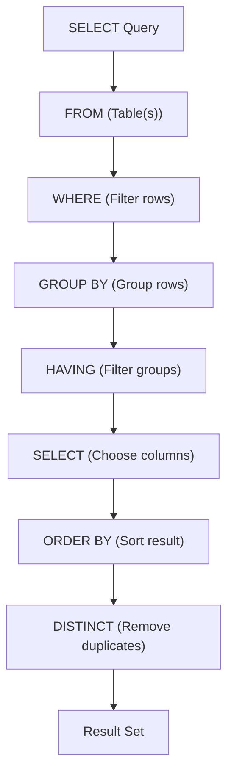
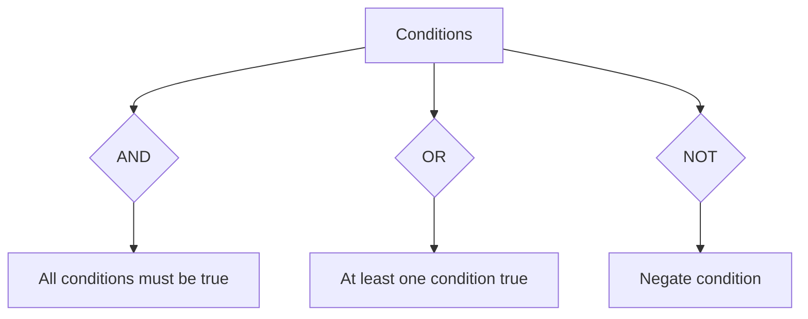

## Section 1: Concept Foundation

### What is the SQL SELECT Statement?
The `SELECT` statement is the most fundamental and frequently used command in SQL. It is used to **retrieve data** from one or more tables. Unlike DDL (structure definition) or DML (data modification), `SELECT` does not change the data; it only displays it.

### Why does SELECT exist?
- **Data Access**: It allows users, applications, and reports to view the data stored in the database.
- **Business Intelligence**: All analytical queries rely on `SELECT` to generate insights.
- **Data Validation**: Developers use `SELECT` to verify the results of INSERT, UPDATE, and DELETE operations.

### Real-world Analogy
Think of a database table as a filing cabinet. The `SELECT` statement is like opening a drawer and pulling out specific folders based on criteria (e.g., all files from a certain year, only those with a certain label).

### Where is SELECT used?
- **Application backends**: To fetch user profiles, product listings, orders.
- **Reporting**: Generating dashboards, monthly summaries, and ad-hoc reports.
- **Debugging**: Checking the contents of tables during development.
- **Data migration**: Extracting data to move to another system.

---

## Section 2: Visual Understanding

### SELECT Statement Execution Flow



### Logical Operator Combinations



---

## Section 3: Syntax Breakdown and Oracle-Specific Rules

### 1. Basic SELECT Syntax
```sql
SELECT column1, column2, ...
FROM table_name;
```

**Explanation:**
- `SELECT`: specifies which columns to retrieve. Use `*` to retrieve all columns.
- `FROM`: specifies the table from which to retrieve data.

**Example:**
```sql
SELECT Name, Age FROM Students;
```

---

### 2. SELECT with WHERE Clause
Used to filter rows based on a condition.

```sql
SELECT column_list
FROM table_name
WHERE condition;
```

**Operators allowed in WHERE:**

| Operator | Meaning | Example |
|----------|---------|---------|
| `=` | Equal to | `WHERE Age = 20` |
| `<>` or `!=` | Not equal | `WHERE Age <> 20` |
| `>` | Greater than | `WHERE Age > 20` |
| `<` | Less than | `WHERE Age < 20` |
| `>=` | Greater than or equal | `WHERE Age >= 20` |
| `<=` | Less than or equal | `WHERE Age <= 20` |

---

### 3. Logical Operators (AND, OR, NOT)

- **AND**: All conditions must be true.
- **OR**: At least one condition must be true.
- **NOT**: Negates a condition.

**Syntax with AND:**
```sql
SELECT * FROM Students WHERE Age > 20 AND City = 'Lahore';
```

**Syntax with OR:**
```sql
SELECT * FROM Students WHERE City = 'Lahore' OR City = 'Karachi';
```

**Combining AND and OR (use parentheses):**
```sql
SELECT * FROM Students
WHERE Age > 20 AND (City = 'Lahore' OR City = 'Karachi');
```

---

### 4. Special Operators

| Operator | Purpose | Example |
|----------|---------|---------|
| `BETWEEN` | Values within a range (inclusive) | `WHERE Age BETWEEN 18 AND 22` |
| `IN` | Matches any value in a list | `WHERE City IN ('Lahore', 'Karachi')` |
| `LIKE` | Pattern matching using wildcards (`%` and `_`) | `WHERE Name LIKE 'A%'` (starts with A) |
| `IS NULL` | Checks for NULL values | `WHERE Age IS NULL` |

**Oracle Note**: `LIKE` is case-sensitive in Oracle by default. Use `UPPER()` or `LOWER()` for case-insensitive matching.

---

### 5. ORDER BY Clause
Sorts the result set.

**Syntax:**
```sql
SELECT column1, column2
FROM table_name
ORDER BY column1 [ASC|DESC], column2 [ASC|DESC];
```
- `ASC`: Ascending order (default).
- `DESC`: Descending order.

**Example:**
```sql
SELECT Name, Age FROM Students ORDER BY Age DESC;
```

---

### 6. DISTINCT Keyword
Removes duplicate rows from the result.

**Syntax:**
```sql
SELECT DISTINCT column1, column2, ...
FROM table_name;
```

**Example:**
```sql
SELECT DISTINCT City FROM Students;
```

**Important**: `DISTINCT` applies to the entire row, not just the first column. If you select multiple columns, it ensures the combination is unique.

---

### 7. GROUP BY Clause
Groups rows that have the same values in specified columns, typically used with aggregate functions (`COUNT`, `SUM`, `AVG`, `MAX`, `MIN`).

**Syntax:**
```sql
SELECT column1, aggregate_function(column2)
FROM table_name
GROUP BY column1;
```

**Example:**
```sql
SELECT City, COUNT(*) FROM Students GROUP BY City;
```

**Order of execution**:
- `FROM` → `WHERE` → `GROUP BY` → `HAVING` → `SELECT` → `ORDER BY`.

---

### 8. HAVING Clause
Filters groups after `GROUP BY` (similar to `WHERE` but for aggregated results).

**Syntax:**
```sql
SELECT column1, aggregate_function(column2)
FROM table_name
GROUP BY column1
HAVING aggregate_function(column2) condition;
```

**Example:**
```sql
SELECT City, COUNT(*)
FROM Students
GROUP BY City
HAVING COUNT(*) > 2;
```

---

### 9. Full SELECT Statement Order (Oracle)
```sql
SELECT [DISTINCT] column_list
FROM table_list
WHERE condition
GROUP BY grouping_columns
HAVING group_condition
ORDER BY sort_columns;
```

---

## Section 4: Query Thinking Process (Professional Approach)

**Requirement**: "Find the names and ages of students who live in Lahore and are older than 20, sorted by age descending."

**Step 1: Identify the table** → `Students`
**Step 2: Identify columns** → `Name`, `Age`
**Step 3: Identify filter conditions** → `City = 'Lahore'` AND `Age > 20`
**Step 4: Determine sorting** → `ORDER BY Age DESC`
**Step 5: Write the query**:
```sql
SELECT Name, Age
FROM Students
WHERE City = 'Lahore' AND Age > 20
ORDER BY Age DESC;
```

**Step 6: Validate** → Check the result set and ensure it meets requirements.

---

## Section 5: Multiple Examples

### Example 1: Easy (Basic SELECT)
**Requirement**: Show all columns of the `Students` table.
**Query**:
```sql
SELECT * FROM Students;
```

### Example 2: Medium (WHERE with BETWEEN)
**Requirement**: List students whose age is between 18 and 22 (inclusive).
**Query**:
```sql
SELECT * FROM Students WHERE Age BETWEEN 18 AND 22;
```

### Example 3: Exam-style (DISTINCT + ORDER BY)
**Requirement**: List all distinct cities from the `Students` table in alphabetical order.
**Query**:
```sql
SELECT DISTINCT City FROM Students ORDER BY City ASC;
```

### Example 4: Real-world (GROUP BY + HAVING)
**Requirement**: For each city, count the number of students, but only show cities with more than 5 students.
**Query**:
```sql
SELECT City, COUNT(*) AS StudentCount
FROM Students
GROUP BY City
HAVING COUNT(*) > 5;
```

### Example 5: Tricky (Combining AND, OR, and NOT)
**Requirement**: Find students who are either from Lahore or Karachi, but not those whose age is less than 18.
**Query**:
```sql
SELECT * FROM Students
WHERE (City = 'Lahore' OR City = 'Karachi')
  AND Age >= 18;
```

---

## Section 6: Pattern Recognition

| Requirement Keyword | Think of | SQL Feature |
|---------------------|----------|-------------|
| "Show all columns" | `SELECT *` | `SELECT * FROM table` |
| "List unique cities" | DISTINCT | `SELECT DISTINCT City FROM ...` |
| "Sorted by" | ORDER BY | `ORDER BY column ASC/DESC` |
| "Greater than", "less than" | Comparison operators | `WHERE Age > 20` |
| "Between X and Y" | BETWEEN | `WHERE Age BETWEEN X AND Y` |
| "Contains", "starts with" | LIKE with wildcards | `WHERE Name LIKE 'A%'` |
| "In a list" | IN | `WHERE City IN ('Lahore', 'Karachi')` |
| "Count per group" | GROUP BY with COUNT | `GROUP BY City` |
| "Filter after grouping" | HAVING | `HAVING COUNT(*) > 2` |
| "Both conditions" | AND | `WHERE cond1 AND cond2` |
| "Either condition" | OR | `WHERE cond1 OR cond2` |
| "Exclude" | NOT | `WHERE NOT City = 'Lahore'` |

---

## Section 7: Common Mistakes

| Mistake | Wrong Query | Why Wrong | Correct Query |
|---------|-------------|-----------|---------------|
| Using `HAVING` without `GROUP BY` | `SELECT City, COUNT(*) FROM Students HAVING COUNT(*) > 2;` | HAVING requires a GROUP BY clause. | `SELECT City, COUNT(*) ... GROUP BY City HAVING ...` |
| Using `WHERE` with aggregate functions | `SELECT City, COUNT(*) FROM Students WHERE COUNT(*) > 2 GROUP BY City;` | Aggregate functions cannot be used in WHERE. Use HAVING. | `... GROUP BY City HAVING COUNT(*) > 2` |
| Forgetting parentheses with AND/OR | `WHERE Age > 20 OR City = 'Lahore' AND City = 'Karachi'` | Operator precedence issues. | `WHERE (Age > 20 OR City = 'Lahore') AND City = 'Karachi'` |
| Using `DISTINCT` on one column only when selecting multiple | `SELECT DISTINCT City, Age FROM Students` | Returns unique combinations of (City, Age), not just unique cities. | Use `SELECT DISTINCT City FROM Students` if only city needed. |
| Misusing `LIKE` with `%` | `WHERE Name LIKE '%A'` | Matches names ending with A, not starting. | `WHERE Name LIKE 'A%'` for starts with A. |
| Using `=` for NULL check | `WHERE Age = NULL` | NULL is not equal to anything. | `WHERE Age IS NULL` |

---

## Section 8: Exam Perspective

### Frequently Asked Questions
1. Write a query to find all employees whose salary is between 5000 and 10000.
2. What is the difference between `WHERE` and `HAVING`?
3. Explain the order of execution of clauses in a SELECT statement.
4. Write a query to display the count of customers per city, sorted by count descending.
5. Write a query to find students whose name starts with 'M' and are from Lahore.

### Viva Questions
- Can you use aggregate functions in the `WHERE` clause? (No, only in `HAVING` or `SELECT`).
- What does `SELECT DISTINCT` do? (Returns unique rows based on the selected columns).
- How does `BETWEEN` work with dates in Oracle? (It includes both endpoints; date values are compared as dates).
- What is the default sorting order if `ASC`/`DESC` is omitted? (Ascending).
- What is the difference between `LIKE` and `IN`? (LIKE for pattern matching, IN for exact values in a list).

### MCQ
1. Which clause is used to filter rows before grouping?
   a) WHERE   b) HAVING   c) GROUP BY   d) ORDER BY
   **Answer: a**

2. Which operator is used to check if a value matches any of a list of values?
   a) LIKE   b) BETWEEN   c) IN   d) IS NULL
   **Answer: c**

3. The `ORDER BY` clause sorts the result in ________ order by default.
   a) Descending   b) Ascending   c) Random   d) No order
   **Answer: b**

---

## Section 9: Industry Perspective

### How professionals use SELECT
- **Indexing**: For performance, they ensure `WHERE` conditions use indexed columns.
- **Partial Retrieval**: They avoid `SELECT *` in production to reduce data transfer and improve performance.
- **Analytical Queries**: They combine `GROUP BY`, `HAVING`, and window functions for complex reporting.
- **Data Protection**: They use `WHERE` clauses to enforce row-level security (e.g., only show data for the logged-in user).

### Best Practices
- **Always qualify column names**: Use `table.column` when joining multiple tables.
- **Use meaningful aliases**: For columns with calculations or aggregates.
- **Avoid `SELECT *` in production**: Specify only needed columns.
- **Test queries on a subset**: Use `WHERE ROWNUM <= 10` in Oracle to limit rows during testing.
- **Use `EXPLAIN PLAN`**: Analyze query execution plans for optimization.

---

## Section 10: Query Construction Framework

Use this framework for any SELECT query:

1. **Understand the requirement**: What data is needed, what filters, any grouping, sorting?
2. **Identify the table(s)**.
3. **Select columns** (or all with *).
4. **Apply filters** (WHERE) – if none, skip.
5. **Apply grouping** (GROUP BY) if aggregates are needed.
6. **Filter groups** (HAVING) if needed.
7. **Sort the result** (ORDER BY).
8. **Add DISTINCT** if duplicates need to be removed.
9. **Write the query** in the correct order.
10. **Run and validate**.

---

## Section 11: Practice Section

### Beginner Exercises
1. Retrieve all columns from the `Product_T` table.
2. Retrieve the `ProductDescription` and `ProductStandardPrice` from `Product_T`.
3. List all products whose price is less than 275.
4. List all distinct `ProductFinish` values from `Product_T`.
5. Retrieve products with `ProductStandardPrice` between 200 and 400.

### Intermediate Exercises
1. Find all products where `ProductFinish` is 'Cherry' and price > 300.
2. Find all products where `ProductFinish` is either 'Natural Ash' or 'Walnut'.
3. Count the number of products for each `ProductFinish`.
4. List the `ProductFinish` with more than 2 products (using HAVING).
5. Retrieve the products sorted by `ProductStandardPrice` descending.

### Advanced Exercises
1. Write a query to display the `ProductDescription`, `ProductStandardPrice`, and a column `PriceCategory` that says 'Low' if price < 300, 'Medium' if between 300 and 600, and 'High' if > 600 (use CASE).
2. Find the product(s) with the highest price (use subquery: `SELECT ... WHERE price = (SELECT MAX(price) FROM Product_T)`).
3. For each `ProductLineID`, show the average price, but only for lines that have at least 2 products.
4. Write a query to list all products whose `ProductDescription` contains the word 'Desk' (use LIKE).
5. Find the total number of products for each `ProductFinish`, and show only those with total > 1, sorted by total descending.

---

## Section 12: Challenge Section – Real-world Scenarios

### Scenario 1: E-commerce Analytics
- Table `orders` with columns: `order_id`, `customer_id`, `order_date`, `total_amount`.
- Write a query to find the total sales per month (extract year-month from `order_date`), and show only months with total > 10000.

### Scenario 2: University Enrollment
- Table `enrollments` with columns: `student_id`, `course_id`, `grade`.
- Write a query to list students who have taken more than 3 courses and have an average grade > 80.

### Scenario 3: Inventory Management
- Table `inventory` with columns: `product_id`, `warehouse_id`, `quantity`.
- Write a query to find warehouses that have at least one product with quantity < 10, and list the product_id and quantity for those.

---

## Section 13: Interview Preparation

### Conceptual Questions

1. **Explain the difference between `WHERE` and `HAVING`.**
   - `WHERE` filters rows before grouping; `HAVING` filters groups after grouping. `HAVING` can use aggregate functions; `WHERE` cannot.

2. **What is the purpose of the `DISTINCT` keyword?**
   - It eliminates duplicate rows from the result set. It applies to all selected columns.

3. **How does `ORDER BY` affect performance?**
   - Sorting is an expensive operation. If not needed, avoid `ORDER BY` to improve performance.

4. **What is the difference between `IN` and `EXISTS`?**
   - `IN` checks if a value matches any in a list; `EXISTS` checks for existence of rows. For large lists, `EXISTS` is often more efficient.

5. **Explain the `LIKE` operator and its wildcards.**
   - `%` matches any sequence of characters; `_` matches a single character. Example: `LIKE 'A%'` finds names starting with A.

### Practical SQL Interview Questions

**Q1:** Write a query to find the second highest salary from an `Employees` table.
**Answer:**
```sql
SELECT MAX(salary) FROM Employees
WHERE salary < (SELECT MAX(salary) FROM Employees);
```

**Q2:** How would you count the number of employees in each department, but only show departments with more than 5 employees?
**Answer:**
```sql
SELECT department_id, COUNT(*) AS emp_count
FROM Employees
GROUP BY department_id
HAVING COUNT(*) > 5;
```

**Q3:** Write a query to find employees whose names start with 'J' and whose salary is greater than 5000.
**Answer:**
```sql
SELECT * FROM Employees
WHERE name LIKE 'J%' AND salary > 5000;
```

**Q4:** Write a query to display the average salary per department, sorted by average salary descending.
**Answer:**
```sql
SELECT department_id, AVG(salary) AS avg_salary
FROM Employees
GROUP BY department_id
ORDER BY avg_salary DESC;
```

**Q5:** Using the `Product_T` table from the lab, write a query to list `ProductDescription` and `ProductStandardPrice` for products where `ProductLineID` is either 1 or 3 and the price is between 200 and 500.
**Answer:**
```sql
SELECT ProductDescription, ProductStandardPrice
FROM Product_T
WHERE ProductLineID IN (1, 3) AND ProductStandardPrice BETWEEN 200 AND 500;
```

---

## Section 14: Topic Summary – Cheat Sheet

### SELECT Statement Clauses (Oracle)

| Clause | Purpose | Example |
|--------|---------|---------|
| `SELECT` | Choose columns | `SELECT col1, col2` |
| `FROM` | Specify table(s) | `FROM table_name` |
| `WHERE` | Filter rows | `WHERE Age > 20` |
| `GROUP BY` | Group rows for aggregation | `GROUP BY City` |
| `HAVING` | Filter groups | `HAVING COUNT(*) > 2` |
| `ORDER BY` | Sort result | `ORDER BY Age DESC` |
| `DISTINCT` | Remove duplicates | `SELECT DISTINCT City` |

### Operator Quick Reference

| Operator | Description |
|----------|-------------|
| `=` `<>` `>` `<` `>=` `<=` | Comparison |
| `AND` `OR` `NOT` | Logical |
| `BETWEEN x AND y` | Range |
| `IN (list)` | Multiple values |
| `LIKE 'pattern'` | Pattern matching |
| `IS NULL` / `IS NOT NULL` | NULL checks |

### Key Takeaways
- `SELECT` is the foundation of data retrieval.
- Use `WHERE` to filter before aggregation, `HAVING` to filter after.
- `DISTINCT` is useful for finding unique values.
- Always think about the order of execution: `FROM` → `WHERE` → `GROUP BY` → `HAVING` → `SELECT` → `ORDER BY`.
- Practice with the `Product_T` table from the lab.

---

### Final Professional Advice
Mastering `SELECT` is essential for every database professional. It is not just about writing syntax; it is about thinking in sets and understanding how to translate business questions into precise queries. Always test your queries on a small sample first, and always consider performance. With practice, you will be able to answer any data retrieval question with confidence.

**Next Steps**: Implement the lab tasks from the PDF. Create the `Product_T` table, insert the sample data, and run all the queries listed. Then attempt the practice exercises above. Good luck!