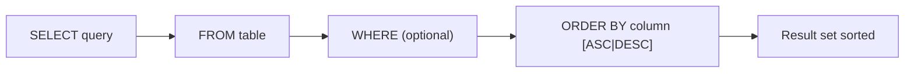
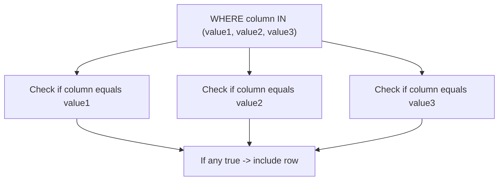
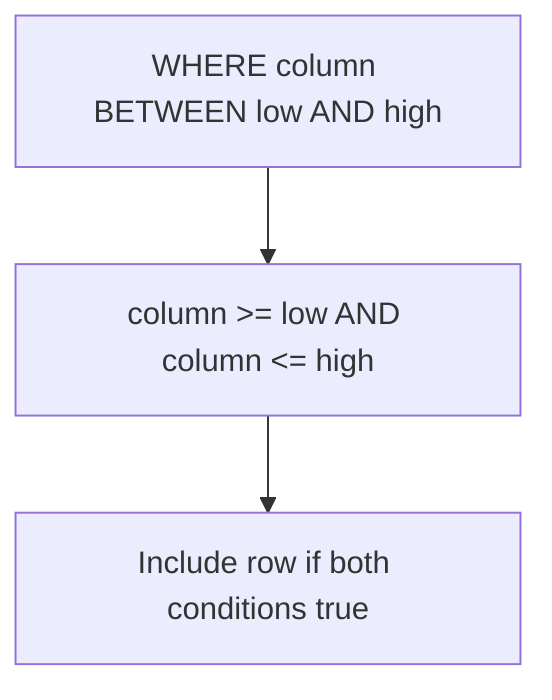

## Section 1: Concept Foundation

### What are these operators?
In Experiment 6, we covered basic filtering with `WHERE`, `AND`, `OR`, and `NOT`. Experiment 7 extends that toolbox with three powerful operators that simplify and enhance conditional logic:

- **ORDER BY**: Sorts the result set.
- **IN / NOT IN**: Tests a value against a list of values (alternative to multiple `OR` conditions).
- **BETWEEN / NOT BETWEEN**: Tests a value within an inclusive range (numeric, text, or date).

### Why were these features created?
- **ORDER BY** exists because raw query results are often unordered; sorting is essential for readability, reporting, and identifying top/bottom records.
- **IN** was created to avoid repetitive `OR` clauses, making queries cleaner and more efficient.
- **BETWEEN** simplifies range checks, especially for numeric and date ranges, ensuring inclusivity without manual boundary conditions.

### Real-world Analogy
- **ORDER BY**: Like arranging a stack of papers alphabetically or by date.
- **IN**: Like checking if a student is in a specific list of names.
- **BETWEEN**: Like selecting employees whose hire date falls within a fiscal year.

### Where are they used?
- **ORDER BY**: In every report, dashboard, and list view (e.g., customers sorted by name, products by price).
- **IN**: Filtering by a set of known values (e.g., statuses: 'Active', 'Pending', 'Closed').
- **BETWEEN**: Date ranges (e.g., sales between Jan 1 and Dec 31), salary bands, or alphabetical ranges.

---

## Section 2: Visual Understanding

### ORDER BY Execution Flow



### IN Operator Logic



### BETWEEN Operator Logic



---

## Section 3: Syntax Breakdown and Oracle-Specific Rules

### 1. ORDER BY Clause

**Purpose**: Sorts the result set based on one or more columns.

**General Syntax:**
```sql
SELECT column1, column2, ...
FROM table_name
ORDER BY column1 [ASC|DESC], column2 [ASC|DESC], ...;
```

**Explanation:**
- `ASC`: Ascending order (lowest to highest, A to Z). This is the default.
- `DESC`: Descending order (highest to lowest, Z to A).
- You can sort by multiple columns: first by `column1`, then by `column2` within equal `column1` values.

**Example:**
```sql
SELECT * FROM Persons ORDER BY LastName ASC;
```

---

### 2. IN Operator

**Purpose**: Checks if a value matches any value in a specified list.

**General Syntax:**
```sql
SELECT column_list
FROM table_name
WHERE column_name IN (value1, value2, value3, ...);
```

**Explanation:**
- The list can be hardcoded values, a result of a subquery, or a combination.
- Equivalent to multiple `OR` conditions: `column = value1 OR column = value2 OR ...`

**Example:**
```sql
SELECT * FROM Customers WHERE City IN ('Plano', 'Albany');
```

---

### 3. NOT IN Operator

**Purpose**: Excludes rows where the column matches any value in the list.

**Syntax:**
```sql
WHERE column_name NOT IN (value1, value2, ...);
```

**Example:**
```sql
SELECT * FROM Customers WHERE City NOT IN ('Sandnes');
```

---

### 4. BETWEEN Operator

**Purpose**: Selects values within a range, inclusive of both endpoints.

**General Syntax:**
```sql
WHERE column_name BETWEEN value1 AND value2;
```

**Explanation:**
- Works with numbers, text (alphabetical order based on collation), and dates.
- Inclusive: `column >= value1 AND column <= value2`.

**Example (Numbers):**
```sql
SELECT * FROM Products WHERE Price BETWEEN 200 AND 300;
```

**Example (Text):**
```sql
SELECT * FROM Persons WHERE LastName BETWEEN 'Hansen' AND 'Pettersen';
```

**Example (Dates):**
```sql
SELECT * FROM Orders WHERE OrderDate BETWEEN '01-JAN-2024' AND '31-DEC-2024';
```

---

### 5. NOT BETWEEN Operator

**Purpose**: Selects values outside the range.

**Syntax:**
```sql
WHERE column_name NOT BETWEEN value1 AND value2;
```

**Example:**
```sql
SELECT * FROM Products WHERE Price NOT BETWEEN 200 AND 300;
```

---

## Section 4: Query Thinking Process (Professional Approach)

**Requirement**: "List all customers who live in either 'FL', 'TX', 'CA', or 'HI'."

**Step 1: Identify table** → `Customer_T`
**Step 2: Identify columns** → `CustomerName`, `CustomerCity`, `CustomerState`
**Step 3: Identify filter condition** → `CustomerState` must be one of those four values.
**Step 4: Choose operator** → `IN` (cleaner than multiple ORs).
**Step 5: Write query**:
```sql
SELECT CustomerName, CustomerCity, CustomerState
FROM Customer_T
WHERE CustomerState IN ('FL', 'TX', 'CA', 'HI');
```

**Step 6: Validate** → Execute and check that results include only those states.

---

## Section 5: Multiple Examples

### Example 1: Easy (ORDER BY)
**Requirement**: List all products sorted by price from lowest to highest.
**Query**:
```sql
SELECT * FROM Product_T ORDER BY ProductStandardPrice ASC;
```

### Example 2: Medium (IN with multiple values)
**Requirement**: Find all customers whose city is either 'Karachi', 'Lahore', or 'Islamabad'.
**Query**:
```sql
SELECT * FROM Customers WHERE City IN ('Karachi', 'Lahore', 'Islamabad');
```

### Example 3: Exam-style (BETWEEN with dates)
**Requirement**: Find orders placed between 1-Oct-2010 and 24-Oct-2010 inclusive.
**Query**:
```sql
SELECT OrderID, OrderDate FROM Order_T
WHERE OrderDate BETWEEN '01-OCT-2010' AND '24-OCT-2010';
```

### Example 4: Real-world (ORDER BY multiple columns)
**Requirement**: Show all products sorted by `ProductFinish` (alphabetical), and within the same finish, by price descending.
**Query**:
```sql
SELECT ProductDescription, ProductFinish, ProductStandardPrice
FROM Product_T
ORDER BY ProductFinish ASC, ProductStandardPrice DESC;
```

### Example 5: Tricky (NOT IN with NULL handling)
**Requirement**: Find customers who do not live in the states 'NY', 'CA', or 'TX'. (Note: If the column contains NULLs, NOT IN may exclude rows where the column is NULL because NULL comparisons are unknown.)
**Query**:
```sql
SELECT * FROM Customers
WHERE CustomerState NOT IN ('NY', 'CA', 'TX');
```
**Explanation**: If `CustomerState` is NULL, it will not be included because `NULL NOT IN (list)` evaluates to false. If you want to include NULLs, you need to add `OR CustomerState IS NULL`.

---

## Section 6: Pattern Recognition

| Requirement Keyword | Think of | SQL Feature |
|---------------------|----------|-------------|
| "Sort by", "Order by" | ORDER BY | `ORDER BY column [ASC|DESC]` |
| "Highest", "lowest" | ORDER BY DESC / ASC | `ORDER BY column DESC` |
| "In a list", "either of these" | IN | `WHERE column IN (val1, val2, ...)` |
| "Not in the list" | NOT IN | `WHERE column NOT IN (val1, ...)` |
| "Between X and Y" | BETWEEN | `WHERE column BETWEEN X AND Y` |
| "Outside the range" | NOT BETWEEN | `WHERE column NOT BETWEEN X AND Y` |
| "Alphabetically between" | BETWEEN (text) | `WHERE text BETWEEN 'A' AND 'M'` |

---

## Section 7: Common Mistakes

| Mistake | Wrong Query | Why Wrong | Correct Query |
|---------|-------------|-----------|---------------|
| Forgetting ASC/DESC assumes ASC | `ORDER BY column` works as expected, but if you intend descending, omit DESC. | Not wrong, but incomplete. | `ORDER BY column DESC` |
| Using `IN` with NULL values | `WHERE column IN (1, 2, NULL)` | The condition `column = NULL` is always false, so NULL is ignored. | Use `OR column IS NULL` if needed. |
| Using `BETWEEN` for non-inclusive range | `WHERE Price BETWEEN 200 AND 300` includes 200 and 300. If you want exclusive, use `Price > 200 AND Price < 300`. | Misunderstanding inclusivity. | Use `>` and `<` for exclusive. |
| `NOT IN` with NULLs in subquery | `WHERE column NOT IN (SELECT ...)` if the subquery returns NULL, the whole condition becomes false because `column NOT IN (NULL, ...)` is unknown. | Avoid `NOT IN` with subqueries that may return NULL. | Use `NOT EXISTS` or filter out NULLs with `WHERE column NOT IN (SELECT ... WHERE column IS NOT NULL)`. |
| Using `BETWEEN` with text and case sensitivity | In Oracle, `BETWEEN` is case-sensitive. `'Hansen'` and `'hansen'` are different. | Use `UPPER()` or `LOWER()` for case-insensitive matching. | `WHERE UPPER(LastName) BETWEEN 'HANSEN' AND 'PETTERSEN'` |

---

## Section 8: Exam Perspective

### Frequently Asked Questions
1. Write a query to sort employees by salary in descending order.
2. Use `IN` to find products whose category is 'Electronics', 'Furniture', or 'Office Supplies'.
3. Write a query to select orders placed between 1-Jan-2023 and 31-Mar-2023.
4. What is the difference between `BETWEEN` and using `>=` and `<=`?
5. Explain the behavior of `NOT IN` when the list contains a NULL.

### Viva Questions
- Does `BETWEEN` include the endpoints? (Yes, inclusive.)
- Can you use `ORDER BY` with a column alias? (Yes, you can use the alias in `ORDER BY`.)
- What happens if you sort by a column that contains NULLs? (NULLs are considered larger than any non-NULL value in ascending order in Oracle; they appear at the end in ASC, at the beginning in DESC.)
- How can you check if a value is not in a list but also include NULLs? (Use `WHERE column NOT IN (list) OR column IS NULL`.)
- Why is `IN` preferred over multiple `OR`s? (It is cleaner, easier to read, and may be optimized better by the database.)

### MCQ
1. Which operator is used to sort the result set?
   a) SORT   b) ORDER BY   c) GROUP BY   d) HAVING
   **Answer: b**

2. The `BETWEEN` operator is __________ of the endpoints.
   a) Exclusive   b) Inclusive   c) Neither   d) Depends on database
   **Answer: b**

3. Which of the following is equivalent to `City IN ('Paris', 'London')`?
   a) `City = 'Paris' AND City = 'London'`
   b) `City = 'Paris' OR City = 'London'`
   c) `City LIKE 'Paris' OR 'London'`
   d) `City BETWEEN 'Paris' AND 'London'`
   **Answer: b**

---

## Section 9: Industry Perspective

### How professionals use these operators
- **ORDER BY** is used extensively in pagination (e.g., with `OFFSET` and `FETCH` in Oracle 12c+) to implement "next page" logic.
- **IN** is common in dynamic filtering (e.g., from a user-selected checklist). It is often combined with subqueries to filter based on another table.
- **BETWEEN** is critical for date range queries in reporting and analytics. Performance-wise, `BETWEEN` can leverage indexes if the column is indexed.

### Best Practices
- **Always explicitly state `ASC` or `DESC`** for clarity.
- **When using `IN` with a long list**, consider using a temporary table or a join for better performance.
- **Be cautious with `NOT IN`** if the subquery may contain NULL; use `NOT EXISTS` instead.
- **For date ranges**, use `TO_DATE` with explicit format to avoid ambiguity (e.g., `BETWEEN TO_DATE('01-JAN-2024','DD-MON-YYYY') AND ...`).
- **Test `BETWEEN` with text** if the collation is case-sensitive; use `UPPER`/`LOWER` to standardize.

---

## Section 10: Query Construction Framework

Use this framework for any query involving sorting or multi-value filtering:

1. **Understand requirement**: What columns, what order, what filters?
2. **Identify table(s)**.
3. **Choose columns** for `SELECT`.
4. **Apply `WHERE` filters** using appropriate operators (`IN`, `BETWEEN`, etc.).
5. **Determine sorting** (`ORDER BY`).
6. **Write query**.
7. **Validate** by running on a sample.

---

## Section 11: Practice Section

### Beginner Exercises
1. Sort the `Product_T` table by `ProductStandardPrice` in ascending order.
2. Find all products whose `ProductFinish` is either 'Cherry' or 'Walnut' using `IN`.
3. List products with `ProductStandardPrice` between 250 and 500.
4. Display distinct `ProductLineID` values from `Product_T`.
5. Sort products by `ProductDescription` descending.

### Intermediate Exercises
1. Find all products whose `ProductDescription` contains the word 'Desk' and whose price is between 200 and 400.
2. List products where `ProductFinish` is not 'Natural Ash' and not 'White Ash' using `NOT IN`.
3. Show products sorted by `ProductFinish` alphabetically, then by price descending.
4. Find products with price outside the range 300 to 700 using `NOT BETWEEN`.
5. Write a query to find all customers who live in states ('FL', 'TX') and whose postal code is not '75094' (use `NOT IN`).

### Advanced Exercises
1. Write a query to display the top 3 most expensive products (use `ORDER BY ... DESC` and `FETCH FIRST 3 ROWS ONLY` in Oracle 12c+).
2. Using `IN` with a subquery, find all products that have been ordered (i.e., `ProductID` exists in `OrderLine_T`).
3. Write a query to list all products whose price is between the average price minus 100 and average price plus 100 (use `BETWEEN` with a subquery).
4. Sort the result of the previous query by `ProductStandardPrice` descending.
5. Find all products whose `ProductFinish` is alphabetically between 'Cherry' and 'Walnut' (inclusive).

---

## Section 12: Challenge Section – Real-world Scenarios

### Scenario 1: E-commerce Filtering
- A user wants to see products with price between $200 and $500, sorted by price low to high, and only in categories 'Furniture' and 'Decor'. Write the query.

### Scenario 2: HR Reporting
- The HR department wants a list of employees whose hire date is between 1-Jan-2020 and 31-Dec-2023, sorted by last name. Write the query.

### Scenario 3: Inventory Analysis
- You need to find all warehouses that have stock quantities outside the normal range (less than 10 or greater than 1000) for any product. Use `NOT BETWEEN` to identify those quantities.

---

## Section 13: Interview Preparation

### Conceptual Questions

1. **Explain the difference between `IN` and `BETWEEN`.**
   - `IN` checks for equality against a list; `BETWEEN` checks for a range (inclusive).

2. **Can you use `ORDER BY` with a column that is not in the `SELECT` list?**
   - Yes, you can sort by any column in the table, even if not displayed.

3. **What happens if you use `ORDER BY` with a column that has NULL values?**
   - In Oracle, NULLs are considered larger than any non-NULL value. Thus, in `ASC`, NULLs appear at the end; in `DESC`, they appear at the beginning. Use `NULLS FIRST` or `NULLS LAST` to control.

4. **Is `BETWEEN` inclusive or exclusive?**
   - Inclusive.

5. **Why might `NOT IN` return an unexpected empty result set?**
   - If the subquery or list contains a NULL, the entire condition evaluates to false because `NULL` comparisons are unknown. Use `NOT EXISTS` instead.

### Practical SQL Interview Questions

**Q1:** Write a query to find all products with a price between 100 and 200, sorted by price descending.
**Answer:**
```sql
SELECT * FROM Product_T
WHERE ProductStandardPrice BETWEEN 100 AND 200
ORDER BY ProductStandardPrice DESC;
```

**Q2:** How do you list all customers who do not live in 'NY' or 'CA'?
**Answer:**
```sql
SELECT * FROM Customers
WHERE State NOT IN ('NY', 'CA');
```

**Q3:** Write a query to show the top 5 most expensive products.
**Answer:**
```sql
SELECT * FROM Product_T
ORDER BY ProductStandardPrice DESC
FETCH FIRST 5 ROWS ONLY;  -- Oracle 12c+
```

**Q4:** Use `IN` to find employees whose department is in (10, 20, 30).
**Answer:**
```sql
SELECT * FROM Employees WHERE DepartmentID IN (10, 20, 30);
```

**Q5:** Find orders placed in the first quarter of 2023 (Jan-Mar).
**Answer:**
```sql
SELECT * FROM Orders
WHERE OrderDate BETWEEN '01-JAN-2023' AND '31-MAR-2023';
```

---

## Section 14: Topic Summary – Cheat Sheet

### Key Operators and Clauses

| Operator / Clause | Syntax Example | Description |
|-------------------|----------------|-------------|
| ORDER BY | `ORDER BY col ASC` / `DESC` | Sorts result set |
| IN | `WHERE col IN (val1, val2)` | Matches any value in list |
| NOT IN | `WHERE col NOT IN (val1, val2)` | Excludes values in list |
| BETWEEN | `WHERE col BETWEEN low AND high` | Inclusive range |
| NOT BETWEEN | `WHERE col NOT BETWEEN low AND high` | Exclusive of range |

### Important Points
- `ORDER BY` default is `ASC`.
- `BETWEEN` includes both endpoints.
- `IN` is a shorthand for multiple `OR`s.
- Be cautious with `NOT IN` and NULLs.
- All these operators can be combined with `AND`, `OR`, `NOT` to form complex conditions.

---

### Final Professional Advice

Mastering these operators is fundamental to writing efficient and readable SQL. They are used daily in data retrieval tasks. Always test your queries with sample data and be aware of the nuances of NULL handling and inclusivity. Practice with the `Product_T` table and the lab tasks below to solidify your understanding.

---

## Lab Tasks from the PDF (with solutions)

### Lab Task 1: Product_T Table Queries
We have the `Product_T` table as shown. Run these queries and examine outputs:

1. **Display all customers for whom we do not know their postal code.**
   - (Assuming `Customer_T` has `PostalCode` column)
   ```sql
   SELECT * FROM Customer_T WHERE PostalCode IS NULL;
   ```

2. **Which orders have been placed since 10/24/2010?**
   ```sql
   SELECT OrderID, OrderDate FROM Order_T
   WHERE OrderDate > '24-OCT-2010';
   ```

3. **What furniture does Pine Valley carry that isn't made of cherry?**
   ```sql
   SELECT ProductDescription, ProductFinish
   FROM Product_T
   WHERE ProductFinish != 'Cherry';
   ```

4. **Which products have a standard price between $200 and $300?**
   ```sql
   SELECT ProductDescription, ProductStandardPrice
   FROM Product_T
   WHERE ProductStandardPrice BETWEEN 200 AND 300;
   ```
   Or using `>=` and `<=`:
   ```sql
   WHERE ProductStandardPrice >= 200 AND ProductStandardPrice <= 300;
   ```

5. **What order numbers are included in the OrderLine table?**
   ```sql
   SELECT OrderID FROM OrderLine_T;
   ```

6. **What are the distinct order numbers included in the OrderLine table?**
   ```sql
   SELECT DISTINCT OrderID FROM OrderLine_T;
   ```

7. **What are the unique combinations of order number and order quantity?**
   ```sql
   SELECT DISTINCT OrderID, OrderedQuantity FROM OrderLine_T;
   ```

8. **List all customers who live in warmer states (FL, TX, CA, HI).**
   ```sql
   SELECT CustomerName, CustomerCity, CustomerState
   FROM Customer_T
   WHERE CustomerState IN ('FL', 'TX', 'CA', 'HI');
   ```

### Lab Task 2: Practice Queries on Product_T

1. **Sort the table Product_T in descending order according to ProductDescription.**
   ```sql
   SELECT * FROM Product_T ORDER BY ProductDescription DESC;
   ```

2. **Select records where productstandardprice is not equal to 275 and ProductDescription is not equal to 'Dining Table'.**
   ```sql
   SELECT * FROM Product_T
   WHERE ProductStandardPrice != 275 AND ProductDescription != 'Dining Table';
   ```

3. **Display all distinct ProductDescription from Product_T.**
   ```sql
   SELECT DISTINCT ProductDescription FROM Product_T;
   ```

4. **Which products have a standard price not between 200 and 300?**
   ```sql
   SELECT * FROM Product_T
   WHERE ProductStandardPrice NOT BETWEEN 200 AND 300;
   ```

5. **Which products have a ProductFinish between Cherry and Walnut?** (Alphabetical range)
   ```sql
   SELECT * FROM Product_T
   WHERE ProductFinish BETWEEN 'Cherry' AND 'Walnut';
   ```
   This will include 'Cherry', 'Natural Ash'? (Note: 'Natural Ash' alphabetically between 'Cherry' and 'Walnut'? Actually 'Natural' > 'Cherry' and < 'Walnut'? Let's check: 'Cherry' < 'Natural Ash' < 'Walnut', so yes it includes it. Be aware of case sensitivity.)

6. **Select products that have ProductDescription Writer Desk or Dining Table or Coffee Table using IN operator.**
   ```sql
   SELECT * FROM Product_T
   WHERE ProductDescription IN ('Writer Desk', 'Dining Table', 'Coffee Table');
   ```

---

## Final Note

Now you have a comprehensive understanding of `ORDER BY`, `IN`, `BETWEEN`, and their variations. Practice these queries on the `Product_T` table and other sample data. These operators are the bread and butter of SQL querying, and with this knowledge, you can answer any exam or interview question related to filtering and sorting. Good luck!