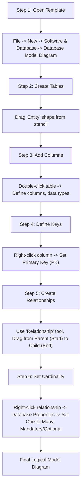
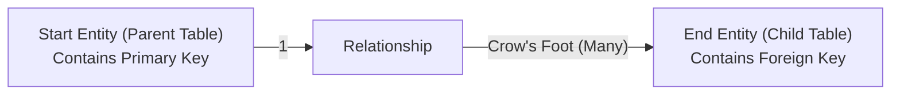

## Section 1: Concept Foundation

### What is MS Visio Database Modeling?
Microsoft Visio is a diagramming tool that includes a specific template for creating **Database Model Diagrams**. In the context of this experiment, Visio is used to convert a conceptual Entity-Relationship Diagram (ERD) into a **Logical Database Model**. A logical model defines tables, columns, primary keys, foreign keys, and relationships without relying on the specific syntax of a particular DBMS (like Oracle), though it can eventually be used to generate physical DDL scripts.

### Why use Visio for Database Modeling?
- **Visual Communication**: It provides a clear, graphical representation of the database structure that can be shared with non-technical stakeholders (project managers, business analysts).
- **Design Blueprint**: Before writing a single `CREATE TABLE` statement, you can verify your relationships, cardinality, and constraints visually, saving significant development time.
- **Documentation**: The final diagram serves as permanent documentation for the database schema.
- **Transitional Tool**: It bridges the gap between high-level conceptual design (ERD) and low-level physical implementation (Oracle SQL).

### Real-world Analogy
Think of Visio as an **architectural blueprint**. An architect does not start building a house by pouring concrete; they first draw a blueprint showing where walls, doors, and electrical outlets go. The blueprint ensures all contractors agree before construction begins. Similarly, a Visio database model is the blueprint of your database, ensuring developers and database administrators (DBAs) agree on table structures and relationships before the actual database is built.

### Where is it used in the Industry?
- **Requirement Gathering**: Analysts draw these models to confirm business rules with clients.
- **Data Warehousing**: Designing star schemas or snowflake schemas.
- **Legacy Migration**: Documenting the structure of an old system before migrating it to a modern RDBMS like Oracle.

---

## Section 2: Visual Understanding

### The Database Modeling Workflow in Visio



### Relationship Direction Rule



**Critical Note:** In Visio, the "Start" of the connection must be the Primary Key side (the parent). The "End" of the connection (where you drop the line) is the Foreign Key side (the child). If you drag the wrong way, the Crow's Foot will appear on the wrong table.

---

## Section 3: Step-by-Step Guide (Procedure for Visio)

This section acts as the "syntax" guide for the visual tool.

### Step 1: Open the Correct Template
- Navigate to **File** > **New**.
- Select **Software and Database** > **Database Model Diagram**.
- *Explanation*: This template loads specific shapes like Entities (tables) and relationships. Do not use the generic "Blank Drawing."

### Step 2: Create Tables (Entities)
- From the "Shapes" stencil on the left, locate the **Entity** shape.
- Drag and drop it onto the canvas.
- Rename the entity by typing (e.g., `Users`, `Videos`, `YouTubePlayList`).

### Step 3: Add Columns (Attributes)
- Double-click the Entity box to open its properties.
- In the editor, type the column names in the rows provided.
- Define the data types (e.g., `VARCHAR2(50)`, `NUMBER(10)`, `DATE`).
- *Professional Tip*: In a logical model, you do not need to specify the exact Oracle data types (like `VARCHAR2`) if you don't know them yet. Generic types like `Variable Characters`, `Integer`, and `Date` are acceptable at this stage.

### Step 4: Define Primary Keys and Foreign Keys
- **Primary Key (PK)**: Right-click on the desired column (e.g., `UserID`) inside the Entity shape and select **Set Primary Key**. Visio will mark it with a PK symbol.
- **Foreign Key (FK)**: Simply add the column (e.g., `UserID`) to the child table (e.g., `Videos`). Visio will link the FK to the PK during the Relationship step.

### Step 5: Create Relationships
- Select the **Relationship** tool from the stencil.
- **Start Point**: Click on the Parent table (the table containing the Primary Key).
- **End Point**: Drag the line to the Child table (the table containing the Foreign Key) and release the mouse.
- *Example*: Click on `Users` and drag to `Videos`.

### Step 6: Set Cardinality and Options
- Right-click on the relationship line and select **Database Properties**.
- Go to the **Cardinality** tab.
- Set the relationship type, for example: **One-to-Many**.
- Set the Parent table cardinality (e.g., Mandatory - meaning a video must be uploaded by exactly one user).
- Set the Child table cardinality (e.g., Optional or Mandatory based on business rules).
- **Check the Diagram**: If the Crow's foot symbol is on the wrong side, the line was drawn in the wrong direction. Delete the line, click the Parent first, and drag to the Child again.

---

## Section 4: Case Study – Building the YouTube Database Model

The lab manual provides a specific case study. Let's apply the steps.

### Entities (Tables) and Columns

1.  **Users** (Parent for Videos and Playlists)
    - `UserId` (Primary Key)
    - `FirstName`
    - `LastName`
    - `Email`

2.  **Videos** (Child of Users)
    - `VideoId` (Primary Key)
    - `Title`
    - `Description`
    - `UploadedDate`
    - `UserId` (Foreign Key referencing `Users.UserId`)

3.  **YouTubePlayList** (Child of Users)
    - `ListNumber` (Primary Key)
    - `ListName`
    - `UserId` (Foreign Key referencing `Users.UserId`)

4.  **PlaylistVideos** (Bridge/Junction Table for Many-to-Many)
    - `ListNumber` (Foreign Key referencing `YouTubePlayList.ListNumber`)
    - `VideoId` (Foreign Key referencing `Videos.VideoId`)
    - **Composite Primary Key**: `ListNumber` + `VideoId` (The combination of these two columns creates a unique record).

### Relationships (How to draw the lines)

| Relationship | Start Point (Parent / One Side) | End Point (Child / Many Side) | Meaning |
| :--- | :--- | :--- | :--- |
| **Users -> Videos** | Users (UserId PK) | Videos (UserId FK) | One user can upload many videos. |
| **Users -> YouTubePlayList** | Users (UserId PK) | YouTubePlayList (UserId FK) | One user can create many playlists. |
| **YouTubePlayList -> PlaylistVideos** | YouTubePlayList (ListNumber PK) | PlaylistVideos (ListNumber FK) | One playlist has many entries in the bridge table. |
| **Videos -> PlaylistVideos** | Videos (VideoId PK) | PlaylistVideos (VideoId FK) | One video can appear in many entries in the bridge table. |

*Industry Note*: The combination of `YouTubePlayList -> PlaylistVideos` and `Videos -> PlaylistVideos` resolves the Many-to-Many relationship between Playlists and Videos.

---

## Section 5: Query Thinking Process (Transitioning to SQL)

How does a professional take a Visio diagram and turn it into an Oracle DDL script?

**Step 1: Read the diagram.** Note every table and its columns.
**Step 2: Identify Primary Keys.** Mark them with `PRIMARY KEY` in your script.
**Step 3: Identify Foreign Keys.** Trace the relationship lines to see which columns link to other tables.
**Step 4: Check Cardinality.** Ensure you understand if a child row is mandatory (NOT NULL) or optional (NULL allowed) based on the circle/crow's foot symbols.
**Step 5: Write the DDL.**
```sql
CREATE TABLE Users (
    UserId NUMBER PRIMARY KEY,
    FirstName VARCHAR2(50),
    LastName VARCHAR2(50),
    Email VARCHAR2(100)
);

CREATE TABLE Videos (
    VideoId NUMBER PRIMARY KEY,
    Title VARCHAR2(300),
    Description VARCHAR2(2000),
    UploadedDate DATE,
    UserId NUMBER NOT NULL,
    CONSTRAINT FK_Video_User FOREIGN KEY (UserId) REFERENCES Users(UserId)
);
```

---

## Section 6: Common Mistakes in Visio Modeling

| Mistake | Why it is wrong | How to correct it |
| :--- | :--- | :--- |
| **Drawing the relationship backwards** | The Crow's foot appears on the Parent table instead of the Child. This implies a foreign key on the wrong table. | Delete the line. Click the **Parent** table first, then drag to the **Child** table. |
| **Forgetting a Bridge Table for Many-to-Many** | Directly connecting `YouTubePlayList` to `Videos` with a many-to-many line is a conceptual error in a logical model. Logical models require a physical bridge table. | Create the `PlaylistVideos` table. Create two one-to-many relationships: `Playlist -> PlaylistVideos` and `Videos -> PlaylistVideos`. |
| **Not defining a Composite Primary Key** | In the `PlaylistVideos` table, marking only `ListNumber` as PK and `VideoId` as FK allows a video to be added to the same playlist multiple times, breaking data integrity. | Right-click on both columns (`ListNumber` and `VideoId`) and select **Set Primary Key** for both to create a composite key. |
| **Using wrong data types** | Using `Varchar` instead of `Varchar2` (Oracle) or `Double` instead of `Number(12,2)` (Oracle). | While Visio allows generic types, you should tailor the data types to match the target RDBMS (Oracle in this course). |
| **Naming constraints inconsistently** | The Visio visual might show a relationship, but there is no `CONSTRAINT name` in the DDL. | When generating DDL from Visio, ensure constraint names are set in the Database Properties to match standards (e.g., `FK_Table_Parent`). |

---

## Section 7: Exam Perspective

### Frequently Asked Questions (Lab Exams)
1.  How do you create a Many-to-Many relationship in Visio?
2.  What is the correct order of steps to create a database model in Visio?
3.  How do you define a Composite Primary Key in Visio?
4.  If the Crow's foot is on the wrong side, what does that indicate, and how do you fix it?
5.  What is a bridge table (junction table), and when is it needed?

### Viva Questions
- What is the difference between the "Start" and "End" of a relationship in Visio?
  - *Answer*: "Start" is the Entity that contains the Primary Key (Parent). "End" is the Entity that contains the Foreign Key (Child).
- How do you resolve a Many-to-Many relationship in a logical model?
  - *Answer*: By creating a junction table (bridge table) that contains foreign keys from both original tables, and then creating two one-to-many relationships between the original tables and the bridge table.
- What is the purpose of using Visio before writing SQL?
  - *Answer*: It helps visualize the schema, verify business rules (cardinality), detect design flaws early, and document the system before physical implementation.
- Can Visio generate SQL scripts?
  - *Answer*: Yes, the Database Model Diagram template can often generate DDL scripts to create the physical tables, though in this experiment, the focus is on the modeling process itself.

### MCQ
1.  Which shape in Visio represents a database table?
    a) Attribute   b) Entity   c) Relationship   d) Cardinality
    **Answer: b**
2.  In Visio, to create a 1-to-Many relationship, you drag from:
    a) The Many side to the One side   b) The One side to the Many side
    **Answer: b**
3.  Which table is required to resolve a Many-to-Many relationship?
    a) Sub-table   b) View   c) Junction Table   d) Temp Table
    **Answer: c**

---

## Section 8: Industry Perspective

### How professionals use Visio (and similar tools)
- **Visio vs. Dedicated Modeling Tools**: In the industry, Visio is considered a general-purpose diagramming tool. For enterprise architecture, professionals often prefer dedicated data modeling tools like **Oracle SQL Developer Data Modeler**, **ER/Studio**, or **SAP Sybase PowerDesigner**. These tools have advanced reverse-engineering capabilities (generating diagrams from existing databases) and better forward-engineering (generating perfectly formatted Oracle DDL).
- **Version Control**: In a professional setting, these models are stored in Git repositories as XML files so changes can be tracked.
- **Collaboration**: The Visio template used in the lab is static. Industry teams often use web-based collaborative diagramming tools (like Lucidchart) to allow multiple stakeholders to edit the model simultaneously.

### Best Practices
- **Standardized Naming**: Always follow naming conventions (e.g., use `UserId` instead of `User_ID` in Oracle for consistency, though both are valid).
- **Documentation**: Add a "Description" field to every table and column in Visio. This will be exported as comments in the final database, which is invaluable for maintenance.
- **Validation**: Before generating DDL, verify that all relationships are correctly linked and that no orphaned columns exist.
- **Target Database**: Configure Visio to use the Oracle data types explicitly so the generated SQL is accurate.

---

## Section 9: Practice Section (Modeling Exercises)

### Beginner Exercises (Hands-on Visio)
1.  Open Visio and create a `Database Model Diagram`.
2.  Create a simple `Customers` table with `CustomerID` (PK), `Name`, and `Email`.
3.  Create an `Orders` table with `OrderID` (PK), `OrderDate`, and `CustomerID` (FK).
4.  Create a 1-to-Many relationship from `Customers` to `Orders`.
5.  Set the CustomerID in `Orders` as a Foreign Key in Visio (by connecting the tables).

### Intermediate Exercises (Building the University Model)
1.  Create a table `Department` with `DeptID` (PK) and `DeptName`.
2.  Create a table `Student` with `StudentID` (PK), `Name`, and `DeptID` (FK).
3.  Create a 1-to-Many relationship from `Department` to `Student`.
4.  Create a table `Course` with `CourseID` (PK) and `CourseName`.
5.  Create a `Enrollment` (Junction) table to resolve the Many-to-Many relationship between `Student` and `Course`. Include `StudentID` and `CourseID` as a Composite Primary Key.

### Advanced Exercises (Real-world Scenario)
1.  Draw a logical model for an inventory management system.
2.  Tables required: `Warehouse`, `Product`, `Inventory`.
3.  A `Product` can be stored in many `Warehouses`, and a `Warehouse` can hold many `Products`.
4.  The `Inventory` table must also track `Quantity`.
5.  Create the bridge table `Inventory` with composite keys `(WarehouseID, ProductID)` and a `Quantity` column.
6.  Correctly link the relationships: `Warehouse` -> `Inventory` (1:M) and `Product` -> `Inventory` (1:M).
7.  (Bonus) Generate the SQL DDL in your mind to see how it translates.

---

## Section 10: Interview Preparation

### Conceptual Questions

1.  **Explain the difference between a Conceptual, Logical, and Physical data model.**
    - **Conceptual**: High-level business view, only entities and relationships (no primary keys/columns).
    - **Logical**: Independent of technology. Includes tables, columns, PKs, FKs, and data types (generic). This is what Visio creates.
    - **Physical**: Database specific. Includes table spaces, partitions, indexes, and exact data types (e.g., Oracle `VARCHAR2`).

2.  **How do you handle a Many-to-Many relationship in a logical model?**
    - By introducing an associative entity (junction table) that holds the Primary Keys of the two original tables as Foreign Keys, along with any specific attributes for that relationship.

3.  **What is the cardinality of a relationship, and how is it represented in Crow's Foot notation?**
    - Cardinality defines the minimum and maximum number of relationships.
    - A single straight line represents "1".
    - A Crow's Foot (three pronged shape) represents "Many".
    - A circle represents "Optional" (can be zero).
    - A crossbar represents "Mandatory" (must be one or more).

4.  **Why is it important to set a Composite Primary Key in a junction table?**
    - To enforce the rule that the combination of the two foreign keys must be unique. For example, a student cannot enroll in the exact same course twice.

### Practical Interview Task
- **Task**: "Draw a logical model on the whiteboard for a Blog system. A `User` can write many `Posts`. A `Post` can have many `Tags`, and a `Tag` can be assigned to many `Posts`."
- **Professional Response**: I would draw the `Users` and `Posts` tables with a 1-to-Many relationship. Then, I would draw a Many-to-Many relationship between `Posts` and `Tags`, and resolve it by creating a junction table called `PostTags` containing `PostID` and `TagID` as a composite primary key.

---

## Section 11: Topic Summary – Cheat Sheet for Visio Database Modeling

### Visio User Interface Quick Reference

| Operation | How to perform in Visio |
| :--- | :--- |
| **Create New Diagram** | File -> New -> Software and Database -> Database Model Diagram |
| **Add Table (Entity)** | Drag `Entity` from the Shapes stencil to the canvas. |
| **Add Column** | Double-click the Table shape and type the column name. |
| **Set Primary Key** | Right-click the column -> Select `Set Primary Key` |
| **Draw Relationship** | Select the `Relationship` tool. Click `Parent` first, then drag to `Child`. |
| **Set Cardinality** | Right-click the relationship line -> `Database Properties` -> `Cardinality`. |
| **Fix Inverse Crow's Foot** | Delete the relationship. Click the `PK` table first, drag to the `FK` table. |
| **Create Composite PK** | Hold `Ctrl` and select both columns in the junction table. Right-click -> `Set Primary Key`. |

### Key Takeaways for Database Modeling
- **Start at the Parent**: Always start a relationship line from the table with the Primary Key.
- **End at the Child**: Always end a relationship line at the table with the Foreign Key.
- **Bridge for M:N**: Never connect two tables directly with a Many-to-Many line in a logical Visio model. Create an intermediate bridge table.
- **Verification**: Once the diagram is complete, trace the foreign keys to ensure every child points to a valid parent.

### Final Professional Advice
While Visio is a fantastic introductory tool for database visualization, professional Database Engineers and Data Architects often elevate their modeling skills by using dedicated data modeling software. However, the core principles you learned in this lab (identifying entities, normalizing data, defining keys, and mapping cardinalities) are universal. They apply whether you draw a box on a whiteboard, drag an entity in Visio, or write a `CREATE TABLE` statement in SQL Developer. Strong modeling skills are the foundation of efficient, robust, and scalable database design.