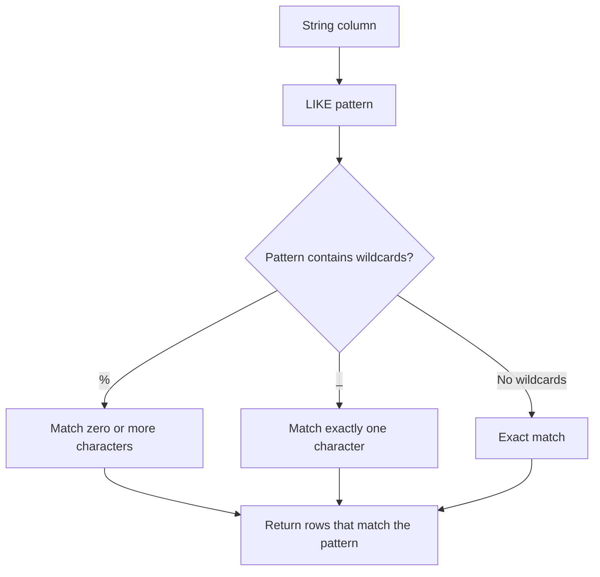
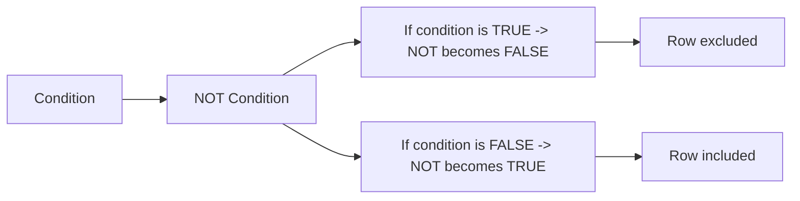

## Section 1: Concept Foundation

### What are SQL Wildcards and the LIKE Operator?
SQL wildcards are special characters used in conjunction with the `LIKE` operator to perform **pattern matching** on string data. Instead of checking for exact equality, `LIKE` allows you to search for strings that match a specific pattern, such as "starts with S", "contains 'nes'", or "ends with 'h'".

### Why was this feature created?
- **Flexible Searching**: Real-world data often requires fuzzy matching (e.g., searching for all customers whose name starts with "A").
- **Pattern Discovery**: In data analysis, you often need to find rows based on partial information.
- **User-Friendly Queries**: Applications with search bars use `LIKE` to implement "contains" or "begins with" searches.

### Real-world Analogy
Think of a library catalog search:
- `%` is like a wildcard that can match any number of letters (e.g., "comput%" finds "computer", "computation", "computing").
- `_` is like a placeholder for exactly one letter (e.g., "c_t" finds "cat", "cot", "cut" but not "cart").

### Where is it used?
- **Search Filters**: E-commerce sites (search for products containing "desk").
- **Data Cleaning**: Finding records with inconsistent formatting (e.g., phone numbers with or without dashes).
- **Reporting**: Filtering by name patterns, email domains, etc.

---

## Section 2: Visual Understanding

### LIKE Pattern Matching Flow



### NOT Operator Negation Flow



---

## Section 3: Syntax Breakdown and Oracle-Specific Rules

### 1. The LIKE Operator

**General Syntax:**
```sql
SELECT column_list
FROM table_name
WHERE column_name LIKE pattern;
```

**Explanation:**
- `column_name`: The character column to test.
- `pattern`: A string containing wildcards `%` and `_`.
- `%`: Matches any sequence of zero or more characters.
- `_`: Matches exactly one character.

**Important**: In Oracle, `LIKE` is **case-sensitive** by default. Use `UPPER()` or `LOWER()` for case-insensitive matching.

**Examples:**
- `WHERE City LIKE 'S%'` → Cities starting with 'S'.
- `WHERE City LIKE '%nes%'` → Cities containing 'nes' anywhere.
- `WHERE City LIKE '_a%'` → Cities with 'a' as the second character.
- `WHERE City LIKE '____'` → Cities with exactly 4 characters.

---

### 2. The NOT Operator

**Purpose**: Negates a condition. Returns rows where the condition is FALSE.

**General Syntax:**
```sql
SELECT column_list
FROM table_name
WHERE NOT condition;
```

**Explanation:**
- `NOT` can be applied to any condition: comparison, `LIKE`, `IN`, `BETWEEN`, `IS NULL`, etc.
- `NOT` reverses the truth value.

**Examples:**
- `WHERE NOT City = 'Sandnes'` → Cities other than Sandnes.
- `WHERE LastName NOT LIKE 'S%'` → Names not starting with 'S'.
- `WHERE City NOT IN ('Sandnes', 'Stavanger')` → Cities not in the list.
- `WHERE P_Id NOT BETWEEN 1 AND 2` → IDs outside the range.
- `WHERE Address IS NOT NULL` → Rows with non‑null addresses.

---

### 3. Combining LIKE and NOT

```sql
SELECT * FROM Customers WHERE LastName NOT LIKE 'S%';
```

---

### 4. Important Oracle Specifics
- `LIKE` is case-sensitive in Oracle. If you want to ignore case, use:
  ```sql
  WHERE UPPER(LastName) LIKE 'S%'
  ```
- Escape characters: If you need to search for actual `%` or `_`, use the `ESCAPE` clause (e.g., `WHERE column LIKE '%\_%' ESCAPE '\'`).
- `NOT LIKE` is equivalent to `NOT (column LIKE pattern)`.

---

## Section 4: Query Thinking Process (Professional Approach)

**Requirement**: "Find all employees whose name ends with the letter 'h'."

**Step 1: Identify table** → `employees`
**Step 2: Identify column** → `employee_name`
**Step 3: Determine pattern** → Ends with 'h' → `'%h'`
**Step 4: Choose operator** → `LIKE`
**Step 5: Write query**:
```sql
SELECT * FROM employees WHERE employee_name LIKE '%h';
```
**Step 6: Validate** → Check that results only include names ending with 'h'.

---

## Section 5: Multiple Examples

### Example 1: Easy (Starts with)
**Requirement**: Find cities starting with "sa" from `Persons` table.
**Query**:
```sql
SELECT * FROM Persons WHERE City LIKE 'sa%';
```

### Example 2: Medium (Contains pattern)
**Requirement**: Find last names containing "sen".
**Query**:
```sql
SELECT * FROM Persons WHERE LastName LIKE '%sen%';
```

### Example 3: Exam-style (Exact number of characters)
**Requirement**: Find first names that are exactly 4 characters long.
**Query**:
```sql
SELECT * FROM Persons WHERE FirstName LIKE '____';
```

### Example 4: Real-world (Email domain search)
**Requirement**: Find customers whose email address ends with "@gmail.com".
**Query**:
```sql
SELECT * FROM Customers WHERE Email LIKE '%@gmail.com';
```

### Example 5: Tricky (NOT LIKE with multiple patterns)
**Requirement**: Find products whose description does **not** contain the word "Desk".
**Query**:
```sql
SELECT * FROM Product_T WHERE ProductDescription NOT LIKE '%Desk%';
```

### Example 6: Combining NOT with IN and LIKE
**Requirement**: Find customers whose city is neither 'Sandnes' nor starts with 'S'.
**Query**:
```sql
SELECT * FROM Customers WHERE City NOT IN ('Sandnes') AND City NOT LIKE 'S%';
```

---

## Section 6: Pattern Recognition

| Requirement Keyword | Think of | SQL Feature |
|---------------------|----------|-------------|
| "Starts with" | `LIKE 'pattern%'` | `WHERE column LIKE 'A%'` |
| "Ends with" | `LIKE '%pattern'` | `WHERE column LIKE '%A'` |
| "Contains" | `LIKE '%pattern%'` | `WHERE column LIKE '%A%'` |
| "Second character is" | `LIKE '_pattern'` | `WHERE column LIKE '_A%'` |
| "Exactly n characters" | `LIKE '____'` (n underscores) | `WHERE column LIKE '____'` |
| "Does not start with" | `NOT LIKE 'pattern%'` | `WHERE column NOT LIKE 'A%'` |
| "Does not contain" | `NOT LIKE '%pattern%'` | `WHERE column NOT LIKE '%A%'` |
| "Not equal to" | `NOT condition` | `WHERE NOT column = 'value'` |
| "Not in list" | `NOT IN` | `WHERE column NOT IN (v1, v2)` |

---

## Section 7: Common Mistakes

| Mistake | Wrong Query | Why Wrong | Correct Query |
|---------|-------------|-----------|---------------|
| Using `=` instead of `LIKE` | `WHERE City = 'S%'` | `=` does not interpret wildcards; it searches for the literal string "S%". | `WHERE City LIKE 'S%'` |
| Forgetting the `%` at the end for "starts with" | `WHERE City LIKE 'S'` | Matches only 'S', not 'Sandnes'. | `WHERE City LIKE 'S%'` |
| Using `%` for exactly one character | `WHERE LastName LIKE '%son'` | This will match any name ending with 'son', not just 3-letter prefixes. | Use `_` for exact single characters. |
| Case sensitivity issues | `WHERE LastName LIKE 's%'` | Will not match 'Smith' if column has 'Smith' (capital S). | Use `UPPER(LastName) LIKE 'S%'` |
| Using `NOT` with `NULL` incorrectly | `WHERE NOT Age = NULL` | `NULL` comparisons are always false; this returns no rows. | `WHERE Age IS NOT NULL` |
| Mixing `AND`/`OR` precedence without parentheses | `WHERE product LIKE '%Desk' OR product LIKE '%Table' AND price > 300` | `AND` has higher precedence than `OR`; this returns all 'Desk' products, and only 'Table' products with price > 300. | `WHERE (product LIKE '%Desk' OR product LIKE '%Table') AND price > 300` |

---

## Section 8: Exam Perspective

### Frequently Asked Questions
1. Write a query to find all employees whose names start with 'J'.
2. Write a query to find customers whose email contains 'gmail'.
3. What is the difference between `%` and `_` in the `LIKE` operator?
4. How do you find products whose description does **not** contain the word 'Desk'?
5. Write a query to find all cities that are exactly 5 characters long.

### Viva Questions
- Is `LIKE` case-sensitive in Oracle? (Yes, by default.)
- How would you perform a case‑insensitive search using `LIKE`? (Use `UPPER()` or `LOWER()` on both sides.)
- Can you use `LIKE` on numeric columns? (No, `LIKE` works only on character data. Use `TO_CHAR` if needed, but avoid.)
- What does `NOT LIKE` do? (It returns rows that do not match the pattern.)
- How do you escape wildcards if you need to search for actual `%` or `_`? (Use the `ESCAPE` clause.)

### MCQ
1. Which wildcard matches exactly one character?
   a) %   b) *   c) _   d) ?
   **Answer: c**

2. To find names ending with 'son', you use:
   a) `LIKE '%son'`   b) `LIKE 'son%'`   c) `LIKE '%son%'`   d) `LIKE '_son'`
   **Answer: a**

3. Which operator negates a condition?
   a) AND   b) OR   c) NOT   d) XOR
   **Answer: c**

---

## Section 9: Industry Perspective

### How professionals use LIKE and NOT
- **Search Boxes**: Web applications use `LIKE` to implement autocomplete and search suggestions.
- **Data Validation**: `NOT LIKE` to detect invalid formats (e.g., phone numbers that contain letters).
- **ETL Pipelines**: Filtering out records with patterns indicating test data (e.g., `LIKE 'test%'`).
- **Performance**: `LIKE` with leading `%` (`'%pattern'`) prevents index usage and can be slow. Professionals often use full‑text search (Oracle Text) for heavy text searching.

### Best Practices
- **Avoid leading `%` if possible**: For performance, prefer patterns that start with a fixed string (e.g., `'A%'`) to leverage indexes.
- **Use `UPPER` for case‑insensitive searches** but be aware that function‑based indexes can help.
- **Escape special characters** when user input contains `%` or `_`.
- **Combine `NOT LIKE` carefully** with other conditions to ensure logical precedence.

---

## Section 10: Query Construction Framework

For any pattern matching task:

1. **Identify the column** (must be character type).
2. **Determine the pattern** (starts, ends, contains, exact length).
3. **Choose wildcards**:
   - `%` for any number of characters.
   - `_` for exactly one character.
4. **Write the `LIKE` pattern**.
5. **Add `NOT` if exclusion is needed**.
6. **Consider case sensitivity** and apply `UPPER()` if needed.
7. **Wrap in parentheses** when combining with other conditions.
8. **Write the final query** and test.

---

## Section 11: Practice Section

### Beginner Exercises (Use Product_T table)
1. Find all products whose `ProductDescription` starts with 'C'.
2. Find products whose `ProductFinish` ends with 'h'.
3. Find products whose `ProductStandardPrice` is 375, but description contains 'Desk'.
4. Find all products where `ProductFinish` is exactly 'Cherry'.
5. Find products where `ProductID` does not start with '1'.

### Intermediate Exercises
1. Find products whose `ProductDescription` contains the word 'Table'.
2. Find products whose `ProductFinish` is 'Natural Ash' and description does not contain 'Desk'.
3. Find products with `ProductStandardPrice` > 400 and `ProductDescription` like '%Desk%'.
4. Find products with `ProductFinish` not like '%Ash%'.
5. Find all products whose `ProductDescription` has exactly 10 characters (hint: use `LENGTH` and `LIKE`? Better use `LENGTH(description)=10`; however, `LIKE` can also do exact length with underscores: `'__________'`).

### Advanced Exercises
1. Write a query to find customers whose name starts with 'A' and ends with 's'.
2. Find all employees whose `employee_name` contains the letter 'a' twice (use `LIKE '%a%a%'`).
3. Write a query that returns products where the `ProductDescription` does not contain any of the words 'Desk', 'Table', 'Center' (use `NOT LIKE` with multiple `AND` conditions).
4. Find products where `ProductFinish` is 'Cherry' or 'Walnut' and the price is between 200 and 400, but description does **not** contain 'Desk'.
5. Using the `employees` table from the lab, find all employees whose name starts with 'J' and salary > 50000.

---

## Section 12: Challenge Section – Real-world Scenarios

### Scenario 1: E-commerce Search
- A user searches for "chair". Write a query to find all products whose `ProductDescription` contains the word "chair" (case‑insensitive).

### Scenario 2: HR Filter
- HR wants to send emails to all employees whose email address is not from the company domain (i.e., does not end with '@company.com'). Write a query.

### Scenario 3: Inventory Audit
- The warehouse manager wants to identify products that have a `ProductFinish` that is not one of the standard finishes: 'Cherry', 'Walnut', 'Natural Ash'. Use `NOT IN` with a list.

---

## Section 13: Interview Preparation

### Conceptual Questions

1. **Explain the difference between `%` and `_` in SQL pattern matching.**
   - `%` matches any sequence of zero or more characters; `_` matches exactly one character.

2. **How do you perform a case‑insensitive search using `LIKE` in Oracle?**
   - Use `UPPER(column) LIKE UPPER(pattern)` or `LOWER(column) LIKE LOWER(pattern)`.

3. **What is the performance impact of using `LIKE '%pattern%'`?**
   - It prevents the use of regular indexes because the leading `%` means the search cannot start from the beginning of the string. For large tables, this can be slow; consider using Oracle Text or a full‑text index.

4. **Can you use `LIKE` on numbers?**
   - No, `LIKE` expects character data. You can convert numbers to strings using `TO_CHAR`, but it's not recommended for performance.

5. **How do you escape a wildcard character if you want to search for a literal `%`?**
   - Use the `ESCAPE` clause: `WHERE column LIKE '%\%%' ESCAPE '\'` finds strings containing `%`.

### Practical SQL Interview Questions

**Q1:** Write a query to find all customers whose last name starts with 'M' and ends with 'n'.
**Answer:**
```sql
SELECT * FROM Customers WHERE LastName LIKE 'M%n';
```

**Q2:** Write a query to find products whose description contains the word 'Desk' but not 'Computer'.
**Answer:**
```sql
SELECT * FROM Product_T
WHERE ProductDescription LIKE '%Desk%'
  AND ProductDescription NOT LIKE '%Computer%';
```

**Q3:** How would you find all employees whose name does NOT contain the letter 'e'?
**Answer:**
```sql
SELECT * FROM Employees WHERE EmployeeName NOT LIKE '%e%';
```

**Q4:** Write a query to find all products with price > 300, but only those whose finish is either 'Cherry' or 'Walnut' and the description ends with 'Desk'.
**Answer:**
```sql
SELECT * FROM Product_T
WHERE ProductStandardPrice > 300
  AND ProductFinish IN ('Cherry', 'Walnut')
  AND ProductDescription LIKE '%Desk';
```

**Q5:** What is the difference between the following two queries?
```sql
-- Query A
SELECT * FROM Products WHERE Description LIKE '%Table' OR Description LIKE '%Desk' AND Price > 300;

-- Query B
SELECT * FROM Products WHERE (Description LIKE '%Table' OR Description LIKE '%Desk') AND Price > 300;
```
**Answer:** In Query A, due to operator precedence (`AND` before `OR`), it returns all products whose description ends with 'Table' (regardless of price) plus those that end with 'Desk' and have price > 300. Query B returns only products that end with either 'Table' or 'Desk' AND have price > 300. This is a classic trap in exam questions.

---

## Section 14: Topic Summary – Cheat Sheet

### LIKE Patterns Quick Reference

| Pattern | Meaning | Example |
|---------|---------|---------|
| `'A%'` | Starts with 'A' | `WHERE City LIKE 'L%'` |
| `'%A'` | Ends with 'A' | `WHERE City LIKE '%n'` |
| `'%A%'` | Contains 'A' | `WHERE City LIKE '%e%'` |
| `'_A%'` | Second character is 'A' | `WHERE City LIKE '_a%'` |
| `'____'` | Exactly 4 characters | `WHERE City LIKE '____'` |
| `'A_B'` | 3 characters: A, any, B | `WHERE Name LIKE 'A_B'` |

### NOT Operator Usage

| With | Example | Effect |
|------|---------|--------|
| `=` | `WHERE NOT City = 'Sandnes'` | Excludes Sandnes |
| `LIKE` | `WHERE LastName NOT LIKE 'S%'` | Excludes names starting with S |
| `IN` | `WHERE City NOT IN ('Sandnes','Stavanger')` | Excludes those cities |
| `BETWEEN` | `WHERE P_Id NOT BETWEEN 1 AND 2` | Excludes IDs 1 and 2 |
| `IS NULL` | `WHERE Address IS NOT NULL` | Includes rows with non‑null addresses |

### Key Takeaways
- `LIKE` is for pattern matching; `%` and `_` are the wildcards.
- `NOT` reverses any condition.
- Be mindful of case sensitivity and operator precedence when combining with `AND`/`OR`.
- Use parentheses to clarify logic.

---

### Final Professional Advice
The `LIKE` operator is a powerful tool for textual data analysis, but it must be used with awareness of its performance implications. In production, avoid leading wildcards if possible. Always test with sample data to ensure your patterns match as intended. Combine `NOT` and `LIKE` wisely to filter out unwanted patterns. With practice, you'll be able to write precise, efficient, and readable queries for any pattern‑based requirement.