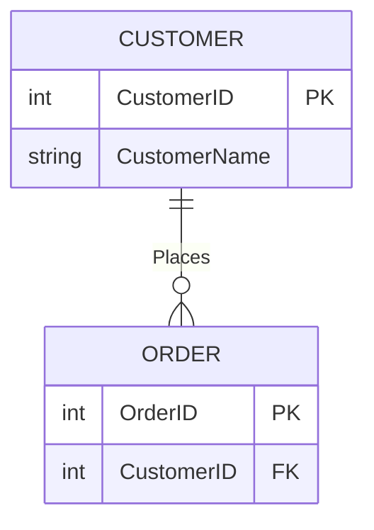
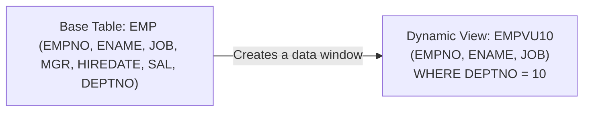

## 1. Lecture Agenda
Today's lecture covers the following advanced SQL topics:
*   **Database Views:** Creation, modification, and management of views.
*   **Data Control:** `WITH CHECK OPTION`, `WITH READ ONLY`, and denying DML operations.
*   **Advanced SQL Logic:** `CASE` statements and `UNION` operators.
*   **Programmable SQL:** Stored Procedures and Database Triggers.

---

## 2. Referential Integrity Constraints (Foreign Key Rules)
*(Slide 5)*
Before diving into SQL logic, the lecture briefly reviews Foreign Key constraints using a `CUSTOMER` and `ORDER` table relationship.
*   **Business Rule:** A customer ID can only be deleted from the `CUSTOMER` table if it is **not** found in the `ORDER` table.

**ER Diagram: CUSTOMER to ORDER (1:M Relationship)**


**Defining the Constraints (SQL Examples):**

When defining a Foreign Key, you can specify what happens to the `ORDER` table if the related `CustomerID` in the `CUSTOMER` table is updated or deleted:
*   **`ON UPDATE RESTRICT`:** The update is blocked. A Customer ID can only be changed if there are no matching records in the `ORDER` table.
*   **`ON UPDATE CASCADE`:** The update flows through. If you change `CustomerID` 1 to 50 in `CUSTOMER`, every row in the `ORDER` table with `CustomerID` 1 automatically updates to 50.
*   **`ON UPDATE SET NULL`:** The update sets the foreign key to `NULL`. If you change `CustomerID` 1, all matching rows in `ORDER` have their `CustomerID` set to `NULL`.
*   **`ON UPDATE SET DEFAULT`:** The update sets the foreign key to a predefined default value (e.g., `999`).

---

## 3. Database Views
*(Slides 6 - 14)*

### What is a View?
A **View** is a logical table based on one or more underlying tables (or other views). 
*   It does **not** contain data of its own. Think of it as a **window** through which you can view or change data from the physical base tables.
*   The view is stored in the database's data dictionary as a `SELECT` statement.
*   **Base Table:** The actual physical table where raw data is inserted and stored.
*   **Virtual Table:** A table constructed automatically by the DBMS as needed. It is not maintained as real data.
*   **Dynamic View:** A virtual table that is **created dynamically** upon request. Its definition is stored in the catalog, and its contents are generated every time a user runs a query that uses the view.
*   **Materialized View:** A copy or replica of data based on an SQL query. This exists as a **physical table** on the disk. Care must be taken to keep it synchronized with its base tables.

**Visual Representation of a View:**


### Simple vs. Complex Views
The primary difference lies in whether you can perform DML (Insert, Update, Delete) operations through the view.

| Feature | Simple Views | Complex Views |
| :--- | :--- | :--- |
| **Number of Tables** | Only one table | One or more tables |
| **Contains Functions** | No | Yes |
| **Contains Groups of Data** | No | Yes |
| **DML Operations** | Yes (you can insert/update via view) | Not always (restricted) |

---

## 4. Working with Views (Creating, Modifying, Dropping)
*(Slides 15 - 32)*

### A. Creating a View
You create a view by embedding a `SELECT` subquery within the `CREATE VIEW` command.
**Basic Syntax:**
```sql
CREATE [OR REPLACE] [FORCE|NOFORCE] VIEW view_name [(alias1, alias2...)]
AS subquery
[WITH CHECK OPTION [CONSTRAINT constraint_name]]
[WITH READ ONLY];
```
*   `OR REPLACE`: Recreates the view if it already exists.
*   `FORCE`: Creates the view even if the base tables do not exist yet (useful for scripting).
*   `NOFORCE`: (Default) Only creates the view if the base tables exist.
*   `alias`: Column names for the expressions selected by the view.
*   `WITH CHECK OPTION`: Ensures that inserted or updated rows meet the view's `WHERE` condition.
*   `WITH READ ONLY`: Prevents any DML operations on the view.

**Rules for Creating a View:**
*   The subquery *cannot* contain an `ORDER BY` clause.
*   The subquery *can* contain complex joins, groups, and subqueries.

**Example 1: Creating a Simple View**
Create a view `empvu10` that only shows employees in department 10.
```sql
CREATE VIEW empvu10  
AS SELECT empno, ename, job  
FROM emp  
WHERE deptno = 10;
```
*(Note: The `DESCRIBE` command can be used to view the structure of this view).*

**Example 2: Creating a Complex View**
Create a view `dept_sum_vu` that displays summarized salary data (MIN, MAX, AVG) grouped by department name from two tables (`emp` and `dept`).
```sql
CREATE VIEW dept_sum_vu (name, minsal, maxsal, avgsal) 
AS SELECT d.dname, MIN(e.sal), MAX(e.sal), AVG(e.sal) 
FROM emp e, dept d 
WHERE e.deptno = d.deptno 
GROUP BY d.dname;
```

### B. Modifying a View
To change the definition of a view without dropping it and regranting privileges, use `CREATE OR REPLACE VIEW`.
```sql
CREATE OR REPLACE VIEW empvu10 (employee_number, employee_name, job_title) 
AS SELECT empno, ename, job 
FROM emp 
WHERE deptno = 10;
```
*(Note: The aliases `employee_number`, `employee_name`, `job_title` are defined in the `CREATE VIEW` clause and must match the order of columns in the `SELECT` subquery).*

### C. Protecting a View (WITH CHECK OPTION & WITH READ ONLY)
**WITH CHECK OPTION:**
This clause ensures that INSERT and UPDATE operations performed through the view do not create rows that the view *cannot* select. It enforces integrity and validation.

*Example:* We create a view `empvu20` that only selects employees in department 20. 
```sql
CREATE OR REPLACE VIEW empvu20 
AS SELECT * FROM emp WHERE deptno = 20 
WITH CHECK OPTION CONSTRAINT empvu20_ck;
```
*Behavior:* If we try to update the department of an employee in this view from `20` to `10`, the database rejects it with an error: `ORA-01402: view WITH CHECK OPTION where-clause violation`. This is because if the department changed to 10, the employee would disappear from the view, which violates the check option.

**WITH READ ONLY:**
This option denies **ALL** DML operations (INSERT, UPDATE, DELETE) on the view. It is extremely useful for security.
```sql
CREATE OR REPLACE VIEW empvu10 
(employee_number, employee_name, job_title) 
AS SELECT empno, ename, job 
FROM emp 
WHERE deptno = 10 
WITH READ ONLY;
```
*(Note: Any attempt to perform an update on this view will result in an Oracle Server error).*

### D. Dropping a View
To remove a view definition from the database, use the `DROP VIEW` command.
*   This does **not** remove the underlying base tables or their data.
*   Other views or applications that rely on this deleted view will become invalid.
```sql
DROP VIEW empvu10;
```

---

## 5. Pros and Cons of Dynamic Views
*(Table 6-4, Slide 33)*

| Positive Aspects (Pros) | Negative Aspects (Cons) |
| :--- | :--- |
| **Simplify query commands:** Users don't need to write complex joins every time. | **Processing Time:** Uses processing time to recreate the view each time it is referenced (slower than a direct base table query). |
| **Help provide data security:** Hide sensitive columns from specific users. | **Update Limitations:** May or may not be directly updateable (especially complex views). |
| **Improve programmer productivity:** Easier for developers to write against a simple view. | **Not Stored:** Does not store data physically, so complex aggregations can be slow for large datasets. |
| **Use little storage space:** Only stores the SQL definition, not the data itself. | **Dependency Changes:** If the base table structure changes, the view can become invalid. |
| **Provide a customized view:** Each user can see their own tailored view of the system. | |
| **Establish physical data independence:** You can change the physical base table structure without breaking applications that use the view. | |

---

## 6. Advanced SQL Control Structures
*(Slides 34 - 42)*

### A. The `CASE` Statement
The `CASE` statement allows you to perform **IF-THEN-ELSE** logic directly inside your SQL query to generate conditional results.

**Syntax:**
```sql
CASE [expression] 
    WHEN condition_1 THEN result_1
    WHEN condition_2 THEN result_2
    ...
    ELSE result_n
END case_name
```
*(Note: `expression` is optional, `condition` and `result` are mandatory, `case_name` is optional).*

**Example 1: Replacing Product Description with `####` for a specific ProductLine**
```sql
SELECT 
    CASE 
        WHEN ProductLine = 1 THEN ProductDescription 
        ELSE '####' 
    END AS ProductDescription 
FROM Product_T;
```

**Example 2: Categorizing Salaries**
```sql
SELECT 
    salary, 
    CASE 
        WHEN salary < 2000 THEN 'Category 1'
        WHEN salary < 3000 THEN 'Category 2'
        WHEN salary < 4000 THEN 'Category 3'
        ELSE 'Category 4'
    END as Category
FROM employees;
```

### B. The `UNION` Operator
The `UNION` operator combines the results of two or more `SELECT` statements into a single result set.

**Example Scenario:** The lecture uses `UNION` to show customers who ordered the **LARGEST** quantity and those who ordered the **SMALLEST** quantity.

**Query 1 (Find Largest Quantity):**
```sql
SELECT C1.CustomerID, CustomerName, OrderedQuantity, 'Largest Quantity' AS Quantity
FROM Customer_T C1, Order_T O1, OrderLine_T Q1
WHERE C1.CustomerID = O1.CustomerID 
AND O1.OrderID = Q1.OrderID 
AND OrderedQuantity = (SELECT MAX(OrderedQuantity) FROM OrderLine_T);
```

**Query 2 (Find Smallest Quantity):**
```sql
SELECT C1.CustomerID, CustomerName, OrderedQuantity, 'Smallest Quantity'
FROM Customer_T C1, Order_T O1, OrderLine_T Q1
WHERE C1.CustomerID = O1.CustomerID 
AND O1.OrderID = Q1.OrderID 
AND OrderedQuantity = (SELECT MIN(OrderedQuantity) FROM OrderLine_T)
ORDER BY 3; -- Order by the 3rd column (OrderedQuantity)
```

**Combined Result of `UNION`:**
The result includes customers who bought the maximum amount **AND** customers who bought the minimum amount.
*   `Customer 1 Contemporary Casuals` -> `1` (Smallest Quantity)
*   `Customer 2 Value Furniture` -> `1` (Smallest Quantity)
*   `Customer 1 Contemporary Casuals` -> `10` (Largest Quantity)

---

## 7. Stored Procedures
*(Slides 43 - 59)*

A **Stored Procedure** is a subprogram unit consisting of a group of PL/SQL statements. It is stored physically in the database as an object.

### Characteristics of Stored Procedures
*   They are standalone blocks of code that can be saved in the database.
*   They can be called by referring to their name using the `EXEC` keyword or from within another block.
*   They contain 3 parts: 
    1.  **Declaration part** (optional - variable definitions).
    2.  **Execution part** (mandatory - the actual logic).
    3.  **Exception handling part** (optional - error handling).
*   **Parameters:** You can pass parameters into the procedure or fetch values out of it.
*   They **cannot** be called directly from a standard `SELECT` statement.

### Procedure Syntax
```sql
CREATE OR REPLACE PROCEDURE procedure_name
(
    parameter_name IN/OUT datatype
)
IS | AS
    <declaration_part>
BEGIN
    <execution_part>
EXCEPTION
    <exception_handling_part>
END;
```

### Types of Parameters
1.  **IN Parameter:**
    *   Used for **input**.
    *   Acts as a read-only variable inside the procedure (its value cannot be changed).
    *   By default, parameters are `IN`.
2.  **OUT Parameter:**
    *   Used for **output**.
    *   Acts as a read-write variable (its value can be changed inside the procedure).
    *   In the calling statement, you must provide a variable to receive this output.
3.  **IN OUT Parameter:**
    *   Used for both **input and output**.
    *   It starts with a value passed in, the procedure can change it, and the changed value is returned to the caller.

### `RETURN` Keyword
Inside a stored procedure, the `RETURN` keyword is used to exit the subprogram immediately and pass control back to the calling statement. Any code written after `RETURN` in the procedure is skipped.

---

### Example 1: The `ProductLineSale` Procedure
*Scenario:* We need a procedure to apply a discount based on the product's standard price.
1.  **Step 1:** Add a column to hold the sale price.
    ```sql
    ALTER TABLE Product_T ADD (SalePrice DECIMAL (6,2));
    ```
2.  **Step 2:** Create the procedure.
    *   Price >= 400 => 90% of standard price (10% off).
    *   Price < 400 => 85% of standard price (15% off).
    ```sql
    CREATE OR REPLACE PROCEDURE ProductLineSale AS
    BEGIN
        UPDATE Product_T
        SET SalePrice = .90 * ProductStandardPrice
        WHERE ProductStandardPrice >= 400;
        
        UPDATE Product_T
        SET SalePrice = .85 * ProductStandardPrice
        WHERE ProductStandardPrice < 400;
    END;
    ```
3.  **Step 3:** Execute the procedure.
    ```sql
    BEGIN
        productlinesale();
    END;
    ```
    *(Result: PL/SQL procedure successfully completed).*
4.  **Step 4 (Resulting Table):**
    | ProductID | ProductDescription | ProductStandardPrice | SalePrice |
    | :--- | :--- | :--- | :--- |
    | 1 | End Table | 175 | 148.75 |
    | 2 | Coffee Table | 200 | 170.00 |
    | 4 | Entertainment Center | 650 | 585.00 |
    | 7 | Dining Table | 800 | 720.00 |

---

### Example 2: The `welcome_msg` Procedure
*Scenario:* A simple procedure to print a welcome message to the user output.
```sql
CREATE OR REPLACE PROCEDURE welcome_msg (p_name IN VARCHAR2)
IS
BEGIN
    dbms_output.put_line ('Welcome ' || p_name);
END;
```
*(To execute it, you run: `BEGIN welcome_msg ('Students'); END;`).*

---

## 8. Database Triggers
*(Slides 60 - 68)*

**Triggers** are stored programs that execute automatically in the database when a specific event occurs. 
*   They execute against **all applications** that access the database.
*   Triggers can **cascade**, meaning one trigger can fire and cause other triggers to fire.

### Uses of Triggers
Triggers are commonly used to:
*   Ensure referential integrity (particularly useful when constraints are insufficient).
*   Enforce complex business rules.
*   Create audit trails (logging every time data changes).
*   Replicate tables.
*   Activate other procedures.

**Constraint vs. Trigger:** Database constraints can be thought of as a special, simpler type of trigger.

### The Three Parts of a Trigger
A trigger has exactly 3 components:
1.  **Event:** The DML statement that fires the trigger (INSERT, UPDATE, DELETE, or a DDL statement like ALTER TABLE).
2.  **Condition:** Determines if the trigger should actually run (e.g., `FOR EACH ROW`, `WHEN (old.salary != new.salary)`).
3.  **Action:** The PL/SQL code that executes if the condition is met.

### Trigger Syntax
```sql
CREATE [OR REPLACE] TRIGGER trigger_name
{BEFORE | AFTER | INSTEAD OF} {INSERT | DELETE | UPDATE [OF column]}
ON table_name
[FOR EACH ROW] [WHEN (search condition)]
DECLARE
    -- variable declarations
BEGIN
    -- trigger code here
EXCEPTION
    WHEN ... THEN ...
    -- exception handling
END;
```

### Trigger Example: Audit Trail
*Scenario:* We want to create an automatic audit log of exactly who updated the `orders` table and what the old and new quantities were.
1.  **Setup:** Create the Orders table.
    ```sql
    CREATE TABLE orders ( 
        order_id number(5), 
        quantity number(4), 
        cost_per_item number(6,2), 
        total_cost number(8,2) 
    );
    ```
2.  **The Trigger:** `orders_after_update`
    ```sql
    CREATE OR REPLACE TRIGGER orders_after_update
    AFTER UPDATE
    ON orders
    FOR EACH ROW
    DECLARE
        v_username varchar2(10);
    BEGIN
        -- Find username of the person performing the UPDATE
        SELECT user INTO v_username FROM dual;
        
        -- Insert an audit record into an audit table
        INSERT INTO orders_audit
        ( order_id, quantity_before, quantity_after, username )
        VALUES
        ( :new.order_id, :old.quantity, :new.quantity, v_username );
    END;
    ```
    *(Note: `:OLD` and `:NEW` are special trigger keywords allowing you to access data before and after the update occurs).*

---

## 9. Summary
*(Slides 69 - 70)*
*   **Views** are created on base tables to improve data integrity, secure data, and simplify queries. They are virtual windows to data.
*   **Advanced SQL Operations** like the `CASE` statement allow you to perform IF-THEN-ELSE logic right inside your SQL queries, while `UNION` allows combining results from different queries.
*   **Triggers and Routines** (like Stored Procedures) are programmable extensions to SQL. They allow you to enforce business rules, validate data, and automate complex logic directly at the database level, saving application programmers from having to write this logic in their code.
*   **Stored Procedures** are stored and executed upon manual request, while **Triggers** are fire automatically based on INSERT, UPDATE, or DELETE events.