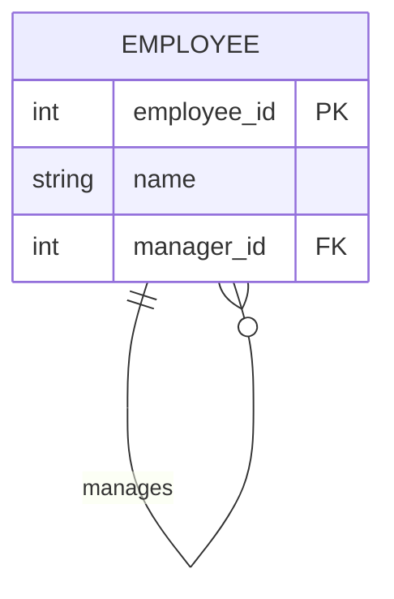
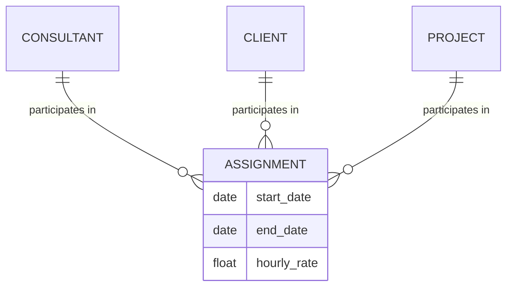
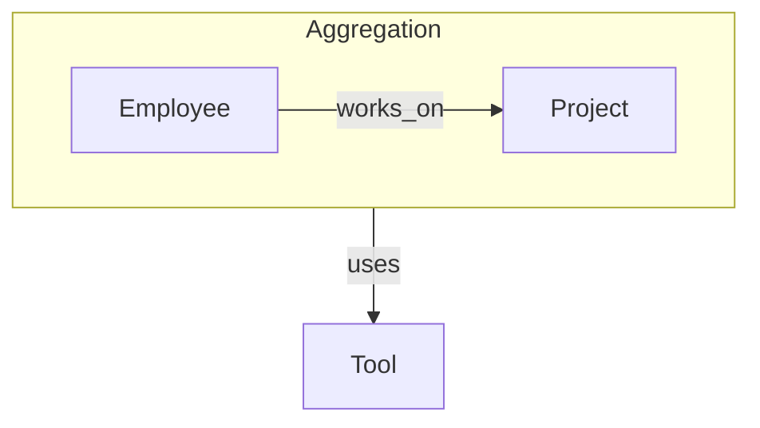

### 1. Big Picture
Beyond simple binary relationships, real-world scenarios involve **recursive** connections, **ternary** relationships, and **aggregation**. These require careful modelling to capture business rules correctly.

### 2. Simple Explanation
- **Unary/Recursive**: Entity relates to itself (e.g., `Employee` manages `Employee`).
- **Binary**: Two entities relate (most common).
- **Ternary**: Three entities relate (e.g., `Doctor`, `Patient`, `Hospital` together form an `Appointment`).
- **Aggregation**: A relationship is treated as a higher-level entity.

### 3. Unary/Recursive Relationships

| Type | Description | Example | How to Map |
| :--- | :--- | :--- | :--- |
| **1:1 Recursive** | One instance relates to one other instance of the same type. | Person marries Person. | Add a FK to the same table (e.g., `spouse_id`). |
| **1:M Recursive** | One instance relates to many instances of the same type. | Employee manages Employee. | Add a FK `manager_id` to `Employee` table. |
| **M:N Recursive** | Many instances relate to many instances of the same type. | Product contains Product (Bill of Materials). | Junction table with two FKs to the same table. |

### 4. Recursive 1:M Example

### 5. Ternary Relationships

### 1. Big Picture
Sometimes, an association involves **three** entities simultaneously. A ternary relationship is a relationship of degree 3.

### 2. Simple Explanation
Think of a `Project` assignment: a `Consultant` is assigned to a `Client` for a specific `Project`. The assignment involves all three entities together – you can't assign a consultant to a client without a project, nor to a project without a client.

### 3. Ternary Example

### 4. Aggregation (Relationship of Relationships)

### 1. Big Picture
Aggregation is used when a **relationship** needs to relate to another entity. It treats the relationship as a higher-level entity.

### 2. Simple Explanation
Consider `Employee` **works on** `Project`. The `Works_On` relationship has attributes like `hours`. Now, suppose we need to track which `Tool` was used for that specific assignment. The `Tool` is related to the `Works_On` relationship, not directly to `Employee` or `Project`. Aggregation lets us connect `Tool` to `Works_On`.

### 3. Aggregation Example

### 5. Software Engineer Perspective
- **Recursive relationships** are common in hierarchical data (org charts, product catalogs, category trees).
- **Ternary relationships** are rare but appear in complex scheduling and resource allocation.
- **Aggregation** is implemented by creating a table for the relationship (e.g., `Works_On`) and then a separate table linking it to the related entity (e.g., `Works_On_Tool`).

### 6. Exam Perspective
- **Define** recursive, ternary, and aggregation relationships.
- **Provide examples** of each.
- **Explain** how to map each to relational tables.

---

