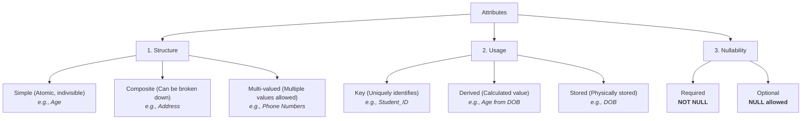

### 1. Big Picture
Attributes describe the properties of entities. Choosing the right types and structures prevents data anomalies and improves query performance. Hoffer classifies attributes into multiple categories based on structure and usage.

### 2. Simple Explanation
Attributes are like the **fields** in a form. We classify them to decide how they will be stored.

### 3. Comprehensive Attribute Taxonomy

### 4. Detailed Attribute Classification

| Attribute Type | Description | Example | How to Store |
| :--- | :--- | :--- | :--- |
| **Simple (Atomic)** | Cannot be divided. | `Age`, `Salary` | Direct column |
| **Composite** | Can be divided into smaller parts. | `FullName` → `FirstName`, `LastName` | Split into multiple columns |
| **Multi-valued** | Holds multiple values. | `PhoneNumbers` (home, work, mobile) | Create separate table |
| **Derived** | Calculated from other data. | `Age` (from `DOB`) | **Do not store** – compute in query |
| **Stored** | Physically stored. | `DOB` | Direct column |
| **Key** | Uniquely identifies an entity. | `Student_ID` | Primary Key |
| **Optional** | NULL allowed. | `MiddleName` | Column with NULL allowed |

### 5. Real World Example
- **E-commerce**: `Product` has `Product_ID` (key), `Name` (simple), `Dimensions` (composite: height, width, depth), `Colors` (multi-valued), `Profit` (derived from price – cost).
- **Banking**: `Customer` has `Customer_ID` (key), `FullName` (composite), `Account_Type` (single-valued).

### 6. Software Engineer Perspective
- **Multi-valued** attributes are avoided in relational tables – we create separate tables for them (normalisation).
- **Derived** attributes are usually not stored; we calculate them in queries or application code to save storage and keep data consistent.
- **Composite** attributes are often split into separate fields for easier searching (e.g., search by last name).

### 7. Exam Perspective
- **List types** of attributes with examples.
- **Explain** which attributes are stored vs derived.
- **Question**: "Which type of attribute is 'Age'?" – Derived.
- **Key** is always underlined in ER diagrams.

### 8. Common Mistakes
- Storing derived attributes (bad practice) – leads to stale data.
- Forgetting to split multi-valued attributes – leads to repeating groups (violates 1NF).
- Confusing composite attributes with multi-valued attributes.

### 9. Quick Revision Box
- **Key** = unique identifier (underline it).
- **Composite** = split into smaller parts.
- **Multi-valued** = need a new table.
- **Derived** = compute, don't store.

---