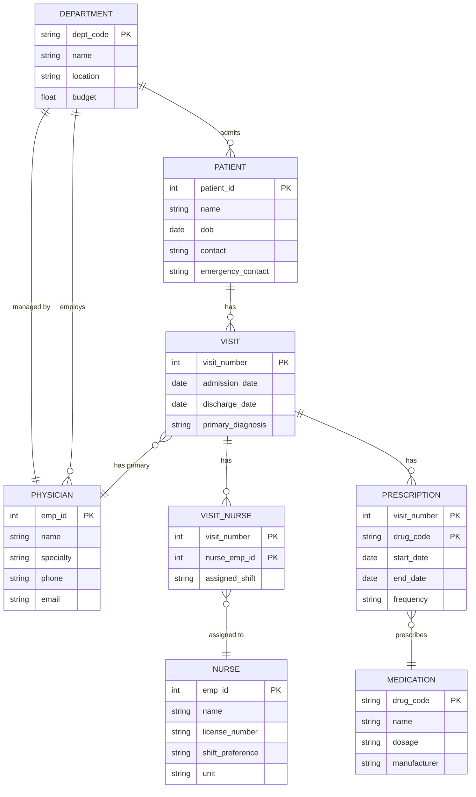
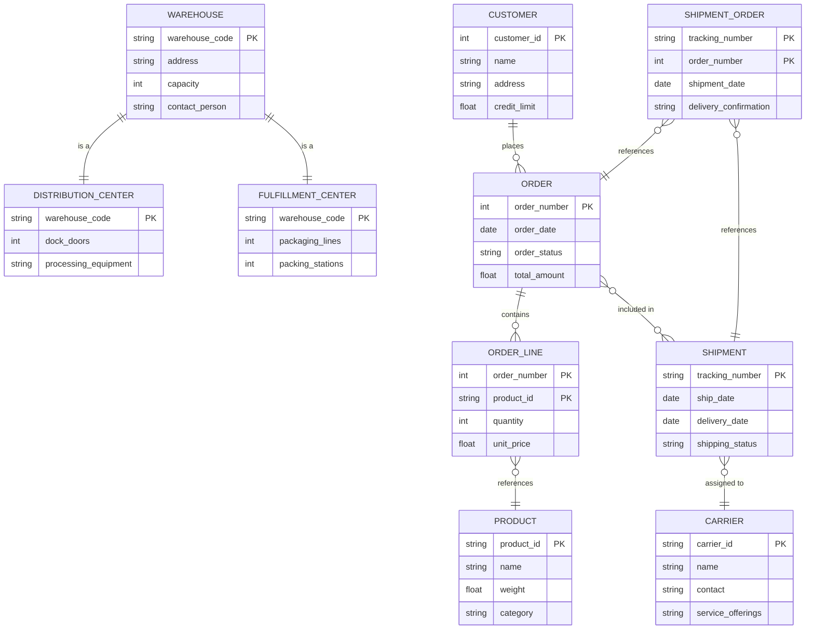
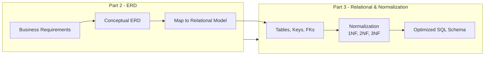

### 1. Big Picture
The ultimate test of ERD proficiency is applying the theory to complex, real-world scenarios. These case studies simulate university exam questions and industry requirements, providing a complete walkthrough from business description to final ERD.

### 2. Case Study 1: Enterprise Hospital Management System

#### Raw Text Description (Business Rules)

> A large hospital wants to build a comprehensive information system to manage its operations. The hospital has multiple **departments** (e.g., Cardiology, Neurology, Pediatrics), each identified by a unique code and having a name, location, and budget. Each department is managed by exactly one **physician**, and a physician can manage at most one department.
>
> The hospital employs many **physicians** (identified by an employee ID) and **nurses**. For each physician, the system tracks their name, specialty, phone, and email. For nurses, it tracks their name, license number, shift preference, and unit assignment.
>
> **Patients** are admitted to the hospital with a unique patient ID, along with their name, date of birth, contact information, and emergency contact. A patient is admitted to exactly one department, but a department can have many patients at any time.
>
> A **visit** represents a patient's stay in the hospital. Each visit is identified by a visit number and has an admission date, discharge date, and a primary diagnosis. During a visit, a patient is assigned to a primary **physician** (the attending physician) and receives care from multiple **nurses** over the course of their stay. A nurse can be assigned to many visits, and a physician can be the primary for many visits.
>
> The hospital also tracks **medications** prescribed during a visit. Each medication is identified by a drug code, with a name, dosage, and manufacturer. A visit can have many medications prescribed, and a medication can be prescribed to many visits. For each prescription, the system must record the start date, end date, and frequency.

#### Step-by-Step Extraction Breakdown

##### Step 1: Identify Entities (Nouns)
- Department
- Physician
- Nurse
- Patient
- Visit
- Medication

##### Step 2: Identify Attributes
- Department: dept_code (PK), name, location, budget
- Physician: emp_id (PK), name, specialty, phone, email
- Nurse: emp_id (PK), name, license_number, shift_preference, unit
- Patient: patient_id (PK), name, dob, contact, emergency_contact
- Visit: visit_number (PK), admission_date, discharge_date, primary_diagnosis
- Medication: drug_code (PK), name, dosage, manufacturer

##### Step 3: Identify Relationships (Verbs)
1. Department **managed by** Physician → 1:1
2. Physician **works in** Department → M:1
3. Patient **admitted to** Department → M:1
4. Visit **involves** Patient → M:1
5. Visit **has** Physician (Primary) → M:1
6. Visit **has** Nurse → M:M (associative)
7. Visit **has** Medication → M:M (associative)

##### Step 4: Determine Cardinality & Modality
| Relationship | Cardinality | Modality |
| :--- | :--- | :--- |
| Department manages Physician | 1:1 | Total: Dept (must have manager) |
| Physician works in Department | M:1 | Total: Phys (must be in dept) |
| Patient admitted to Department | M:1 | Total: Patient (must be in dept) |
| Visit involves Patient | M:1 | Total: Visit (must have patient) |
| Visit has Primary Physician | M:1 | Total: Visit (must have primary) |
| Visit has Nurse | M:M | Partial: Both (optional) |
| Visit has Medication | M:M | Partial: Both (optional) |

##### Step 5: Resolve M:N with Associative Entities
- Visit has Nurse → `Visit_Nurse` (visit_number, nurse_emp_id, assigned_shift)
- Visit has Medication → `Prescription` (visit_number, drug_code, start_date, end_date, frequency)

##### Complete Mermaid ERD (Production Grade)

---

### 3. Case Study 2: International Supply Chain & Logistics Tracker

#### Raw Text Description (Business Rules)

> A global logistics company manages the movement of **goods** across its supply chain network. The system needs to track **warehouses**, **shipments**, **orders**, **customers**, and **carriers**.
>
> Each **warehouse** has a unique code, address, capacity, and contact person. A warehouse can be of two types: **Distribution Center** (which has additional dock doors and processing equipment) or **Fulfillment Center** (which has packaging lines and packing stations). A warehouse must be exactly one of these types.
>
> The company has many **customers** identified by a customer ID, with name, address, and credit limit. A customer can place many **orders**, but each order belongs to exactly one customer.
>
> Each **order** has an order number, order date, order status, and total amount. An order can consist of many **order lines**, each tracking a specific **product**, quantity, and unit price. A product can appear in many order lines across different orders.
>
> **Shipments** are created to deliver orders. A shipment can contain many orders, and an order can be split across multiple shipments (in case of partial fulfillment). Each shipment has a tracking number, ship date, delivery date, and shipping status.
>
> **Carriers** (like FedEx, DHL, UPS) are identified by a carrier ID, with name, contact, and service offerings. A shipment is assigned to exactly one carrier. A carrier can handle many shipments.

#### Step-by-Step Extraction Breakdown

##### Step 1: Identify Entities (Nouns)
- Warehouse (Supertype)
  - Distribution Center (Subtype)
  - Fulfillment Center (Subtype)
- Customer
- Order
- Product
- Order_Line (Associative Entity)
- Shipment
- Carrier

##### Step 2: Identify Attributes
- Warehouse: warehouse_code (PK), address, capacity, contact_person
- Distribution Center: dock_doors, processing_equipment
- Fulfillment Center: packaging_lines, packing_stations
- Customer: customer_id (PK), name, address, credit_limit
- Order: order_number (PK), order_date, order_status, total_amount
- Product: product_id (PK), name, weight, category
- Shipment: tracking_number (PK), ship_date, delivery_date, shipping_status
- Carrier: carrier_id (PK), name, contact, service_offerings

##### Step 3: Identify Relationships (Verbs)
1. Warehouse **is a** Distribution Center / Fulfillment Center → Supertype/Subtype
2. Customer **places** Order → 1:M
3. Order **has** Order_Line → 1:M
4. Order_Line **references** Product → M:1
5. Order **included in** Shipment → M:M (associative → Shipment_Order)
6. Shipment **assigned to** Carrier → M:1

##### Step 4: Determine Cardinality & Modality
| Relationship | Cardinality | Modality |
| :--- | :--- | :--- |
| Customer places Order | 1:M | Total: Order (must have customer) |
| Order has Order_Line | 1:M | Total: Order_Line (must belong to order) |
| Order_Line references Product | M:1 | Total: Order_Line (must have product) |
| Order included in Shipment | M:M | Partial: Both (orders may not be shipped yet) |
| Shipment assigned to Carrier | M:1 | Total: Shipment (must have carrier) |

##### Step 5: Resolve M:N with Associative Entities
- Order included in Shipment → `Shipment_Order` (tracking_number, order_number, shipment_date, delivery_confirmation)

##### Complete Mermaid ERD (Production Grade)

---

### 4. Exam-Style Questions for Practice

Based on the case studies above, here are typical exam questions:

1. **Question**: For the Hospital Management System, identify all weak entities and justify why they are weak.
   - **Answer**: `Visit_Nurse` and `Prescription` are weak entities because they depend on `Visit` for their existence.

2. **Question**: In the Supply Chain System, what is the associative entity and why is it needed?
   - **Answer**: `Shipment_Order` is the associative entity because `Order` and `Shipment` have a many-to-many relationship, and it stores attributes like `shipment_date` and `delivery_confirmation`.

3. **Question**: Explain the supertype/subtype relationship in the Supply Chain System and its constraints.
   - **Answer**: `Warehouse` is the supertype, with `DistributionCenter` and `FulfillmentCenter` as subtypes. It is **disjoint** (a warehouse is exactly one type) and **total** (every warehouse must be one of these types).

---

## Mindset Summary – Connecting to Part 3

- **ERD is the bridge** between messy business requirements and a clean relational schema.
- **Entities** become **Tables**.
- **Attributes** become **Columns**.
- **Keys** become **Primary Keys**.
- **1:M Relationships** become **Foreign Keys**.
- **M:N Relationships** become **Junction Tables** (resolved during mapping).
- **Supertype/Subtype** → choose a mapping strategy (Single Table, Joined Table, etc.).
- **Associative Entities** → junction tables with additional attributes.

In Part 3, we will take this ERD and **map** it to actual relational tables, then apply **Normalization** to remove anomalies. As a software engineer, you will never skip the ERD step – it's your contract with the business that ensures you build the right thing before you code it.

---
