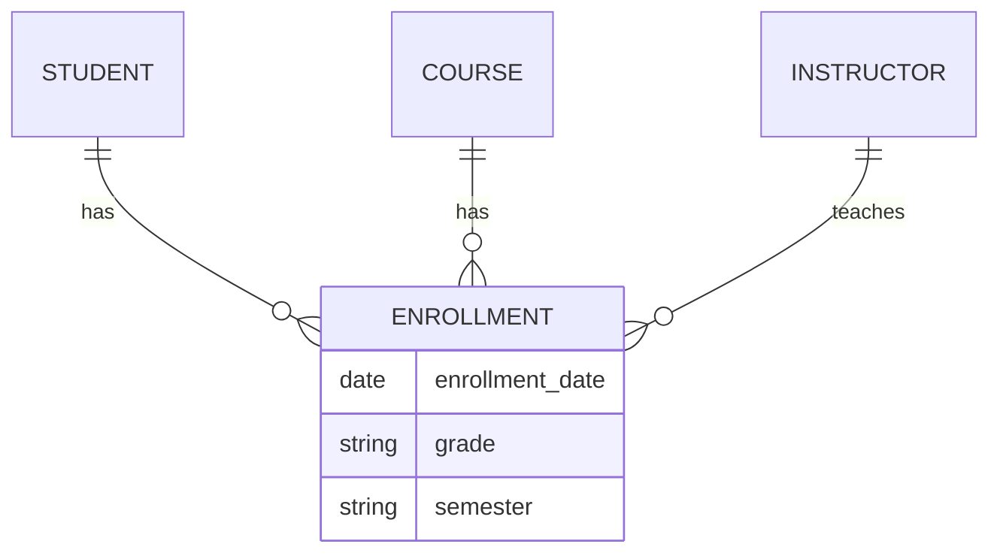

### 1. Big Picture
Entities are the **nouns** of your system. Identifying them correctly is the most critical step – miss an entity and your database is incomplete. Hoffer emphasizes that entities should be **independent** and **identifiable**.

### 2. Simple Explanation
An entity is a real-world object or concept that is distinguishable from others. It becomes a **table** later. There are two main types:

### 3. Strong vs Weak Entities

| Aspect | Strong Entity | Weak Entity |
| :--- | :--- | :--- |
| **Definition** | Exists independently. Has its own primary key. | Exists only because of another entity (owner). Has no primary key of its own. |
| **Identification** | Identified by its own attributes. | Identified by a **foreign key** + a **discriminator** (partial key). |
| **Example** | `Student` | `Dependent` (of an `Employee`) |
| **Notation** | Single rectangle | Double rectangle |
| **Existence** | Independent existence | Existence-dependent on owner |

### 4. Associative Entities (The "Bridge" Concept)

### 1. Big Picture
Sometimes a relationship has **attributes** of its own and participates in other relationships. An **associative entity** is an entity that represents a relationship between other entities, effectively making the relationship an entity itself.

### 2. Simple Explanation
Think of `Enrollment` – it's not just a relationship between `Student` and `Course`; it has attributes like `Grade`, `EnrollmentDate`, and may relate to other entities like `Instructor` (who taught that specific enrollment). This makes it an **associative entity**.

### 3. When to Use an Associative Entity (Hoffer's Rules)
1. The relationship has attributes of its own.
2. The relationship participates in other relationships.
3. The relationship has a many-to-many cardinality that needs resolution.

### 4. Visual Comparison

### 5. Software Engineer Perspective
In ORMs, associative entities map to **junction tables** with additional columns. For example, in Spring Boot JPA, an `@Entity` class `Enrollment` with `@ManyToOne` relationships to `Student` and `Course`, plus its own fields like `grade`.

### 6. Exam Perspective
- **Differentiate** strong vs weak entities.
- **Define** associative entities and explain when to use them.
- **Identify** weak entities in a given scenario.

---
