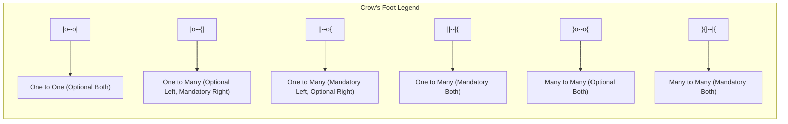

### 1. Big Picture
ERDs are useless if no one can read them. Standard notations ensure we communicate clearly. **Chen** is academic; **Crow's Foot** is industry standard (used in tools like Lucidchart, DataGrip, dbdiagram.io).

### 2. Simple Explanation
- **Chen**: Uses diamonds for relationships, ellipses for attributes. Very precise but gets messy for large diagrams.
- **Crow's Foot**: Uses lines with "crows' feet" (three-pronged forks) to indicate "many". Cleaner and more readable for large enterprise models.

### 3. Detailed Comparison

| Feature | Chen Notation | Crow's Foot Notation |
| :--- | :--- | :--- |
| **Entity** | Rectangle | Rectangle |
| **Relationship** | Diamond | Line with labels |
| **1 side** | '1' near entity | Single straight line (`|`) |
| **Many side** | 'N' or 'M' near entity | Three-pronged fork (`<` or `{`) |
| **Total Participation** | Double line | Solid line (vs dashed) |
| **Partial Participation** | Single line | Dashed line |
| **Key Attribute** | Underlined | Not shown (in PK section) |
| **Weak Entity** | Double rectangle | Not standard (use notes) |
| **Multi-valued Attribute** | Double ellipse | Not shown (converted) |

### 4. Crow's Foot Cardinality Symbols

### 5. Reading Crow's Foot
- `|` = exactly one (mandatory)
- `o` = zero or one (optional)
- `{` or `<` = zero or many (optional many)
- `|{` or `|<` = one or many (mandatory many)

### 6. Software Engineer Perspective
We use **Crow's Foot** in design tools because it's intuitive for developers and stakeholders. We map:
- `|` (mandatory) → `NOT NULL` in SQL
- `o` (optional) → `NULL` in SQL
- `{` (many) → collection (List/Set in ORM)

### 7. Exam Perspective
- **Identify** cardinalities from a diagram.
- **Draw** a simple ERD given a scenario (Crow's Foot is usually accepted).
- **Translate** Chen to Crow's Foot or vice versa.

---