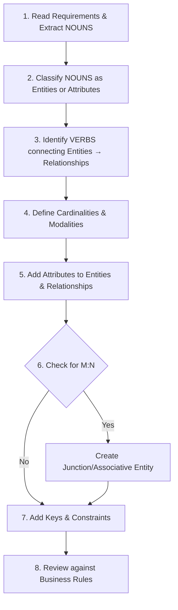

### 1. Big Picture
Facing a blank page is scary. This systematic process turns a messy business description into a clean ERD. This is the **practical procedure** for drawing and validating your diagram.

### 2. Step-by-Step Procedure



### 3. Detailed Procedure

#### Step 1: Identify Entities (Nouns)
- **What to look for**: Nouns in the business description.
- **Examples**: "A university wants to track **students**, the **courses** they take, and the **grades** they receive. Each **course** is taught by one **professor**."
- **Entities**: Student, Course, Professor.

#### Step 2: Identify Attributes
- **What to look for**: Properties of entities.
- **Examples**: Student (ID, Name, DOB), Course (Code, Title, Credits), Professor (ID, Name, Department).
- **Classify**: Simple vs Composite vs Multi-valued vs Derived.

#### Step 3: Identify Relationships (Verbs)
- **What to look for**: Verbs connecting entities.
- **Examples**: Student **takes** Course, Professor **teaches** Course.

#### Step 4: Determine Cardinality & Modality
- **For each relationship**, ask:
  - What is the maximum number on each side?
  - Is participation mandatory or optional?
- **Examples**: 
  - Student takes Course → M:N (many-to-many).
  - Professor teaches Course → 1:M (one professor teaches many courses).

#### Step 5: Add Keys & Constraints
- **Primary Key**: Unique identifier for each entity.
- **Foreign Key**: Will be added during mapping (logical design).

#### Step 6: Resolve M:N Relationships
- **Rule**: Any M:N relationship becomes an associative entity/junction table.
- **Example**: Student takes Course → Enrollment (StudentID, CourseID, Grade, Date).

#### Step 7: Review Against Business Rules
- **Validation**: Does every rule in the description map to a construct in the diagram?
- **Example**: "Every course must have at least one student" → Total participation of Course in Enrollment.

### 4. Notation Mapping Rules (ERD → Relational Schema)

| ER Construct | Relational Mapping Rule |
| :--- | :--- |
| **Strong Entity** | Create a table with all simple attributes. PK is the entity's key attribute. |
| **Composite Attribute** | Break it down into its constituent parts. |
| **Multi-valued Attribute** | Create a **separate table**. PK is the entity's PK + the attribute value. |
| **Derived Attribute** | **Do not store** – compute in query. |
| **1:1 Relationship** | Place PK of one side as FK in the other. Usually place on side with **total participation**. |
| **1:M Relationship** | Place PK of the "One" side as FK in the "Many" side table. |
| **M:N Relationship** | Create a **Junction Table**. Include PKs of both entities as composite PK + FKs. |
| **Supertype/Subtype** | Use Single Table, Joined Table, or Table per Class strategy. |
| **Recursive Relationship** | Add a FK to the same table (1:M) or create a junction table (M:N). |

### 5. Software Engineer Perspective
We use tools like **dbdiagram.io** (DSL-based) to define ERDs as code:

```
Table students {
  student_id int [pk]
  name varchar
  dob date
}

Table courses {
  course_id int [pk]
  title varchar
  credits int
}

Table enrollments {
  student_id int [ref: > students.student_id]
  course_id int [ref: > courses.course_id]
  grade varchar
  enrollment_date date
}
```

This approach is **version-controlled** and **reviewable** in pull requests.

---
