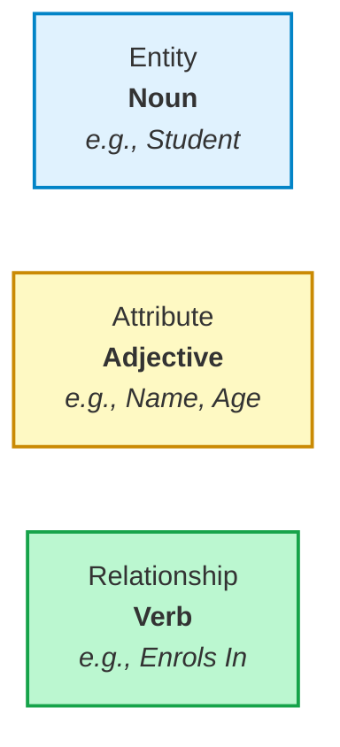
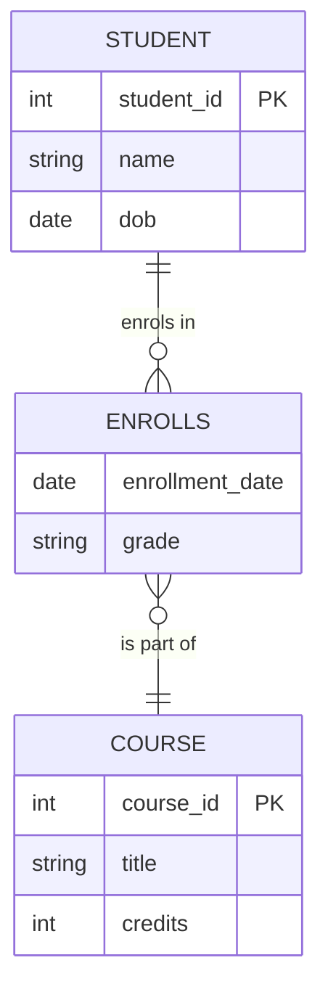

## The Entity-Relationship (ER) Model – Core Components

### 1. Big Picture
The ER Model is a **visual language** used to map out the foundational structure of a database. It breaks down complex business domains into three basic linguistic blocks: **Entities** (the nouns), **Attributes** (the adjectives), and **Relationships** (the verbs). It is the absolute cornerstone of conceptual database design.

### 2. Simple Explanation
Think of an ERD as a structured **relationship map**:
*   **Entities** are the "things" we care about and store data for (e.g., **Student**).
*   **Attributes** are the specific "details" or traits describing those things (e.g., Name, Age).
*   **Relationships** are the logical "connections" tying them together (e.g., Student **enrols in** Course).

---

### 3. The ER Model Overview

The visual blueprint below uses Crow's Foot notation to show how a student maps to their courses via an enrollment record:

---

### 4. Key Terms (Academic)

| Data Classification | Type (The Blueprint / Structure) | Instance (The Actual Live Data) |
| --- | --- | --- |
| **Entity** | `STUDENT` | The specific student *"John Smith"* |
| **Attribute** | `Name` | The string value *"John"* |
| **Relationship** | `Enrolls_In` | *John Smith* enrolled in *CS101* on *2026-09-01* |

* **Entity Type**: A collection of entities that share common properties (e.g., `STUDENT`).
* **Entity Instance**: A single, specific occurrence of an entity type (e.g., *"John Smith"*).
* **Attribute Type**: A property or field belonging to an entity type (e.g., `Name`).
* **Attribute Value**: The actual discrete data stored inside an attribute instance (e.g., *"John"*).
* **Relationship Type**: A meaningful structural association between entity types.
* **Relationship Instance**: A specific occurrence of an association link (e.g., *John Smith* enrolled in *CS101*).

