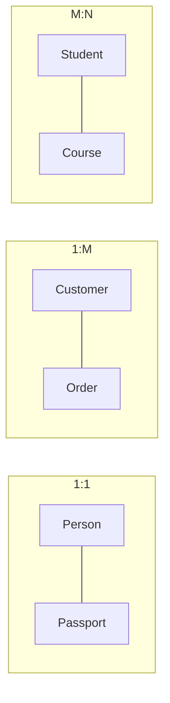

### 1. Big Picture
Relationships are the **verbs** that connect entities. The most critical part of ERD is getting the **cardinality** right – it defines the business rules (e.g., "One customer can have many orders"). Hoffer emphasizes that cardinality constraints are **maximum** constraints, while **modality** constraints are **minimum** constraints.

### 2. Simple Explanation
Cardinality defines the **maximum** number of relationships an entity can participate in. Modality defines the **minimum** (whether participation is mandatory or optional).

### 3. Cardinality Types (Binary Relationships)

### 4. Cardinality vs Modality (Hoffer's Distinction)

| Constraint | What It Defines | Symbol (Chen) | Symbol (Crow's Foot) |
| :--- | :--- | :--- | :--- |
| **Cardinality (Maximum)** | Max number of relationships | `1`, `N`, `M` | `|` (one), < (many/fork) |
| **Modality (Minimum)** | Min number of relationships | Double line (total) vs Single line (partial) | Solid line (mandatory) vs Dashed line (optional) |

### 5. Participation Constraints (Modality)

| Participation | Meaning | Example |
| :--- | :--- | :--- |
| **Total Participation** | Every entity instance must participate in the relationship. | Every `Employee` must belong to a `Department`. |
| **Partial Participation** | Some entity instances may not participate. | Some `Employees` may not manage any `Projects`. |

### 6. Real World Example
- **University**: `Student` enrolls in `Course`.
    - Cardinality: M:N (many students to many courses).
    - Modality: Total participation for `Student` (every student must enroll in at least one course) and `Course` (every course must have at least one student).
- **Hospital**: `Patient` has `Appointment`.
    - Cardinality: 1:M (one patient can have many appointments).
    - Modality: Partial participation for `Patient` (a patient may not have any appointments yet).

### 7. Software Engineer Perspective
- **Cardinality** directly dictates **Foreign Key** placement.
- In 1:M, place the FK on the "Many" side (e.g., `Order` gets `customer_id`).
- In M:N, we must create a **junction table** (e.g., `Enrollment` with `student_id` and `course_id`). This junction table often gains its own attributes (like `grade`, `enrollment_date`).
- **Participation** affects whether a FK can be `NULL`. Total participation = `NOT NULL`.

### 8. Exam Perspective
- **Draw** cardinalities (Crow's Foot vs Chen notation).
- **Identify** cardinality from a given business rule.
- **State** why M:N is problematic and how to resolve it.
- **Explain** total vs partial participation with examples.

### 9. Common Mistakes
- Confusing **cardinality** (max) with **participation** (min).
- Trying to implement M:N directly as a single table.
- Forgetting that a relationship can have **attributes** (e.g., `Enrolment` has `Grade` – this becomes an attribute of the junction table).

---