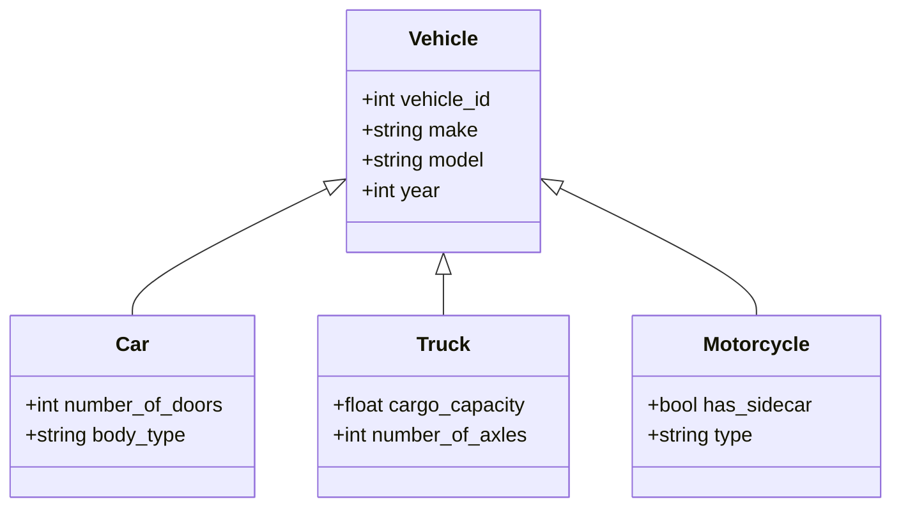

### 1. Big Picture
Real-world entities often have **hierarchies**. A `Manager` is an `Employee` with extra attributes. A `Car` and `Truck` are both `Vehicles`. The ER model extends to handle **inheritance** through supertype/subtype relationships.

### 2. Simple Explanation
- **Supertype**: The parent entity (generic).
- **Subtype**: The child entity (specific). It inherits all attributes of the supertype and adds its own.
- **Specialization**: Top-down process – splitting a supertype into subtypes.
- **Generalization**: Bottom-up process – combining subtypes into a supertype.

### 3. Visualizing Inheritance

### 4. Disjointness & Completeness Constraints (Hoffer)

| Constraint | Symbol | Meaning | Example |
| :--- | :--- | :--- | :--- |
| **Disjoint** | `d` | An instance can belong to **only one** subtype. | `Employee` is either `Developer` or `Manager`, never both. |
| **Overlap** | `o` | An instance can belong to **multiple** subtypes. | `Person` can be both `Student` and `Employee`. |
| **Total** (Completeness) | Double line | Every supertype instance **must** be in at least one subtype. | Every `Vehicle` must be either a `Car` or `Truck`. |
| **Partial** | Single line | A supertype instance **may** not belong to any subtype. | A `Person` may not be a `Student` or `Employee`. |

### 5. Real World Example
- **Banking**: `Account` (supertype) → `SavingsAccount`, `CheckingAccount`, `FixedDepositAccount`.
    - **Disjoint** (an account is one type only).
    - **Total** (every account must be one of these).
- **University**: `Person` (supertype) → `Student`, `Faculty`, `Staff`.
    - **Overlap** (a student can also be staff – e.g., teaching assistant).
    - **Partial** (a visitor can be in the system but not a student/staff).

### 6. Software Engineer Perspective
This maps **directly** to OOP inheritance (extends/implements). In ORM (Hibernate, Entity Framework), we use `@Inheritance` strategies:
- **Single Table**: One table for supertype + all subtypes (discriminator column).
- **Joined Table**: Separate tables for supertype and each subtype (joined by FK).
- **Table per Class**: Separate table for each subtype (repeating supertype columns).

### 7. Exam Perspective
- **Define** specialization and generalization.
- **Explain** the difference between disjoint and overlap.
- **Explain** total vs partial participation in this context.
- **Identify** constraints from a given scenario.

### 8. Common Mistakes
- Confusing **disjoint** with **total** – they are independent constraints.
- Forgetting that **subtypes inherit all attributes** of the supertype – don't repeat them.
- Not handling the **discriminator attribute** (the attribute that tells which subtype an instance belongs to – e.g., `account_type`).

---
