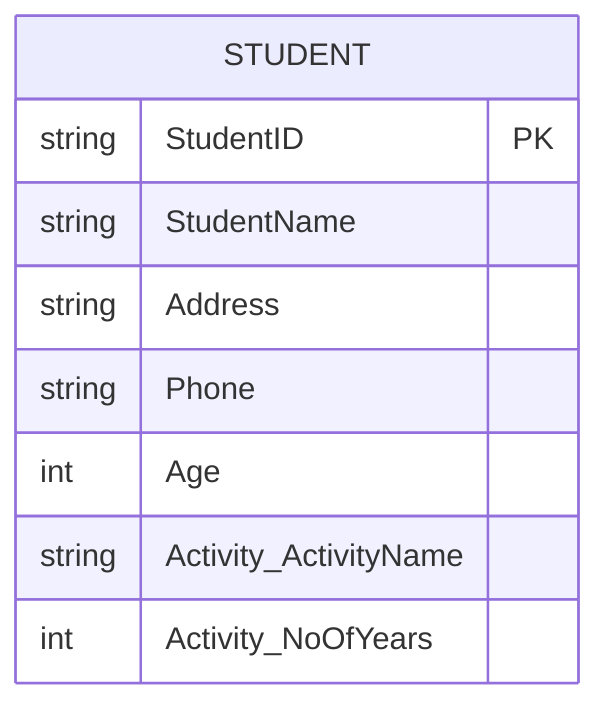
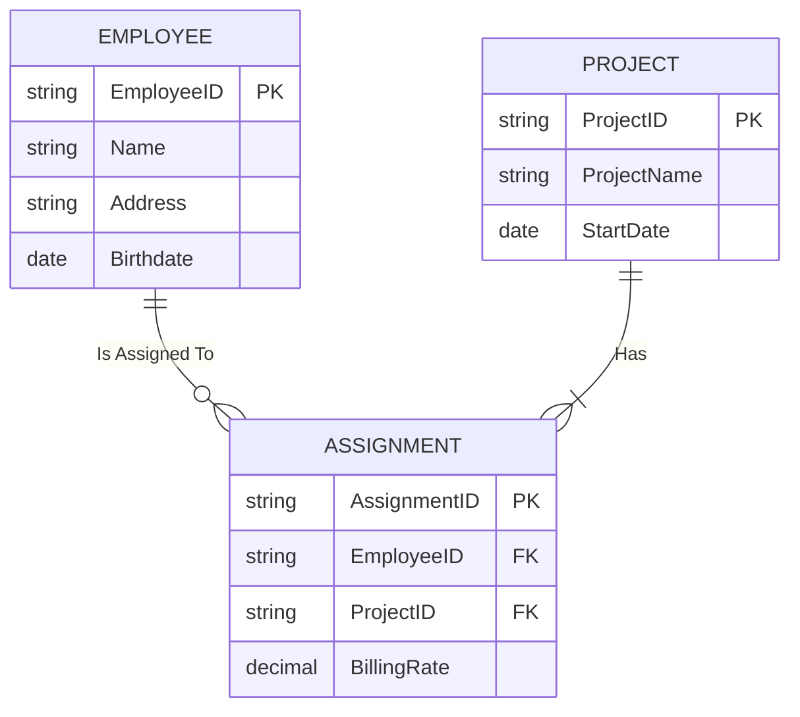
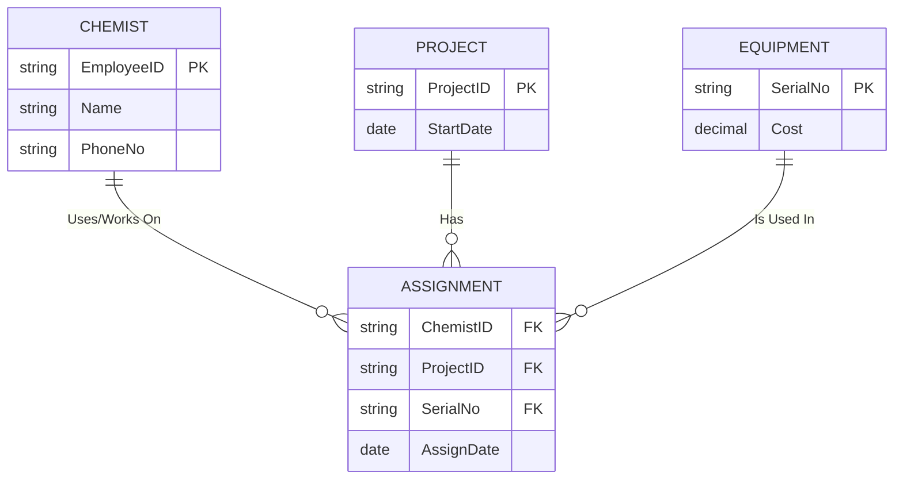
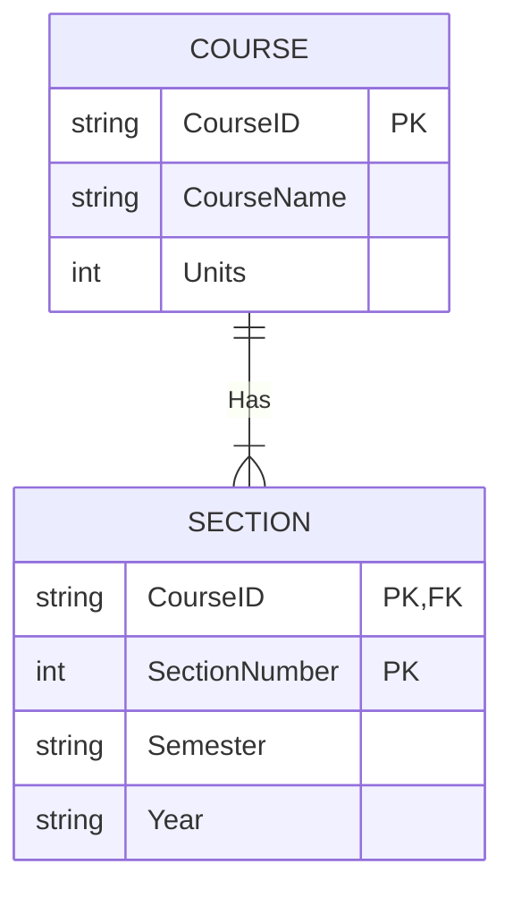
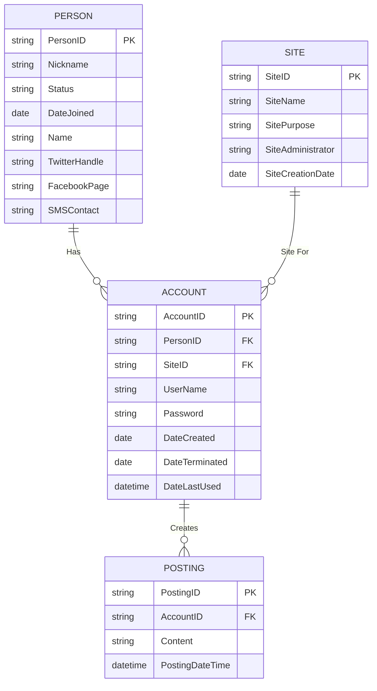
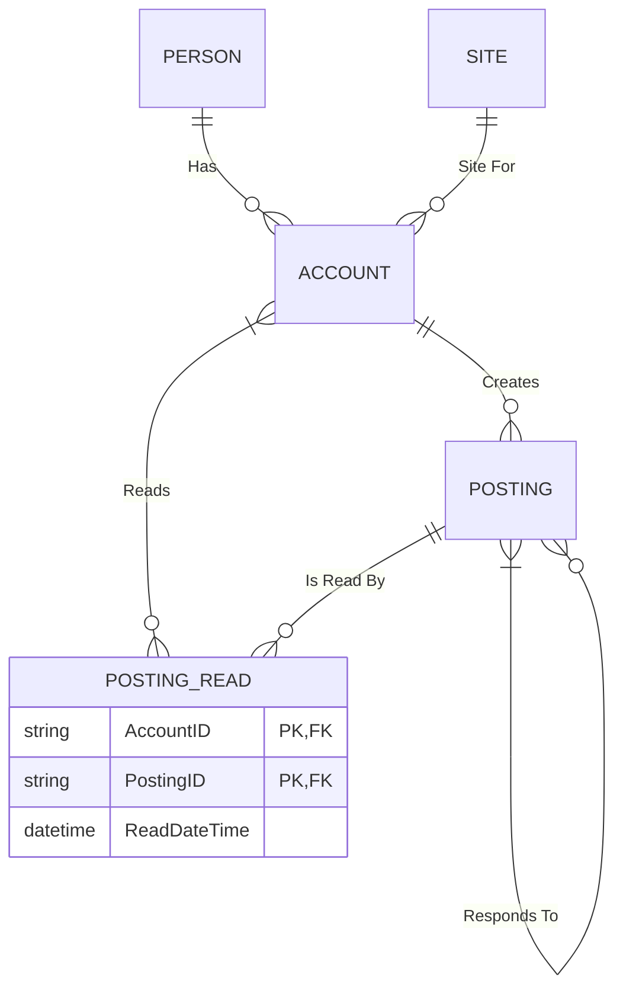
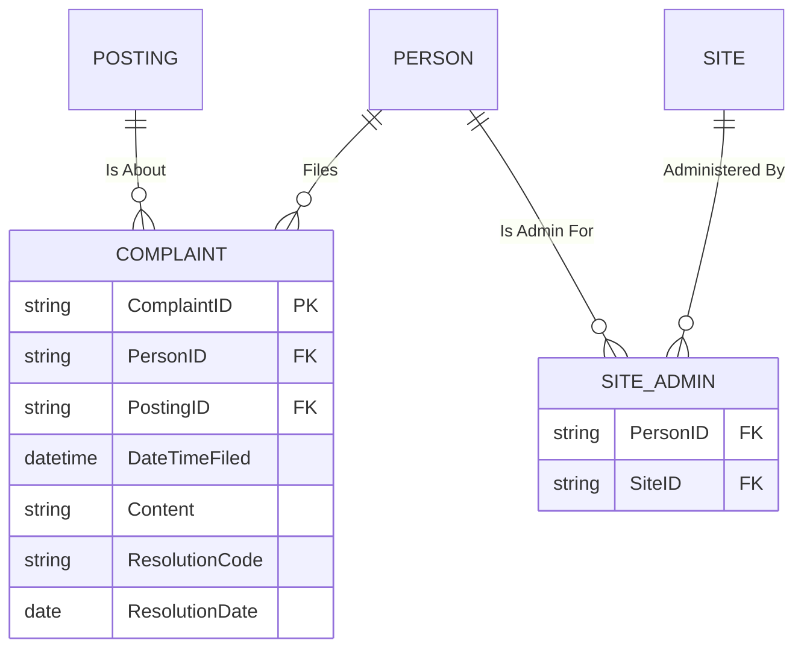
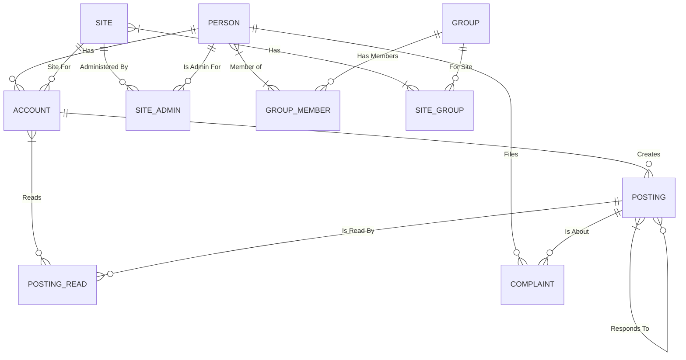
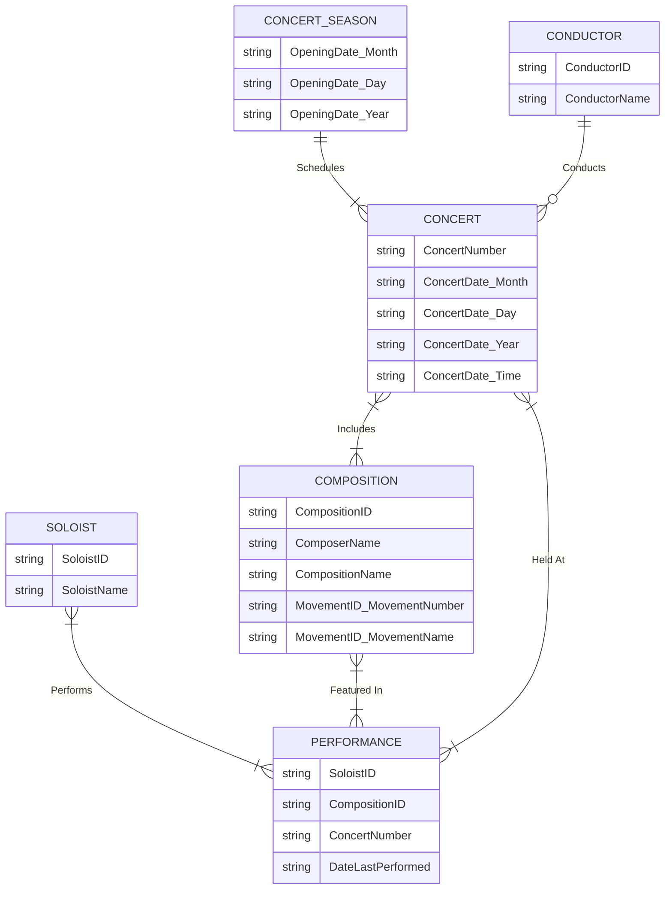
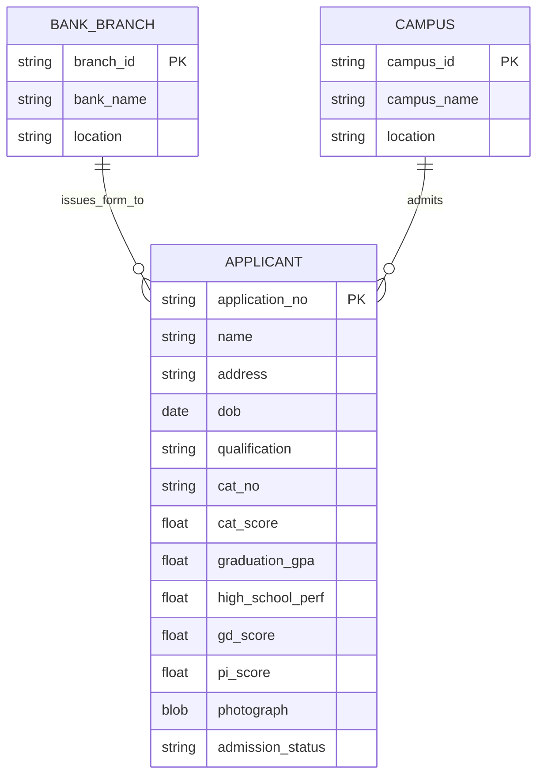

## 2-28: Community Service Agencies and Volunteers

### Question

Consider the two E-R diagrams in Figure 2-25, which represent a database of community service agencies and volunteers in two different cities (A and B). For each of the following three questions, place a check mark under City A, City B, or Can't Tell for the choice that is the best answer.

- **a.** Which city maintains data about only those volunteers who currently assist agencies?
- **b.** In which city would it be possible for a volunteer to assist more than one agency?
- **c.** In which city would it be possible for a volunteer to change which agency or agencies he or she assists?

### Thinking Process

1.  **Analyze City A's Diagram:**
    - The relationship `Assists` connects `AGENCY` and `VOLUNTEER`.
    - Both sides have an `o` (circle) with a crow's foot. This represents a **minimum cardinality of 0** and a **maximum cardinality of Many (\*)**.
    - Therefore, in City A, an Agency can have zero or many Volunteers, and a Volunteer can be assigned to zero or many Agencies.

2.  **Analyze City B's Diagram:**
    - The `Assists` relationship here is different.
    - `AGENCY` side: Has two vertical bars (`||`). This is **Mandatory One**, meaning an Agency must have at least one Volunteer associated with it.
    - `VOLUNTEER` side: Has an `o` (circle) and a crow's foot. This means a Volunteer is **Optional Many** (`0..*`), meaning a Volunteer can exist without assisting any Agencies or can assist many.

3.  **Evaluate Question (a):**
    - _Question:_ Which city maintains data about only those volunteers who currently assist agencies?
    - In City A, a Volunteer can have 0 Agencies. So City A stores inactive volunteers. (Answer: No).
    - In City B, a Volunteer can still have 0 Agencies. So City B also stores inactive volunteers. (Answer: No).
    - Since the question asks to choose the best answer between the two cities or "Can't Tell", and neither model enforces "only active volunteers", the correct choice is **Can't Tell**.

4.  **Evaluate Question (b):**
    - _Question:_ In which city would it be possible for a volunteer to assist more than one agency?
    - Both City A and City B assign a maximum cardinality of Many (`*`) on the `VOLUNTEER` side of the relationship. Thus, a Volunteer can assist multiple Agencies in both diagrams.
    - Because the possibility exists in both models, we cannot choose one city over the other. The correct choice is **Can't Tell**.

5.  **Evaluate Question (c):**
    - _Question:_ In which city would it be possible for a volunteer to change which agency or agencies he or she assists?
    - In both diagrams, the relationship is `Many-to-Many` (M:N). This design allows any specific Volunteer record to modify its connections to Agency records. Therefore, changing which agencies are assisted is possible in both cities.
    - Because the possibility exists in both models, the correct choice is **Can't Tell**.

### Solution Table

| Question                                                                                                        | City A | City B | Can't Tell |
| :-------------------------------------------------------------------------------------------------------------- | :----: | :----: | :--------: |
| **a.** Which city maintains data about only those volunteers who currently assist agencies?                     |        |        |     ✅     |
| **b.** In which city would it be possible for a volunteer to assist more than one agency?                       |        |        |     ✅     |
| **c.** In which city would it be possible for a volunteer to change which agency or agencies he or she assists? |        |        |     ✅     |

---

## 2-29: STUDENT Entity Identifier and ERD

### Question

The entity type STUDENT has the following attributes:
`Student Name`, `Address`, `Phone`, `Age`, `Activity`, and `No of Years`.

`Activity` represents some campus-based student activity, and `No of Years` represents the number of years the student has engaged in this activity. A given student may engage in more than one activity.

Draw an ERD for this situation. What attribute or attributes did you designate as the identifier for the STUDENT entity? Why?

### Thinking Process

1.  **Identify Core Entity:**
    The primary entity in this scenario is `STUDENT`. We know it has the attributes `Student Name`, `Address`, `Phone`, and `Age`.

2.  **Handle the Multivalued Attribute:**
    The prompt specifies that a "given student may engage in more than one activity." This makes `Activity` a **multivalued attribute**. Furthermore, `No of Years` is not a general student attribute; it is specific to a particular `Activity` a student engages in. Therefore, these two attributes are tightly coupled and form a **composite, multivalued attribute**. In E-R notation, this is represented as `{Activity (ActivityName, No of Years)}`.

3.  **Designate an Identifier:**
    We must identify an attribute that can uniquely distinguish each instance of `STUDENT`. Let's evaluate the provided attributes:
    - `Student Name`: Not unique; multiple students can share the same name (e.g., John Smith). It can also change.
    - `Address`: Can change frequently and is not guaranteed to be unique.
    - `Phone`: Can change and is not guaranteed to be unique.
    - `Age`: Not unique and changes every year.
    - `Activity` and `No of Years`: These are not identifying characteristics of the student; they are dependent on the relationship and can vary for the same student.

    Since none of the provided attributes can serve as a unique, static identifier, we must introduce a new attribute to serve as an identifier. The most logical and commonly used identifier for a student in an educational system is a **Student ID** (often called `StudentID` or `StudentNumber`). This is a surrogate key assigned specifically to uniquely identify each student.

### Solution / Visual Representation

The ERD uses curly brackets `{}` to denote the multivalued composite attribute `{Activity}`. The composition of `Activity` into `ActivityName` and `NoOfYears` is represented using parentheses `(ActivityName, NoOfYears)`.

_Note on the diagram notation: In a standard E-R diagram, the attributes would be listed inside the entity rectangle. The multivalued attribute `{Activity}` is a composite attribute containing `ActivityName` and `NoOfYears`. The `StudentID` is underlined to denote it is the identifier._

### Reasoning for the Identifier

The designated identifier for the `STUDENT` entity is **StudentID**.

- **Why?** The `STUDENT` entity does not possess any natural attributes from the provided list that are guaranteed to be universally unique and immutable over time.
- `Student Name` is a poor choice because names are not unique and can change (e.g., due to marriage).
- `Address` and `Phone` are volatile attributes that can change frequently.
- `Age` changes every year and is highly likely to be duplicated among students.
- `Activity` and `No of Years` are tied to the specific activities a student participates in, not to the student's identity itself.
  Therefore, a system-assigned, unique **StudentID** (or Student Number) is essential to ensure each instance of the STUDENT entity can be distinctly and permanently identified.

---

## 2-30: Associative Entities and Weak Entities

### Question

Are associative entities also weak entities? Why or why not? If yes, is there anything special about their "weakness"?

### Thinking Process

1.  **Define Associative Entity:**
    An associative entity is an entity type that associates the instances of one or more entity types and contains attributes that are peculiar to the relationship between those entity instances. They are typically used to resolve a **many-to-many (M:N)** relationship and are represented by a rectangle with **rounded corners** (e.g., `REGISTRATION` between `STUDENT` and `COURSE`, or `CERTIFICATE` between `EMPLOYEE` and `COURSE`).

2.  **Define Weak Entity:**
    A weak entity type is an entity type whose existence depends on some other entity type. It does not have its own full identifier and uses a **partial identifier**. It is connected to its owner via an **identifying relationship** and is represented by a **double-lined rectangle** (e.g., `DEPENDENT` depends on `EMPLOYEE`).

3.  **Are Associative Entities also Weak Entities?**
    **No**, associative entities are not _inherently_ weak entities. The structural definitions and notational symbols are distinct.

4.  **Why?**
    - **Dependence Pattern:** A weak entity depends on a **single** owner entity (e.g., a `DEPENDENT` cannot exist without an `EMPLOYEE`). An associative entity depends on **multiple** parent entities (e.g., a `REGISTRATION` cannot exist without both a `STUDENT` and a `COURSE`). This is a "symmetric" dependence, not an "owner/weak" pair.
    - **Identifier Self-Sufficiency:** Weak entities cannot be uniquely identified without the owner's identifier. Most associative entities, however, are given a **surrogate primary key** (like `RegistrationID` or `CertificateNumber`) that uniquely identifies the association even without knowledge of the parent entities. While an associative entity can technically have a composite primary key composed of the parent entity identifiers, it is perfectly legal (and preferred) to give it a non-intelligent surrogate key, which makes it structurally a strong entity.

5.  **Addressing the "Weakness" question:**
    The question includes a conditional: _"If yes, is there anything special about their 'weakness'?"_
    Since the answer is **No**, the conditional part does not apply. However, it is worth noting for conceptual clarity: If an associative entity is _not_ given a surrogate key, it does rely on the existence of its parent entities, which _resembles_ dependence. However, because it is the intersection point between two or more entities in an M:N relationship (instead of a dependent class belonging to a single owner), it does not fit the strict academic or professional definition of a weak entity.

### Solution

**Are associative entities also weak entities?**
**No**, associative entities are not weak entities.

**Why or why not?**
While both concepts involve some form of dependence on other entities, they are structurally and notationally distinct:

- **Weak Entities** represent dependent objects that exist solely due to a **single** owner entity (e.g., `DEPENDENT` depends on `EMPLOYEE`). They cannot exist without the owner and are indicated in E-R diagrams with **double-lined rectangles** and an **identifying relationship** (double line).
- **Associative Entities** represent **many-to-many relationships** between two (or more) independent entities. While they require the existence of their parent entities to have meaning, they usually can possess their own **surrogate primary key** (such as `CertificateNumber` or `RegistrationID`). Even if they rely on a composite key from the parent entities, their dependence is symmetrical on multiple parents, not a single owner. They are depicted using a rectangle with **rounded corners**, not a double-lined rectangle.

Since the answer is No, the condition for any special weakness does not apply.

---

## 2-39. (Part a)
**Question:**
A company has a number of employees. The attributes of EMPLOYEE include Employee ID (identifier), Name, Address, and Birthdate. The company also has several projects. Attributes of PROJECT include Project ID (identifier), Project Name, and Start Date. Each employee may be assigned to one or more projects or may not be assigned to a project. A project must have at least one employee assigned and may have any number of employees assigned. An employee's billing rate may vary by project, and the company wishes to record the applicable billing rate (Billing Rate) for each employee when assigned to a particular project. Do the attribute names in this description follow the guidelines for naming attributes? If not, suggest better names. Do you have any associative entities on your ERD? If so, what are the identifiers for those associative entities? Does your ERD allow a project to be created before it has any employees assigned to it? Explain. How would you change your ERD if the Billing Rate could change in the middle of a project?

### Thinking Process
1.  **Analyze the Core Entities:** We have `EMPLOYEE` and `PROJECT`. Both are strong entities with their own identifiers (`Employee ID` and `Project ID`).
2.  **Examine the Business Rules:** The relationship between Employees and Projects is Many-to-Many (M:N):
    - An Employee can be assigned to *many* Projects.
    - A Project must have *at least one* Employee assigned (mandatory) and can have *many*.
3.  **Handle the "Billing Rate" Attribute:** This is a classic indicator for an **Associative Entity**. The billing rate is a property of the *assignment* (the relationship) between an employee and a project, not of the employee alone or the project alone.
4.  **Answer the Embedded Questions:**
    - **Naming:** Check the attribute names against the guidelines (nouns, camelCase, etc.).
    - **Associative Entity:** Since it's an M:N relationship with an attribute, we must have an associative entity. I will call it `ASSIGNMENT`. Its identifier should be a **surrogate key** (`AssignmentID`), as a composite key (`EmployeeID`, `ProjectID`) could fail if an employee is reassigned to the same project later.
    - **Project Creation:** Address the mandatory cardinality. The rule says "A project must have at least one employee assigned", so strictly speaking, it cannot be created without an employee. I will explain this nuance and how to handle it.
    - **Changing Billing Rate:** To handle a changing rate mid-project, the `BillingRate` must be treated as a **time-dependent, multivalued attribute**, structured as `{BillingRate (Rate, EffectiveDate)}`.

### Solution / Visual Representation

**Answers to Embedded Questions:**

- **Attribute Naming:** The attribute names are mostly valid, but they violate the guideline of using no spaces and a consistent formatting (standard is often **CamelCase** or underscores). Better names would be: `EmployeeID`, `ProjectID`, `ProjectName`, `StartDate`, and `Birthdate`. These conform to standard naming conventions used in databases.
- **Associative Entity:** Yes, **ASSIGNMENT** is an associative entity. Its identifier is `AssignmentID` (a surrogate primary key). While a composite key of `(EmployeeID, ProjectID)` is technically possible, a surrogate key is preferred because it can handle cases where the same employee is reassigned to the same project later (potentially requiring history to be tracked).
- **Project Creation:** **No**, according to the defined business rules ("A project must have at least one employee assigned"), the ERD does *not* allow a project to be created without an employee assigned to it. If you needed to allow a project to exist in the database before any employees are assigned, you would have to modify the business rule and change the minimum cardinality of the Project side from `Mandatory One` (||) to `Optional One` (o). This is an important distinction between a business rule and the database structure.
- **Changing Billing Rate:** If a billing rate can change in the middle of a project, you must modify the `ASSIGNMENT` entity to store a **history of billing rates**. You can do this by making `BillingRate` a composite, multivalued attribute: `{BillingRate (Rate, EffectiveDate)}` attached to `ASSIGNMENT`. This design tracks the entire history of rate changes for a specific assignment.

---

## 2-39. (Part b)
**Question:**
A laboratory has several chemists who work on one or more projects. Chemists also may use certain kinds of equipment on each project. Attributes of CHEMIST include Employee ID (identifier), Name, and Phone No. Attributes of PROJECT include Project ID (identifier) and Start Date. Attributes of EQUIPMENT include Serial No and Cost. The organization wishes to record Assign Date—that is, the date when a given equipment item was assigned to a particular chemist working on a specified project. A chemist must be assigned to at least one project and one equipment item. A given equipment item need not be assigned, and a given project need not be assigned either a chemist or an equipment item. Provide good definitions for all of the relationships in this situation.

### Thinking Process
1.  **Identify the Core Entities:** Three entities: `CHEMIST`, `PROJECT`, and `EQUIPMENT`.
2.  **Determine the Complex Relationship:** The data we need to capture is the `Assign Date`. This is the date a specific *Equipment item* is assigned to a specific *Chemist* who is working on a specific *Project*. 
3.  **Model the Complexity:** Because the attribute depends on all three entities simultaneously, this is a **Ternary Relationship** (degree 3). As discussed in Chapter 2, ternary relationships are best modeled as an **Associative Entity**. I will name this entity `ASSIGNMENT`.
4.  **Define Cardinalities based on Business Rules:**
    - `CHEMIST`: Must be assigned to at least one project and one equipment item. Therefore, the cardinality is `Mandatory Many`.
    - `PROJECT`: Need not be assigned. Cardinality is `Optional Many`.
    - `EQUIPMENT`: Need not be assigned. Cardinality is `Optional Many`.
5.  **Define the Relationships:** Provide clear definitions for each side of the connections as requested in the prompt.

### Solution / Visual Representation

**Relationship Definitions:**
- **Works On:** Links a `CHEMIST` to a `PROJECT` via the `ASSIGNMENT` entity. A `Chemist` must be assigned to at least one project. A `Project` does not have to have a chemist assigned.
- **Uses:** Links a `CHEMIST` to `EQUIPMENT` via the `ASSIGNMENT` entity. A `Chemist` must be assigned to at least one equipment item. An `Equipment` item does not have to be assigned to a chemist.
- **Assigned To:** (Implied) Links `PROJECT` and `EQUIPMENT`. This relationship clarifies that a specific equipment item is assigned for use on a specific project. A `Project` does not have to have equipment assigned, and an `Equipment` item does not have to be assigned to a project.
- **Assignment Associative Entity:** The connection of these three entities together, capturing the `Assign Date` as a property of the combination. 

*(Note: Instead of writing three separate relationship definitions, it is common to define the associative entity as representing the core interaction: "**Assignment** represents the date when a specific Chemist was assigned a specific piece of Equipment to use on a specific Project.")*

---

## 2-39. (Part c)
**Question:**
A college course may have one or more scheduled sections or may not have a scheduled section. Attributes of COURSE include Course ID, Course Name, and Units. Attributes of SECTION include Section Number and Semester ID. Semester ID is composed of two parts: Semester and Year. Section Number is an integer (such as 1 or 2) that distinguishes one section from another for the same course but does not uniquely identify a section. How did you model SECTION? Why did you choose this way versus alternative ways to model SECTION?

### Thinking Process
1.  **Analyze the Data:** 
    - `COURSE` is a strong entity (CourseID, CourseName, Units).
    - `SECTION` has `SectionNumber` and `SemesterID` (which is composed of `Semester` and `Year`).
2.  **Analyze the Identifiers:** The text explicitly states that `Section Number` is an integer that distinguishes one section from another for the *same course*, but it *does not uniquely identify a section*. This implies `SectionNumber` alone is not enough; it depends on the `COURSE`.
3.  **Determine the Correct Entity Type:** Because a section cannot exist without a course, and because its identifier is incomplete without the course identifier, `SECTION` should be modeled as a **Weak Entity**.
4.  **Determine the Partial Identifier:** `SectionNumber` is the partial identifier. Combined with the owner's primary key (`CourseID`), the composite key becomes `(CourseID, SectionNumber)`.
5.  **Address the Semester Issue:** `Semester ID` is a composite attribute consisting of `Semester` and `Year`. Since `SectionNumber` does not repeat across different semesters for a given course, `(CourseID, SectionNumber)` alone *might* be unique. However, to be safe and robust (handling courses that reset their section numbers every semester), it is a best practice to include a time element (like `Semester` and `Year`) as part of the full identifier. A safer primary key would be `(CourseID, Semester, Year, SectionNumber)`.

### Solution / Visual Representation

**Explanation of Modeling Approach:**
`SECTION` is modeled as a **Weak Entity** dependent on its owner, `COURSE`. 

**Why I chose this approach:**

- **Data Dependence:** The text explicitly states that a `SectionNumber` (like "Section 1") has no meaning outside the context of a specific course. The existence of a section depends entirely on the existence of the course.
- **Identifier Requirements:** The `SectionNumber` is only a partial identifier. The full identifier is a composite of the section's partial identifier and the owner's full identifier `(CourseID, SectionNumber)`. Furthermore, to avoid potential data ambiguity (where Course 101 offers Section 1 in Spring 2023 and Fall 2023), the primary key should technically be `(CourseID, Semester, Year, SectionNumber)`.
- **Alternative Approach (and why it's worse):** One could model `SECTION` as a strong entity with its own surrogate primary key (`SectionID`). While technically easier to implement, this loses the conceptual business meaning that a section is inherently attached to a course. Using a weak entity in the conceptual model correctly captures the semantic business rule that "A section cannot exist without a course."

**Assumptions Made:** I assumed that while `SectionNumber` is the partial identifier, the full identifier for the relationship must also incorporate the `Semester` and `Year` attributes to uniquely distinguish sections over time. Without this, the system would fail if a course ever offers the same section number (e.g., Section 1) in two different semesters.

---
Here are the detailed solutions for **Problems and Exercises 2-44 and 2-45**.

---

## 2-44: Virtual Campus (VC) Social Media Application

**Question (Parts a - f):**  
Virtual Campus (VC) is a social media firm specializing in virtual meeting places for college campuses. Your assignment is to draw an ERD to represent each phase of the database development for a threaded discussion application and answer questions raised by clients regarding business rules.

---

### Part (a) – Initial Phase
**Scenario:**  
A client maintains several social media sites. Any person may register (with Person Identifier, Nickname, Status, Name, Twitter Handle, Facebook Page, SMS Contact). An account is created each time a person registers to use a particular site (Account ID, User Name, Password, Date Created, Date Terminated, Date/Time last used). A person, over time, may create multiple postings from an account.

**ERD:**

---

### Part (b) – Question Regarding Multiple Accounts
**Question:** *Is it possible for a person to have multiple accounts on the same site? Could you enforce via the ERD a business rule of only one account per site per person?*

**Answer:**  
Yes, a person can have multiple accounts on the same site. The ERD allows `Person` to have `M` Accounts and `Site` to have `M` Accounts, with no restriction on the combinations.  

**No**, you cannot enforce the “only one account per site per person” rule visually in a conceptual E-R diagram. This is a **uniqueness constraint** over the combination of `PersonID` and `SiteID` in the `ACCOUNT` entity. Such constraints are implemented later (e.g., using `UNIQUE` constraints in SQL or application logic), not by changing the structure of the E-R diagram itself.

---

### Part (c) – Adding Threads and Read Tracking
**New Requirements:**  
- Postings may form threads (a posting can respond to another posting). → Unary M:N relationship on `POSTING`.  
- Track when persons read a posting. → Associative entity between `ACCOUNT` and `POSTING` with a timestamp.

**Updated ERD:**

---

### Part (d) – Answering Analytical Inquiries
**Question:** *Can the database provide answers to these inquiries?*

1. **How many postings has each person created for each site?**  
   **Yes.** By tracing `Person → Account → Posting → Site`, you can group by `Person` and `Site` to count postings.

2. **Which postings appear under multiple sites?**  
   **Yes.** A posting is tied to an `Account` and thus to exactly one `Site`. To find postings across multiple sites, you query `Posting → Account → Site` and filter for `SiteID` duplicates.

3. **Has any person created a posting and then responded to his/her own posting before any other person has read the original?**  
   **Yes.** The data exists to check if the same `PersonID` is linked to both a `Posting` (original) and its `Response` (via the unary relationship), and then compare the `ReadDateTime` on the `POSTING_READ` entity for the original posting against the `PostingDateTime` of the response.

4. **Which sites have no associated postings?**  
   **Yes.** Using a left outer join of `Site` to `Posting` (via `Account`), you can find sites where `PostingID` is NULL.

---

### Part (e) – Adding Complaints and Resolutions
**New Requirements:**  
- A `Complaint` can be filed by a `Person` about a `Posting` (M:N relationship via associative entity).  
- Attributes: `ComplaintID`, `DateTimeFiled`, `Content`, `ResolutionCode`, `ResolutionDate`.  
- A `Site Administrator` (role assigned to some `Person`s) reviews and resolves complaints.

**Updated ERD:**

---

### Part (f) – Private Sites and Groups
**New Requirements:**  
- A `Group` can be created by a `Person`. `Person` can invite other `Person`s to a group (M:N).  
- A `Site` can be private, and only members of an associated `Group` can create `Account`s for it.  
- A `Site` can be associated with one or more `Group`s (M:N).

**Final Consolidated ERD:**

**Key Design Point:** The business rule “Only group members can create accounts for a private site” is **enforced by application logic**, not by the structural ERD. The ERD provides the data structures (`SITE_GROUP` and `GROUP_MEMBER`) needed to validate that rule at runtime.

---

## 2-45: Symphony Orchestra ERD

**Question:**  
After completing a course in database management, you are asked to develop a preliminary ERD for a symphony orchestra. The entities and attributes are shown in Table 2-3. Additional business rules are:  
- A concert season schedules one or more concerts. A particular concert is scheduled for only one concert season.  
- A concert includes the performance of one or more compositions. A composition may be performed at one or more concerts or may not be performed.  
- For each concert there is one conductor. A conductor may conduct any number of concerts or may not conduct any concerts.  
- Each composition may require one or more soloists or may not require a soloist. A soloist may perform one or more compositions at a given concert or may not perform any composition.  
- Record the date when a soloist last performed a given composition (`Date Last Performed`).  

Draw an ERD. Identify a business rule and explain how it is modeled.

---

### Thinking Process
1. **Entities:** Using Table 2-3, we have `CONCERT_SEASON`, `CONCERT`, `COMPOSITION`, `CONDUCTOR`, and `SOLOIST`.  
2. **Attributes:**  
   - `CONCERT_SEASON`: `OpeningDate` (composite: Month, Day, Year) – identifier.  
   - `CONCERT`: `ConcertNumber` – identifier; `ConcertDate` (composite: Month, Day, Year, Time).  
   - `COMPOSITION`: `CompositionID` (composite: ComposerName, CompositionName); `MovementID` (composite: MovementNumber, MovementName).  
   - `CONDUCTOR`: `ConductorID` – identifier; `ConductorName`.  
   - `SOLOIST`: `SoloistID` – identifier; `SoloistName`.  
3. **Relationships:**  
   - **Schedule:** `CONCERT_SEASON` (1) → `CONCERT` (*). (Mandatory many, exactly one season).  
   - **Conduct:** `CONDUCTOR` (0..1) → `CONCERT` (1..*). (A concert must have a conductor; a conductor may or may not conduct concerts).  
   - **Includes:** `CONCERT` (*) → `COMPOSITION` (*). (M:N).  
   - **Perform:** A `SOLOIST` performs a `COMPOSITION` at a `CONCERT`. This is a ternary relationship. We model it as an associative entity `PERFORMANCE`. The `Date Last Performed` is a derived attribute on the `SOLOIST–COMPOSITION` relationship derived from the `ConcertDate` of the associated concert.

### Solution / Visual Representation

**Business Rule Modeled:**  
**"For each concert, there is exactly one conductor."**  
This rule is represented in the ERD by the cardinality on the `CONCERT` side of the `Conducts` relationship: a `CONCERT` instance must participate in exactly one `Conducts` instance, meaning `MIN=1, MAX=1` (mandatory one). The `CONDUCTOR` side is `0..1` to `1..*`, meaning a conductor may or may not conduct, but any concert that exists must have a conductor associated with it.

**Why the `Date Last Performed` is a derived attribute:**  
It is calculated by taking the maximum `ConcertDate` from the `PERFORMANCE` entity for the specific `SoloistID` and `CompositionID`. The ERD shows this as a derived attribute `[DateLastPerformed]` on the `PERFORMANCE` entity or the `SOLOIST-COMPOSITION` relationship, indicating it is computed from existing data rather than stored separately.

---

Here is the cleaned-up, fully working version.

The primary issue causing a syntax error in your Mermaid block was the use of hyphens in the entity names (`BANK-BRANCH`). Mermaid entity names must be a single word or use underscores (e.g., `BANK_BRANCH`). The language has also been simplified to make it completely straightforward and readable.

---

## 2-64: Admission Office Database Design ⭐

**Scenario:** A business school offers a post-graduate diploma in Management (PGDM) across multiple campuses. You need to design an Entity-Relationship (E-R) model for their admission office based on these rules:

**Application Process:** Students get their application forms from local branches of a national bank. Only students who took the Common Admission Test (CAT) can apply.
* **Evaluation Criteria:** Applicants are evaluated in two stages (Shortlisting and Final Admission) using graduation GPA, high school scores, CAT scores, Group Discussion (GD) marks, and Personal Interview (PI) marks.
* **Campus Allocation:** An applicant can be admitted to only **one** campus.
* **Final Record:** The final list of admitted students, including their photographs, is sent to the main office.

**Task:** Create an E-R model to represent these business rules.

---

## Entity-Relationship Breakdown

### 1. Entities and Attributes

**BANK_BRANCH:** Represents the bank branches where forms are distributed.
*Attributes:* `branch_id` (Unique Identifier), `bank_name`, `location`.

**APPLICANT:** Represents the students applying for the program.
*Attributes:* `application_no` (Unique Identifier), `name`, `address`, `dob` (Date of Birth), `qualification`, `cat_no`, `cat_score`, `graduation_gpa`, `high_school_perf`, `gd_score` (Group Discussion), `pi_score` (Personal Interview), `photograph`, `admission_status` (Applied / Shortlisted / Admitted).

* **CAMPUS:** Represents the school's various campuses.
* *Attributes:* `campus_id` (Unique Identifier), `campus_name`, `location`.

### 2. Relationships and Rules

1. **Issues Form (`BANK_BRANCH` to `APPLICANT`):** One bank branch can give forms to **many** applicants. Each applicant gets their form from **exactly one** bank branch.
2. **Admits (`CAMPUS` to `APPLICANT`):** A single campus can admit **many** students. An admitted student belongs to **exactly one** campus.

---

## ER Diagram

---

### Clear Design Notes

**Simplified Scores:** All performance metrics (GPA, High School, CAT, GD, and PI scores) are kept directly inside the `APPLICANT` entity. This makes it simple to track both their initial eligibility and their final admissions ranking.
**Optional Campus Link:** The connection between `CAMPUS` and `APPLICANT` is set as optional on the applicant's side. This is because a student is only assigned to a campus *after* they pass all interviews and their status changes to "Admitted."