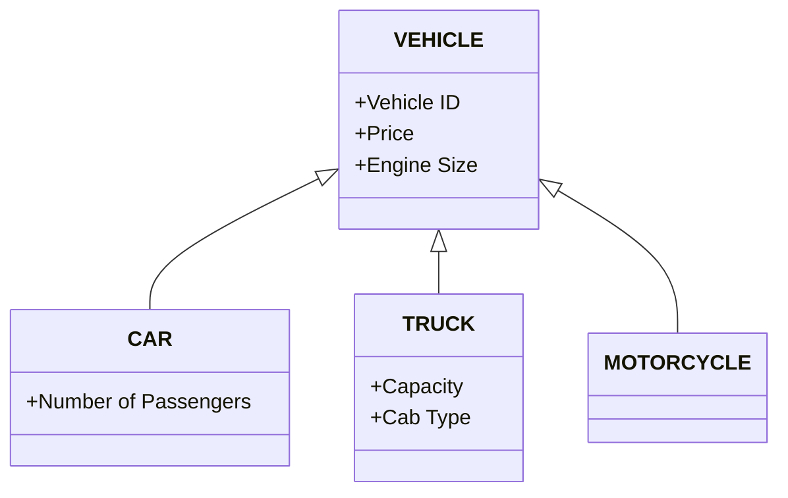
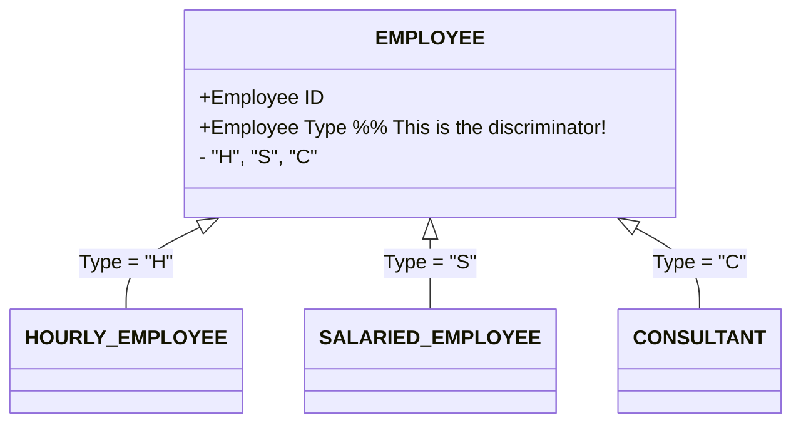
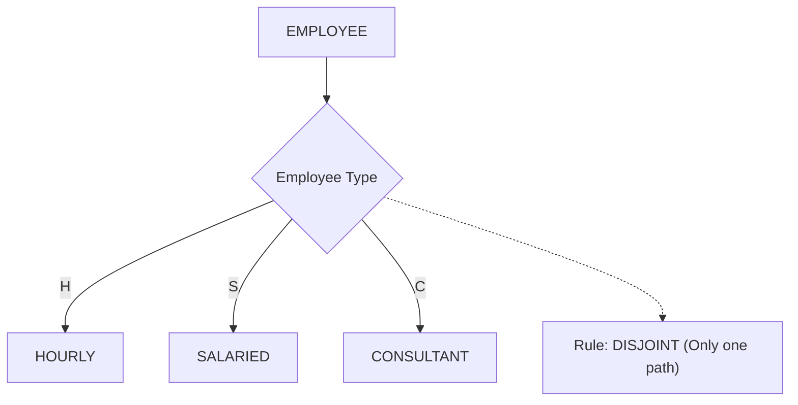
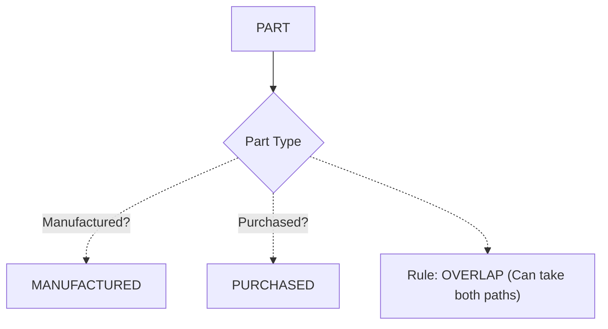
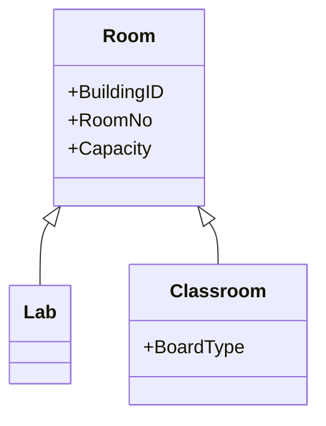
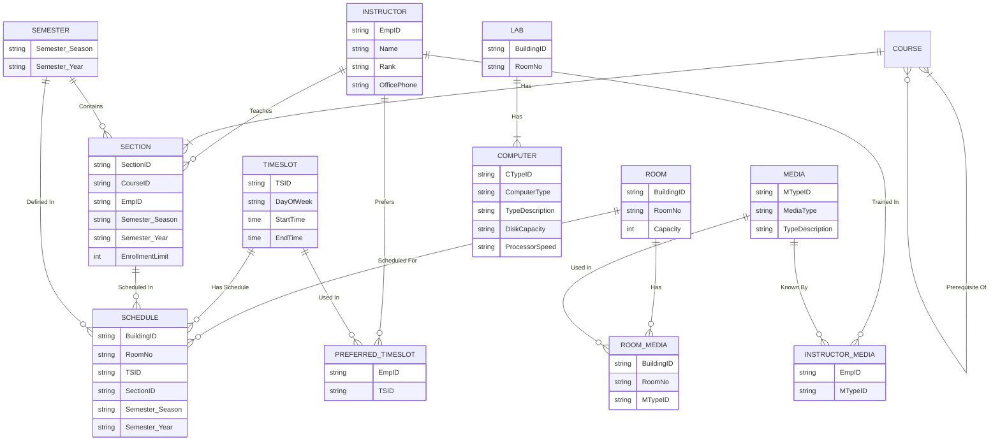
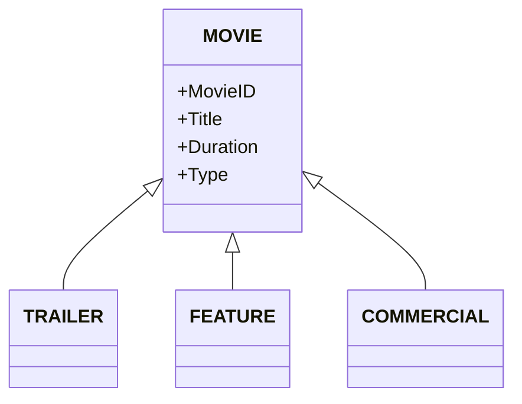
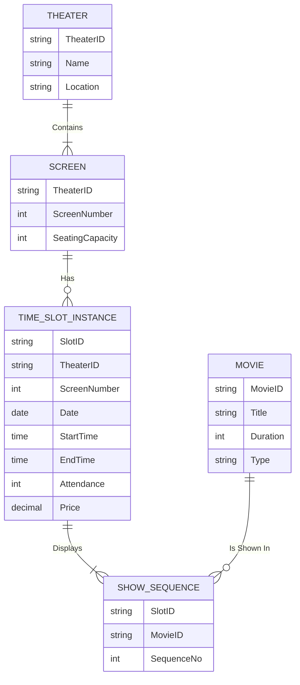

## 3-1: Review Exercise Question

### a. Supertype
**What it is:** A generic, "parent" entity type. It holds attributes that are common to all its specialized children.
**Why it exists:** To avoid repeating the same attributes over and over. It promotes reusability.
**Example:** `VEHICLE`. Every vehicle has a `Vehicle ID`, `Price`, and `Engine Size`. You store these in the `VEHICLE` supertype so you don’t have to rewrite them for Cars, Trucks, or Motorcycles.

### b. Subtype
**What it is:** A specialized, "child" entity type that inherits attributes from the supertype but also has its own unique attributes.
**Why it exists:** To capture the specific details that apply to *only* certain instances of the supertype.
**Example:** `CAR` (a subtype of `VEHICLE`). It inherits `Price` and `Engine Size` but has its own unique attribute, like `Number of Passengers`.

**Visual of a & b (Supertype & Subtype):**

---

### c. Specialization
**What it is:** The **process** of taking a generic supertype and splitting it into specialized subtypes. It is a **Top-Down** approach.
**Why it exists:** You start with a broad concept (e.g., `EMPLOYEE`) and realize that different types of employees have different rules and pay structures.
**Example:** You look at `EMPLOYEE` and realize you have three distinct types: `HOURLY_EMPLOYEE`, `SALARIED_EMPLOYEE`, and `CONSULTANT`. You specialize the `EMPLOYEE` entity to create these three subtypes.

---

### d. Entity Cluster
**What it is:** A "macro-level" entity that groups several related entities and relationships together into one single box. It’s used to simplify very large, complex diagrams.
**Why it exists:** Huge E-R diagrams (with 100+ entities) are impossible to put on one page. Entity clusters allow you to show a high-level "zoomed-out" view.
**Example:** Instead of showing `SALESPERSON`, `SALES TERRITORY`, and the `Serves` relationship separately, you hide them inside an entity cluster named `SELLING UNIT`.

---

### e. Completeness Constraint
**What it is:** A rule that asks: "Does **every** instance of the supertype **have** to belong to at least one subtype?"
**Why it exists:** To enforce business rules about whether a supertype instance can exist "on its own" without being assigned to a subtype.
**Two Types:**
1.  **Total:** Yes, it *must* belong to a subtype. (e.g., a `PATIENT` must be `OUTPATIENT` or `RESIDENT`).
2.  **Partial:** No, it *may* exist without being in a subtype. (e.g., a `VEHICLE` might be a `CAR` or `TRUCK`, or it might just be a `MOTORCYCLE` with no defined subtype).

---

### f. Enhanced Entity-Relationship (EER) Model
**What it is:** An extension of the standard E-R model that adds advanced features like **Supertypes/Subtypes** and **Specialization/Generalization**.
**Why it exists:** Modern business environments have complex rules (e.g., overlapping employee types, supertype/subtype hierarchies). The basic E-R model couldn't handle these complexities, so the EER model was created to handle them.
**Example:** A standard E-R model can show `EMPLOYEE` and `PROJECT`. An EER model can show that an `EMPLOYEE` can be a `SALARIED_EMPLOYEE` OR `CONSULTANT`, and that a `CONSULTANT` also has a relationship with a `CLIENT`.

---

### g. Subtype Discriminator
**What it is:** An attribute in the supertype that acts as a "signpost" to tell the system exactly which subtype a specific instance belongs to.
**Why it exists:** When you insert a new record, the database needs a rule to decide which subtype table it should go into.
**Example:** An `EMPLOYEE` has an attribute called `Employee Type`. If the value is `'H'`, it goes to `HOURLY_EMPLOYEE`. If it's `'S'`, it goes to `SALARIED_EMPLOYEE`.

---

### h. Total Specialization Rule
**What it is:** A rule stating that **every** instance of the supertype **must** be a member of at least one subtype. (This is the strict version of the Completeness Constraint).
**Why it exists:** To guarantee the data model covers all possibilities. There are no "orphan" supertype instances.
**Example:** In a specific hospital database, they decide a `PATIENT` cannot exist without being categorized. Therefore, every patient MUST be either `OUTPATIENT` OR `RESIDENT PATIENT`.

---

### i. Generalization
**What it is:** The **reverse process** of specialization. It is a **Bottom-Up** approach. You look at a group of specific, existing subtypes and create a new, broad supertype to hold their shared attributes.
**Why it exists:** To reduce redundancy. You realize three different tables have identical attributes and merge them into one parent table.
**Example:** You have `CAR`, `TRUCK`, and `MOTORCYCLE`. You notice they all share `Price`, `Engine Size`, and `Vehicle ID`. You group them together to form the `VEHICLE` supertype.

---

### j. Disjoint Rule
**What it is:** A rule stating that an instance of a supertype can be a member of **only one** subtype at any given time. The subtypes do not overlap.
**Why it exists:** For business rules where a single entity must be exclusively one type.
**Example:** An `EMPLOYEE` is either `HOURLY`, `SALARIED`, or `CONSULTANT`. They cannot be two of these at the same time.

---

### k. Overlap Rule
**What it is:** A rule stating that an instance of a supertype can be a member of **two or more** subtypes at the same time. The subtypes can overlap.
**Why it exists:** For business rules where an entity naturally fits into multiple categories.
**Example:** A `PART` can be both `MANUFACTURED` and `PURCHASED`. An item can be built in-house *and* bought from a supplier at the same time (to meet high demand).

---

### l. Partial Specialization Rule
**What it is:** A rule stating that an instance of the supertype **may** belong to a subtype, but it **does not have to**. (This is the relaxed version of the Completeness Constraint).
**Why it exists:** To allow "generic" instances that don't fit neatly into any defined subtype.
**Example:** A `VEHICLE` database defines subtypes `CAR` and `TRUCK`. However, `MOTORCYCLE` is also a vehicle but has no unique attributes, so it is not defined as a subtype. A Motorcycle exists as an instance of `VEHICLE` with no subtype.

---

### m. Universal Data Model
**What it is:** A pre-designed, "ready-to-use" data model (a template or pattern) that you can purchase and customize for your organization.
**Why it exists:** It saves massive amounts of time. Designing an E-R model from scratch can take months. Using a universal model gives you 80% of the design for free, and you only have to customize the remaining 20% to fit your specific business.
**Example:** Instead of designing a `Customer`, `Product`, and `Order` model from scratch, you buy a universal data model for an e-commerce company. It already has the correct tables, relationships, and business rules. You just rename the attributes and delete what you don't need.

---

## 3-33: International School of Technology Scheduling

Develop an EER model for the following situation:

An international school of technology wants a database to assist in scheduling classes.

- **Room** is identified by `Building ID` and `Room No`, and has a `Capacity`. A room can be a **Lab** or a **Classroom**. If it is a Classroom, it has a `Board Type`.
- **Media** (type) has `MType ID`, `Media Type`, and `Type Description`.
- **Computer** (type) has `CType ID`, `Computer Type`, `Type Description`, `Disk Capacity`, and `Processor Speed`.
- **Instructor** has `Emp ID`, `Name`, `Rank`, and `Office Phone`.
- **Timeslot** has `TSID`, `Day Of Week`, `Start Time`, and `End Time`.
- **Course** has `Course ID`, `Course Description`, and `Credits`. Courses can have prerequisites. Courses also have one or more **Sections**.
- **Section** has `Section ID` and `Enrollment Limit`.

**Business Rules:**
- An instructor teaches 0..M sections. A section is taught by exactly one instructor.
- Instructors specify preferred time slots (M:N).
- Scheduling data is kept for each `Semester` (composite: `Semester` + `Year`).
- A room can be scheduled for 0..1 section in one time slot during one semester. However, a room participates in many schedules, a time slot in many schedules, and a section in many schedules (this implies a M:N relationship between Room, Timeslot, and Section for a specific Semester).
- A room can have 0..M media types. A media type can be in 0..M rooms.
- Instructors are trained in 0..M media types. A media type can be known by 0..M instructors.
- A Lab has 1..M computer types. A Classroom does **not** have computers.
- A room cannot be both a Lab and a Classroom. There are no other room types (Total, Disjoint).

## Solution 

### EER Supertype/Subtype Structure (Room)

*Note: `Room` is the supertype, `Lab` and `Classroom` are the subtypes. The constraint is `Total, Disjoint` (every room is either one or the other, nothing else). `Lab` and `Classroom` inherit `BuildingID` and `RoomNo` as their composite identifier from `Room`.*

---

### Full E-R Data Model 

---

## Solution: 3-37 – TomKat Entertainment Chain of Theaters

Draw an EER diagram for the following situation:

TomKat Entertainment wants a database to track what is playing or has played on each screen in each theater at different times of the day.

- A **theater** (`Theater ID`, `theater name`, `location`) contains one or more **screens**.
- Each **screen** is identified by its `number` within that theater (`Screen Number` + `Theater ID`) and is described by `seating capacity`.
- **Movies** are scheduled for showing in **time slots**. Each screen can have different time slots on different days. For each time slot, record the `end time`, `attendance`, and `price charged`.
- Each **movie** (`Movie ID`, `title`, `duration`, `type`) can be either a **trailer**, **feature**, or **commercial**.
- In each time slot, one or more movies are shown. The system must track the **sequence** in which the movies are shown.

---

## Solution 

### EER Supertype/Subtype Structure (Movie)

*Note: `MOVIE` is the supertype, `TRAILER`, `FEATURE`, and `COMMERCIAL` are the subtypes. The constraint is `Partial, Disjoint` (a movie may not fall into any of these three types, but if it does, it is exactly one of them).*

---

### Full E-R Data Model

---