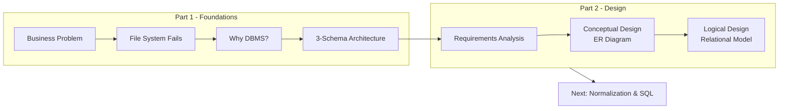

Designing a database without a plan is like building a skyscraper without an architect's drawing. You *will* end up with a structural mess. The database design process ensures we capture complex business rules accurately, creating a backend blueprint that is **flexible**, **efficient**, and **maintainable**.

---

### 1. The Three-Step Zoom-In
The design process flows through a three-step abstraction layer, mapping directly to the classic **3-Schema Architecture**:

| Phase | Focal Point | Academic Mapping | Real-World Deliverable |
| :--- | :--- | :--- | :--- |
| **1. Conceptual** | **What data matters?** High-level business concepts completely independent of technology. | **Conceptual Schema** | Entity-Relationship Diagram (ERD) |
| **2. Logical** | **How do we organize it?** Structuring data into tables, columns, primary keys, and foreign keys. | **Logical Schema** | Relational Schema / Tabular Layout |
| **3. Physical** | **Where and how do we store it?** Fine-tuning indexes, partitions, data types, and hardware constraints. | **Internal Schema** | Actual SQL DDL Scripts (`CREATE TABLE`) |

<Callout type="info" title="Scope of this Module">
  This section focuses entirely on **Step 1 (Conceptual/ERD)** and introduces the core architectural building blocks required to transition into **Step 2**.
</Callout>

---

### 2. Core Academic Foundations (Hoffer)
According to Hoffer's *Modern Database Management*, effective data modeling relies on four strict definitions:

*   **Entity:** A person, place, object, event, or concept in the user environment about which the organization wishes to maintain data.
*   **Relationship:** A meaningful, named association between two or more entities.
*   **Attribute:** A discrete property or characteristic of an entity or relationship type.
*   **Business Rule:** A declarative statement that defines or constrains some aspect of the business. 

<Callout type="warn" title="Why it matters">
  Business rules are the **absolute foundation** of ERD design. You cannot draw an accurate relationship until you understand the underlying business policy.
</Callout>

---

### 3. The Software Engineer's Reality 🛠️
In production-level engineering, we don't start by opening a SQL terminal. 

1. **The Discovery Phase:** We begin with intensive **requirements gathering** (digesting user stories, analyzing legacy workflows, and interviewing stakeholders).
2. **The Blueprint as a Contract:** The ERD acts as our **contract with the business**. It validates that the engineering team thoroughly understands the domain rules *before* writing a single line of application code.
3. **Design as Code:** Modern development teams utilize tools like **dbdiagram.io**, **Draw.io**, or **Lucidchart**. Advanced teams write their schemas using Database Definition DSLs (Domain Specific Languages), allowing ERDs to be version-controlled in Git right alongside the codebase.

---

### 4. High-Yield Exam Guide 🎓
If you are preparing for an academic assessment, pay close attention to this section. Historically, this forms a foundational **5-to-10 mark essay question**.

*   **Be Prepared To:**
    *   **Define** and differentiate the three primary phases of database design.
    *   **Explain** why omitting the conceptual phase leads to data redundancy and system failure.
    *   **Map** each design phase explicitly to its corresponding tier in the 3-schema architecture.

---

## Conceptual Modeling: The ERD

### Structural Context
The diagram below shows how requirements analysis bridges the gap between high-level problems and physical implementation:

### The Bridge 

We now understand *why* modern database management systems exist and the structural architecture that isolates physical data from user applications. Now, we dive into the engineering execution: **how to build them**.

The **Entity-Relationship Diagram (ERD)** is your foundational blueprint. It acts as a universal visual translator, converting conversational business requirements into an objective data model that developers, stakeholders, and DBAs can instantly understand.

