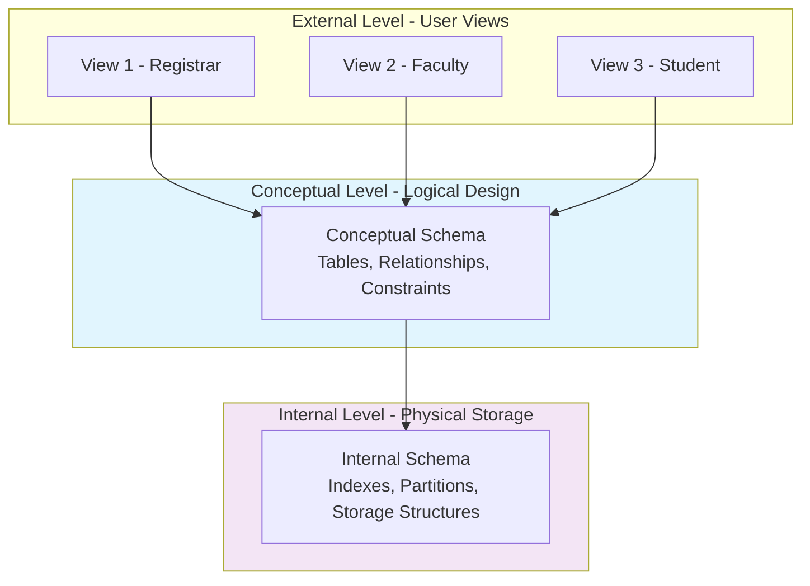
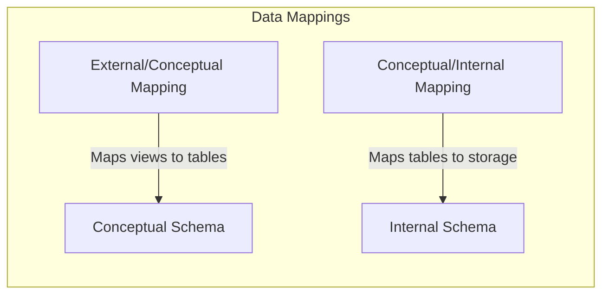

### 1. Big Picture
The ANSI/SPARC architecture provides a **standard framework** for describing database systems. It separates the user view from the physical storage, enabling **data independence** – the ability to change one level without affecting others.

### 2. Simple Explanation
Think of this as three layers of abstraction:
- **External Level**: What users see (different views for different users).
- **Conceptual Level**: The logical design (what data exists and how it relates).
- **Internal Level**: How data is physically stored (files, indexes, storage structures).

### 3. The Architecture Diagram

### 4. Level Breakdown

| Level | What It Defines | Who Uses It | Example |
| :--- | :--- | :--- | :--- |
| **External** | User-specific views of data | End-users, application developers | A student sees only their grades, not all students |
| **Conceptual** | Overall logical structure | Database designers, DBAs | Tables: Students, Courses, Enrollments |
| **Internal** | Physical storage details | DBAs, system programmers | Indexes, data files, partitioning strategies |

### 5. Data Mapping Between Levels

### 6. Software Engineer Perspective
- We work at the **External** level when writing application queries.
- We design the **Conceptual** schema (tables, relationships).
- We rarely touch the **Internal** level – that's the DBA's realm.
- The mapping layer ensures that if physical storage changes (e.g., adding indexes), our queries still work.

### 7. Exam Perspective
- **Draw** the 3-schema architecture.
- **Explain** each level and its purpose.
- **Define** data mapping between levels.

### 8. Quick Revision Box
- **External** = user views.
- **Conceptual** = logical design.
- **Internal** = physical storage.
- Data independence = change one level without affecting others.
