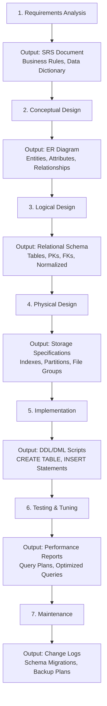
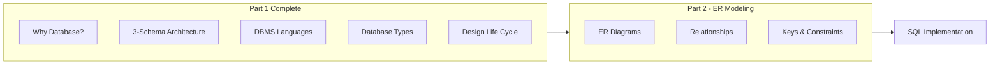

 

### 1. Big Picture
Building a database isn't just about creating tables – it's a systematic process. The design life cycle ensures that we start from business requirements and end with a working, efficient, and maintainable database.

### 2. Simple Explanation
Think of designing a database like building a house. You don't start with bricks – you first understand needs, draw blueprints (ER diagrams), choose materials (relational model), check for structural issues (normalisation), and then finally construct (create tables and queries). The life cycle guides you through these phases.

### 3. The Life Cycle Flow

### 4. Phase Outputs in Detail

| Phase | Key Activities | Deliverable/Output |
| :--- | :--- | :--- |
| **1. Requirements Analysis** | Interview stakeholders, identify data needs, define business rules | **SRS Document** (Software Requirements Specification) with data dictionary |
| **2. Conceptual Design** | Create high-level model, identify entities and relationships | **ER Diagram** (Entity-Relationship Diagram) |
| **3. Logical Design** | Map ER to relational model, apply normalisation | **Relational Schema** (tables, columns, primary keys, foreign keys) |
| **4. Physical Design** | Choose storage structures, indexes, partitioning strategies | **Storage Specifications** (tablespaces, file groups, index definitions) |
| **5. Implementation** | Write DDL and DML statements, populate initial data | **DDL/DML Scripts** (CREATE TABLE, INSERT, etc.) |
| **6. Testing & Tuning** | Execute test queries, profile performance, optimise | **Performance Reports** (execution plans, query optimisation results) |
| **7. Maintenance** | Monitor performance, apply schema changes, backup/recovery | **Change Logs** (migration scripts, backup schedules) |

### 5. Real World Example
- **University**: Requirements – track students, courses, faculty. Conceptual – ER diagram. Logical – tables with foreign keys. Physical – choose indexes on student ID. Implementation – create tables in PostgreSQL. Testing – run sample queries. Maintenance – add new fields as needed.
- **E‑commerce**: Requirements – products, orders, customers. Conceptual – ER. Logical – normalised tables. Physical – use sharding for scalability. Implementation – deploy on AWS RDS. Testing – load test with high traffic.

### 6. Software Engineer Perspective
We live this life cycle on every project. We start with **requirements gathering** (often via user stories), then design the schema, normalise, choose indexes, and finally write DAOs and queries. We also iterate – schema evolves with new features. Tools like **Liquibase** or **Flyway** help manage versioned schema migrations.

### 7. Exam Perspective
- **List phases** in order.
- **Explain each phase** briefly.
- **Why each phase is important** – e.g., conceptual design helps communication with non‑tech stakeholders.
- **Outputs** of each phase (ER diagram, relational schema, DDL).
- This is a very common question for 5‑10 marks.

### 8. Common Mistakes
- Jumping straight to implementation without design – leads to poor structures.
- Forgetting **normalisation** in logical design – it's crucial.
- Mixing up logical and physical design – they are distinct.
- Not considering maintenance – real systems change over time.

### 9. Quick Revision Box
- Phases: Requirements → Conceptual (ER) → Logical (Relational) → Physical → Implementation → Testing → Maintenance.
- Conceptual: high‑level, user‑friendly.
- Logical: tables, keys, normalisation.
- Physical: indexes, storage.
- Implementation: SQL DDL/DML.
- Maintenance: continuous.

---

## Mindset Summary – Connecting to Part 2

- **Part 1** gave you the complete foundation – from the philosophy (why databases exist) to the architecture (3-schema), languages (DDL/DML/DCL/TCL), and the process (design life cycle).
- **Key takeaways**: Data independence protects applications from schema changes. The 3-schema architecture provides the framework for this independence. DBMS languages give us precise control over structure, data, and permissions.
- As a software engineer, you will:
  - Design schemas using the life cycle approach.
  - Write DDL/DML daily.
  - Rely on data independence to evolve systems.
  - Choose database types based on use cases.
- **Part 2** will dive into the **how** – starting with Entity‑Relationship (ER) modelling, then moving to the relational model, normalisation, and finally SQL.
- Remember: **Design first, code later.** A well-designed database is the foundation of every successful application.

---

**End of Part 1**

**Next up:** Part 2 – ER Modeling & Relational Model