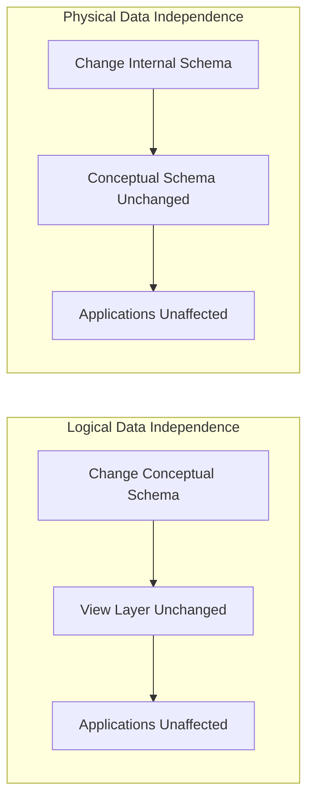

### 1. Big Picture
Data independence is the ability to change the database structure **without** affecting applications that use the data. It is a key benefit of the 3-schema architecture.

### 2. Simple Explanation
Think of data independence like swapping a car engine: users still see the same dashboard and controls, but the engine underneath can change.

### 3. Two Types of Data Independence

### 4. Detailed Comparison

| Aspect | Logical Data Independence | Physical Data Independence |
| :--- | :--- | :--- |
| **Definition** | Changes to conceptual schema don't affect external schemas. | Changes to internal schema don't affect conceptual schema. |
| **What Changes** | Adding/removing tables, columns, relationships. | Changing storage structures, indexes, file organization. |
| **Protects Against** | Schema modifications (e.g., splitting a table). | Storage changes (e.g., moving data to new disks). |
| **Which Levels** | External ←→ Conceptual mapping. | Conceptual ←→ Internal mapping. |
| **Easier/Harder** | **Harder** – more complex to maintain views. | **Easier** – DBMS handles most changes. |
| **Example** | Adding a `phone_number` column to `Students` without breaking existing queries. | Adding an index on `last_name` to speed up searches without changing the table structure. |

### 5. Real World Example
- **Logical Independence**: You add a `middle_name` column to `employees` table. Existing applications that `SELECT *` or specifically query other columns still work.
- **Physical Independence**: You migrate the database from spinning disks to SSDs, or from one file system to another. Applications don't notice.

### 6. Software Engineer Perspective
- We **rely** on data independence to evolve schemas without rewriting applications.
- In practice, we use **database migration tools** (Flyway, Liquibase) that apply changes carefully.
- We avoid `SELECT *` in production code – it breaks when columns change. Always specify columns.

### 7. Exam Perspective
- **Define** logical vs physical data independence.
- **Explain** which is harder to achieve and why.
- **Give examples** of changes that affect each type.

### 8. Quick Revision Box
- **Logical** = changes to schema structure (harder to maintain).
- **Physical** = changes to storage (easier, handled by DBMS).
- Data independence = application immunity to schema/storage changes.
- `SELECT *` breaks logical independence – always specify columns.
