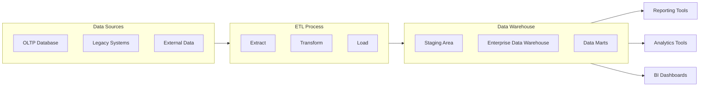

### 1. Big Picture
Operational databases (OLTP) are optimised for day‑to‑day transactions. But for **analysis and reporting**, we need a different structure – a data warehouse that aggregates data from multiple sources and is optimised for read‑heavy queries.

### 2. Simple Explanation
A data warehouse is like a **library of historical data**. It stores large volumes of data from various operational systems, cleansed and transformed, so that business analysts can run complex reports and find trends without slowing down the live systems.

### 3. Key Terms
- **Data Warehouse (DW)**: A central repository for integrated, subject‑oriented, non‑volatile, and time‑variant data for decision support.
- **ETL**: Extract, Transform, Load – the process of moving data into the warehouse.
- **OLAP**: Online Analytical Processing – for complex queries and multidimensional analysis.
- **Data Mart**: A subset of a data warehouse focused on a specific business area (e.g., sales).

### 4. OLTP vs OLAP Comparison

| Aspect | OLTP (Online Transaction Processing) | OLAP (Online Analytical Processing) |
| :--- | :--- | :--- |
| **Purpose** | Manage day-to-day transactions | Support business decision-making |
| **Data State** | Current, real-time data | Historical, aggregated data |
| **Query Patterns** | Simple, repetitive queries | Complex, ad-hoc queries |
| **Read/Write** | **Write-heavy** (many inserts/updates) | **Read-heavy** (few writes) |
| **Users** | Operational staff (cashiers, clerks) | Analysts, managers, executives |
| **Data Model** | Normalized (3NF) | Denormalized (Star/Snowflake schema) |
| **Response Time** | Sub-second required | Seconds to minutes acceptable |
| **Data Volume** | GB to TB | TB to PB |
| **Concurrency** | High (thousands of concurrent users) | Low (hundreds of concurrent users) |
| **Example** | Banking transactions, ATM operations | Sales trend analysis, forecasting |

### 5. Data Warehouse Architecture

### 6. Real World Example
- **Banking**: A data warehouse stores daily transaction summaries over years. Analysts can query it to detect fraud patterns or customer trends.
- **E‑commerce**: Amazon uses data warehouses to analyse buying behaviour, recommend products, and forecast inventory.
- **Hospital**: A data warehouse combines patient records from different clinics to study disease outbreaks.

### 7. Software Engineer Perspective
We may build ETL pipelines to feed data into the warehouse, using tools like Apache Spark, or cloud services like AWS Redshift, Google BigQuery. We design star schemas (fact and dimension tables) to optimise performance. Modern approaches also use **data lakes** for raw data and **lakehouses** for flexibility.

### 8. Exam Perspective
- **Definition** of data warehouse.
- **Difference** between operational DB and data warehouse (OLTP vs. OLAP).
- **Properties** (subject‑oriented, integrated, non‑volatile, time‑variant).
- **ETL process** – often asked.

### 9. Common Mistakes
- Confusing a data warehouse with a database – they are different (though both store data).
- Forgetting that data warehouses are **read‑only** for analysis – they are not updated by transactions.
- Not mentioning **ETL** – a critical component.

### 10. Quick Revision Box
- Data warehouse = analytical database.
- Stores historical, integrated data from multiple sources.
- Optimised for complex queries and reporting.
- Uses ETL to load data.
- Supports OLAP.

---
