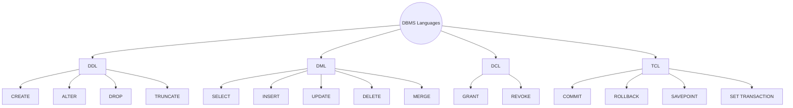

### 1. Big Picture
DBMS provides a rich set of languages to interact with the database, each serving a distinct purpose. These are the **tools** we use to define, manipulate, and control data.

### 2. Simple Explanation
Think of a database as a country:
- **DDL** writes the constitution (CREATE, ALTER).
- **DML** runs the daily operations (SELECT, INSERT, UPDATE).
- **DCL** manages citizenship and permissions (GRANT, REVOKE).
- **TCL** handles transactions and rollbacks (COMMIT, ROLLBACK).

### 3. Language Categories



### 4. Detailed Breakdown

| Language | Purpose | Key Commands | Auto-Commit? |
| :--- | :--- | :--- | :--- |
| **DDL** | Define/modify database structure | `CREATE`, `ALTER`, `DROP`, `TRUNCATE` | **Yes** (implicit commit) |
| **DML** | Manage data | `SELECT`, `INSERT`, `UPDATE`, `DELETE`, `MERGE` | **No** (needs explicit COMMIT) |
| **DCL** | Control access permissions | `GRANT`, `REVOKE` | **Yes** |
| **TCL** | Manage transactions | `COMMIT`, `ROLLBACK`, `SAVEPOINT` | N/A |

### 5. SQL Examples

#### DDL (Data Definition Language)
```sql
-- Define structure
CREATE TABLE students (
    student_id NUMBER(10) PRIMARY KEY,
    name VARCHAR2(100) NOT NULL
);

-- Modify structure
ALTER TABLE students ADD (email VARCHAR2(100));

-- Remove structure
DROP TABLE students;
```

#### DML (Data Manipulation Language)
```sql
-- Retrieve data
SELECT * FROM students WHERE student_id = 101;

-- Insert data
INSERT INTO students VALUES (101, 'Alice', 'alice@email.com');

-- Modify data
UPDATE students SET email = 'alice.new@email.com' WHERE student_id = 101;

-- Delete data
DELETE FROM students WHERE student_id = 101;
```

#### DCL (Data Control Language)
```sql
-- Grant permissions
GRANT SELECT ON students TO user1;

-- Revoke permissions
REVOKE SELECT ON students FROM user1;
```

#### TCL (Transaction Control Language)
```sql
-- Start a transaction (implicit)
INSERT INTO accounts VALUES (101, 500);

-- Set a savepoint
SAVEPOINT before_update;

-- Make permanent
COMMIT;

-- Undo changes
ROLLBACK TO SAVEPOINT before_update;
-- or
ROLLBACK;  -- Undo all
```

### 6. Software Engineer Perspective
- We use **DML** daily – it's the core of application logic.
- **DDL** is for schema migrations – we version-control DDL scripts.
- **DCL** is managed by DBAs – we rarely do this directly.
- **TCL** is crucial – we always control transactions in application code.

### 7. Exam Perspective
- **Classify** SQL commands into DDL, DML, DCL, TCL.
- **Define** each language with examples.
- **Difference** between DELETE (DML) and DROP (DDL).
- **Why** DDL commits automatically.

### 8. Quick Revision Box
- **DDL** = structure (CREATE, ALTER, DROP) – auto-commit.
- **DML** = data (SELECT, INSERT, UPDATE, DELETE) – needs COMMIT.
- **DCL** = permissions (GRANT, REVOKE) – auto-commit.
- **TCL** = transactions (COMMIT, ROLLBACK) – controls DML.

---