## 1. Lecture Agenda
Today we will discuss two major ways to combine data from multiple tables:
1. **Processing Multiple Tables using Joins** (Inner, Outer, Self, Multi-table joins).
2. **Processing Multiple Tables using Subqueries** (Correlated and Non-correlated).

---

## 2. What is a JOIN?
A **JOIN** is a SQL operation used to combine columns from two or more tables (or views) based on the values of related columns. 
- The related columns are usually the **Primary Key (PK)** of the first table and the **Foreign Key (FK)** of the second table.
- In a 1:M (One-to-Many) relationship, the common columns are the Primary Key of the dominant table and the Foreign Key of the dependent table.

### JOIN Syntax
Queries contain at least one join condition. This condition can be written in the `FROM` clause using the `ON` keyword, rather than the old method of using a `WHERE` clause. The join condition compares two columns from the different tables.

### Visualizing a Join
*(The general idea is taking the overlapping records of two tables)*

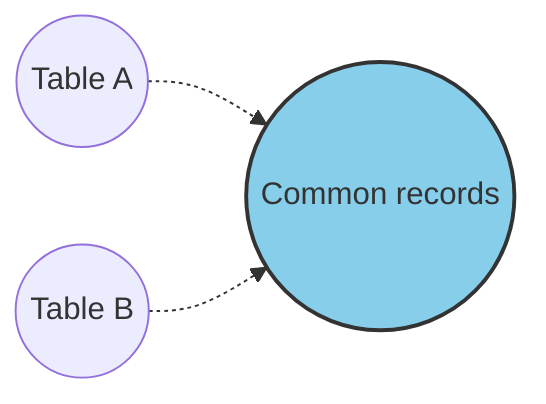

---

## 3. The Sample Enterprise Data Model
To explain joins, we will use a data model for a furniture company (Pine Valley Furniture). Below is the Entity-Relationship diagram showing how the tables relate to each other.

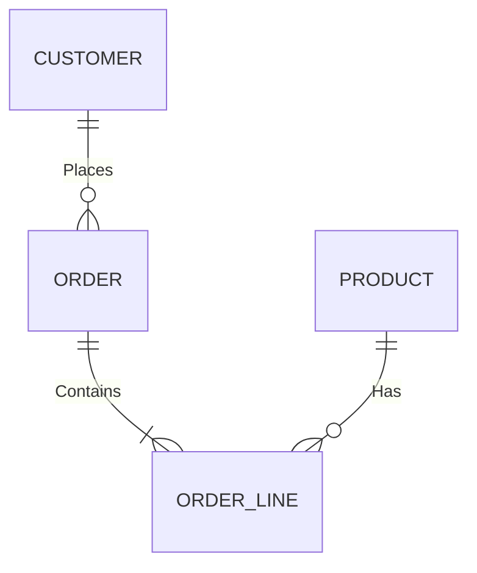

**Relationship Definitions:**
- **Customer to Order:** One customer can place many orders (1:M).
- **Product to Order Line:** One product can appear in many order lines (1:M).
- **Order to Order Line:** One order can have many order lines (1:M).

---

## 4. Creating the Tables
We create the tables to store the data for these relationships. Here is an example `CREATE TABLE` statement for the `Product_T` table, including a constraint to restrict the product finish.

```sql
CREATE TABLE Product_T  
(ProductID INTEGER,  
 ProductDescription VARCHAR(50),  
 ProductFinish VARCHAR(20),  
 ProductStandardPrice DECIMAL(6,2),  
 ProductLineID INTEGER,  
 CONSTRAINT Product_PK PRIMARY KEY (ProductID),  
 CONSTRAINT Product_Finish_Check CHECK (ProductFinish IN ('Cherry', 'Natural Ash', 'White Ash', 'Red Oak', 'Natural Oak', 'Walnut'))
);
```

---

## 5. Example Data: Order and Customer Tables
To understand how joins work, let’s look at example data for two tables: `Order_T` (Orders) and `Customer_T` (Customers).

*(Relationship: The `CustomerID` in the `Order_T` table is a Foreign Key pointing to the `CustomerID` in the `Customer_T` table).*

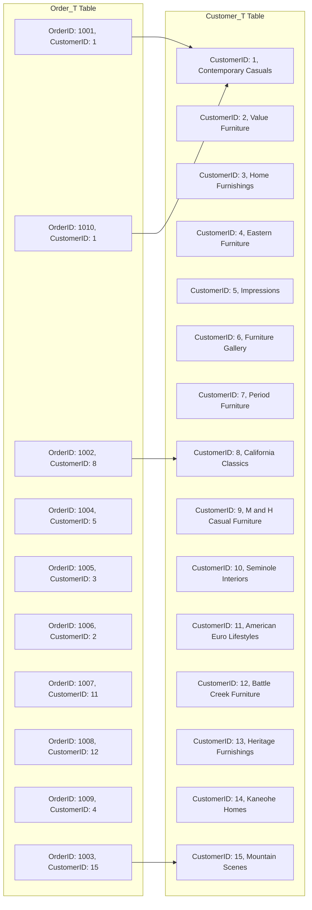

---

## 6. Types of JOINs
There are several types of joins, which we will examine in detail:
- **INNER JOIN** (includes Equi Join and Natural Join)
- **OUTER JOIN** (Left, Right, and Full Outer Join)
- **SELF JOIN**

---

## 7. INNER JOIN
An **INNER JOIN** is the most common type of join. It returns only the rows from multiple tables where the join condition matches.

*Visual representation: The blue shaded area below shows the intersection where matches are found.*

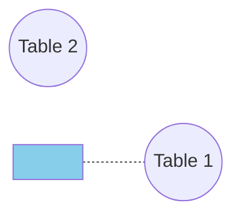

### Syntax
```sql
SELECT columns  
FROM table1  
INNER JOIN table2  
ON table1.column = table2.column;
```
*(Note: Inner join allows standard comparison operators like `=`, `<`, `>`, `!=`).*

### Inner Join Query Example (Using `ON`)
The query below joins the Customer and Order tables. The `WHERE` clause is replaced by the `ON` condition.

```sql
SELECT Customer_T.CustomerID, Order_T.CustomerID, CustomerName, OrderID  
FROM Customer_T  
INNER JOIN Order_T  
ON Customer_T.CustomerID = Order_T.CustomerID  
ORDER BY OrderID;
```

### Inner Join Query Example (Using `USING`)
If the joining columns have the **exact same name** in both tables, you can use `USING` instead of `ON`. This also eliminates the duplicate column automatically.

```sql
SELECT CustomerID, CustomerName, OrderID  
FROM Customer_T  
JOIN Order_T USING (CustomerID)  
ORDER BY OrderID;
```

### Result of the Inner Join
When you run this query on the sample data, you get **10 matching rows** back. (Notice Customer 6, 7, 9, 10, 13, 14 have no orders, so they do not appear).

| CustomerID | CustomerName | OrderID |
| :--- | :--- | :--- |
| 1 | Contemporary Casuals | 1001 |
| 8 | California Classics | 1002 |
| 15 | Mountain Scenes | 1003 |
| 5 | Impressions | 1004 |
| 3 | Home Furnishings | 1005 |
| 2 | Value Furniture | 1006 |
| 11 | American Euro Lifestyles | 1007 |
| 12 | Battle Creek Furniture | 1008 |
| 4 | Eastern Furniture | 1009 |
| 1 | Contemporary Casuals | 1010 |

### Joining More Than Two Tables
Inner joins can join multiple tables. For example, joining `Order_T`, `Order_Items`, and `Customer_T`.
*Important*: In practice, you should limit the number of joined tables for performance reasons.

```sql
SELECT name AS customer_name, order_id, order_date, item_id, quantity, unit_price  
FROM orders  
INNER JOIN order_items USING(order_id)  
INNER JOIN customers USING(customer_id)  
ORDER BY order_date DESC, order_id DESC, item_id ASC;
```

### The Cartesian Product (Cross Join)
A JOIN without a condition is a **Cartesian Product**. For example, if Table A has 5 rows and 3 columns, and Table B has 10 rows and 5 columns:
- Total rows after a Cartesian Join = `5 * 10 = 50`
- Total columns = `3 + 5 = 8`

---

## 8. EQUI JOIN
An **Equi Join** is a specific type of inner join where the joining condition is based on **equality** (`=`) between values in the common columns. This condition is traditionally mentioned in the `WHERE` clause.

### Example: Finding Customers with Orders
We want to know data about customers who have placed orders. This information is split between `Customer_T` and `Order_T`. We match them up.

**Query:**
```sql
SELECT Customer_T.CustomerID, Order_T.CustomerID, CustomerName, OrderID  
FROM Customer_T, Order_T  
WHERE Customer_T.CustomerID = Order_T.CustomerID  
ORDER BY OrderID;
```

**Visual Representation of Equi Join Matching:**
*(The query uses the arrow logic below to match ID 1 to 1, 8 to 8, etc.)*

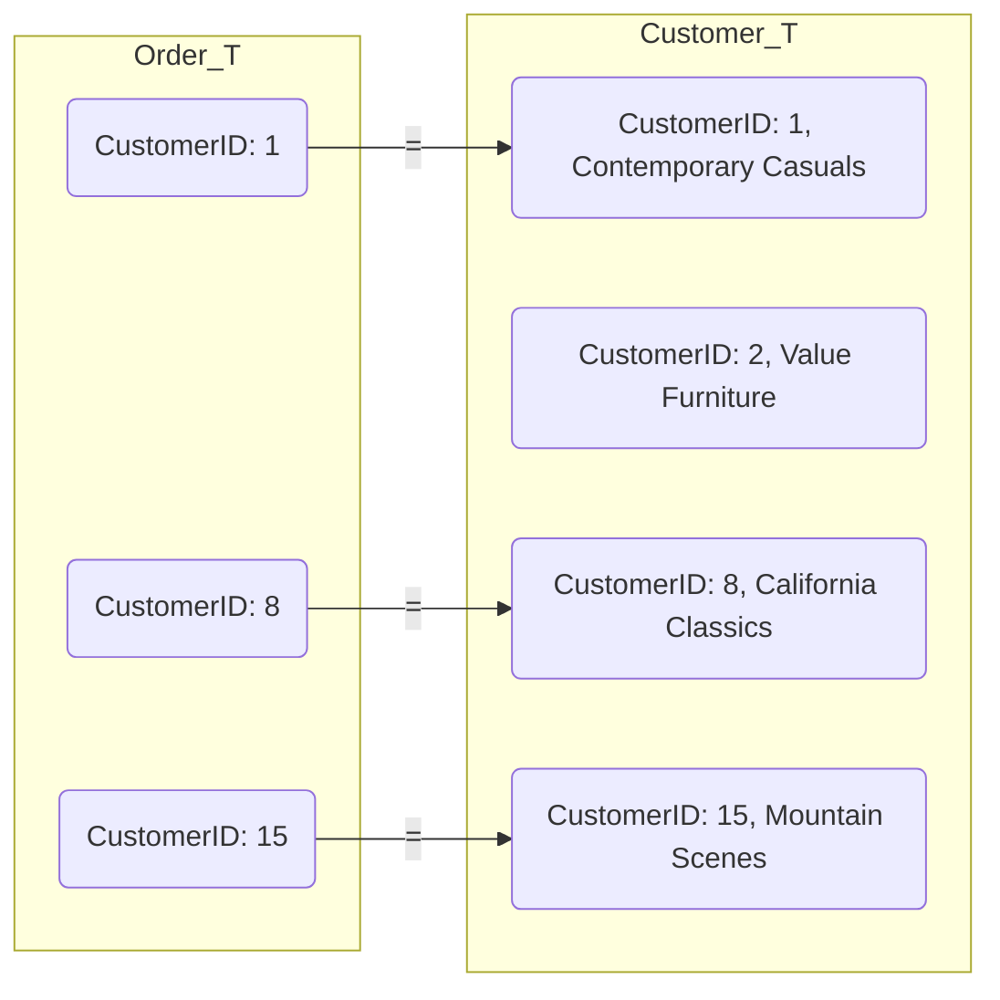

**Result:** The result is identical to the Inner Join result (10 rows) shown earlier.

---

## 9. NATURAL JOIN
A **Natural Join** is the same as an Equi Join, but with a few specific rules:
1. The columns must have the **exact same name** in both tables.
2. It automatically matches matching columns.
3. Duplicate columns are automatically eliminated from the result table.

**Visual representation:**
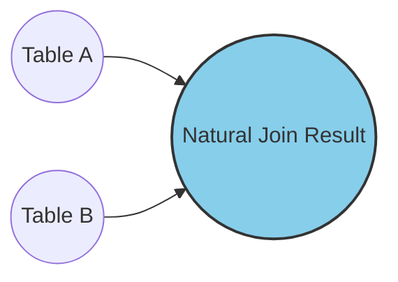

### Natural Join Query
```sql
SELECT CustomerID, CustomerName, OrderID  
FROM Customer_T  
NATURAL JOIN Order_T;
```
*(Note: There is no need to write `ON` or specify the column name, as it auto-detects `CustomerID`).*

### Natural Join Query Result
The result is slightly different from standard inner joins because the duplicate `CustomerID` column is shown only once.

| CustomerID | CustomerName | OrderID |
| :--- | :--- | :--- |
| 1 | Contemporary Casuals | 1001 |
| 1 | Contemporary Casuals | 1010 |
| 2 | Value Furniture | 1006 |
| 3 | Home Furnishings | 1005 |
| 4 | Eastern Furniture | 1009 |
| 5 | Impressions | 1004 |
| 8 | California Classics | 1002 |
| 11 | American Euro Lifestyles | 1007 |
| 12 | Battle Creek Furniture | 1008 |
| 15 | Mountain Scenes | 1003 |

### Full `SELECT *` Result
If we use `SELECT * FROM Customer_T NATURAL JOIN Order_T;`, the complete combined data row is shown:

| CustomerID | CustomerName | CustomerAddress | CustomerCity | CustomerState | CustomerPostalCode | OrderID | OrderDate |
| :--- | :--- | :--- | :--- | :--- | :--- | :--- | :--- |
| 1 | Contemporary Casuals | 1355 S Hines Blvd | Gainesville | FL | 32601-2871 | 1001 | 21-OCT-10 |
| 1 | Contemporary Casuals | 1355 S Hines Blvd | Gainesville | FL | 32601-2871 | 1010 | 05-NOV-10 |
| 2 | Value Furniture | 15145 S.W. 17th St. | Plano | TX | 75094-7743 | 1006 | 24-OCT-10 |
| 3 | Home Furnishings | 1900 Allard Ave. | Albany | NY | 12209-1125 | 1005 | 24-OCT-10 |
| 4 | Eastern Furniture | 1925 Beltline Rd. | Carteret | NJ | 07008-3188 | 1009 | 05-NOV-10 |
| 5 | Impressions | 5585 Westcott Ct. | Sacramento | CA | 94206-4056 | 1004 | 22-OCT-10 |
| 8 | California Classics | 816 Peach Rd. | Santa Clara | CA | 96915-7754 | 1002 | 21-OCT-10 |
| 11 | American Euro Lifestyles | 2424 Missouri Ave N. | Prospect Park | NJ | 07508-5621 | 1007 | 27-OCT-10 |

---

## 10. OUTER JOINS (Left, Right, Full)
Outer joins are used when you want to keep data from one or both tables, even if there is no matching row in the other table. Where there is no match, `NULL` values are placed in the columns of the table without a match.

### A. LEFT OUTER JOIN
A **Left Outer Join** returns **all rows from the left-hand table** (Table 1), and only the matching rows from the right-hand table (Table 2). If a left row has no match in the right table, it still appears, but the right-side columns are `NULL`.

*Visual: The shaded area represents all of Table 1, plus the intersection.*

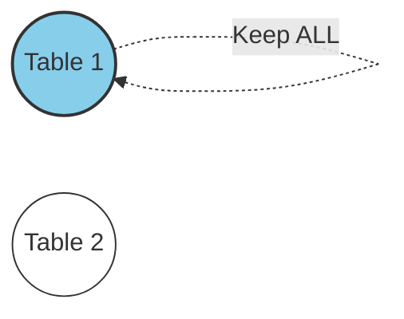

### Syntax
```sql
SELECT columns  
FROM table1  
LEFT [OUTER] JOIN table2  
ON table1.column = table2.column;
```

### Example & Query
*Scenario:* List all customers, including those who have not placed any orders yet.
```sql
SELECT Customer_T.CustomerID, CustomerName, OrderID  
FROM Customer_T  
LEFT OUTER JOIN Order_T  
ON Customer_T.CustomerID = Order_T.CustomerID;
```

### Left Outer Join Result
*(Notice customers like Furniture Gallery and Kaneohe Homes appear here, but with `(null)` for OrderID because they have not placed orders).*

| CustomerID | CustomerName | OrderID |
| :--- | :--- | :--- |
| 5 | Impressions | 1004 |
| 3 | Home Furnishings | 1005 |
| 2 | Value Furniture | 1006 |
| 11 | American Euro Lifestyles | 1007 |
| 12 | Battle Creek Furniture | 1008 |
| 4 | Eastern Furniture | 1009 |
| 1 | Contemporary Casuals | 1010 |
| 6 | Furniture Gallery | (null) |
| 14 | Kaneohe Homes | (null) |
| 7 | Period Furniture | (null) |
| 10 | Seminole Interiors | (null) |

### B. RIGHT OUTER JOIN
A **Right Outer Join** is the exact mirror of a Left Outer Join. It returns **all rows from the right-hand table** (Table 2), and only matching rows from the left-hand table (Table 1).

*Visual: The shaded area represents all of Table 2, plus the intersection.*

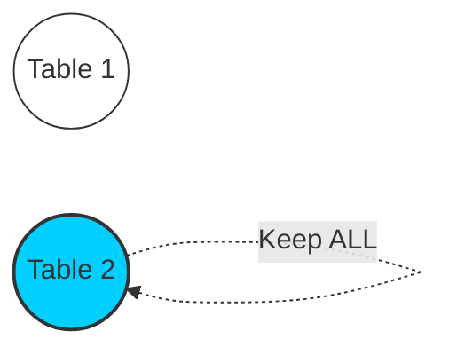

### Example & Query
*Scenario:* List all orders, including any order that has no customer name associated with it (a data integrity anomaly).
```sql
SELECT Customer_T.CustomerID, CustomerName, OrderID  
FROM Customer_T  
RIGHT OUTER JOIN Order_T  
ON Customer_T.CustomerID = Order_T.CustomerID;
```

### Right Outer Join Result
*(All 10 orders appear here. Since all orders have a CustomerID in this dataset, no extra nulls appear).*

| CustomerID | CustomerName | OrderID |
| :--- | :--- | :--- |
| 1 | Contemporary Casuals | 1001 |
| 1 | Contemporary Casuals | 1010 |
| 2 | Value Furniture | 1006 |
| 3 | Home Furnishings | 1005 |
| 4 | Eastern Furniture | 1009 |
| 5 | Impressions | 1004 |
| 8 | California Classics | 1002 |
| 11 | American Euro Lifestyles | 1007 |
| 12 | Battle Creek Furniture | 1008 |
| 15 | Mountain Scenes | 1003 |

### C. FULL OUTER JOIN
A **Full Outer Join** returns **all records from both tables**. If a row in the left table has no match in the right table (and vice versa), `NULL` values are used to fill the gaps.

*Visual: The shaded area represents both Table 1 and Table 2 entirely.*

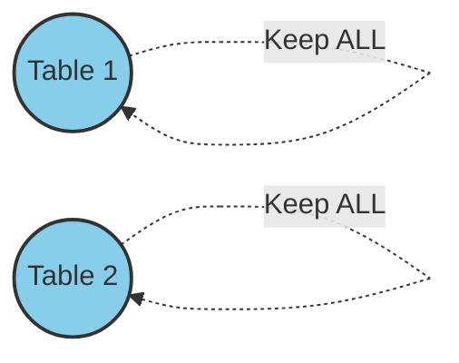

### Syntax
```sql
SELECT columns  
FROM table1  
FULL [OUTER] JOIN table2  
ON table1.column = table2.column;
```

### Example & Query
```sql
SELECT CustomerID, CustomerName, OrderID  
FROM Customer_T  
FULL OUTER JOIN Order_T  
USING (CustomerID);
```

### Full Outer Join Result
*(This joins all 15 customers with 10 orders. Customers without orders get nulls, and if there were orders without customers, they would also appear).*

| CustomerID | CustomerName | OrderID |
| :--- | :--- | :--- |
| 6 | Furniture Gallery | (null) |
| 7 | Period Furniture | (null) |
| 8 | California Classics | 1002 |
| 9 | M and H Casual Furniture | (null) |
| 10 | Seminole Interiors | (null) |
| 11 | American Euro Lifestyles | 1007 |
| 12 | Battle Creek Furniture | 1008 |
| 13 | Heritage Furnishings | (null) |
| 14 | Kaneohe Homes | (null) |
| 15 | Mountain Scenes | 1003 |
| 5 | Impressions | 1004 |
| 3 | Home Furnishings | 1005 |
| 2 | Value Furniture | 1006 |
| 4 | Eastern Furniture | 1009 |
| 1 | Contemporary Casuals | 1010 |

---

## 11. SELF JOIN
A **Self Join** is used to join a table to itself. This happens in **Unary Relationships** (Recursive relationships), such as an employee's relationship to their supervisor, where both employee and supervisor are stored in the same table.

### Creating an Employee Table (with Supervisor)
```sql
CREATE TABLE Employee_T  
(EmployeeID VARCHAR2(10) NOT NULL,  
 EmployeeName VARCHAR2(25),  
 EmployeeAddress VARCHAR2(30),  
 EmployeeBirthDate DATE,  
 EmployeeCity VARCHAR2(20),  
 EmployeeState CHAR(2),  
 EmployeeZipCode VARCHAR2(10),  
 EmployeeDateHired DATE,  
 EmployeeSupervisor VARCHAR2(10),  
 CONSTRAINT Employee_PK PRIMARY KEY (EmployeeID));
```

### Example Data: Employee Table
*(Notice that the `Super_ssn` (Supervisor ID) points to the `Ssn` (Employee ID) of another row in the same table).*

| Fname | Minit | Lname | Ssn | Bdate | Address | Sex | Salary | Super_ssn | Dno |
| :--- | :--- | :--- | :--- | :--- | :--- | :--- | :--- | :--- | :--- |
| John | B | Smith | 123456789 | 1965-01-09 | 731 Fondren, Houston, TX | M | 30000 | 333445555 | 5 |
| Franklin | T | Wong | 333445555 | 1955-12-08 | 638 Voss, Houston, TX | M | 40000 | 888665555 | 5 |
| Alicia | J | Zelaya | 999887777 | 1968-01-19 | 3321 Castle, Spring, TX | F | 25000 | 987654321 | 4 |
| Jennifer | S | Wallace | 987654321 | 1941-06-20 | 291 Berry, Bellaire, TX | F | 43000 | 888665555 | 4 |
| Ramesh | K | Narayan | 666884444 | 1962-09-15 | 975 Fire Oak, Humble, TX | M | 38000 | 333445555 | 5 |
| Joyce | A | English | 453453453 | 1972-07-31 | 5631 Rice, Houston, TX | F | 25000 | 333445555 | 5 |
| Ahmad | V | Jabbar | 987987987 | 1969-03-29 | 980 Dallas, Houston, TX | M | 25000 | 987654321 | 4 |
| James | E | Borg | 888665555 | 1937-11-10 | 450 Stone, Houston, TX | M | 55000 | NULL | 1 |

### Self Join Visual Execution
We need to read the same table twice. We assign **aliases** `E` (Employees) and `M` (Managers) to distinguish the two copies.

*Visual logic:*
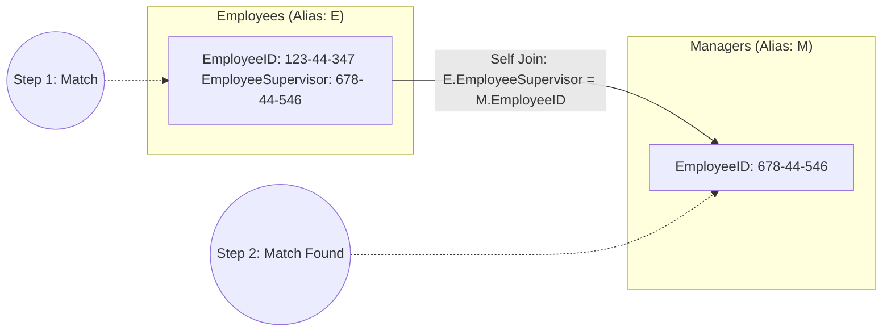

**Example Query:**
Find the Employee ID, Employee Name, and the supervisor's name for each employee.
```sql
SELECT E.EmployeeID, E.EmployeeName, M.EmployeeName AS Manager  
FROM Employee_T E, Employee_T M  
WHERE E.EmployeeSupervisor = M.EmployeeID;
```
*(Note: In the `FROM` clause, we list `Employee_T` twice: once as `E` and once as `M`).*

**Result:**
| EmployeeID | EmployeeName | Manager |
| :--- | :--- | :--- |
| 123-44-347 | Jim Jason | Robert Lewis |

---

## 12. Multi-Table Join (4 Tables)
To create a full invoice for a specific order (e.g., Order 1006), we need to join **4 tables**: `Customer_T`, `Order_T`, `Order_Line_T`, and `Product_T`.

*Visual: The join paths between the tables.*

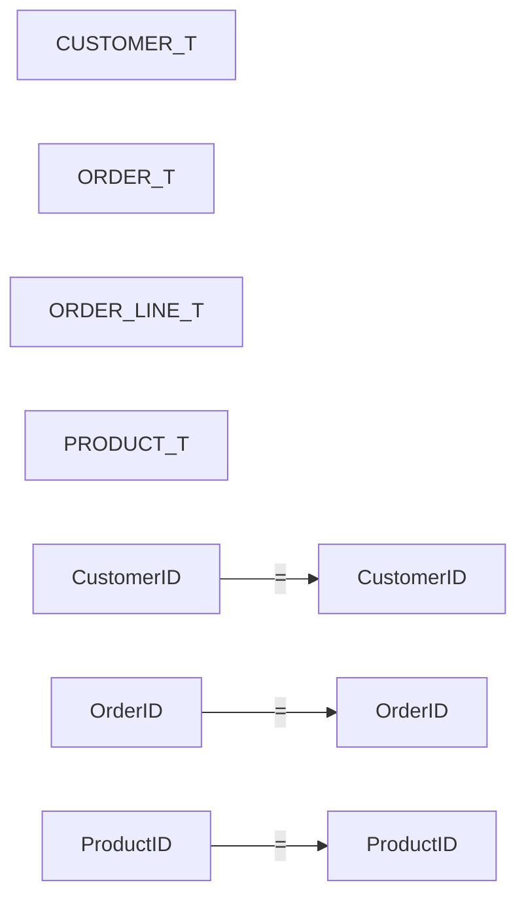

### SQL Query (Using Old WHERE Syntax)
```sql
SELECT CUSTOMER_T.CUSTOMER_ID, CUSTOMER_NAME, CUSTOMER_ADDRESS, CITY, STATE, POSTAL_CODE,  
       ORDER_T.ORDER_ID, ORDER_DATE, QUANTITY, PRODUCT_NAME, UNIT_PRICE,  
       (QUANTITY * UNIT_PRICE) AS TOTAL  
FROM CUSTOMER_T, ORDER_T, ORDER_LINE_T, PRODUCT_T  
WHERE CUSTOMER_T.CUSTOMER_ID = ORDER_T.CUSTOMER_ID  
  AND ORDER_T.ORDER_ID = ORDER_LINE_T.ORDER_ID  
  AND ORDER_LINE_T.PRODUCT_ID = PRODUCT_T.PRODUCT_ID  
  AND ORDER_T.ORDER_ID = 1006;
```
*Key rule:* Each pair of tables requires an equality condition matching a Primary Key to a Foreign Key.

### Result of the 4-Table Join (For Order 1006)
| CustomerID | CustomerName | CustomerAddress | City | State | PostalCode | OrderID | OrderDate | Ordered Qty | ProductName | UnitPrice | Total |
| :--- | :--- | :--- | :--- | :--- | :--- | :--- | :--- | :--- | :--- | :--- | :--- |
| 2 | Value Furniture | 15145 S. W. 17th St. | Plano | TX | 75094-7743 | 1006 | 24-OCT-10 | 1 | Entertainment Center | 650 | 650 |
| 2 | Value Furniture | 15145 S. W. 17th St. | Plano | TX | 75094-7743 | 1006 | 24-OCT-10 | 2 | Writer's Desk | 325 | 650 |
| 2 | Value Furniture | 15145 S. W. 17th St. | Plano | TX | 75094-7743 | 1006 | 24-OCT-10 | 2 | Dining Table | 800 | 1600 |

---

## 13. Subqueries
A **Subquery** (also called an inner query) is a `SELECT` statement placed inside another `SELECT` statement (the outer query). 
- It can be placed inside the `WHERE` clause or `HAVING` clause.
- Subqueries are usually easier to read than complex joins for certain problems.

### Types of Subqueries
1. **Non-correlated Subquery:** Executed **once** for the entire outer query. The inner query runs first, gives a result, then the outer query uses that result.
2. **Correlated Subquery:** Executed **once for each row** returned by the outer query. The inner query depends on values from the outer query.

---

## 14. Non-Correlated Subquery Examples

### Example 1: Using `=` Operator
*Scenario:* Who is the customer that placed Order 1008?
```sql
SELECT CustomerName, CustomerAddress, CustomerCity, CustomerState, CustomerPostalCode  
FROM Customer_T  
WHERE Customer_T.CustomerID =  
      (SELECT Order_T.CustomerID  
       FROM Order_T  
       WHERE OrderID = 1008);
```
**Execution order (Visual):**
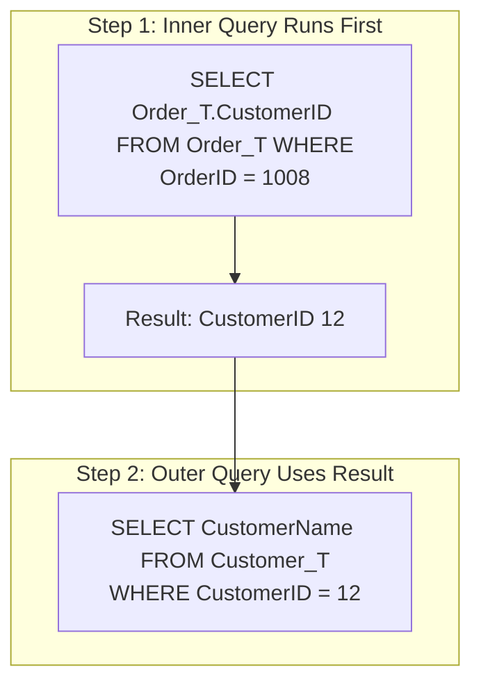

### Example 2: Using `IN` Operator
*Scenario:* Which customers have placed at least one order?
```sql
SELECT CustomerName  
FROM Customer_T  
WHERE CustomerID IN (SELECT DISTINCT CustomerID FROM Order_T);
```
*(`IN` is used when the subquery might return multiple rows).*

### Example 3: Using `NOT IN` and Multiple Tables
*Scenario:* Which customers have **not** placed an order for Computer Desks?
```sql
SELECT CustomerName  
FROM Customer_T  
WHERE CustomerID NOT IN  
      (SELECT CustomerID  
       FROM Order_T, OrderLine_T, Product_T  
       WHERE Order_T.OrderID = OrderLine_T.OrderID  
         AND OrderLine_T.ProductID = Product_T.ProductID  
         AND ProductDescription = 'Computer Desk');
```

**Result for NOT IN query:**
*(Customers who never bought a computer desk).*

| CustomerName |
| :--- |
| Value Furniture |
| Home Furnishings |
| Eastern Furniture |
| Furniture Gallery |
| Period Furniture |
| M & H Casual Furniture |
| Seminole Interiors |
| American Euro Lifestyles |
| Heritage Furnishings |
| Kaneohe Homes |

**Visual Logic (Page 85):**
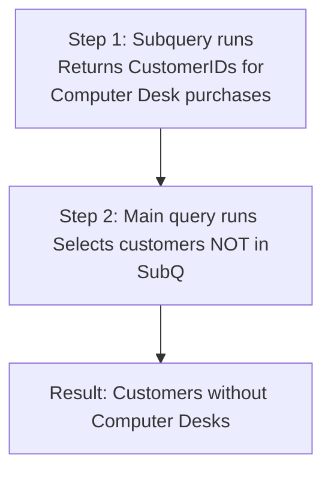

---

## 15. Correlated Subqueries
Correlated subqueries use data from the outer query for every row being evaluated. They make use of the `EXISTS` operator. 
- `EXISTS` returns `TRUE` if the subquery returns any rows.
- `NOT EXISTS` returns `TRUE` if the subquery returns zero rows.

### Example: Natural Ash Furniture
*Scenario:* Find the Order IDs for all orders that have included a product finished in "Natural ash".
```sql
SELECT DISTINCT ORDER_ID  
FROM ORDER_LINE_T  
WHERE EXISTS  
      (SELECT *  
       FROM PRODUCT_T  
       WHERE PRODUCT_ID = ORDER_LINE_T.PRODUCT_ID  
         AND PRODUCT_FINISH = 'Natural Ash');
```

**Execution Step-by-Step (Visual):**
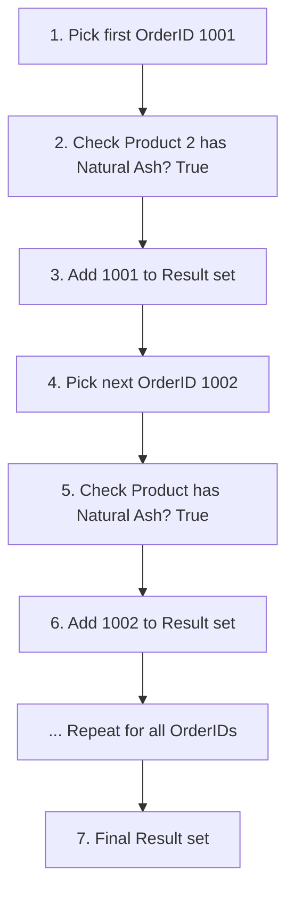

**Result:**
*(7 rows selected).*

| OrderID |
| :--- |
| 1001 |
| 1002 |
| 1003 |
| 1006 |
| 1007 |
| 1008 |
| 1009 |

---

## 16. Subquery in the `FROM` Clause
Subqueries can also be placed in the `FROM` clause to create a **Derived Table** (a temporary table). The outer query then queries this temporary table.

*Scenario:* Show products whose price is higher than the average price of all products.
```sql
SELECT PRODUCT_DESCRIPTION, STANDARD_PRICE, AVGPRICE  
FROM  
     (SELECT AVG(STANDARD_PRICE) AS AVGPRICE  
      FROM PRODUCT_T)  
WHERE STANDARD_PRICE > AVGPRICE;
```
*(Why do we do this? Because aggregate functions like `AVG` cannot be used directly in the `WHERE` clause. By putting the average calculation inside the FROM clause, we can use it for the comparison).*

---

## 17. Study Tips and Summary
**Study Guide:**
- Study **Chapter 7** (Advanced SQL) from *Modern Database Management, 12th Edition*.
- Follow the syntax from these slides, as the syntax in the textbook might be slightly different.
- Look up **Lookup Tables (LUT)** online.

**Final Summary:**
- **Join Purpose:** Combine columns from multiple tables using Primary Key/Foreign Key relationships.
- **Join Types:** Inner, Equi, Natural, Outer (Left, Right, Full), Self.
- **Joins vs Subqueries:** Joins can handle complex data retrieval, subqueries are easier to read for specific logic.
- **Correlated vs Non-correlated:** Non-correlated runs once (inner query first). Correlated runs once per row (inner query depends on outer query).

**Relational Model Recap:**
- Logical database design converts conceptual models into logical models (Tables/Relations).
- A relation is a two-dimensional table of data.
- Relations *cannot* contain multivalued attributes.