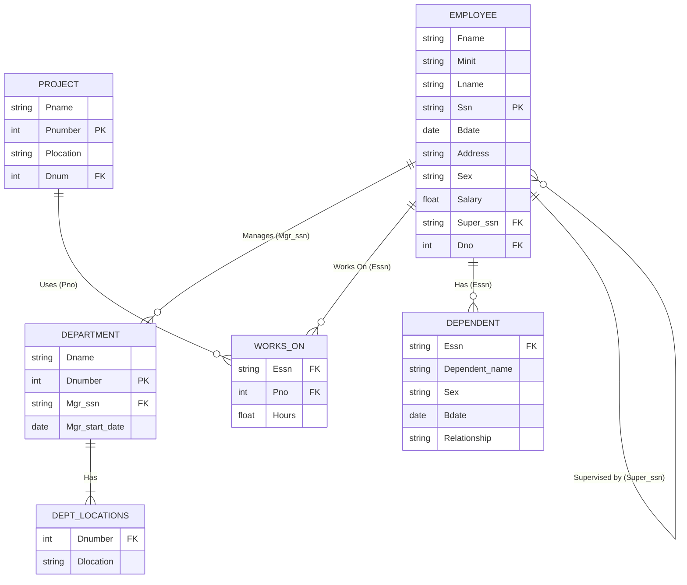

## 1. Introduction to Relational Algebra
Relational Algebra is a foundational mathematical framework for the relational database model. It provides a basic set of operations that allow a user to specify data retrieval requests (queries).

**Key Concept:** The result of every relational algebra operation is a **new relation** (a new table).
*   You can take the result of one operation and use it as input for the next operation.
*   A sequence of these operations forms a **Relational Algebra Expression**.

### Why is Relational Algebra Important?
1. **Foundation of the Relational Model:** It defines the rules for manipulating data.
2. **Query Optimization:** Relational Database Management Systems (RDBMS) use Relational Algebra internally to determine the fastest way to execute a SQL query.
3. **SQL Standard:** Some of its concepts are built directly into the SQL language we use today.

### Groups of Relational Operations
The operations are divided into four main groups:
*   **Unary Operations:** Work on a single relation.
*   **Set Theory Operations:** Standard math set operations applied to relations.
*   **Binary Relational Operations:** Work on two relations to combine them.
*   **Additional Operations:** Extensions for advanced needs (aggregates, outer joins, recursion).

---

## 2. The COMPANY Database Schema (Example Data)
To understand every example in this lecture, we will use the **COMPANY database**. Below is the Entity-Relationship schema of the database followed by the sample data provided in the slides.

**Schema Diagram (Referential Integrity):**


### Sample Data Tables

**EMPLOYEE Table:**
| Fname | Minit | Lname | Ssn | Bdate | Address | Sex | Salary | Super_ssn | Dno |
| :--- | :--- | :--- | :--- | :--- | :--- | :--- | :--- | :--- | :--- |
| John | B | Smith | 123456789 | 1965-01-09 | 731 Fondren, Houston, TX | M | 30000 | 333445555 | 5 |
| Franklin | T | Wong | 333445555 | 1955-12-08 | 638 Voss, Houston, TX | M | 40000 | 888665555 | 5 |
| Alicia | J | Zelaya | 999887777 | 1968-01-19 | 3321 Castle, Spring, TX | F | 25000 | 987654321 | 4 |
| Jennifer | S | Wallace | 987654321 | 1941-06-20 | 291 Berry, Bellaire, TX | F | 43000 | 888665555 | 4 |
| Ramesh | K | Narayan | 666884444 | 1962-09-15 | 975 Fire Oak, Humble, TX | M | 38000 | 333445555 | 5 |
| Joyce | A | English | 453453453 | 1972-07-31 | 5631 Rice, Houston, TX | F | 25000 | 333445555 | 5 |
| Ahmad | V | Jabbar | 987987987 | 1969-03-29 | 980 Dallas, Houston, TX | M | 25000 | 987654321 | 4 |
| James | E | Borg | 888665555 | 1937-11-10 | 450 Stone, Houston, TX | M | 55000 | NULL | 1 |

**DEPARTMENT Table:**
| Dname | Dnumber | Mgr_ssn | Mgr_start_date |
| :--- | :--- | :--- | :--- |
| Research | 5 | 333445555 | 1988-05-22 |
| Administration | 4 | 987654321 | 1995-01-01 |
| Headquarters | 1 | 888665555 | 1981-06-19 |

**DEPT_LOCATIONS Table:**
| Dnumber | Dlocation |
| :--- | :--- |
| 1 | Houston |
| 4 | Stafford |
| 5 | Bellaire |
| 5 | Sugarland |
| 5 | Houston |

**WORKS_ON Table:**
| Essn | Pno | Hours |
| :--- | :--- | :--- |
| 123456789 | 1 | 32.5 |
| 123456789 | 2 | 7.5 |
| 666884444 | 3 | 40.0 |
| 453453453 | 1 | 20.0 |
| 453453453 | 2 | 20.0 |
| 333445555 | 2 | 10.0 |
| 333445555 | 3 | 10.0 |
| 333445555 | 10 | 10.0 |
| 333445555 | 20 | 10.0 |
| 999887777 | 30 | 30.0 |
| 999887777 | 10 | 10.0 |
| 987987987 | 10 | 35.0 |
| 987987987 | 30 | 5.0 |
| 987654321 | 30 | 20.0 |
| 987654321 | 20 | 15.0 |
| 888665555 | 20 | NULL |

**PROJECT Table:**
| Pname | Pnumber | Plocation | Dnum |
| :--- | :--- | :--- | :--- |
| ProductX | 1 | Bellaire | 5 |
| ProductY | 2 | Sugarland | 5 |
| ProductZ | 3 | Houston | 5 |
| Computerization | 10 | Stafford | 4 |
| Reorganization | 20 | Houston | 1 |
| Newbenefits | 30 | Stafford | 4 |

**DEPENDENT Table:**
| Essn | Dependent_name | Sex | Bdate | Relationship |
| :--- | :--- | :--- | :--- | :--- |
| 333445555 | Alice | F | 1986-04-05 | Daughter |
| 333445555 | Theodore | M | 1983-10-25 | Son |
| 333445555 | Joy | F | 1958-05-03 | Spouse |
| 987654321 | Abner | M | 1942-02-28 | Spouse |
| 123456789 | Michael | M | 1988-01-04 | Son |
| 123456789 | Alice | F | 1988-12-30 | Daughter |
| 123456789 | Elizabeth | F | 1967-05-05 | Spouse |

---

## 3. Unary Relational Operations
Unary operations work on *one* single table (relation).

### 3.1 The SELECT Operation ($\sigma$)
*   **Symbol:** $\sigma$ (Sigma).
*   **Purpose:** It acts as a horizontal filter. It selects a subset of *rows* (tuples) from a relation based on a specific condition. Rows that meet the condition are kept; rows that fail are discarded.
*   **General Formula:** $\sigma_{\langle\text{selection condition}\rangle}(R)$

**Examples:**

1. Select employees who work in Department 4:

$$\sigma_{DNO=4}(EMPLOYEE)$$

2. Select employees whose salary is greater than $30,000:

$$\sigma_{SALARY \gt 30000}(EMPLOYEE)$$

3. Select employees in Department 4 **AND** having a salary > 25,000:

$$\sigma_{DNO=4 \;\wedge\; SALARY \gt 25000}(EMPLOYEE)$$

**SQL Equivalent:**
In SQL, the SELECT operation is written in the `WHERE` clause.
```sql
SELECT * FROM EMPLOYEE WHERE Dno = 4 AND Salary > 25000;
```

**Properties of SELECT:**

1.  **Commutative:** You can perform SELECTs in any order.

$$\sigma_{c1}(\sigma_{c2}(R)) = \sigma_{c2}(\sigma_{c1}(R))$$

2.  **Cascade Combination:** A sequence of SELECTs is equivalent to a single SELECT with an `AND` condition.

$$\sigma_{c1}(\sigma_{c2}(R)) = \sigma_{c1 \;\wedge\; c2}(R)$$

3.  **Row Count:** The number of rows in the result will always be **less than or equal to** the number of rows in the original relation $R$.

### 3.2 The PROJECT Operation ($\pi$)
*   **Symbol:** $\pi$ (Pi).
*   **Purpose:** It acts as a vertical filter. It selects a subset of *columns* (attributes) from a relation and discards the rest.
*   **General Formula:** $\pi_{\langle\text{attribute list}\rangle}(R)$

**Example:**
To list only the last name, first name, and salary of all employees:

$$\pi_{LNAME,\; FNAME,\; SALARY}(EMPLOYEE)$$

**Important Rule:** The PROJECT operation automatically **removes duplicate rows**. Because the result of a projection must be a mathematical set, and sets do not allow duplicate elements.

**SQL Equivalent:**
In SQL, the PROJECT operation is written in the `SELECT` clause.
```sql
SELECT DISTINCT Gender, Salary FROM EMPLOYEE;
```

**Properties of PROJECT:**

1.  **Not Commutative:** You cannot swap the order of the attribute lists.
    $\pi_{L1}(\pi_{L2}(R)) = \pi_{L1}(R)$ only if $L2$ contains all attributes in $L1$.

2.  **Tuple Count:** The number of rows in the result is **less than or equal to** the number of rows in $R$ because duplicates are removed.

### Example of Combined SELECT and PROJECT
*Request:* Find the first name, last name, and salary of employees who work in department 5.

**Relational Expression:**

$$\pi_{FNAME,\; LNAME,\; SALARY}(\sigma_{DNO=5}(EMPLOYEE))$$

*(Note: The SELECT runs first, creating an intermediate table of department 5 employees. Then PROJECT keeps only the 3 requested columns.)*

**Result:**
| Fname | Lname | Salary |
| :--- | :--- | :--- |
| John | Smith | 30000 |
| Franklin | Wong | 40000 |
| Ramesh | Narayan | 38000 |
| Joyce | English | 25000 |

### 3.3 The RENAME Operation ($\rho$)
*   **Symbol:** $\rho$ (Rho).
*   **Purpose:** To give a new name to a relation, its columns, or both. This is incredibly useful for self-joins.
*   **General Formula (3 forms):**
    1. $\rho_{S(B1,\; B2,\; \ldots,\; Bn)}(R)$ — Renames relation $R$ to $S$ and renames the columns.
    2. $\rho_{S}(R)$ — Renames the relation name only.
    3. $\rho_{(B1,\; B2,\; \ldots,\; Bn)}(R)$ — Renames the column names only.

**SQL Equivalent:**
```sql
SELECT E.Fname AS First_name, E.Lname AS Last_name
FROM EMPLOYEE E
WHERE E.Dno = 5;
```

---

## 4. Relational Algebra Operations from Set Theory
These are standard mathematical set operations, but they require **Union Compatibility**.

**Union Compatibility Rule:** Two relations $R$ and $S$ are compatible if:
1. They have the exact same number of attributes (columns).
2. The domain (data type) of each column in $R$ matches the corresponding column in $S$.

### 4.1 UNION ($\cup$)
*   **Result:** All tuples that are in $R$, in $S$, or in both. Duplicates are automatically removed.
*   **Example — Find the SSN of employees who work in Dept 5 OR supervise an employee in Dept 5:**

$$DEP5\_EMPS \leftarrow \sigma_{DNO=5}(EMPLOYEE)$$

$$RESULT1 \leftarrow \pi_{SSN}(DEP5\_EMPS)$$

$$RESULT2(SSN) \leftarrow \pi_{SUPERSSN}(DEP5\_EMPS)$$

$$RESULT \leftarrow RESULT1 \cup RESULT2$$

**Diagram of Result:**
| RESULT1 (SSN) | RESULT2 (SSN) | RESULT (SSN) |
| :---: | :---: | :---: |
| 123456789 | 333445555 | 123456789 |
| 333445555 | 888665555 | 333445555 |
| 666884444 | | 666884444 |
| 453453453 | | 453453453 |
| | | 888665555 |

### 4.2 INTERSECTION ($\cap$)
*   **Result:** Only tuples that are in **both** $R$ and $S$.
*   **Example:**

$$RESULT \leftarrow RESULT1 \cap RESULT2$$

This gives SSNs of people who *both* work in department 5 AND supervise someone in department 5.

### 4.3 SET DIFFERENCE ($-$)
*   **Result:** Tuples that are in $R$ but **NOT** in $S$.
*   **Important:** Set difference is **NOT** commutative. $R - S \neq S - R$.

### Visual Example of UNION, INTERSECTION, SET DIFFERENCE

| (a) STUDENT | (a) INSTRUCTOR | (b) UNION | (c) INTERSECTION | (d) STUDENT − INSTRUCTOR | (e) INSTRUCTOR − STUDENT |
| :--- | :--- | :--- | :--- | :--- | :--- |
| Susan, Yao | John, Smith | Susan, Yao | Susan, Yao | Johnny, Kohler | John, Smith |
| Ramesh, Shah | Ricardo, Browne | Ramesh, Shah | Ramesh, Shah | Barbara, Jones | Ricardo, Browne |
| Johnny, Kohler | Susan, Yao | Johnny, Kohler | | Amy, Ford | Francis, Johnson |
| Barbara, Jones | Francis, Johnson | Barbara, Jones | | Jimmy, Wang | |
| Amy, Ford | Ramesh, Shah | Amy, Ford | | Ernest, Gilbert | |
| Jimmy, Wang | | Jimmy, Wang | | | |
| Ernest, Gilbert | | Ernest, Gilbert | | | |
| | | John, Smith | | | |
| | | Ricardo, Browne | | | |
| | | Francis, Johnson | | | |

### 4.4 CARTESIAN PRODUCT ($\times$)
*   **Symbol:** $\times$ (Cross Product).
*   **Purpose:** Combines every tuple from $R$ with every tuple from $S$.
*   **Mathematical Properties:**
    *   If $R$ has $n$ columns and $S$ has $m$ columns, the result has $n + m$ columns.
    *   If $R$ has $nR$ rows and $S$ has $nS$ rows, the result has $nR \times nS$ rows.
*   $R$ and $S$ do **NOT** need to be union-compatible.
*   By itself rarely meaningful — but becomes powerful when followed by SELECT. In fact: **Join = Cartesian Product + Select**.

**Example:**

$$FEMALE\_EMPS \leftarrow \sigma_{Sex='F'}(EMPLOYEE)$$

$$EMPNAMES \leftarrow \pi_{FNAME,\; LNAME,\; SSN}(FEMALE\_EMPS)$$

$$EMP\_DEPENDENTS \leftarrow EMPNAMES \times DEPENDENT$$

$$ACTUAL\_DEPS \leftarrow \sigma_{SSN = ESSN}(EMP\_DEPENDENTS)$$

---

## 5. Binary Relational Operations: JOIN
Because Cartesian Product + SELECT is such a common pattern, Relational Algebra provides a dedicated shortcut: **The JOIN operation ($\bowtie$)**.

### 5.1 The JOIN Operation ($\bowtie$)
*   **General Formula:** $R \bowtie_{\text{join condition}} S$
*   **Purpose:** Combine related tuples from two tables, discarding unrelated ones.
*   **Example (Theta-Join):** Find the manager details for each department.

$$DEPT\_MGR \leftarrow DEPARTMENT \bowtie_{MGRSSN = SSN} EMPLOYEE$$

### 5.2 The EQUIJOIN
*   The most common type of Join — uses only the **equality** (`=`) operator.
*   **Side Effect:** The result includes the two matching columns twice (once from each table), holding identical values.

### 5.3 The NATURAL JOIN ($*$)
*   **Symbol:** $*$
*   **Purpose:** A cleaner EQUIJOIN that is automatic.
*   **Automatic Matching:** Automatically joins on attributes with the **exact same name** in both relations.
*   **Removes Duplicates:** Automatically removes the redundant duplicate column.

**Example 1:**

$$DEPT\_LOCS \leftarrow DEPARTMENT * DEPT\_LOCATIONS$$

*(Both have column `DNUMBER`, so it joins on `DEPARTMENT.DNUMBER = DEPT_LOCATIONS.DNUMBER` and shows `DNUMBER` only once.)*

**Example 2:**

$$PROJ\_DEPT \leftarrow PROJECT * DEPARTMENT$$

**Result of PROJ_DEPT:**
| Pname | Pnumber | Plocation | Dnum | Dname | Mgr_ssn | Mgr_start_date |
| :--- | :--- | :--- | :--- | :--- | :--- | :--- |
| ProductX | 1 | Bellaire | 5 | Research | 333445555 | 1988-05-22 |
| ProductY | 2 | Sugarland | 5 | Research | 333445555 | 1988-05-22 |
| Computerization | 10 | Stafford | 4 | Administration | 987654321 | 1995-01-01 |

---

## 6. The Complete Set of Relational Algebra Operations
The Relational Algebra is mathematically complete. Any complex operation can be expressed using only these **6 fundamental operations**:

1.  **SELECT** ($\sigma$)
2.  **PROJECT** ($\pi$)
3.  **UNION** ($\cup$)
4.  **SET DIFFERENCE** ($-$)
5.  **RENAME** ($\rho$)
6.  **CARTESIAN PRODUCT** ($\times$)

**Proof of Completeness:**

$$R \cap S \;=\; (R \cup S) - ((R - S) \cup (S - R))$$

$$R \bowtie_{\text{condition}} S \;=\; \sigma_{\text{condition}}(R \times S)$$

---

## 7. The DIVISION Operation
*   **Symbol:** $\div$
*   **Purpose:** Used to answer queries like *"Find the employee who works on **ALL** projects."*
*   **How it works:** Given $R(Z) \div S(X)$ where $X \subseteq Z$, the result is a relation $T(Y)$ where $Y = Z - X$.
*   **The Logic:** A tuple $t$ appears in the result only if $t$ appears in $R$ in combination with **every single tuple** in $S$. This is the equivalent of a "FOR ALL" (Universal Quantifier).

---

## 8. Additional Relational Operations

### 8.1 Aggregate Functions and Grouping ($\mathcal{F}$)
Basic Relational Algebra cannot calculate summary statistics. The **Aggregate Function operation** $\mathcal{F}$ solves this.

**Common Aggregates:** `SUM`, `AVERAGE`, `MAXIMUM`, `MINIMUM`, `COUNT`.

**Formula with grouping:**

$${}_{Grouping\;Attribute}\; \mathcal{F}_{Function1,\; Function2}(Relation)$$

**Example 1 — Max salary from EMPLOYEE:**

$$\mathcal{F}_{MAX\;Salary}(EMPLOYEE)$$

**Example 2 — Per department: count employees and average salary:**

$${}_{DNO}\; \mathcal{F}_{COUNT\;SSN,\; AVERAGE\;Salary}(EMPLOYEE)$$

**Result:**
| Dno | Count_ssn | Average_Salary |
| :--- | :--- | :--- |
| 5 | 4 | 33250 |
| 4 | 3 | 31000 |
| 1 | 1 | 55000 |

### 8.2 OUTER JOIN Operations
In a standard Join, rows with no match are dropped. Outer Joins keep them, filling missing values with `NULL`.

1.  **LEFT OUTER JOIN:** Keeps every tuple in $R$. Missing $S$ attributes become `NULL`.
2.  **RIGHT OUTER JOIN:** Keeps every tuple in $S$. Missing $R$ attributes become `NULL`.
3.  **FULL OUTER JOIN:** Keeps every tuple in both $R$ and $S$.

**Example of LEFT OUTER JOIN:**

| Fname | Minit | Lname | Dname |
| :--- | :--- | :--- | :--- |
| John | B | Smith | NULL |
| Franklin | T | Wong | Research |
| Alicia | J | Zelaya | NULL |
| Jennifer | S | Wallace | Administration |
| Ramesh | K | Narayan | NULL |
| James | E | Borg | Headquarters |

*(John Smith has `NULL` for Dname — he has no department, but the Left Outer Join keeps him in the result.)*

### 8.3 OUTER UNION
Normal UNION requires perfectly type-compatible tables. **OUTER UNION** works on **partially compatible** relations:
*   Common columns appear once.
*   Unique columns from both relations are included.
*   Missing values are padded with `NULL`.

**Example:**
`STUDENT(Name, SSN, Department, Advisor)` OUTER UNION `INSTRUCTOR(Name, SSN, Department, Rank)` produces:
`STUDENT_OR_INSTRUCTOR(Name, SSN, Department, Advisor, Rank)`

### 8.4 RECURSIVE CLOSURE
Recursive operations cannot be expressed in basic Relational Algebra. They handle **self-referential relationships** like the Employee-Supervisor relationship.

**Goal:** Find all employees supervised by James Borg at all levels.

**Step 1 — Find Borg's SSN:**

$$BORG\_SSN \leftarrow \pi_{Ssn}(\sigma_{Fname='James' \;\wedge\; Lname='Borg'}(EMPLOYEE))$$

**Step 2 — Build a SUPERVISION table:**

$$SUPERVISION(Ssn1, Ssn2) \leftarrow \pi_{Ssn,\; Super\_ssn}(EMPLOYEE)$$

**Step 3 — Level 1 (direct reports):**

$$RESULT1(Ssn) \leftarrow \pi_{Ssn1}(SUPERVISION \bowtie_{Ssn2 = Ssn} BORG\_SSN)$$

**Step 4 — Level 2 (reports of direct reports):**

$$RESULT2(Ssn) \leftarrow \pi_{Ssn1}(SUPERVISION \bowtie_{Ssn2 = Ssn} RESULT1)$$

**Step 5 — All levels combined:**

$$RESULT \leftarrow RESULT1 \cup RESULT2$$

*(In a real RDBMS this is done with `WITH RECURSIVE` SQL, but in basic Relational Algebra you manually repeat the join for each level.)*

---

## 9. Query Trees
A **Query Tree** (Query Evaluation Tree / Execution Tree) is an internal data structure used by a DBMS to represent a query.

*   **Leaf Nodes:** Represent input relations (tables).
*   **Internal Nodes:** Represent relational algebra operations ($\sigma$, $\pi$, $\bowtie$, etc.).

**Execution Order:**
1. Leaf nodes (raw tables) are loaded.
2. Internal node operations execute when their child operands are ready.
3. The result of each internal node replaces that node.
4. Execution ends when the **root node** produces the final result.

**Standard logical order (Bottom to Top):**
1. **SELECT ($\sigma$)** — Filter rows early to reduce data size.
2. **JOIN ($\bowtie$)** — Combine the filtered tables.
3. **PROJECT ($\pi$)** — At the root, output only the requested columns.

---

## 10. Practice Examples

**Q1 — Retrieve the name and address of all employees who work for the 'Research' department:**

$$RESEARCH\_DEPT \leftarrow \sigma_{DNAME='Research'}(DEPARTMENT)$$

$$RESEARCH\_EMPS \leftarrow RESEARCH\_DEPT \bowtie_{DNUMBER = DNO} EMPLOYEE$$

$$RESULT \leftarrow \pi_{FNAME,\; LNAME,\; ADDRESS}(RESEARCH\_EMPS)$$

**Q2 — Find names of employees who work on ALL projects controlled by department 5:**

$$PROJ\_DEPT5(PNO) \leftarrow \pi_{Pnumber}(\sigma_{Dnum=5}(PROJECT))$$

$$EMP\_PROJ(SSN, PNO) \leftarrow \pi_{Essn,\; Pno}(WORKS\_ON)$$

$$RESULT\_SSN \leftarrow EMP\_PROJ \div PROJ\_DEPT5$$

$$RESULT \leftarrow \pi_{LNAME,\; FNAME}(RESULT\_SSN * EMPLOYEE)$$

**Q3 — List project numbers involving an employee with last name 'Smith' (as worker OR department manager):**

$$SMITH\_EMPS(SSN) \leftarrow \pi_{SSN}(\sigma_{LNAME='Smith'}(EMPLOYEE))$$

$$PROJ\_WORKER(PNO) \leftarrow \pi_{Pno}(SMITH\_EMPS * WORKS\_ON)$$

$$PROJ\_MGR(PNO) \leftarrow \pi_{Pnumber}(SMITH\_EMPS * DEPARTMENT \bowtie_{DNUMBER = Dnum} PROJECT)$$

$$RESULT \leftarrow PROJ\_WORKER \cup PROJ\_MGR$$

**Q6 — Retrieve names of employees who have NO dependents:**

$$ALL\_EMPS \leftarrow \pi_{SSN}(EMPLOYEE)$$

$$EMPS\_WITH\_DEPS(SSN) \leftarrow \pi_{ESSN}(DEPENDENT)$$

$$EMPS\_WITHOUT\_DEPS \leftarrow ALL\_EMPS - EMPS\_WITH\_DEPS$$

$$RESULT \leftarrow \pi_{LNAME,\; FNAME}(EMPS\_WITHOUT\_DEPS * EMPLOYEE)$$

---

## 11. Summary of Chapter 6
*   **Relational Algebra** is a mathematical language for manipulating relations.
*   **Unary Operations:** SELECT ($\sigma$ — filter rows), PROJECT ($\pi$ — filter columns), RENAME ($\rho$ — rename relation/columns).
*   **Set Theory Operations:** UNION ($\cup$), INTERSECTION ($\cap$), SET DIFFERENCE ($-$), CARTESIAN PRODUCT ($\times$). All require Union Compatibility except Cartesian Product.
*   **Binary Relational Operations:** JOIN ($\bowtie$), EQUIJOIN, NATURAL JOIN ($*$) — combine related data from multiple tables.
*   **Other Operations:** DIVISION ($\div$), AGGREGATE FUNCTIONS ($\mathcal{F}$) with GROUPING, OUTER JOINS, OUTER UNION, RECURSIVE CLOSURE.
*   **Completeness:** The 6 fundamental operations (SELECT, PROJECT, UNION, SET DIFFERENCE, RENAME, CARTESIAN PRODUCT) can express all other operations.
*   **Query Trees** are internal diagrams the DBMS optimizer uses to plan the fastest execution path for a query.