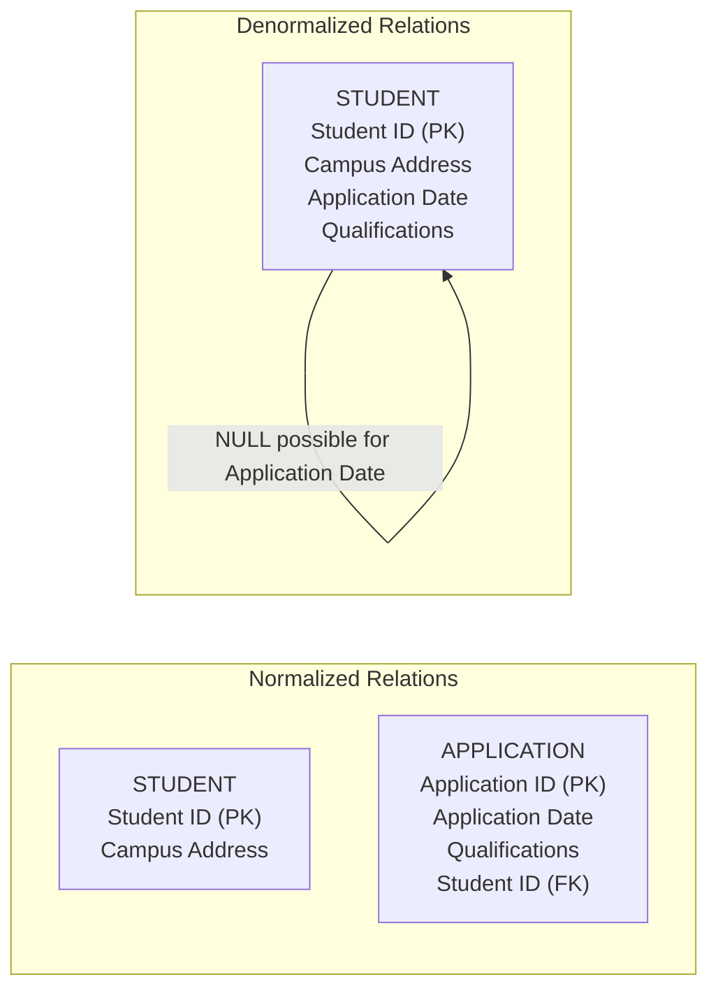
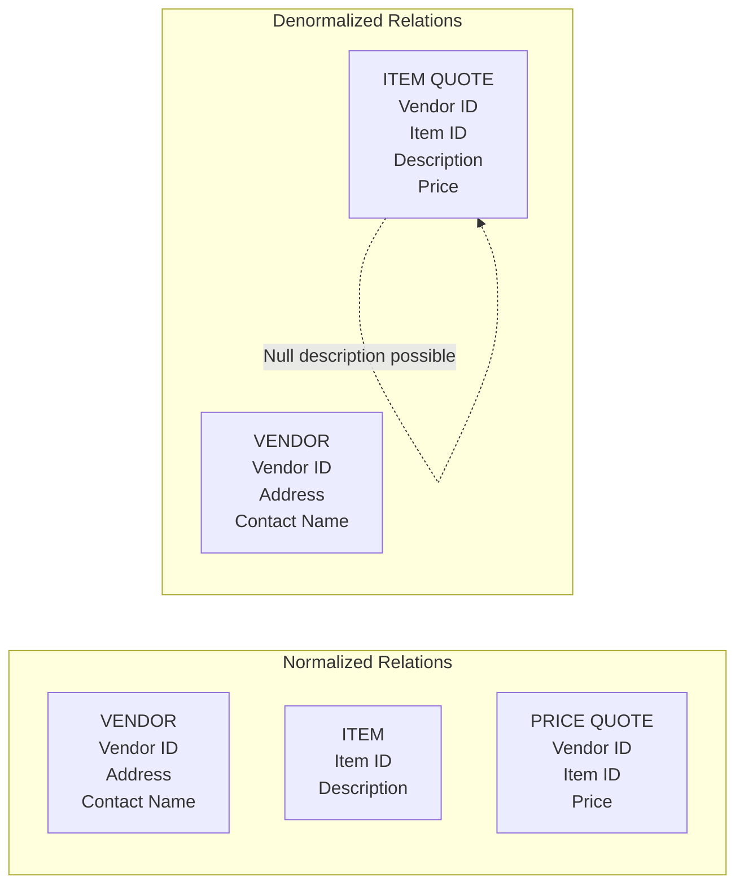
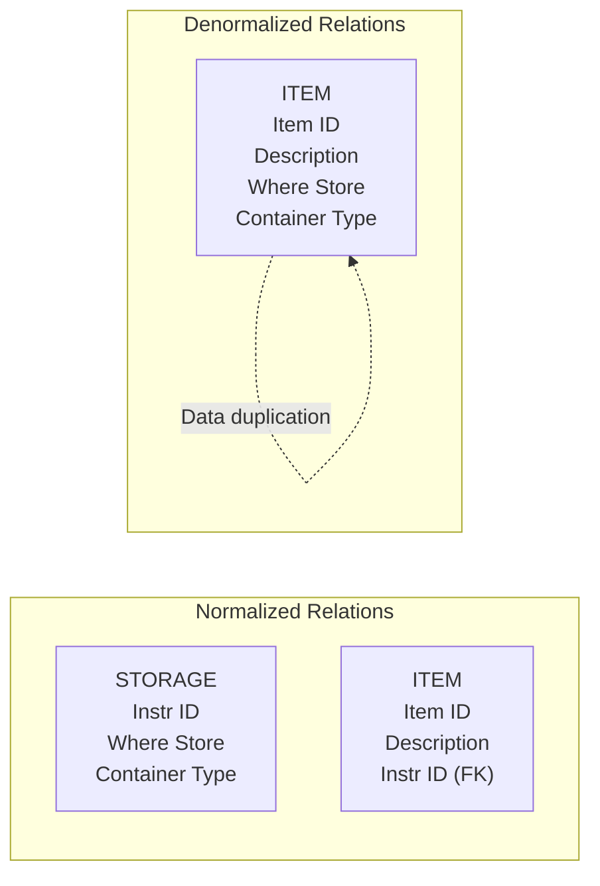
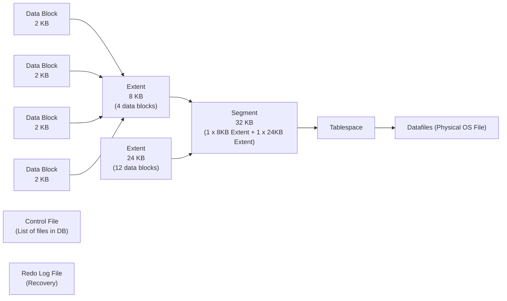
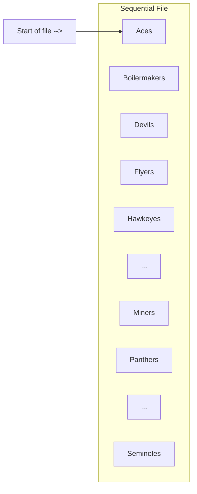
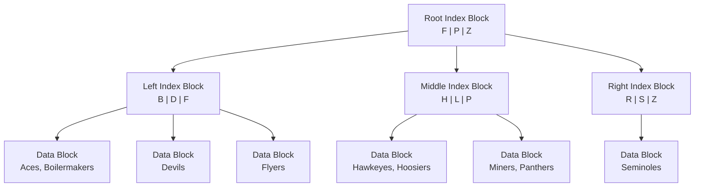
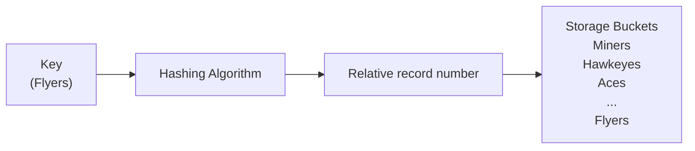

## 1. Introduction & Objectives
Physical database design is the process of translating the **logical description** of a database (the tables and relationships) into the **technical specifications** for storing and retrieving data on physical hardware (disk drives).

**The Main Goal:** To create a design that provides adequate **performance** (fast queries) while ensuring database **integrity**, **security**, and **recoverability**.

### Learning Objectives (from Slide 2)
By the end of this lecture, you will be able to:
*   Define key physical design terms.
*   Describe the physical database design process.
*   Choose correct storage formats for attributes (data types).
*   Select appropriate file organizations (Sequential, Indexed, Hashed).
*   Describe indexes and when to use them.
*   Translate a logical model into efficient physical structures and understand when/why to **denormalize**.

---

## 2. The Physical Database Design Process
*(Reference Slide 5)*

The process takes a set of **Inputs** and leads to a set of **Decisions**. 

```mermaid
flowchart LR
    subgraph Inputs ["Inputs"]
        direction TB
        I1["Normalized relations"]
        I2["Volume estimates"]
        I3["Attribute definitions"]
        I4["Response time expectations"]
        I5["Data security needs"]
        I6["Backup/recovery needs"]
        I7["Integrity expectations"]
        I8["DBMS technology used"]
    end

    Process((Leads to))

    subgraph Decisions ["Decisions"]
        direction TB
        D1["Attribute data types"]
        D2["Physical record descriptions<br>(doesn't always match logical design)"]
        D3["File organizations"]
        D4["Indexes and database architectures"]
        D5["Query optimization"]
    end

    Inputs --> Process --> Decisions
```



---

## 3. Regulatory Compliance
*(Reference Slide 6)*

When designing the physical storage of data, you must often comply with government regulations and industry standards:
*   **SOX (Sarbanes-Oxley Act):** Protects investors by improving the accuracy and reliability of financial corporate disclosures. It directly impacts how financial data must be physically stored and audited.
*   **COSO (Committee of Sponsoring Organizations):** Provides a framework for internal controls to prevent fraud.
*   **ITIL (IT Infrastructure Library):** A set of best practices for IT service management.
*   **COBIT (Control Objectives for Information and Related Technology):** A framework for developing, implementing, monitoring, and improving IT governance.

---

## 4. Field Design and Data Types
*(Reference Slides 7 & 8)*

A **Field** is the smallest unit of application data recognized by the system software (e.g., a `FirstName` column). Physical field design involves choosing a data type, coding/compression, encryption, and integrity controls.

**Table 5-1: Commonly Used Data Types in Oracle 11g**
*(This is the exact table from Slide 8, transcribed for your notes).*

| Data Type | Description |
| :--- | :--- |
| **VARCHAR2** | Variable-length character data with a maximum length of 4,000 characters. You must enter a maximum field length, e.g., `VARCHAR2(30)`. A string shorter than the maximum consumes only the required space. |
| **CHAR** | Fixed-length character data with a maximum length of 2,000 characters. Default length is 1 character. E.g., `CHAR(5)` always reserves 5 characters, regardless of the data stored. |
| **CLOB** | Character Large Object. Capable of storing up to (4 gigabytes - 1) * (database block size) of variable-length character data. Used for medical instructions or long customer comments. |
| **NUMBER** | Positive or negative number in the range 10⁻¹³⁰ to 10¹²⁶. You can specify precision (total digits) and scale (digits to the right of the decimal). E.g., `NUMBER(5)` is up to 5 integer digits; `NUMBER(5,2)` holds up to 5 total digits, with exactly 2 decimal places. |
| **DATE** | Stores any date from January 1, 4712 B.C. to December 31, 9999 A.D., including the century, year, month, day, hour, minute, and second. |
| **BLOB** | Binary Large Object. Capable of storing up to (4 gigabytes - 1) * (database block size) of binary data, such as a photograph, sound clip, or video. |

---

## 5. Using Look-up Tables (Code Look-up)
*(Reference Slide 9)*

Instead of storing long names repeatedly, you can store short codes. This **saves storage space** but requires an **extra lookup** to retrieve the actual name.

**Figure 5-1: Example of a code look-up table (Pine Valley Furniture)**

**Product Table (E.g., PART Table):**
| Product No | Description | Product Finish Code |
| :--- | :--- | :--- |
| B100 | Chair | C |
| B120 | Desk | B |
| M128 | Table | A |
| C100 | Bookcase | B |

**Product Finish Look-up Table:**
| Code | Value |
| :--- | :--- |
| A | Birch |
| B | Maple |
| C | Oak |

*Note: The actual value "Birch" is only stored once in the lookup table. Every item that finishes in Birch points to code `A`.*

---

## 6. Field Data Integrity & Missing Data
*(Reference Slides 10 & 11)*

### Field Data Integrity
You can enforce integrity at the physical field level using several techniques:
*   **Default Value:** An assumed value if no explicit value is provided by the user.
*   **Range Control:** Allowable value limitations defined by constraints or validation rules.
*   **Null Value Control:** Allowing or prohibiting empty fields (e.g., `NOT NULL` constraint).
*   **Referential Integrity:** Ensuring that every foreign key matches a valid existing primary key in its parent table.
*   **SOX:** The Sarbanes-Oxley Act legislates the importance of financial data integrity, making these controls crucial for finance tables.

### Handling Missing Data
When a field is missing a value (NULL), you have three main options:
1.  **Substitute an estimate:** Calculate the missing value using a formula (e.g., using the average of surrounding values).
2.  **Construct a report:** Create a special report that lists all the missing values for human review.
3.  **Ignore the missing data:** In programs, skip over NULL values unless the missing data is statistically significant (requires "sensitivity testing").
*(Note: Database **Triggers** are often used to automatically perform these operations).*

---

## 7. Denormalization
*(Reference Slides 12 - 15)*

**Denormalization** is the process of transforming normalized logical relations into non-normalized physical record specifications. In other words, you intentionally combine tables back together, even though it violates 3NF, to improve speed.

### Benefits vs. Costs
| **Benefits (Pros)** | **Costs (Cons)** |
| :--- | :--- |
| **+ Improves Performance:** Reduces the number of table lookups (fewer JOINS needed to display data). | **- Wasted Storage Space:** Data is duplicated across many rows. |
| | **- Data Integrity Threats:** If you update a duplicated value in one row, you must update it everywhere else or the data becomes inconsistent. |

### Common Denormalization Opportunities

#### Scenario 1: One-to-One Relationship
*(Figure 5-2 in slides)*
**Example:** A `STUDENT` entity has an optional one-to-one relationship with an `APPLICATION` entity. 
*   **Normalized:** Two tables (`STUDENT` and `APPLICATION`). To get a student's application details, the database must perform a JOIN.
*   **Denormalized:** Merge all columns into one `STUDENT` table. `Application Date` and `Qualifications` become columns in the student table. (If a student hasn't applied, these fields are simply NULL). This saves a JOIN operation.



#### Scenario 2: Many-to-Many Relationship with Non-Key Attributes
*(Figure 5-3 in slides)*
**Example:** `VENDOR` and `ITEM` have an M:N relationship, bridged by an associative entity `PRICE QUOTE`.
*   **Normalized:** Three tables. To find the description of an item alongside its price, you must join `ITEM_QUOTE` with `ITEM`.
*   **Denormalized:** Merge the `Description` column from `ITEM` directly into the `ITEM_QUOTE` associative table. You save one join access.



#### Scenario 3: Reference Data
*(Figure 5-4 in slides)*
**Example:** `STORAGE INSTRUCTIONS` reference data dictates where `ITEM`s are stored.
*   **Normalized:** `ITEM` table has a Foreign Key (`Instr ID`) pointing to `STORAGE`.
*   **Denormalized:** Merge the physical storage details (`Where Store`, `Container Type`) directly into the `ITEM` table. Every item duplicates the storage instructions, but you avoid a join to find out where it is kept.



### Denormalize with Caution!
*(Reference Slide 17)*
Before denormalizing, consider that it introduces serious risks:
*   **Increased errors and inconsistencies** (if you forget to update a duplicate column).
*   **Reintroducing anomalies** (Insertion, Update, Deletion anomalies that normalization was designed to remove).
*   **Forcing costly reprogramming** when business rules change.
*   **Alternative Methods:** Before denormalizing, try using **File Organization/Clustering** and **Proper Query Optimization** to improve performance first.

---

## 8. Data Volume and Usage Analysis
*(Reference Slide 16 & 18)*

Before deciding to denormalize, database designers create a **Composite Usage Map** to see how frequently data is accessed. 

**Figure 5-1: Composite Usage Map (Pine Valley Furniture Company)**
*   The solid lines represent the logical relationships between tables.
*   The dashed arrows represent **access frequencies** (how many times an hour this data is read).

| Table | Record Count | Access Frequency |
| :--- | :--- | :--- |
| PART | 3,000 records | 20,000 accesses/hr |
| PURCHASED PART | 2,100 records | 6,000 accesses/hr |
| SUPPLIER | 150 records | 7,500 accesses/hr |
| SUPPLIES | 6,000 records | 4,000 accesses/hr |

*   *The Design Decision:* The map shows that `PURCHASED PART` is accessed 6,000 times an hour via the `PART` table. `SUPPLIES` is accessed 4,000 times an hour via `SUPPLIER`. Because these tables are heavily co-accessed, the physical designer might decide to **denormalize** (combine) `PURCHASED PART` and `SUPPLIES` into a single physical file to store them closer together on the disk, which dramatically speeds up retrieval.

---

## 9. Achieving Optimal Performance through Partitioning
*(Reference Slides 19 - 24)*

If denormalization is too risky, database designers use **Partitioning**. Partitioning splits a single logical table into multiple physical storage pieces, allowing data to be retrieved in parallel (faster).

### A. Horizontal Partitioning (Row Partitioning)
*   **Definition:** Distributing the **rows** of a logical relation into several separate physical tables (or partitions).
*   **Analogy:** Placing business journals in a business library, science books in a science library, etc.
*   **Result:** Each partition has the exact same columns, but only contains a subset of the rows (e.g., `Customer_North`, `Customer_South`).

**Oracle Partitioning Methods (Slide 21/22):**
1.  **Range Partitioning:** Rows are put into partitions based on numeric ranges (e.g., `EMP_ID` 1-200, 201-400, 401-600).
2.  **Hash Partitioning:** A hashing algorithm is used to distribute rows across partitions evenly to balance the data load on disks.
3.  **List Partitioning:** Rows are partitioned based on a specific list of values (e.g., `State` in ('CL', 'FL', 'HI')).

### B. Vertical Partitioning (Column Partitioning)
*   **Definition:** Distributing the **columns** of a logical relation into separate physical tables.
*   **Result:** To reconstruct the full record, you must join them back together based on the Primary Key. The Primary Key is repeated in every partition.
*   **Example:** A wide `PART` logical table is split into:
    *   `ENGINEERED_PART` (Contains `PartID`, Technical specs)
    *   `SALES_PART` (Contains `PartID`, Sales Price, Marketing Data)

### Note on Partitioning
Neither Horizontal nor Vertical partitioning prohibits you from treating the original relation as a single logical whole using SQL Unions or Joins. **User Views** in SQL are actually logical representations of partitions.

---

## 10. Physical File Structures and Oracle Architecture
*(Reference Slides 25 - 29)*

### Key Definitions
*   **Physical File:** A named portion of secondary memory (disk) allocated for storing records.
*   **Tablespace:** A named logical storage unit in which data from multiple tables, views, and objects can be stored.
*   **Data Block:** The smallest unit of storage that Oracle can use (usually 2KB, 4KB, or 8KB).
*   **Extent:** A contiguous section of disk space made up of several contiguous data blocks.
*   **Segment:** A logical grouping of extents that stores a specific database object (like a table, index, or partition).

### Oracle's Logical Database Architecture
*(Derived from the diagram in Slide 27 and Slide 29)*

The diagram below shows how Oracle physically stores data from smallest to largest unit:



*   **Datafiles:** Where the logical structures (tablespaces) are physically stored on the operating system.
*   **Redo Log Files:** Used for database recovery (to redo changes if the server crashes).
*   **Control Files:** A list of files that make up the database (critical for booting up the database).

---

## 11. File Organizations
*(Reference Slides 30 - 33, 37, 49 - 50)*

**File Organization** is the technique used to physically arrange records of a file on secondary storage. There are three main types: **Sequential**, **Indexed**, and **Hashed**.

**Factors for selecting a file organization:**
1. Fast data retrieval and throughput.
2. Efficient storage space utilization.
3. Protection from failure and data loss.
4. Minimizing the need for reorganization.
5. Accommodating growth.
6. Security from unauthorized use.

### A. Sequential File Organization
*(Reference Slide 32 & Figure 5-6a)*
*   **How it works:** Records are stored in sequence by the primary key field values.
*   **Example:** A file containing `Aces, Boilermakers, Devils, Flyers, Hawkeyes...`.
*   **Search:** To find "Flyers", the system must scan from the start of the file.
*   **Performance:** Unsorted average time to find a record = `n/2` (50% of the file scanned).
*   **Drawbacks:** Every insert or delete requires rewriting and resorting the entire file.



### B. Indexed File Organization
*(Reference Slide 33 & Figure 5-6b)*
*   **How it works:** Stores records sequentially or non-sequentially, but creates an **Index** (a separate lookup table) to locate individual records rapidly.
*   **Primary Key Index:** The primary key is automatically indexed by default.
*   **Secondary Key Index:** Other fields or combinations of fields can also be indexed manually.
*   **Search:** Uses a Tree Search. Instead of scanning all records, the database traverses a tree (like a B-Tree) to find the exact storage location. 
*   **Performance:** Average time to find a record = `Depth of the tree` (much faster than scanning!).



### C. Hashed File Organization
*(Reference Slide 49 & Figure 5-6c)*
*   **How it works:** Uses a **Hashing Algorithm** to convert the Primary Key value directly into a record address (bucket number). 
*   **Algorithm example:** Divide the primary key by a suitable prime number, and use the **remainder** as the storage location. 
*   *Example:* If the prime number is 997, and the employee ID is `12396`, `12396 / 997` gives a remainder of `432`. The record is stored directly at location `432`.
*   **Performance:** Fastest for exact match queries (`WHERE ID = 12396`). 
*   **Drawback:** Sequential data processing (e.g., `WHERE ID > 500`) is practically impossible because records are scattered randomly by the math.



### Table 5-2: Comparative Features of File Organizations
*(This is the comprehensive comparison table from Slide 50).*

| Factor | Sequential | Indexed | Hashed |
| :--- | :--- | :--- | :--- |
| **Storage space** | No wasted space | No wasted space for data, but extra space for index | Extra space needed for adding/deleting records after initial load |
| **Sequential retrieval on primary key** | Very fast | Moderately fast | Impractical (unless using a hash index) |
| **Random retrieval on primary key** | Impractical | Moderately fast | Very fast |
| **Multiple-key retrieval** | Possible, but requires scanning whole file | Very fast with multiple indexes | Not possible (unless using a hash index) |
| **Deleting records** | Can create wasted space | Easy, but requires index maintenance | Very easy |
| **Adding new records** | Requires rewriting a file | Easy, but requires index maintenance | Very easy, but multiple keys with the same address require extra work |
| **Updating records** | Usually requires rewriting a file | Easy, but requires index maintenance | Very easy |

---

## 12. Using and Selecting Keys (Indexes)
*(Reference Slides 39 - 41)*

### Creating Indexes in Oracle
*   **Unique Key Index (Primary Key):** Automatically created by Oracle on Primary Keys. You can explicitly create it using:
    ```sql
    CREATE UNIQUE INDEX CustIndex_PK ON Customer_T(CustomerID);
    ```
*   **Composite Key Index:** An index on multiple columns (Foreign Keys):
    ```sql
    CREATE UNIQUE INDEX LineIndex_PK ON OrderLine_T(OrderID, ProductID);
    ```
*   **Secondary Key Index:** An index on a non-unique field frequently searched (like `Description`):
    ```sql
    CREATE INDEX DescIndex_FK ON Product_T(Description);
    ```

### Guidelines for Creating Indexes (Rules of Thumb)
*(From Slide 40 & 41)*
1.  **Use on larger tables:** Indexes are most useful on tables with thousands of rows. Do not index very small tables (fewer than 30 records).
2.  **Index the Primary Key:** Always indexed automatically.
3.  **Index search fields:** Index any field frequently used in the `WHERE` clause.
4.  **Index ORDER BY and GROUP BY:** Columns used in these SQL clauses benefit greatly from indexes.
5.  **Value Count:** Index a field if it has **>100 distinct values** (e.g., `State` has 50). Do not index fields with less than 30 distinct values (e.g., `Gender` has only 2, an index won't help).
6.  **Avoid long fields:** Do not index fields with long character strings. Instead, compress or hash the values first.
7.  **Use Surrogate Keys:** If a key is used to determine location, use a generic sequence number (surrogate key) to allow an even spread of data across storage areas.
8.  **DBMS Limits:** Be aware that your specific DBMS will have a hard limit on the number of indexes allowed per table and the maximum byte size for an indexed field.
9.  **Watch out for NULLs:** Many DBMSs do not recognize NULL values in index searches. If you use an index on a column that allows NULLs, some search queries might unexpectedly skip those rows.

---

## 13. Transaction Processing
*(Reference Slides 67 - 73)*

### What is a Transaction?
A **Transaction** is a sequence of one or more SQL operations (INSERT, UPDATE, DELETE) that must be treated as a single, indivisible logical unit of work. If any single operation in the transaction fails, the entire transaction must be rolled back (undone) so the database is not left in a half-finished, inconsistent state.

### Why are Transactions Important?
SQL operations typically work on only one table at a time. However, a business process often requires updating multiple tables. 
**Example:** An `Order` requires:
1.  Inserting a row in the `Order_T` table.
2.  Inserting a row in the `OrderLine_T` table for every product in the order.
If the second step fails (e.g., an invalid Product ID), the first step must be undone, or you will have an "Order" with no "Order Lines," which destroys database integrity.

### Transaction Control in Oracle
*(Slide 70)*
Unlike SQL Server, Oracle **does not** have a `BEGIN TRANSACTION` command. 
*   A transaction begins **implicitly** the moment the database executes your first executable SQL statement (`INSERT`, `UPDATE`, `DELETE`, or `SELECT FOR UPDATE`).
*   It continues until you explicitly end it using:
    *   `COMMIT;` → Saves all changes permanently to the disk.
    *   `ROLLBACK;` → Undoes all changes made since the transaction began.

### Transaction Control Commands
*(Slide 71)*
Oracle provides the following commands:
*   `COMMIT;` - Saves all changes since the last commit or rollback.
*   `ROLLBACK;` - Undoes all changes since the last commit or rollback.
*   `SAVEPOINT name;` - Sets a temporary internal marker within the transaction. If something goes wrong later, you can roll back only to this specific point without undoing earlier parts.
*   `ROLLBACK TO name;` - Rolls back the transaction to the previously defined savepoint.

### SQL Example: A Full Transaction (From Slide 73)
The slide provides a PL/SQL block demonstrating a transaction where an order is inserted, but the second insert fails due to an invalid Product ID, triggering a full rollback.

```sql
BEGIN
    -- Step 1: Insert a new Order
    INSERT INTO Order_T (OrderID, OrderDate, CustomerID) 
    VALUES (101, TO_DATE('2025-05-11', 'YYYY-MM-DD'), 1001);

    -- Step 2: Insert valid product lines
    INSERT INTO OrderLine_T (OrderID, ProductID, OrderedQuantity) VALUES (101, 201, 2);
    INSERT INTO OrderLine_T (OrderID, ProductID, OrderedQuantity) VALUES (101, 202, 1);

    -- Step 3: Attempt to insert a product with an invalid Product ID (9999 does not exist)
    -- This causes a Foreign Key constraint violation error.
    INSERT INTO OrderLine_T (OrderID, ProductID, OrderedQuantity) VALUES (101, 9999, 5);

    -- If all Insert statements work, we explicitly Commit the work
    COMMIT;
    DBMS_OUTPUT.PUT_LINE('Transaction Committed Successfully');

EXCEPTION
    WHEN OTHERS THEN
        -- If any error occurred, ROLLBACK all changes made in the transaction
        ROLLBACK;
        DBMS_OUTPUT.PUT_LINE('Transaction aborted due to: ' || SQLERRM);
END;
/
```

**Execution Flow of the Example:**
1.  The transaction begins.
2.  The `Order` and first two `OrderLine` inserts are temporarily held in memory.
3.  The third insert hits a Foreign Key error.
4.  The `EXCEPTION` block catches the error and executes `ROLLBACK;`.
5.  The database undoes the order insertion and the first two line insertions.
6.  The database state is exactly as it was before the transaction began, preserving integrity.