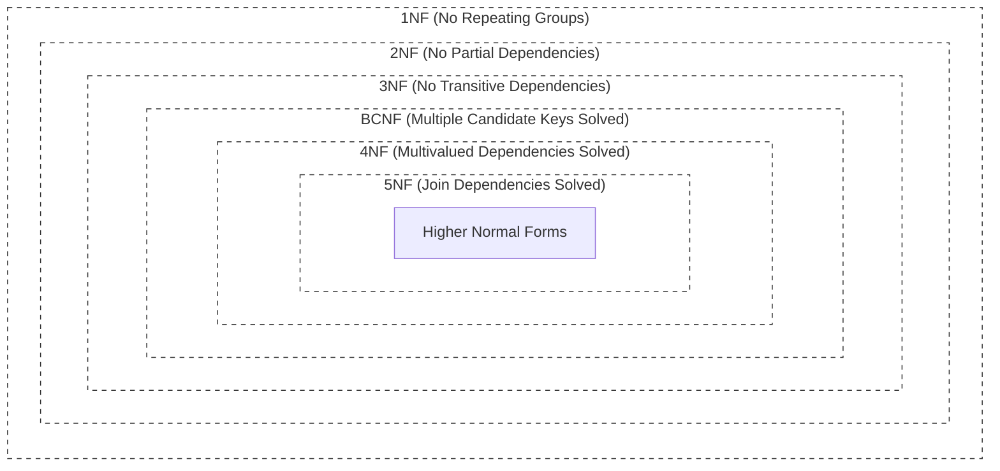
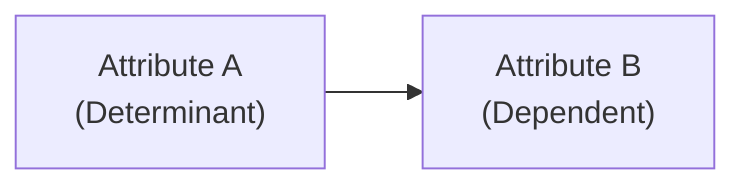
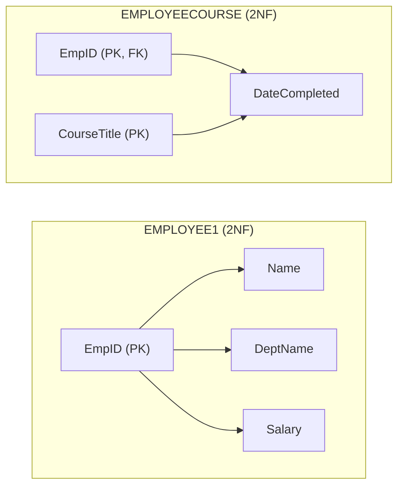
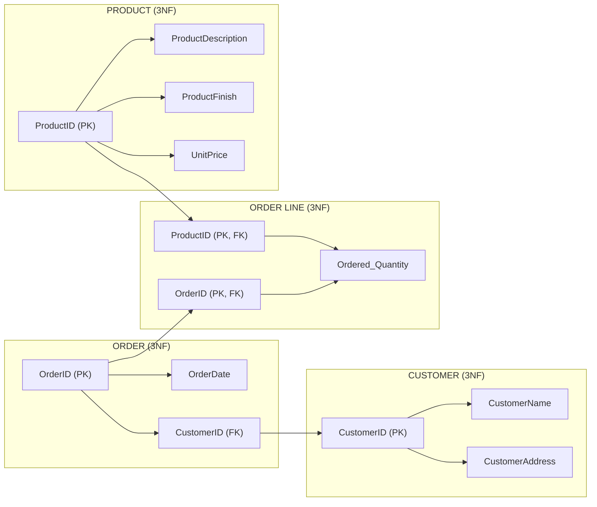
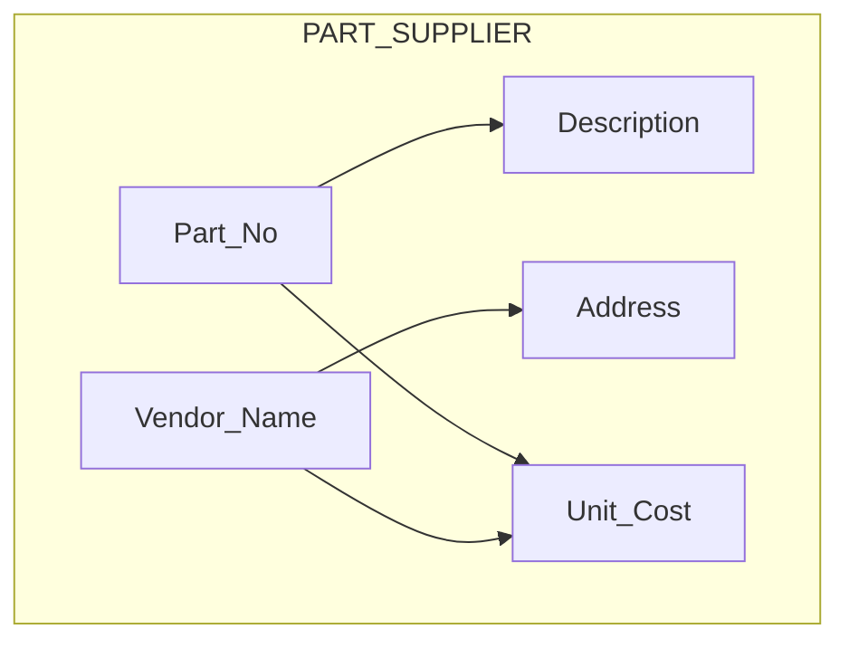
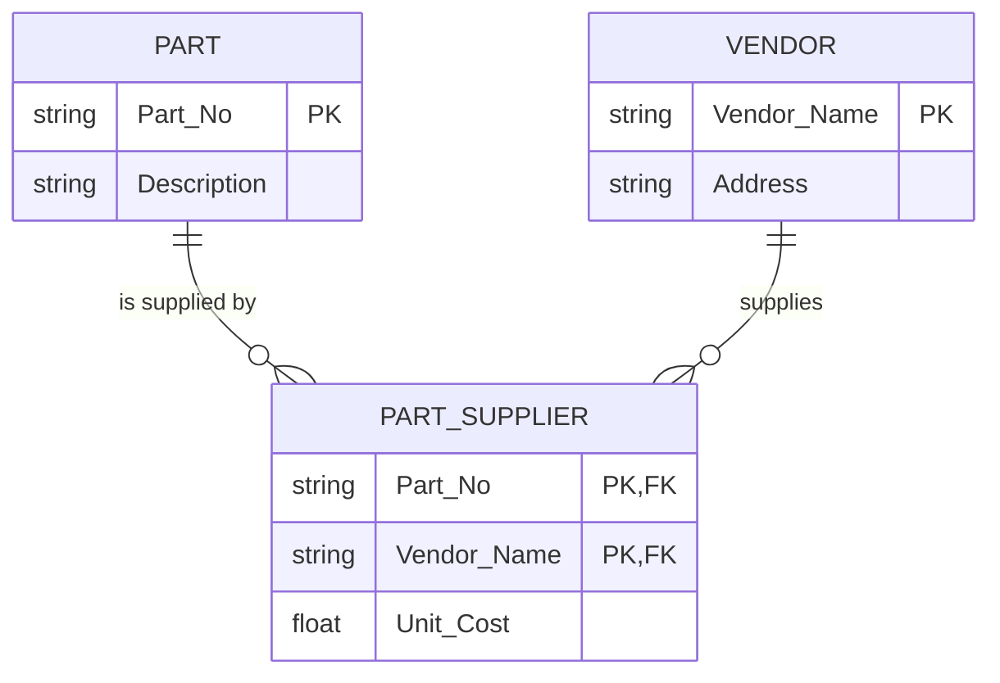
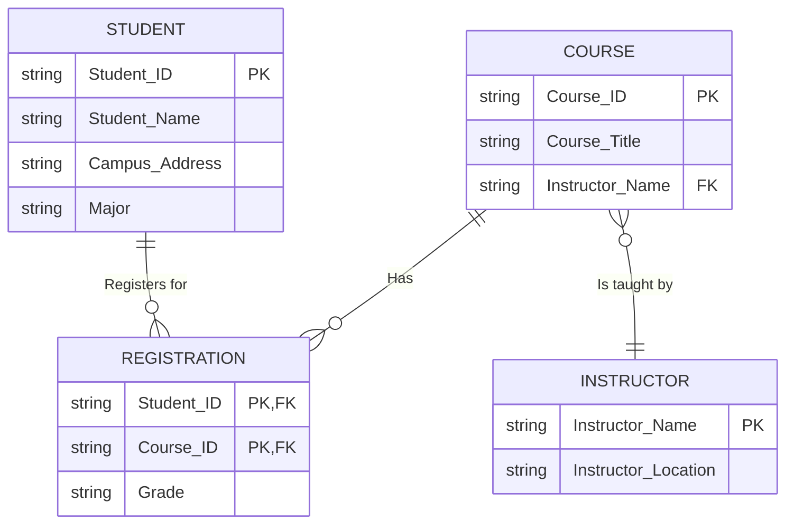
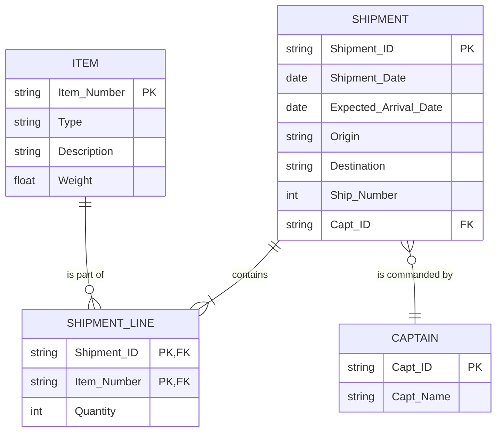
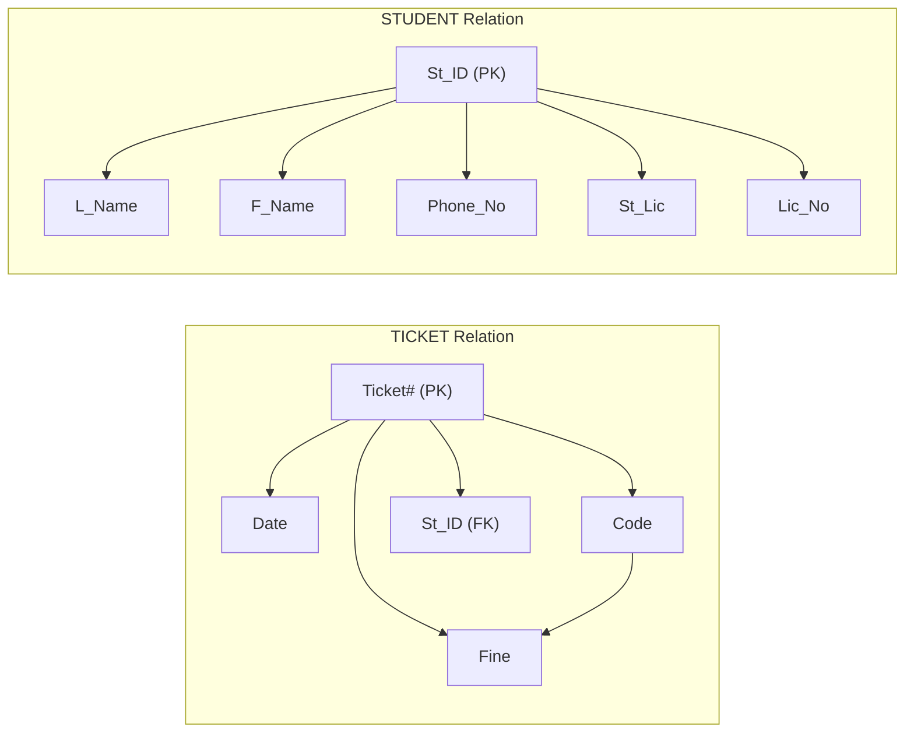
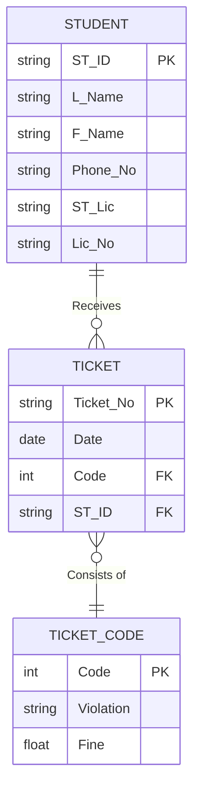

## 1. Introduction to Normalization
**Normalization** is a formal process used to decide which attributes should be grouped together in a database table (relation) so that all data anomalies (errors) are removed.

*   **Where to apply it?** You can apply normalization in two stages:
    1. During **Logical Database Design**: Use it as a quality check for tables obtained from your EER diagrams.
    2. When **Reverse-Engineering**: Older legacy systems often have redundant tables and data anomalies; normalization fixes this.

**Main Goals of Normalization:**
*   Minimize data redundancy, saving storage space and avoiding anomalies.
*   Simplify the enforcement of referential integrity constraints (ensuring foreign keys correctly point to primary keys).
*   Make it easier to insert, update, and delete data without breaking the database.
*   Provide a better, stronger foundation for future database growth.

**Key Rule:** Normalization relies on **Functional Dependencies** and **Normal Forms**, which are based on business rules and relationships, not on how the user interface displays the data.

---

## 2. The Six Normal Forms (Overview)
The lecture introduces normal forms. For the purpose of this lecture, we focus strictly on **1NF, 2NF, and 3NF**.

*   **1NF (First Normal Form):** Any multivalued attributes (repeating groups) must be removed. The intersection of every row and column must contain a single value.
*   **2NF (Second Normal Form):** Any partial functional dependencies must be removed (every non-key attribute must depend on the *whole* primary key).
*   **3NF (Third Normal Form):** Any transitive dependencies must be removed (non-key attributes must depend *only* on the primary key).
*   **BCNF (Boyce-Codd Normal Form):** Removes anomalies resulting from multiple candidate keys.
*   **4NF (Fourth Normal Form):** Removes multivalued dependencies.
*   **5NF (Fifth Normal Form):** Removes remaining join dependencies.

**Relationship between Normal Forms (Visual Diagram):**
*(This diagram represents the concentric layers of normalization: 1NF is the largest group, 5NF is the smallest).*

---

## 3. The 4-Step Normalization Process
The lecture divides the process into four steps:
*   **Step 0:** Represent the user view in a tabular form.
*   **Step 1:** Convert to First Normal Form (1NF).
*   **Step 2:** Convert to Second Normal Form (2NF).
*   **Step 3:** Convert to Third Normal Form (3NF).
*   *(Step 4: Further Normalization to 4NF, 5NF, etc., if needed).*

### Step 0: The Starting View
Here is a raw invoice view from Pine Valley Furniture Company. This is **not** a valid database relation yet because it contains repeating groups.

**PVFC Customer Invoice View (Step 0):**
*(Figure 04 in slides)*
*   **Customer ID:** 2
*   **Customer Name:** Value Furniture
*   **Address:** 15145 S.W. 17th St., Plano TX 75022
*   **Order ID:** 1006
*   **Order Date:** 10/24/2010
*   **Products:**
    1.  Product ID 7, Dining Table, Natural Ash, 2 units, $800.00 each ($1,600.00 total)
    2.  Product ID 5, Writer’s Desk, Cherry, 2 units, $325.00 each ($650.00 total)
    3.  Product ID 4, Entertainment Center, Natural Maple, 1 unit, $650.00 each ($650.00 total)
*   **Total:** $2,900.00

**Initial Raw Table Data (Figure 05):**
*(Note: The Product Description, Finish, and Price columns contain multiple values per single Order ID, which violates 1NF).*

| Order ID | Order Date | Customer ID | Customer Name | Customer Address | Product ID | Product Description | Product Finish | Unit Price | Ordered Quantity |
| :--- | :--- | :--- | :--- | :--- | :--- | :--- | :--- | :--- | :--- |
| 1006 | 10/24/2004 | 2 | Value Furniture | Plano, TX | 7, 5, 4 | Dining Table, Writer's Desk, Ent. Center | Natural Ash, Cherry, Natural Maple | 800.00, 325.00, 650.00 | 2, 2, 1 |
| 1007 | 10/25/2004 | 6 | Furniture Gallery | Boulder, CO | 1, 4 | 4-Dr Dresser, Ent. Center | Oak, Natural Maple | 500.00, 650.00 | 4, 3 |

---

### Step 1: Convert to First Normal Form (1NF)
**Rule:** A table must have a **single value** at the intersection of every row and column. There can be no "repeating groups."

To fix the raw table, we flatten it by putting the repeating product data into separate rows. We will also identify a **Composite Primary Key** (Order ID + Product ID) to uniquely identify every row.

**Table in 1NF (Figure 5-26 INVOICE relation):**
*(Each row now represents a single order line).*

| Order ID | Order Date | Customer ID | Customer Name | Customer Address | Product ID | Product Description | Product Finish | Unit Price | Ordered Quantity |
| :--- | :--- | :--- | :--- | :--- | :--- | :--- | :--- | :--- | :--- |
| 1006 | 10/24/2004 | 2 | Value Furniture | Plano, TX | 7 | Dining Table | Natural Ash | 800.00 | 2 |
| 1006 | 10/24/2004 | 2 | Value Furniture | Plano, TX | 5 | Writer's Desk | Cherry | 325.00 | 2 |
| 1006 | 10/24/2004 | 2 | Value Furniture | Plano, TX | 4 | Entertainment Center | Natural Maple | 650.00 | 1 |
| 1007 | 10/25/2004 | 6 | Furniture Gallery | Boulder, CO | 1 | 4-Dr Dresser | Oak | 500.00 | 4 |
| 1007 | 10/25/2004 | 6 | Furniture Gallery | Boulder, CO | 4 | Entertainment Center | Natural Maple | 650.00 | 3 |

*Note:* This table is in 1NF, but it is **not** well-structured yet. It still suffers from anomalies.

---

## 4. Functional Dependencies and Keys
To move beyond 1NF, we must understand **Functional Dependencies (FDs)**.

### What is a Functional Dependency?
For any relation R, Attribute **B** is functionally dependent on Attribute **A** if, for every single valid instance of A, that value of A uniquely determines the value of B.
*   **Notation:** A → B (A determines B).
*   **Example:** `Social Security Number → Name` (Every unique SSN points to exactly one Name).
*   **Visual Representation:** *Left side = Determinant*, *Right side = Dependent*.

**Lecture Example (Staff vs Position):**
*   `staffNo → position` is true. (If you know the Staff ID, you know their position).
*   `position → staffNo` is **false**. (Knowing the position "Manager" does not uniquely identify a single staff member, because there could be multiple managers).
*   *(These examples correspond to Figures 8a and 8b in the slides).*

### Identifying Functional Dependencies using Sample Data (Example I - Figure 9)
Let's look at a sample relation with attributes A, B, C, D, E.

| A | B | C | D | E |
| :---: | :---: | :---: | :---: | :---: |
| a | b | z | w | q |
| e | b | r | w | p |
| a | d | z | w | t |
| e | d | r | w | q |
| a | f | z | s | t |
| e | f | r | s | t |

**Identifying the Functional Dependencies:**
1.  **A → C (fd1) & C → A (fd2):** Whenever 'a' appears in column A, 'z' appears in column C, and vice versa. This is a 1:1 relationship. Therefore, A determines C, and C determines A.
2.  **B → D (fd3):** Whenever 'b' or 'd' appears in B, 'w' appears in D. Whenever 'f' appears in B, 's' appears in D. Therefore, B determines D. *(Notice D → B is false, because 'w' maps to both 'b' and 'd')*.
3.  **AB → E (fd4):** The combination of A and B (e.g., `(a,b)`) uniquely determines a specific value for E (e.g., `q`). Therefore, AB determines E.

*(Attribute E does not determine A, B, C, or D).*

---

## 5. Anomalies and 2NF, 3NF

### Data Anomalies in 1NF
The 1NF INVOICE table (Figure 5-26) suffers from 3 types of data anomalies:
1.  **Insertion Anomaly:** If a new product is ordered for an existing customer, all customer data (Name, Address) must be re-entered, causing duplication.
2.  **Deletion Anomaly:** If we delete the row for the Dining Table from Order 1006, we lose the specific information regarding that item's finish and price entirely.
3.  **Update Anomaly:** If the price of product ID 4 changes, we have to update the Unit Price in *every row* where product ID 4 appears (multiple records).

**Why do these anomalies exist?**
Because multiple entity types (`Customer`, `Order`, `Product`) have been stuffed into one single relation. This creates unnecessary dependencies between the entities.

### Step 2: Second Normal Form (2NF)
**Rule:** In 2NF, the table must be in 1NF, **AND** there must be **no partial functional dependencies**. 
*(Meaning: No non-key attribute can be dependent on only *part* of the composite primary key. Every non-key attribute must be fully functionally dependent on the entire primary key).*

**Example: Normalizing EMPLOYEE2 to 2NF (Figure 4-23)**
The EMPLOYEE2 table below is in 1NF, but its primary key is `(EmpID, CourseTitle)`.

**EMPLOYEE2 (Before 2NF):**

| EmpID | Name | DeptName | Salary | CourseTitle | DateCompleted |
| :--- | :--- | :--- | :--- | :--- | :--- |
| 100 | Margaret Simpson | Marketing | 48,000 | SPSS | 6/19/201X |
| 100 | Margaret Simpson | Marketing | 48,000 | Surveys | 10/7/201X |
| 110 | Chris Lucero | Info Systems | 43,000 | Visual Basic | 1/12/201X |

**Identifying the Partial Dependencies:**
*   `Name`, `DeptName`, and `Salary` depend **only on EmpID**, not on `CourseTitle`. This is a **Partial Dependency**.
*   `DateCompleted` depends on the **whole** key `(EmpID, CourseTitle)`. This is a **Full Dependency**.

**EMPLOYEE2 in 2NF (Split into two tables):**
To put this in 2NF, we split the relation into two:
1.  `EMPLOYEE1 (EmpID, Name, DeptName, Salary)`
2.  `EMPLOYEECOURSE (EmpID, CourseTitle, DateCompleted)`

---

### Step 3: Third Normal Form (3NF)
**Rule:** In 3NF, the table must be in 2NF, **AND** it must have **no transitive dependencies**. 
*(Meaning: A non-key attribute must not be dependent on the primary key via another non-key attribute).*

**What is a Transitive Dependency?**
If `A → B` and `B → C`, then `A → C` is a transitive dependency. We want to remove the step `B → C`.
*   *Example:* `OrderID → CustomerID` AND `CustomerID → CustomerAddress`. Therefore, `OrderID → CustomerAddress` is transitive. It creates redundant data.

**Example: Normalizing INVOICE to 3NF (Figure 5-27)**
The 1NF Invoice table is shown with its dependencies:
*   Primary Key = `(Order_ID, Product_ID)`
*   `Order_ID` determines `Order_Date`, `Customer_ID`, `Customer_Name`, `Customer_Address`.
*   `Customer_ID` determines `Customer_Name`, `Customer_Address` (This is the Transitive Dependency!).
*   `Product_ID` determines `Product_Description`, `Product_Finish`, `Unit_Price`.
*   `(Order_ID, Product_ID)` determines `Ordered_Quantity`.

**INVOICE in 3NF (Split into three tables):**
To remove transitive dependencies, we separate `Customer` information into its own table and `Product` information into its own table. We are left with 3 tables:

1.  `ORDER (OrderID, OrderDate, CustomerID)` → PK: `OrderID`
2.  `CUSTOMER (CustomerID, CustomerName, CustomerAddress)` → PK: `CustomerID`
3.  `ORDER_LINE (OrderID, ProductID, Ordered_Quantity)` → PK: `(OrderID, ProductID)`
4.  `PRODUCT (ProductID, ProductDescription, ProductFinish, UnitPrice)` → PK: `ProductID`

---

# Section 6: Solved Activities & Exercises
We now apply the normalization rules to four detailed activities provided in the lecture slides.

---

## ACTIVITY I: PART SUPPLIER (Page 58-66)
**Scenario:** We have a table `PART_SUPPLIER` showing parts and the vendors who supply them. 

**Sample Data (Table 4-3):**
| Part No | Description | Vendor Name | Address | Unit Cost |
| :--- | :--- | :--- | :--- | :--- |
| 1234 | Logic chip | Fast Chips Smart Chips | Cupertino Phoenix | 10.00 8.00 |
| 5678 | Memory chip | Fast Chips Quality Chips Smart Chips | Cupertino Austin Phoenix | 3.00 2.00 5.00 |

**Activity I Solutions:**

**Part a: Convert to 1NF relation**
*(Fill in empty cells to remove the multivalued attributes).*

| Part No | Description | Vendor Name | Address | Unit Cost |
| :--- | :--- | :--- | :--- | :--- |
| 1234 | Logic Chip | Fast Chips | Cupertino | 10.00 |
| 1234 | Logic Chip | Smart Chips | Phoenix | 8.00 |
| 5678 | Memory Chip | Fast Chips | Cupertino | 3.00 |
| 5678 | Memory Chip | Quality Chips | Austin | 2.00 |
| 5678 | Memory Chip | Smart Chips | Phoenix | 5.00 |

**Part b: List Functional Dependencies and Candidate Key**
*   `Part No → Description`
*   `Vendor Name → Address`
*   `(Part No, Vendor Name) → Unit Cost`
*   **Candidate Key:** `(Part No, Vendor Name)`

**Part c: Identify the Data Anomalies**
*   **Insertion Anomaly:** To insert a new part, you must have both `Part No` and `Vendor Name`.
*   **Delete Anomaly:** If we delete the only row for a specific vendor, we lose their address entirely from the database.
*   **Update Anomaly:** If a vendor moves to a new city, we must update the `Address` in *every single row* where that vendor appears (duplicate data).

**Part d: Draw a Relational Schema showing FDs**

**Part e: What Normal Form is this relation in?**
*   **1NF.** It is in 1NF because it has no repeating groups.
*   It is **NOT in 2NF** because `Description` depends only on `Part No` (partial dependency), and `Address` depends only on `Vendor Name` (partial dependency).

**Part f: Develop a set of 3NF relations**
We must split the table into three parts to remove partial dependencies.
*   `PART (Part_No, Description)` → PK: `Part_No`
*   `VENDOR (Vendor_Name, Address)` → PK: `Vendor_Name`
*   `PART_SUPPLIER (Part_No, Vendor_Name, Unit_Cost)` → PK: `(Part_No, Vendor_Name)`, FK: `Part_No`, FK: `Vendor_Name`

**Part g: Draw an E-R Diagram for the 3NF relations**

---

## ACTIVITY II: GRADE REPORT (Page 67-73)
**Scenario:** A university grade report showing students, courses, instructors, and grades.

**Sample Data (Table 4-4):**
| Student ID | Student Name | Campus Address | Major | Course ID | Course Title | Instructor Name | Instructor Location | Grade |
| :--- | :--- | :--- | :--- | :--- | :--- | :--- | :--- | :--- |
| 168300458 | Williams | 208 Brooks | IS | IS 350 | Database Mgt | Codd | B 104 | A |
| 168300458 | Williams | 208 Brooks | IS | IS 465 | Systems Analysis | Parsons | B 317 | B |
| 543291073 | Baker | 104 Phillips | Acctg | IS 350 | Database Mgt | Codd | B 104 | C |
| 543291073 | Baker | 104 Phillips | Acctg | Acct 201 | Fund Acctg | Miller | H 310 | B |
| 543291073 | Baker | 104 Phillips | Acctg | Mktg 300 | Intro Mktg | Bennett | B 212 | A |

**Activity II Solutions:**

**Part a: Draw a relational schema and diagram the FDs**
*(Based on the data, the primary key is `(Student_ID, Course_ID)`)*
*   FD1: `Student_ID → Student_Name, Campus_Address, Major`
*   FD2: `Course_ID → Course_Title, Instructor_Name`
*   FD3: `Instructor_Name → Instructor_Location` (Transitive dependency via Course_ID)
*   FD4: `(Student_ID, Course_ID) → Grade`

**Part b: In what normal form is this relation?**
*   **1NF.** It is in 1NF, but has partial and transitive dependencies.

**Part c: Decompose GRADE REPORT into a set of 3NF relations**
We split it into 4 tables to remove dependencies:
1.  `STUDENT (Student_ID, Student_Name, Campus_Address, Major)` → PK: `Student_ID`
2.  `COURSE (Course_ID, Course_Title, Instructor_Name)` → PK: `Course_ID`, FK: `Instructor_Name`
3.  `INSTRUCTOR (Instructor_Name, Instructor_Location)` → PK: `Instructor_Name`
4.  `REGISTRATION (Student_ID, Course_ID, Grade)` → PK: `(Student_ID, Course_ID)`, FK: `Student_ID`, FK: `Course_ID`

**Part d/e: Draw a relational schema with referential integrity constraints**

---

## ACTIVITY III: SHIPPING MANIFEST (Page 74-79)
**Scenario:** A shipping manifest showing shipments, captains, and items on board.

**Sample Data (Table 4-5):**
*(Summarized). Shipment ID 00-0001, Date 01/10/2015, Origin Boston, Destination Brazil, Ship Number 39, Captain Henry Moore (ID 002-15).*
*   Item 3223: Concrete Form, Weight 500, Quantity 100, Total Weight 50,000.
*   Item 3297: Steel Beam, Weight 872, Quantity 200, Total Weight 174,000.
*(Note: The slides specifically state total weight is a derived attribute, so we exclude it from FDs).*

**Activity III Solutions:**

**Part a: Draw relational schema and FDs**
*   `Shipment_ID → Shipment_Date, Expected_Arrival_Date, Origin, Destination, Ship_Number, Captain_ID`
*   `Captain_ID → Captain_Name` (Transitive dependency)
*   `Item_Number → Type, Description, Weight`
*   `(Shipment_ID, Item_Number) → Quantity` (Full dependency)

**Part b: In what normal form is this relation?**
*   **1NF.**

**Part c: Decompose MANIFEST into a set of 3NF relations**
1.  `SHIPMENT (Shipment_ID, Shipment_Date, Expected_Arrival_Date, Origin, Destination, Ship_Number, Capt_ID)` → PK: `Shipment_ID`, FK: `Capt_ID`
2.  `CAPTAIN (Capt_ID, Capt_Name)` → PK: `Capt_ID`
3.  `ITEM (Item_Number, Type, Description, Weight)` → PK: `Item_Number`
4.  `SHIPMENT_LINE (Shipment_ID, Item_Number, Quantity)` → PK: `(Shipment_ID, Item_Number)`, FK: `Shipment_ID`, FK: `Item_Number`

**Part d/e: Relational Schema with Referential Integrity Constraints**

---

## ACTIVITY IV: PARKING TICKET (Page 80-87)
**Scenario:** Millennium College keeps a list of parking tickets.

**Sample Data (Table 4-6):**
| St ID | L Name | F Name | Phone No | St Lic | Lic No | Ticket # | Date | Code | Fine |
| :--- | :--- | :--- | :--- | :--- | :--- | :--- | :--- | :--- | :--- |
| 38249 | Brown | Thomas | 111-7804 | FL | BRY 123 | 15634 | 10/17/2015 | 2 | $25 |
| 38249 | Brown | Thomas | 111-7804 | FL | BRY 123 | 16017 | 11/13/2015 | 1 | $15 |
| 82453 | Green | Sally | 391-1689 | AL | TRE 141 | 14987 | 10/05/2015 | 3 | $100 |
| 82453 | Green | Sally | 391-1689 | AL | TRE 141 | 16293 | 11/18/2015 | 1 | $15 |
| 82453 | Green | Sally | 391-1689 | AL | TRE 141 | 17892 | 12/13/2015 | 2 | $25 |

**Activity IV Solutions:**

**Part a: Convert to 1NF, identify determinants**
*   The table is already in 1NF (no repeating groups).
*   **Determinants:**
    *   `St_ID → L_Name, F_Name, Phone_No, St_Lic, Lic_No`
    *   `Ticket# → Date, Code, Fine, St_ID` (There is a problem here: `Code` determines `Fine`, which is a transitive dependency).
    *   `Code → Fine` (Transitive dependency inside the ticket table).

**Part b: Draw a dependency diagram**

**Part c: Give an example of Anomalies**
*   **Delete Anomaly:** If we delete Ticket #15634, we do not lose the student's details because the student has multiple other tickets. However, if a student *only* had one ticket and we deleted it, we might lose the student's data. The biggest issue is **Update Anomaly**: If the fine for "Code 2" increases from $25 to $30, we must update *every single ticket row* with Code 2.

**Part d: Develop a set of relations in Third Normal Form (3NF)**
*(According to the instructions: Include a new column "Violation" to explain reason for each ticket code. Code 1 = Expired meter, Code 2 = No permit, Code 3 = Handicap violation).*

We decompose into 3 tables:
1.  `STUDENT (ST_ID, L_Name, F_Name, Phone_No, ST_Lic, Lic_No)` → PK: `ST_ID`
2.  `TICKET (Ticket#, Date, Code, ST_ID)` → PK: `Ticket#`, FK: `ST_ID`, FK: `Code`
3.  `TICKET_CODE (Code, Violation, Fine)` → PK: `Code`

*(Note: This removes the transitive dependency where `Ticket# → Code → Fine`).*

**Part e: Develop an E-R Diagram with appropriate cardinality**

---

## Summary
*   **Normalization** is the process of organizing data to minimize redundancy and dependency.
*   **1NF** ensures every cell contains a single value.
*   **2NF** ensures every non-key attribute depends on the *entire* primary key.
*   **3NF** ensures every non-key attribute depends *only* on the primary key (removing transitive dependencies).
*   By converting a large 1NF table into several smaller 3NF tables (as demonstrated in all 4 activities), you ensure data integrity and make the database much easier to maintain and update without accidental data loss or corruption.