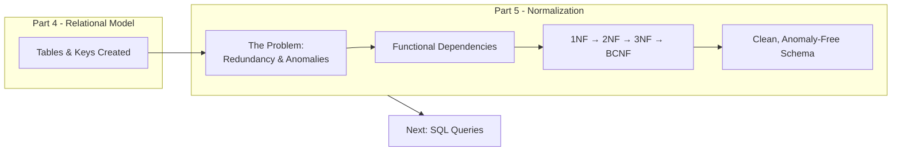
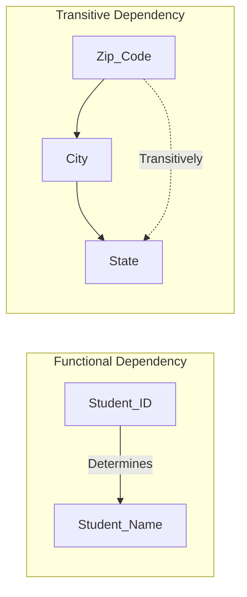
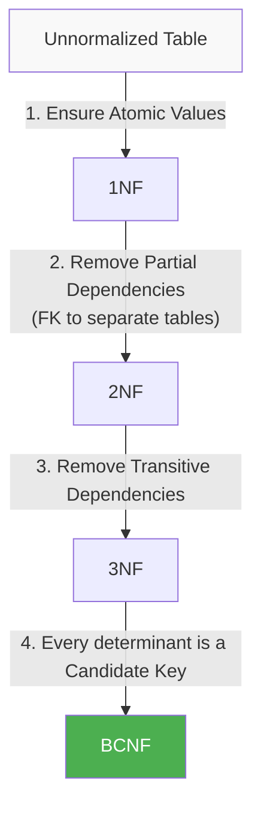
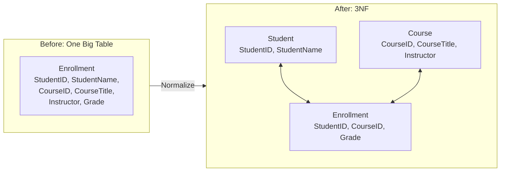
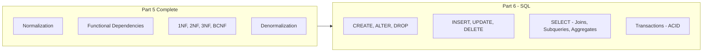

## The Big Picture Flow (Fixing the Design)

**Bridge**: We mapped our ERD to tables. But is it **good**? If we just throw everything into one table, we get duplicates, wasted space, and data corruption risks. **Normalization** is the science of refining tables to eliminate these problems—think of it as **refactoring** your database schema.

---

## 1. What is Normalization & Why Do We Need It?

### 1. Big Picture
Normalization is a systematic process of organizing columns and tables to reduce **data redundancy** and avoid **update anomalies**. It ensures your database is lean, consistent, and maintainable.

### 2. Simple Explanation
Imagine a single spreadsheet containing `OrderID`, `CustomerName`, `CustomerAddress`, and `Product`. If a customer moves, you have to update their address in *every* row of every order they ever placed—a nightmare. Normalization splits this into separate tables (`Customers`, `Orders`, `Products`) linked by keys. **Change data in one place, and it updates everywhere.**

### 3. The Three Anomalies (Why We Normalize)

| Anomaly | Description | Example (in a bad table) |
| :--- | :--- | :--- |
| **Insert Anomaly** | Can't add data without other data. | Can't add a new course until a student enrolls in it. |
| **Update Anomaly** | Same data repeated; updating one copy misses others. | Updating a professor's office in one row but not all rows. |
| **Delete Anomaly** | Deleting one fact accidentally deletes another. | Deleting the last student in a course deletes the course itself. |

### 4. Real World Example
- **E-commerce**: If `Order` table stores `CustomerName` and `CustomerAddress` directly, updating an address requires updating every past order. **Bad design**.
- **Solution**: Separate `Customers` table. `Orders` store only `customer_id` (FK).

---

## 2. Functional Dependencies (The Math Behind Normalization)

### 1. Big Picture
To normalize, we must understand **dependencies**—how one attribute determines another. This is the rulebook for splitting tables.

### 2. Simple Explanation
An attribute **X** functionally determines **Y** (written `X → Y`) if, for every valid instance, knowing the value of **X** gives you exactly one value of **Y**.

- **Example**: `Student_ID → Student_Name`. If you know the ID, you know the name. The name is functionally dependent on the ID.
- **Full Functional Dependency**: In a composite key, the attribute depends on the **whole** key, not just a part.
- **Transitive Dependency**: When `A → B` and `B → C`, then `A → C` transitively.

### 3. Dependency Visualization

### 4. Software Engineer Perspective
We identify FDs during requirements analysis. In code, FDs map to **hash maps** or **dictionaries**—the key determines the value. When designing APIs, a `GET /students/{id}` endpoint relies on the FD `Student_ID → all_other_attributes`.

---

## 3. The Normal Forms (1NF, 2NF, 3NF, BCNF)

### 1. Big Picture
Normal Forms are **levels of strictness**. We move step-by-step from 1NF (basic) to BCNF (very strict). Most industry databases aim for **3NF** or **BCNF**.

### 2. The Step-by-Step Evolution (Flowchart)

### 3. Detailed Table Breakdown

| Normal Form | The Rule | What it Fixes | Violation Example |
| :--- | :--- | :--- | :--- |
| **1NF** | Atomic values; no repeating groups. | Multi-valued attributes. | A cell contains `"Math, Physics"`. |
| **2NF** | In 1NF + No partial dependencies. (Every non-key attribute must depend on the **whole** primary key). | Partial dependency (wasted space). | A table with PK `(StudentID, CourseID)` has `InstructorName`—this depends only on `CourseID`, not the whole PK. |
| **3NF** | In 2NF + No transitive dependencies. (Non-key attributes must depend *only* on the PK). | Transitive dependency (update anomalies). | `ZipCode → City → State`. `State` transitively depends on `ZipCode`, not directly on the PK. |
| **BCNF** | In 3NF + Every determinant must be a candidate key. | Rare, complex overlapping keys. | A table where `Course` → `Instructor`, but `Instructor` is not a candidate key, yet determines `Office`. |

---

## 4. Walkthrough: Normalizing a "Bad" Table

### Scenario
A university stores `Enrollment` data in one table:
`Enrollment(StudentID, StudentName, CourseID, CourseTitle, Instructor, Grade)`

**Step 0: Identify the PK and FDs**
- PK: `{StudentID, CourseID}` (Composite).
- FDs: `StudentID → StudentName`; `CourseID → CourseTitle, Instructor`.

**Step 1: Check 1NF**
- All values are atomic. ✅ (No lists).

**Step 2: Check 2NF**
- **Violation**: Partial Dependency. `StudentName` depends only on `StudentID` (part of PK). `CourseTitle` depends only on `CourseID` (part of PK).
- **Fix**: Remove them to separate tables.

*Resulting Tables:*
- `Student(StudentID, StudentName)`
- `Course(CourseID, CourseTitle, Instructor)`
- `Enrollment(StudentID, CourseID, Grade)`

**Step 3: Check 3NF**
- In `Course` table: `CourseID → Instructor`. Are there transitive dependencies? If `Instructor → Office` existed, we'd need to fix it. Let's assume no.
- In `Enrollment`: `StudentID` and `CourseID` just point to FKs. No transitive deps. ✅

**Result**: Clean 3NF Schema.

### Visual Decomposition

---

## 5. Decomposition & Lossless Join

### 1. Big Picture
When we split tables, we must ensure we can **reconstruct** the original data without losing information. This is called a **Lossless Join**.

### 2. Simple Explanation
If you split a table and then `JOIN` it back together, you must get exactly the original rows—nothing added, nothing missing. The rule for lossless join is that the **common attribute** (the FK) must be a **candidate key** in at least one of the resulting tables.

### 3. Example
- `R(A, B, C)`. Decompose into `R1(A, B)` and `R2(B, C)`.
- If `B` is a candidate key in `R1` or `R2`, it's lossless.
- In our university example, `StudentID` is PK in `Student`, so joining `Enrollment` and `Student` on `StudentID` reconstructs correctly.

### 4. Software Engineer Perspective
In ORMs, we constantly do this implicitly. When we define `@OneToMany` relationships, we rely on the underlying foreign keys to ensure the join is lossless. We must be careful—**bad decomposition** leads to **spurious tuples** (extra rows) when joining, which is a silent data corruption bug.

### 5. Exam Perspective
- **Define** lossless join.
- **Explain** why it's important.
- **Determine** if a given decomposition is lossless (using the common attribute rule).
- **Define** dependency preservation (another property—ensuring all FDs can be enforced without joins).

---

## 6. Denormalization (The Rebel)

### 1. Big Picture
Normalization is great for **writes** (OLTP). But for **reads** (OLAP/reporting), joining many tables is slow. **Denormalization** is the intentional act of adding redundancy back to improve read performance.

### 2. Simple Explanation
Sometimes, you sacrifice storage and write-speed to make queries faster. You might store `CustomerName` in the `Orders` table again to avoid a join on every order lookup. **You do this ONLY when necessary**, usually in data warehouses or high-traffic read APIs.

### 3. Software Engineer Perspective
- We design **normalized** for transactional systems (ensuring data integrity).
- We design **denormalized** for analytics (caching, materialized views, reporting databases).
- In modern NoSQL databases (like MongoDB), denormalization is the default—we embed data because joins are expensive.

### 4. Exam Perspective
- **Define** denormalization.
- **Why** would you do it? (Performance).
- **Trade-offs**: Faster reads, but slower writes and more storage.
- Usually asked as a short question contrasting with normalization.

---

## Mindset Summary – Connecting to Part 6

- **Normalization** is the "clean code" of databases. It ensures integrity and prevents subtle bugs from update/insert/delete anomalies.
- As a software engineer, you will design schemas in **3NF** by default.
- You will **denormalize** only when you have performance metrics proving the need (e.g., 1000+ QPS read load).
- You must identify **Functional Dependencies** during the design phase—they are the key to understanding relationships.

Now you have a perfectly structured relational schema. In **Part 6**, we will finally write **SQL** to create these tables, query them, and manipulate data. This is where all the theory pays off—writing fast, correct SQL on a well-designed schema is a superpower.

---