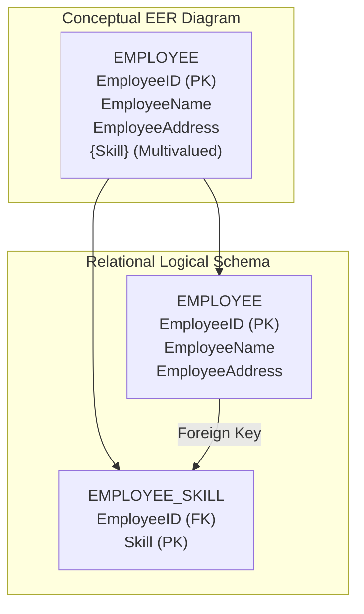
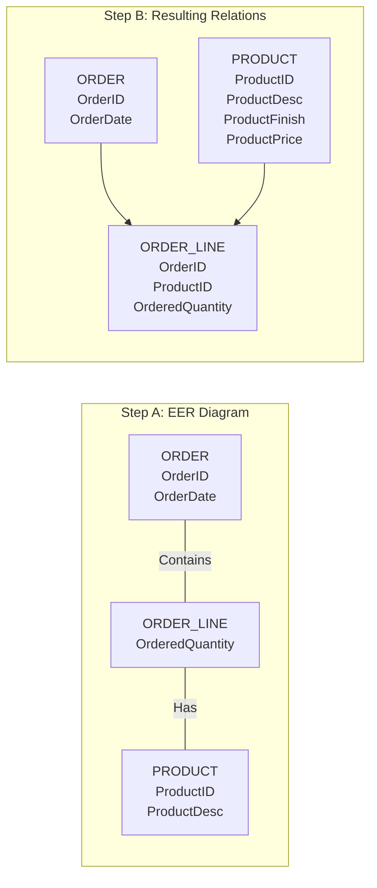
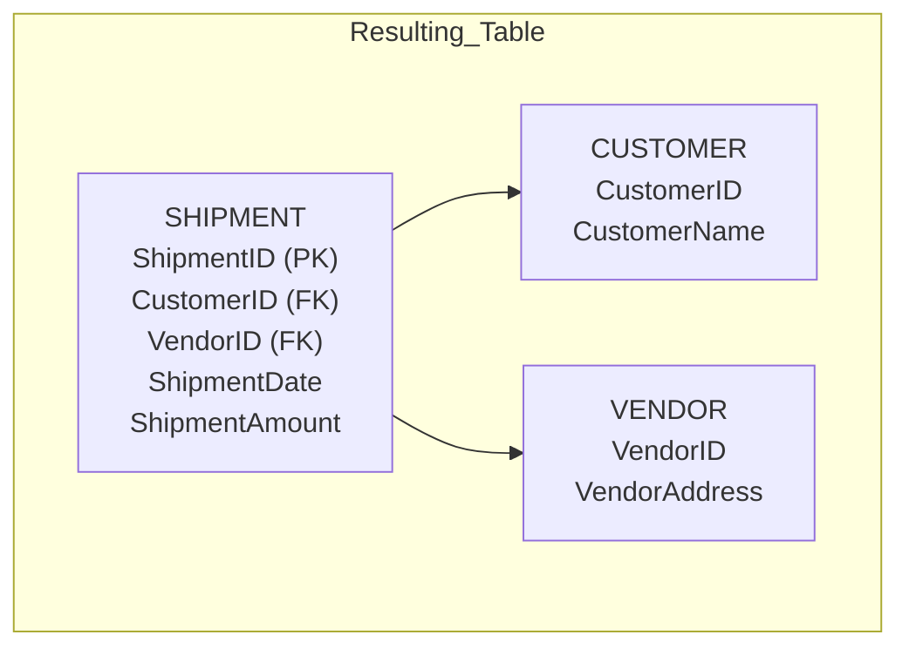
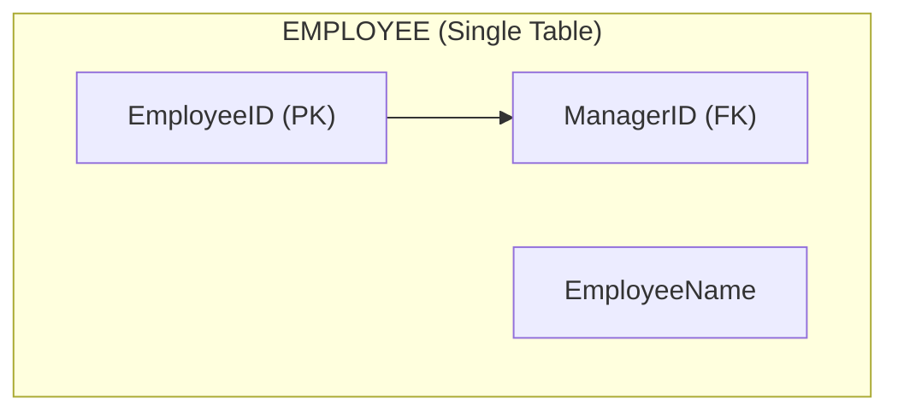
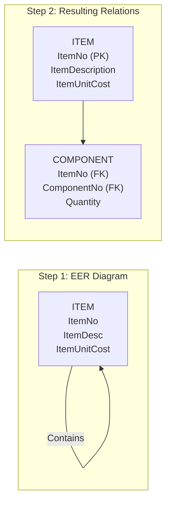
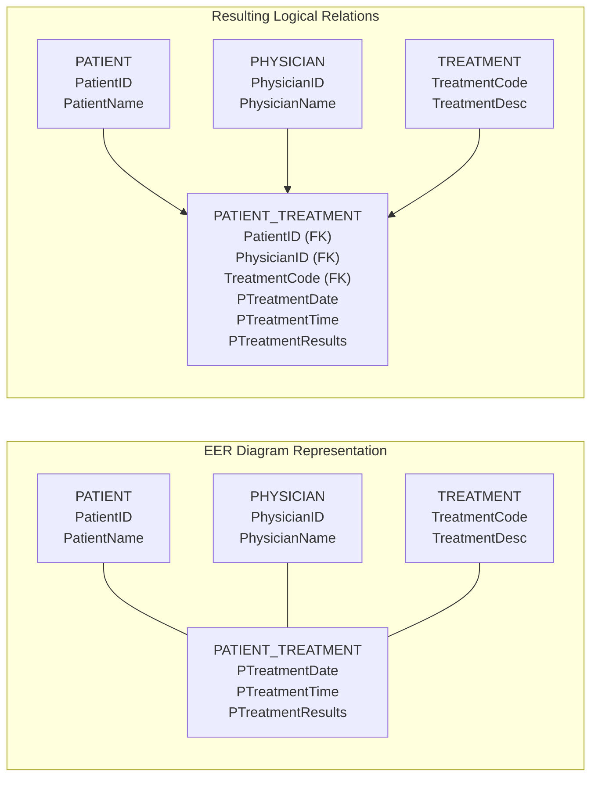
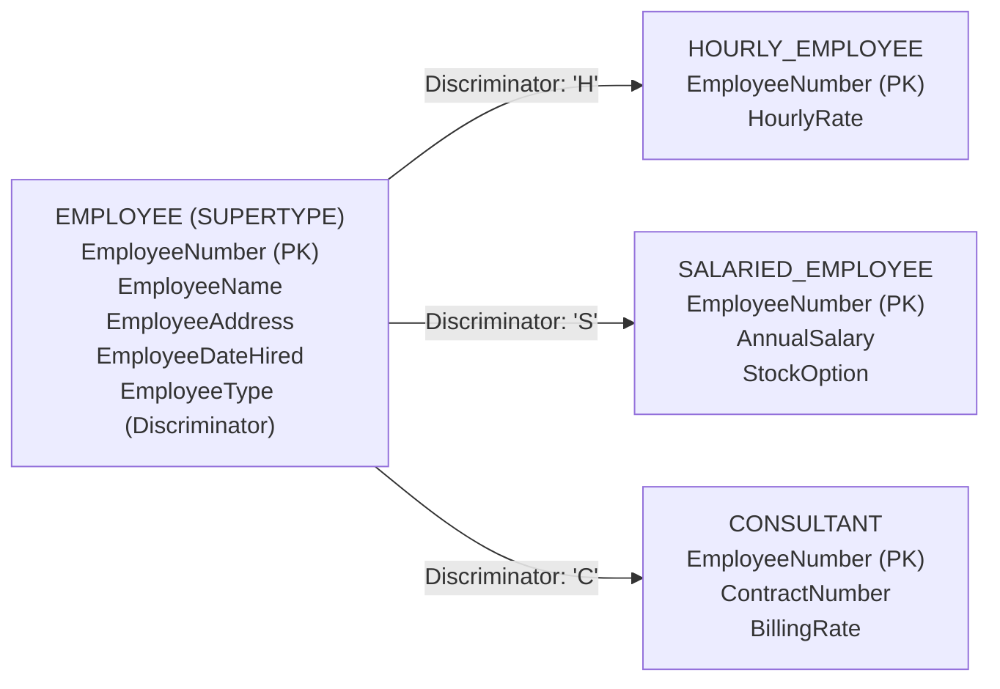

##  Chapter Overview & Objectives

### What is the Problem?
In Chapters 2 and 3, you created a **Conceptual Data Model (EER Diagram)**. This diagram uses business-oriented language (entities, relationships, attributes) to represent how the business operates. However, EER diagrams are *abstract* and *technology independent*. You cannot run an EER diagram on a computer. 

**Logical Database Design** solves this by transforming the EER diagram into a **Logical Data Model** (specifically the **Relational Model**), which is a *technical blueprint* compatible with modern Database Management Systems (like MySQL, Oracle, or PostgreSQL).

### Why is this Chapter Important?
- **Bridging the Gap:** It is the precise engineering step between "understanding the business" and "building the actual database."
- **Eliminating Bad Data:** It introduces **Normalization**, a scientific process for removing errors (anomalies) that allow duplicate or conflicting data to enter your system.
- **The "Blueprints" for SQL:** The output of this chapter is a set of **Relational Schemas** (tables with Primary and Foreign Keys) which you will directly translate into SQL `CREATE TABLE` commands in Chapter 6.

### How Does it Connect to the SDLC?
- **Analysis Phase:** Produced the EER diagram (The "What").
- **Design Phase (Logical):** Produces the Relational Schema (The "How" in database terms).
- **Design Phase (Physical):** Optimizes the schema for performance and storage.
- **Implementation:** Creates the actual tables using SQL.

--- 

## 1. Introduction
**Logical database design** is the process of transforming a conceptual data model (like an EER diagram) into a logical data model (like a Relational Database Schema). 
In the Relational Data Model, data is stored in the form of **relations** (which are two-dimensional tables).
**A key rule of relations:** They cannot contain multivalued attributes (attributes that contain a list of multiple values in a single cell).

This lecture teaches you the specific rules to convert Entities, Attributes, and Relationships from your ER diagram into actual database tables.

---

## 2. Mapping Regular Entities
Mapping a simple, regular entity type to a relation (table) is straightforward. 

### The Rules:
1. **Table Name:** Give the table the same name as the entity type (e.g., `EMPLOYEE`).
2. **Simple Attributes:** Each simple attribute of the entity type becomes a column in the table.
3. **Primary Key:** The unique identifier (ID) of the entity type becomes the Primary Key (PK) of the table.
4. **Composite Attributes:** Do not add the composite attribute as a whole; instead, **only** add its individual simple components as columns.

### Example of Mapping a Regular Entity
**Conceptual Entity:** 
`EMPLOYEE` (with attributes: `EmployeeID`, `EmployeeName`, `Address` where `Address` is a composite made of `Street`, `City`, `State`).

**Logical Table:**
| EMPLOYEE | | | | |
| :--- | :--- | :--- | :--- | :--- |
| **EmployeeID** (PK) | EmployeeName | Street | City | State |

---

## 3. Handling Multivalued Attributes
A multivalued attribute (like **Skill** for an employee) violates the "First Normal Form" (1NF) rule that says a cell can only hold one single value.

### The Rules:
To handle this, we must break it into **two relations (tables)**.
1. **First Relation (The Parent Table):** Contains all the regular attributes of the entity, with its original Primary Key.
2. **Second Relation (The Child/Intersection Table):** Contains exactly two columns:
   - The `Primary Key` from the first relation (acting as a Foreign Key).
   - The `Multivalued Attribute` itself.
   - **The Primary Key of this second table is a composite of BOTH columns.** 
   - Give the second relation a name that describes the multivalued attribute (e.g., `EMPLOYEE_SKILL`).

### Diagram: Transforming Multivalued Attributes (Employee Skills)

**Explanation of the resulting tables:**
- `EMPLOYEE` table holds the basic info.
- `EMPLOYEE_SKILL` table allows us to have multiple rows for one employee. If EmployeeID `1` knows "SQL", "Java", and "Python", the `EMPLOYEE_SKILL` table will have 3 rows for them, keeping the database compliant with the rules of the relational model.

---

## 4. Mapping Weak Entities
A **Weak Entity** does not have a complete identifier of its own. It depends entirely on a **Strong Entity** (its owner). In the ER diagram, it usually has a *partial identifier* (a dashed line under the attribute). 

**Example:** An `EMPLOYEE` has `DEPENDENT`s. A dependent (like a child or spouse) only exists in the database because the employee exists. The dependent's partial identifier might be `FirstName`.

### The Rules:
1. Create a new relation for the Weak Entity.
2. Include all of its simple attributes.
3. Include the Primary Key of the **Strong/Identifying Entity** as a Foreign Key.
4. The **Primary Key** of this new relation is the **combination of the Strong Entity's Primary Key and the Weak Entity's Partial Identifier**.

### Alternative Approach (Using Surrogate Keys):
The slides also explain that sometimes the composite primary key (e.g., `EmployeeID + FirstName`) becomes too long or messy. In this case, you can create a **Surrogate Primary Key** (a system-generated serial number).
- The slides suggest adding a new attribute called `Dependent#`.
- The table becomes: `DEPENDENT(Dependent#, EmployeeID, FirstName, MiddleInitial, LastName, DateOfBirth, Gender)`.
- `Dependent#` is a simple serial number that acts as the primary key, simplifying joins and indexing.

**When should you create a Surrogate Key?**
- If the primary key is a complicated composite key.
- If the natural primary key is inefficient (e.g., very long text strings).
- If the natural primary key might be recycled or changed over time.

### Resulting Table for Weak Entity Mapping:
| DEPENDENT | | | | | |
| :--- | :--- | :--- | :--- | :--- | :--- |
| **EmployeeID (FK)** | **DependentName** (Partial PK) | DateOfBirth | Gender | Relation | ... |
| 101 | Sarah | 2010-05-12 | F | Daughter | ... |
| 101 | David | 2012-11-03 | M | Son | ... |

---

## 5. Mapping Binary Relationships (1:M, M:N, 1:1)
We now look at the relationships between two distinct entities.

### A. Binary One-to-Many (1:M) Relationships
*Example:* A `CUSTOMER` can place many `ORDER`s.

**The Rule:**
- Create a table for each entity (`CUSTOMER` and `ORDER`).
- Take the **Primary Key of the entity on the "One" side** (in this case, `CUSTOMER`), and add it as a **Foreign Key** in the table of the "Many" side (in this case, `ORDER`). 

**Resulting Tables:**
- `CUSTOMER (CustomerID, Name, Address)` → PK: `CustomerID`
- `ORDER (OrderID, OrderDate, CustomerID)` → PK: `OrderID`, **FK: `CustomerID`**

### B. Binary Many-to-Many (M:N) Relationships
*Example:* A `STUDENT` can take many `COURSE`s, and a `COURSE` can be taken by many `STUDENT`s.

**The Rule:**
- Create a table for each entity (`STUDENT` and `COURSE`).
- Create a **new, third relation** (often called an Associative Entity/Intersection Table). Let's call it `ENROLLMENT`.
- Include the **Primary Keys of both entities** as Foreign Keys in this new table.
- Together, these two foreign keys form the **Primary Key** of this new table.
- If there are any attributes directly on the relationship (like `EnrollmentDate` or `Grade`), they belong in this third table.

**Resulting Tables:**
- `STUDENT (StudentID, Name)`
- `COURSE (CourseID, Title)`
- `ENROLLMENT (StudentID, CourseID, EnrollmentDate, Grade)` → PK: `StudentID + CourseID`.

### C. Binary One-to-One (1:1) Relationships
*Example:* `PERSON` is married to `PERSON` (or a `DEPARTMENT` is managed by one `EMPLOYEE`). 

**The Rule:**
- Create a table for each entity.
- The slide teaches that in a 1:1 relationship, one direction is usually **Mandatory**, and the other is **Optional**.
- **Where to put the Foreign Key?** Place the Foreign Key in the entity with the **Optional** participation.
- Any attributes that belong to the relationship itself are included in the same table as the foreign key.

**Example:** 
Let's say the business rule says: *"An employee can manage at most one department, but every department MUST have a manager."* Here, `EMPLOYEE` is optional (not every employee is a manager), and `DEPARTMENT` is mandatory (every department must have a manager).
We put the Foreign Key (`EmployeeID`) on the `DEPARTMENT` table.

**Resulting Tables:**
- `EMPLOYEE (EmployeeID, Name, DeptID)` → PK: `EmployeeID` (Note: `DeptID` is optional here).
- `DEPARTMENT (DeptID, Name, ManagerID)` → PK: `DeptID`, **FK: `ManagerID`**.

---

## 6. Mapping Associative Entities
An Associative Entity is very similar to an M:N relationship intersection table, but it might have an explicit Primary Key assigned to it on the EER diagram.

### Diagram: Associative Entity (Order Line)
This slide shows the classic example from Pine Valley Furniture. The `ORDER_LINE` is an associative entity bridging `ORDER` and `PRODUCT`.

**Mapping Strategy 1: Identifier NOT assigned on the ER diagram**
If `ORDER_LINE` does not have a custom ID, we let the database create it automatically. 
- The primary key of `ORDER_LINE` becomes the combination of `OrderID` and `ProductID`.
- `OrderID` and `ProductID` are Foreign Keys pointing to `ORDER` and `PRODUCT`.
- `OrderedQuantity` is a non-key attribute of the relationship.

**Mapping Strategy 2: Identifier assigned on the ER diagram**
If `ORDER_LINE` in the ER diagram is explicitly given an ID (e.g., `ShipmentID`), we use that as the Primary Key. 
- The Primary Key of the new table is `ShipmentID`.
- We still include `OrderID` and `ProductID` as Foreign Keys (but they are no longer part of the Primary Key).

### Diagram: Associative Entity with an Identifier Assigned (Shipment)
The slides give an example of a `SHIPMENT` entity with its own `ShipmentID`.

---

## 7. Mapping Unary (Recursive) Relationships
A Unary Relationship is when an entity relates to itself. We cover the two most important cases here.

### A. Unary One-to-Many (1:M) Relationship
*Example:* An `EMPLOYEE` manages other `EMPLOYEE`s. One manager manages many employees.

**The Rule:**
- Create a single relation for the entity.
- Add a **Foreign Key** to the same relation. This is called a **Recursive Foreign Key**.
- This foreign key points to the `Primary Key` in the same table.

**Visual Example:**

**Explanation:** If `EmployeeID` 1001 has `ManagerID` 1002, it means Employee 1001 reports to Employee 1002. This is stored in the exact same table.

### B. Unary Many-to-Many (M:N) Relationship
*Example:* An `ITEM` is made up of other `ITEM`s. This is called a **Bill of Materials** structure.

**The Rule:**
- Create **two relations**.
1. One relation for the entity itself (`ITEM`).
2. One associative relation to represent the M:N relationship (`COMPONENT`).
- The associative table's Primary Key consists of two attributes. Both of these attributes take their values from the primary key of the original relation. 
- Any non-key attributes of the relationship (like `Quantity` used in the assembly) are included in the associative relation.

### Diagram: Unary M:N Relationship (Item Components)

**Explanation of the `COMPONENT` table:**
- `ItemNo`: The parent item being built.
- `ComponentNo`: The raw component making up the parent item.
- `Quantity`: How many of that component are needed.
- The *Primary Key* is `(ItemNo, ComponentNo)`.

### C. Unary One-to-One (1:1) Relationship
*Example:* `PERSON` is married to another `PERSON`. 
- This is mapped similarly to a binary 1:1. 
- You create a single table for `PERSON`. 
- You add a column called `SpouseID` which is a recursive foreign key pointing back to the primary key of the same table. 

---

## 8. Mapping Ternary (and n-ary) Relationships
A ternary relationship involves three entities at the same time.

**The Rule:**
1. Convert the ternary relationship into an **Associative Entity** on your ER diagram to accurately represent its participation constraints.
2. Create a new **Associative Relation** for this associative entity.
3. The default Primary Key of this relation consists of the **combination of the three Primary Keys** of the participating entities (which become Foreign Keys).
4. Any attributes belonging to the relationship itself become attributes of this new relation.

### Diagram: Ternary Relationship (Patient Treatment)
This example maps the relationship between `PATIENT`, `PHYSICIAN`, and `TREATMENT` connected by an associative entity `PATIENT_TREATMENT`.

**Resulting Table:** The `PATIENT_TREATMENT` table has a composite Primary Key: `(PatientID, PhysicianID, TreatmentCode)`. However, note that the slide also indicates that an implicit rule might be that `TreatmentCode` could be replaced with a simple `TreatmentDateTime` or a Surrogate Key depending on the specific constraints of the treatment. 

---

## 9. Mapping Supertype/Subtype Relationships (Inheritance)
The Relational Data Model does *not* natively support inheritance or supertype/subtype relationships (like `EMPLOYEE` supertype, and `HOURLY`, `SALARIED`, `CONSULTANT` subtypes).

However, database designers use a specific strategy to represent this.

### The Strategy (One table per class):
1. **Create a separate relation for the supertype**, containing attributes common to *all* members, including its Primary Key.
2. **Create a separate relation for each subtype**, containing the `Primary Key` of the supertype (acting as its Primary Key and a Foreign Key) and *only* attributes unique to that subtype.
3. Assign a **Subtype Discriminator** attribute to the supertype. This tells you which subtype a specific row belongs to (e.g., 'H' for Hourly, 'S' for Salaried, 'C' for Consultant).

### Diagram & Data Structure: Employee Subtypes
The slide provides this exact structure. Let's say the Supertype is `EMPLOYEE`, and the subtypes are `HOURLY_EMPLOYEE`, `SALARIED_EMPLOYEE`, and `CONSULTANT`.

**Explanation of how the data is stored:**
- **EMPLOYEE Table:**
  | EmployeeNumber (PK) | EmployeeName | EmployeeType |
  | :--- | :--- | :--- |
  | 100 | John Doe | H |
  | 101 | Jane Smith | S |
  | 102 | Bob Johnson | C |
- **HOURLY_EMPLOYEE Table:**
  | EmployeeNumber (PK, FK) | HourlyRate |
  | :--- | :--- |
  | 100 | 25.00 |
- **SALARIED_EMPLOYEE Table:**
  | EmployeeNumber (PK, FK) | AnnualSalary | StockOption |
  | :--- | :--- | :--- |
  | 101 | 75000 | 100 |
- **CONSULTANT Table:**
  | EmployeeNumber (PK, FK) | ContractNumber | BillingRate |
  | :--- | :--- | :--- |
  | 102 | C-999 | 150.00 |

**Why use this approach?**
If you want to look up a specific employee, you check the `EMPLOYEE` table, see their `EmployeeType`, and then know exactly which subtype table to join with to find their specific specialized data. This strictly preserves the relational model's rules while perfectly mimicking inheritance. 

---

## 10. Summary
- **Logical Database Design** is the bridge between your visual conceptual model (EER diagram) and your actual physical database tables.
- **Relations (Tables)** must be normalized; they cannot contain multivalued attributes.
- Regular entities become regular tables.
- **Multivalued attributes** must be pulled out into their own secondary tables.
- **Weak Entities** inherit their Primary Key from their "owner" strong entity.
- **Binary Relationships** dictate where Foreign Keys go (1:M → FK on Many side; M:N → new intersection table; 1:1 → FK on optional side).
- **Unary Relationships** are mapped using recursive foreign keys (for 1:M) or associative intersection tables (for M:N).
- **Ternary/Associative Entities** are mapped like M:N relationships, but the Primary Key is a combination of multiple foreign keys.
- **Supertype/Subtype** is not natively supported in relational databases, so we map them using a parent table for common attributes, child tables for unique attributes, and a subtype discriminator in the parent table.