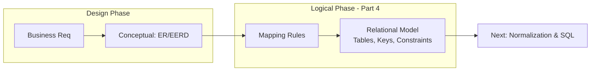
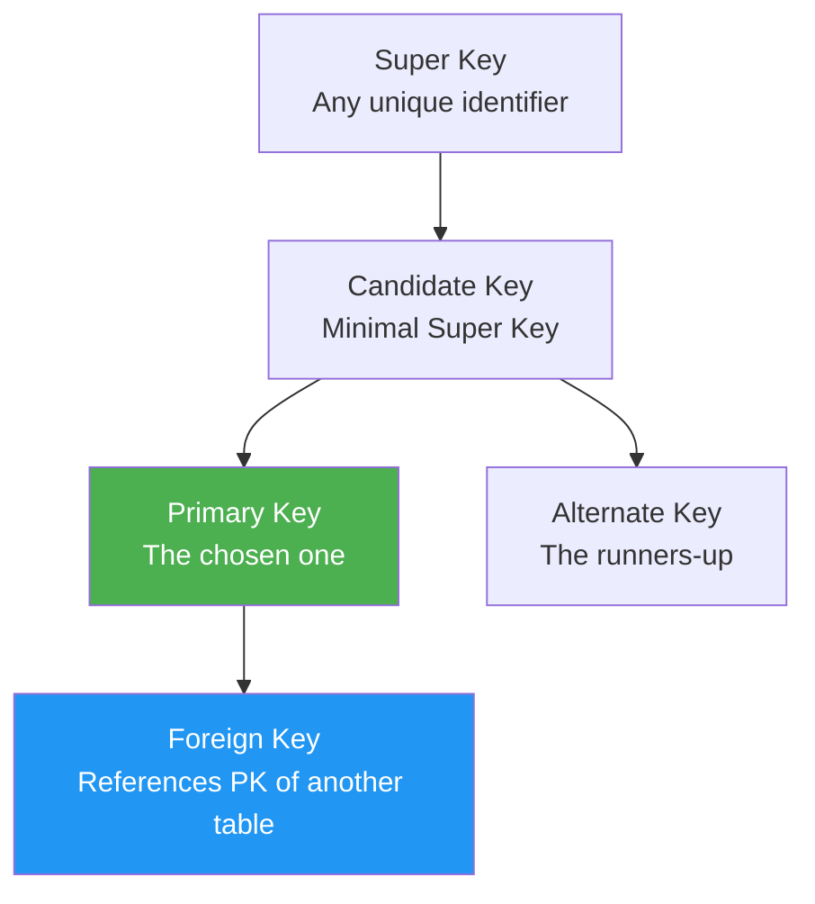
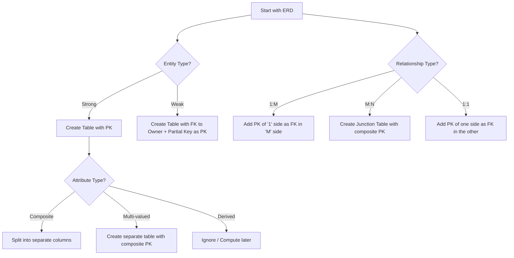
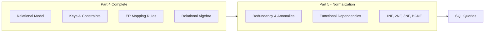

## The Big Picture Flow (The Bridge)



**Bridge**: The ERD is a blueprint. The **Relational Model** is the actual *language* and *structure* we use to build the database. It takes the "what" (entities/relationships) and defines the "how" (tables, columns, keys, and strict mathematical rules). This is where we map our beautiful diagrams to actual `CREATE TABLE` statements.

---

## 1. What is the Relational Model?

### 1. Big Picture
Proposed by E.F. Codd in 1970, the Relational Model is a **mathematical framework** for organizing data into tables. It ensures data integrity and provides a standardized way to query data (SQL). It is the foundation of almost every modern transactional database.

### 2. Simple Explanation
Think of the Relational Model as a **strict spreadsheet** on steroids.
- The whole database is a collection of **Tables** (called *Relations*).
- Each table has **Rows** (called *Tuples*) and **Columns** (called *Attributes*).
- The magic is that tables can be linked together using **Keys**, allowing us to combine data without duplication.

### 3. Core Terminology

| Formal Term | Everyday Term | Description |
| :--- | :--- | :--- |
| **Relation** | Table | A 2D structure with rows and columns. |
| **Tuple** | Row / Record | A single entry in the table. |
| **Attribute** | Column / Field | A specific property of the entity. |
| **Domain** | Data Type | The set of allowed values for an attribute (e.g., `INT`, `VARCHAR(50)`). |
| **Degree** | - | The number of columns in a table. |
| **Cardinality** | - | The number of rows in a table. |
| **Schema** | Table Definition | The structure (name, columns, types, constraints). |
| **Instance** | Table Data | The actual data in the table at a specific moment. |

### 4. Properties of a Relation (The Golden Rules)

1.  **Atomic Values**: Every cell must contain a single value (cannot be a list or nested table). This is the rule of **1NF**.
2.  **No Duplicate Rows**: Each row must be unique (enforced by a Primary Key).
3.  **Unordered Rows & Columns**: The order of rows/columns does not matter.
4.  **Single Value per Cell**: Intersection of a row and column holds exactly one value.

---

## 2. Keys – The Glue of the Relational Model

### 1. Big Picture
Keys are the **identifiers** that allow us to uniquely find data and link tables together. Without keys, we cannot relate a `Customer` to their `Orders`.

### 2. Simple Explanation
Keys are like ID cards and family ties:
- **Super Key**: Any set of attributes that can uniquely identify a row. (e.g., `{ID}`, `{ID, Name}`, `{Email}`).
- **Candidate Key**: A *minimal* Super Key. No extra columns allowed. (e.g., `{ID}` or `{Email}`).
- **Primary Key (PK)**: The one Candidate Key we choose to use. (e.g., `customer_id`).
- **Alternate Key**: The Candidate Keys we didn't choose. (e.g., `Email` if `ID` is PK).
- **Foreign Key (FK)**: A column (or set of columns) that points to the Primary Key of another table. (e.g., `customer_id` in the `Orders` table).
- **Composite Key**: A Primary Key made of two or more columns. (e.g., `{order_id, product_id}` in an order items table).

### 3. Key Hierarchy



### 4. Real World Example
- **University**: `Student` table. `student_id` is PK (Candidate). `email` is an Alternate Key (unique). `Enrollment` table uses `student_id` and `course_id` as a Composite PK, and each is a Foreign Key referencing the respective tables.
- **E-commerce**: `Orders` table has `order_id` (PK) and `customer_id` (FK referencing `Customers`).

### 5. Software Engineer Perspective
We define keys using **DDL** (Data Definition Language) constraints:
- `PRIMARY KEY (id)`
- `FOREIGN KEY (customer_id) REFERENCES Customers(id)`
- `UNIQUE (email)` (for Alternate Keys)

Choosing a PK is critical. We often prefer **Surrogate Keys** (auto-increment integers or UUIDs) over **Natural Keys** (like email or SSN) because natural keys can change over time.

### 6. Exam Perspective
- **Define** all key types.
- **Differentiate** Super vs Candidate vs Primary.
- **Explain** why Composite Keys are necessary.
- **What is a Foreign Key constraint?** (Referential Integrity).

### 7. Quick Revision Box
- **Super** = unique (may have extra cols).
- **Candidate** = minimal unique.
- **Primary** = chosen candidate.
- **Foreign** = reference to another table's PK.
- **Composite** = PK with multiple columns.

---

## 3. Integrity Constraints – Guarding the Data

### 1. Big Picture
Constraints are **business rules** enforced by the DBMS. They prevent application bugs from corrupting your data.

### 2. Simple Explanation
Three main rules protect your database:
1.  **Domain Integrity**: Ensures data is of the correct type/format (e.g., Age cannot be negative).
2.  **Entity Integrity**: Ensures every row has a unique, non-null Primary Key.
3.  **Referential Integrity (RI)**: Ensures that a Foreign Key always points to an existing row in the parent table. (e.g., You cannot add an `Order` for a `Customer` that doesn't exist).

### 3. Real World Example
- **Referential Integrity**: If you try to delete a `Department` that still has `Employees`, the DBMS will either:
    - **RESTRICT**: Throw an error and cancel the delete.
    - **CASCADE**: Delete the employees too.
    - **SET NULL**: Set the employee's `department_id` to NULL.
- **Domain**: `salary` column only accepts positive numbers.

### 4. Software Engineer Perspective
We **never** bypass these constraints. They are our last line of defense. In our application code, we handle the exceptions thrown by the DBMS (e.g., `SQLIntegrityConstraintViolationException`) gracefully and show user-friendly error messages.

### 5. Exam Perspective
- **Explain** Entity, Referential, and Domain Integrity.
- **What happens** if we violate a Foreign Key constraint? (The operation is rejected).
- **Define** the `ON DELETE CASCADE` / `ON DELETE SET NULL` clauses.

### 6. Quick Revision Box
- **Entity**: PK must be unique and not null.
- **Referential**: FK must exist in parent table.
- **Domain**: Data must match column type/range.
- DBMS enforces these automatically.

---

## 4. Mapping ER/EER to Relational Tables (The Rulebook)

### 1. Big Picture
This is the **practical conversion** process. We take our conceptual ERD/EERD and generate a physical set of tables. We have standardized rules for every ER construct.

### 2. Simple Explanation
Follow these steps to turn a diagram into tables:

| ER Construct | Relational Mapping Rule |
| :--- | :--- |
| **Strong Entity** | Create a table with all simple attributes. PK is the entity's key attribute. |
| **Composite Attribute** | Break it down into its constituent parts (e.g., `Address` → `Street`, `City`, `Zip`). |
| **Multi-valued Attribute** | Create a **separate table** for it. The table's PK is the entity's PK + the attribute value. (e.g., `Employee_Phone(emp_id, phone_number)`). |
| **Derived Attribute** | **Do not store** it. Create a view or compute in application. (e.g., `Age` from `DOB`). |
| **1:1 Relationship** | Place the PK of one side as a FK in the other table. Usually, place it on the side with **total participation**. |
| **1:M Relationship** | Place the PK of the "One" side as a FK in the "Many" side table. (e.g., `Department` PK goes into `Employee` as FK). |
| **M:N Relationship** | Create a **new Junction Table**. Include the PKs of both entities as composite PK + FKs. (e.g., `Enrollment(student_id, course_id, grade)`). |
| **Specialization (Inheritance)** | Use one of the 4 strategies (Single Table, Joined Table, etc.) - covered in Part 3. |
| **Aggregation** | Treat the aggregated relationship as an entity. Its PK is the composite of the related entities. Link it using FKs. |

### 3. Mapping Flow Diagram



### 4. Software Engineer Perspective
We use ORM generators (like JPA `hbm2ddl`) to automatically map our Java/Python classes to relational tables based on these rules. However, we **always** review the generated schema to ensure it matches the performance needs (adding indexes, adjusting types). This mapping is the basis for our **database migrations**.

### 5. Exam Perspective
- **"Map the following ERD to relational tables."** (A guaranteed 10-mark question).
- **Write the SQL `CREATE TABLE` statements** for the mapped schema.
- **Explain** why a junction table is needed for M:N.

### 6. Common Mistakes
- Forgetting that **multi-valued attributes** need a separate table.
- Putting the FK on the wrong side in a 1:M relationship (must go on the "Many" side).
- Trying to store derived attributes.
- Forgetting to include the FK from the owner when mapping a **Weak Entity**.

### 7. Quick Revision Box
- Strong → Table.
- 1:M → FK on Many side.
- M:N → New Junction Table.
- Multi-valued → New Table.
- Derived → Don't store.

---

## 5. Introduction to Relational Algebra (Theoretical Foundation)

### 1. Big Picture
SQL is the *practical* language we use. **Relational Algebra** is the *mathematical* theory behind SQL. It defines a set of operations that take tables as input and produce tables as output.

### 2. Simple Explanation
Think of it as **data pipe operations**:
- **SELECT** (σ): Filter rows (like `WHERE`).
- **PROJECT** (π): Pick specific columns (like `SELECT column1, column2`).
- **JOIN** (⋈): Combine two tables based on a condition (like `INNER JOIN`).
- **UNION** (∪), **INTERSECT** (∩), **DIFFERENCE** (-): Combine rows from two tables (like `UNION`, `INTERSECT`, `EXCEPT` in SQL).
- **RENAME** (ρ): Change column or table names.

### 3. Core Operations Overview

```mermaid
graph TD
    Input1[Table A] --> Op{Relational Operation}
    Input2[Table B] --> Op
    Op --> Output[New Table]
    
    subgraph Examples
        direction LR
        Sel[SELECT \n σ age>18 (Student)]
        Proj[PROJECT \n π name (Student)]
        Join[JOIN \n Student ⋈ Enroll]
    end
```

### 4. Software Engineer Perspective
When you write an SQL query, the DBMS translates it into relational algebra expressions, then an **Optimizer** chooses the most efficient sequence of operations (e.g., doing SELECT before JOIN to reduce data size). Understanding this helps us write efficient queries.

### 5. Exam Perspective
- **Write** relational algebra expressions for a given query.
- **Define** basic operations (σ, π, ⋈, ∪, ∩, -).
- **Explain** why relational algebra is important (it is the foundation of query optimization).
- Often asked as a short question (2-5 marks).

### 6. Quick Revision Box
- σ (Sigma) = Filter rows.
- π (Pi) = Project columns.
- ⋈ (Join) = Combine tables.
- Operations are composable (output of one is input to another).
- Foundation of SQL.

---

## Mindset Summary – Connecting to Part 5



- The **Relational Model** gives us the strict, mathematical structure for our tables.
- **Keys** ensure integrity and enable connections.
- **Mapping rules** are our bread-and-butter for translating client requirements into actual database structures.
- **Relational Algebra** is the theory that powers SQL.

As a software engineer, you will spend a huge amount of time designing schemas (applying these mapping rules). Next, we will take these relational schemas and **Normalize** them to eliminate redundancy, ensuring your database remains lean, fast, and anomaly-free as it scales.

---
