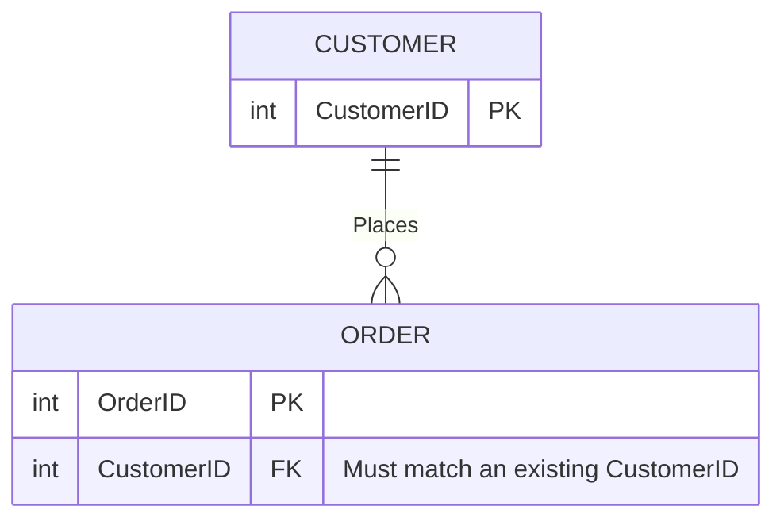
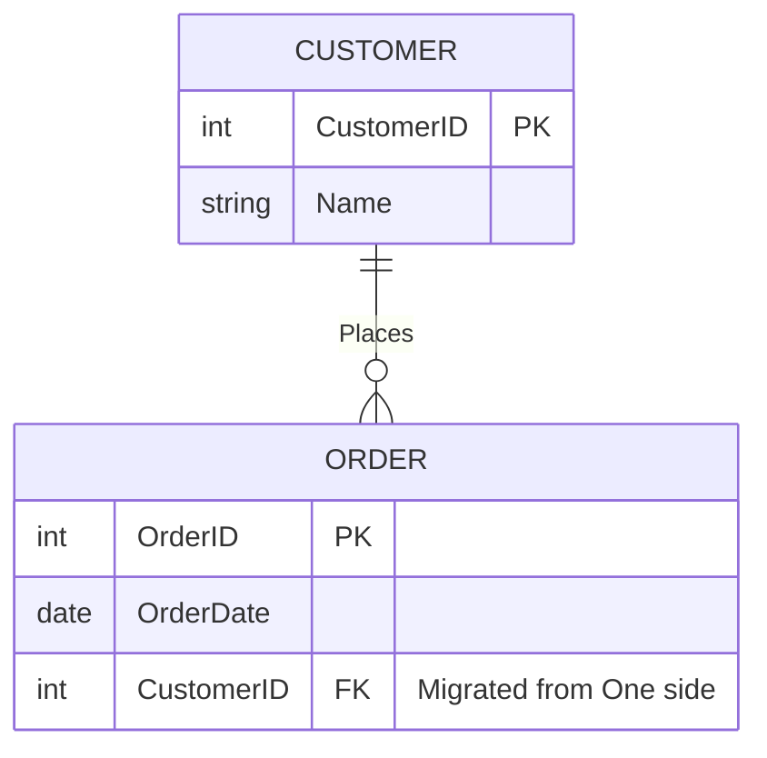
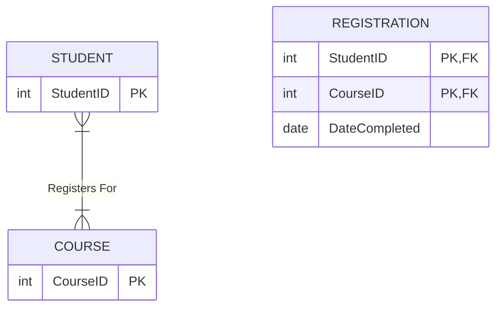
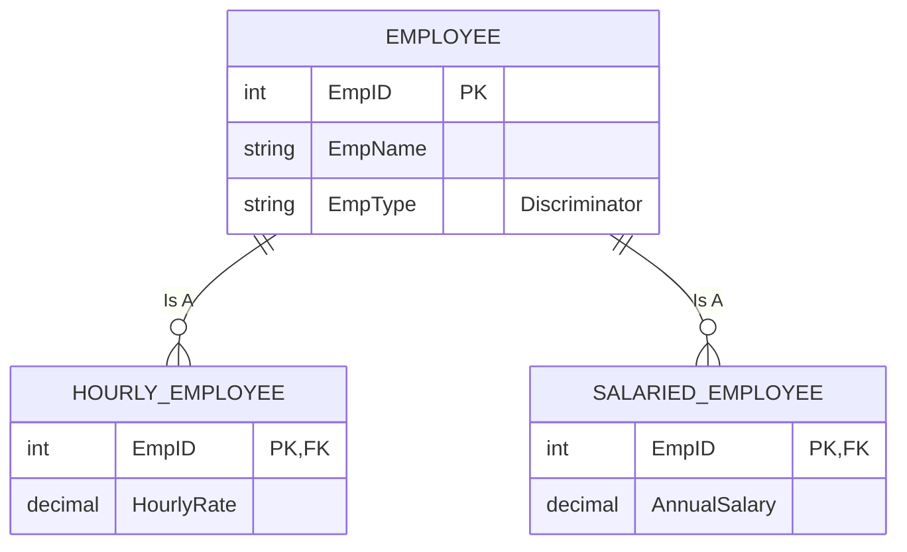

## 1. Chapter Overview & Objectives

### What is the Problem?
In Chapters 2 and 3, you created a **Conceptual Data Model (EER Diagram)**. This diagram uses business-oriented language (entities, relationships, attributes) to represent how the business operates. However, EER diagrams are *abstract* and *technology independent*. You cannot run an EER diagram on a computer. 

**Logical Database Design** solves this by transforming the EER diagram into a **Logical Data Model** (specifically the **Relational Model**), which is a *technical blueprint* compatible with modern Database Management Systems (like MySQL, Oracle, or PostgreSQL).

### Why is this Chapter Important?
- **Bridging the Gap:** It is the precise engineering step between "understanding the business" and "building the actual database."
- **Eliminating Bad Data:** It introduces **Normalization**, a scientific process for removing errors (anomalies) that allow duplicate or conflicting data to enter your system.
- **The "Blueprints" for SQL:** The output of this chapter is a set of **Relational Schemas** (tables with Primary and Foreign Keys) which you will directly translate into SQL `CREATE TABLE` commands in Chapter 6.

### How Does it Connect to the SDLC?
- **Analysis Phase:** Produced the EER diagram (The "What").
- **Design Phase (Logical):** Produces the Relational Schema (The "How" in database terms).
- **Design Phase (Physical):** Optimizes the schema for performance and storage.
- **Implementation:** Creates the actual tables using SQL.

---

## 2. The Relational Data Model: Core Terminology

Before we can design, we must understand the vocabulary. A **Relational Data Model** represents data as a collection of **Relations** (tables).

| Term | Simple Definition | Exam Definition | Example |
| :--- | :--- | :--- | :--- |
| **Relation** | A table of data. | A named, two-dimensional table containing data. | The `EMPLOYEE` table. |
| **Attribute** | A column in a table. | A named column of a relation describing a characteristic. | `EmployeeName` |
| **Row / Tuple** | A single record. | A single occurrence of data within a relation. | `(101, "John Doe", "IT")` |
| **Primary Key (PK)** | The unique ID for a row. | An attribute (or combination of attributes) that uniquely identifies each row in a relation. Cannot be null. | `EmployeeID` |
| **Composite Key** | A PK made of 2+ attributes. | A primary key that consists of more than one attribute. | `(FlightNumber, Date, Time)` |
| **Foreign Key (FK)** | The link to another table. | An attribute in a relation that serves as the Primary Key of *another* relation. Used to establish relationships between tables. | `DepartmentID` in the `Employee` table (links to the `Department` table). |
| **Candidate Key** | "Almost" a primary key. | An attribute (or combination) that *could* serve as the PK because it uniquely identifies rows. | Both `StudentID` and `Email` address could uniquely identify a student. |
| **Surrogate Key** | A system-assigned ID. | A non-intelligent, automatically generated serial number used as the primary key for a relation. | `Auto-increment` ID columns in databases. |
| **Domain** | The "legal" values for a column. | The set of allowable values for a given attribute. For example, the domain of "Gender" is `{'M', 'F'}`. | `CustomerState` domain could be `{'CA', 'NY', 'TX'...}`. |

### Fundamental Properties of a Relation (Must Know)
For a table to truly be a "Relation", it must follow these 6 rules:
1.  **Unique Name:** Every table name must be unique in the database.
2.  **Atomic Values:** Every cell must contain exactly one value (no repeating groups, no lists).
3.  **Unique Rows:** No two rows can be identical.
4.  **Unique Column Names:** Attributes must have unique names within the table.
5.  **Order of Columns is Irrelevant:** You can move columns around; the data means the same.
6.  **Order of Rows is Irrelevant:** You can sort rows differently; the data remains the same.

---

## 3. Integrity Constraints (The "Laws" of Relations)

To prevent "garbage-in, garbage-out," the relational model enforces strict rules.

1.  **Domain Constraints:** The value entered must be from the correct data type and specified range.
    - *Example:* You cannot enter "Text" into a `DATE` column, and you cannot set a `Quantity` to `-5` if the domain is `Positive Integer`.
2.  **Entity Integrity Rule:** **No Primary Key attribute may be null** (empty). 
    - *Why?* If the PK is null, you cannot uniquely identify that row.
3.  **Referential Integrity Constraint:** **Any Foreign Key value must match an existing Primary Key value in the parent table, OR be null.**
    - *Why?* If you have an order for `CustomerID 5`, `CustomerID 5` *must* exist in the `Customer` table. You cannot have an "orphan" order belonging to a customer that doesn't exist.

**Visualizing Referential Integrity (Crow's Foot):**

---

## 4. Transforming EER Diagrams into Relations (The MAPPING Guide)

This is the most important section of the chapter for exams. You will be given an EER diagram and asked to produce the relational schema. Here is the **Master Mapping Strategy**.

### Step 1: Mapping Regular (Strong) Entities
**Method:** Create one relation for the entity. Use the entity's identifier as the PK. Add all simple attributes.
- **Composite Attributes:** Ignore the composite name. Only bring the *atomic component parts*.
- **Multivalued Attributes:** *Create a new separate relation!* The PK of the new relation is `(Owner PK + Multivalued Attribute)`.

**Example:** `EMPLOYEE` has `EmpID`, `EmpName`, and `{Skill}` (multivalued).
- **Rule:** Create two tables: `EMPLOYEE(EmpID, EmpName)` and `EMPLOYEE_SKILL(EmpID, Skill)`.

### Step 2: Mapping Weak Entities
**Method:** Create one relation for the weak entity. Include the **Owner's Primary Key** as a Foreign Key. The composite PK of the weak entity is `(Owner PK + Weak Entity's Partial Identifier)`.

**Example:** `DEPENDENT` depends on `EMPLOYEE`. `DEPENDENT` has `DependentName` (partial ID) and `DOB`.
- **Rule:** `DEPENDENT(EmployeeID, DependentName, DOB)` with PK = `(EmployeeID, DependentName)`. 
- *Professional Tip:* It is highly recommended to assign a **Surrogate Primary Key** (`DependentID`) here instead, because the composite key is bulky and hard to manage.

### Step 3: Mapping Binary Relationships
**Case A: One-to-Many (1:M)**
**Method:** Migrate the Primary Key of the "One" side as a **Foreign Key** into the relation for the "Many" side.

**Case B: Many-to-Many (M:N)**
**Method:** Create a *new associative relation* (a bridge table). The new composite PK is `(PK1 + PK2)`. Both attributes become Foreign Keys. Add any relationship attributes to this new table.

**Case C: One-to-One (1:1)**
**Method:** Identify the optional and mandatory side. Place the PK of the **Mandatory** entity as an FK into the **Optional** entity.

**Visual for 1:M Mapping (CUSTOMER -> ORDER):**

**Visual for M:N Mapping (STUDENT -> COURSE):**

### Step 4: Mapping Associative Entities
**Method:** If your EER diagram already has a rounded rectangle (Associative Entity), map it as you would an M:N relationship. If it has its own *single attribute identifier* (like `CertificateNumber`), you can choose that as the PK instead of the composite key.

### Step 5: Mapping Unary (Recursive) Relationships
**Case A: 1:M Unary (Employee Supervises Employee)**
**Method:** Add a Foreign Key to the same table that references the Primary Key.

**Case B: M:N Unary (Part Contains Part)**
**Method:** Create a new associative table containing two FKs, both referencing the same original table. Add any relationship attributes to this new table.

### Step 6: Mapping Ternary (N-ary) Relationships
**Method:** Create a new associative table containing **three** Foreign Keys from the three participating entities. The composite Primary Key is `(PK1 + PK2 + PK3)`.

### Step 7: Mapping Supertype/Subtype Relationships
**Method:** 
1.  Create a single relation for the **Supertype**. Include its PK and all common attributes. Add the **Subtype Discriminator** attribute.
2.  Create a relation for **each Subtype**.
3.  The **Primary Key of each subtype relation is exactly the same as the Supertype's PK** (it acts as both PK and FK).

**Example:** `EMPLOYEE` Supertype, `HOURLY` and `SALARIED` Subtypes.

---

## 5. Normalization: Designing Well-Structured Relations

**What is the problem?** You have mapped an EER diagram to tables. But these tables might still be "bad." They contain **Anomalies** (errors caused by redundancy when inserting, updating, or deleting data). 

**The Solution:** **Normalization** is the step-by-step process of eliminating these anomalies and breaking large, messy tables into smaller, clean, well-structured tables.

### Step 0: Functional Dependencies (The Foundation)
Before normalizing, you must map the logic of the data.
- **Functional Dependency:** If you know the value of Attribute A, you can *uniquely* determine the value of Attribute B. (Written as `A → B`).
- **Determinant:** The attribute on the left side of the arrow (`A`).
- **Candidate Key:** A determinant that uniquely identifies *all* remaining non-key attributes in a relation.

### The Normalization Process (Step-by-Step)

**Step 1: First Normal Form (1NF)**
- **Rule:** The table must have a Primary Key, and **every cell must contain only one value** (No repeating groups).
- **Action:** Remove any multivalued attributes by filling in blank rows with the related data, and assign a composite primary key.

**Step 2: Second Normal Form (2NF)**
- **Rule:** The table is in 1NF, and **there are no Partial Dependencies**.
- **Action:** A Partial Dependency happens when a non-key attribute is functionally dependent on *only part* of a composite Primary Key. 
- *Fix:* Move that partial key and its dependent non-key attribute to a new table.

**Step 3: Third Normal Form (3NF)**
- **Rule:** The table is in 2NF, and **there are no Transitive Dependencies**.
- **Action:** A Transitive Dependency happens when a non-key attribute depends on the Primary Key *via another non-key attribute* (e.g., `PK → AttributeA → AttributeB`).
- *Fix:* Move the middle attribute (`AttributeA`) and its dependent (`AttributeB`) to a new table.

**Step 4: Beyond 3NF (Note for exams)**
- **Boyce-Codd Normal Form (BCNF):** Every determinant in the relation must be a Candidate Key. If you have multiple overlapping Candidate Keys, even a 3NF table can have anomalies. You must decompose to BCNF.
- **4NF, 5NF:** Normalizing to remove multivalued and join dependencies. (Appendix B covers these).

---

## 6. Merging Relations (View Integration)

In large projects, different teams might work on different parts of the database and come up with their own normalized relations. You must **merge** these relations into a single, consistent database. When you merge, watch out for these 4 pitfalls:

| Pitfall | Definition | How to Fix it |
| :--- | :--- | :--- |
| **Synonyms** | Two or more attributes have *different names* but the *same meaning*. (e.g., `StudentID` in one table, `StudentNo` in another). | Standardize on one name (e.g., `StudentID`) or pick a third name. Create an `Alias` if needed. |
| **Homonyms** | One attribute name has *multiple meanings* in different contexts. (e.g., `Address` is a "Home Address" in one table, and a "Campus Address" in another). | Rename both attributes to be distinct and specific (e.g., `HomeAddress`, `CampusAddress`). |
| **Transitive Dependencies** | When merging two 3NF relations, a new transitive dependency is introduced between the combined PK and a non-key attribute. | Decompose the merged relation again into 3NF relations. |
| **Hidden Supertypes/Subtypes** | You merge two relations with identical PKs, but one represents a supertype and the other represents a subtype. | Split the merged relation back into `SUPERTYPE` and `SUBTYPE` tables. |

---

## 7. Enterprise Keys vs. Surrogate Keys

**Problem:** If you use a natural business key (like `EmpID`), you might find out later that an employee can also be a customer, and you want to merge the `EMPLOYEE` and `CUSTOMER` tables into a `PERSON` table. The `EmpID` and `CustID` values will likely clash.

**The Solution: Enterprise Keys.**
1.  Instead of using a business key as the PK, give *every* relation a system-assigned **Surrogate Enterprise Key** (e.g., `ObjectID`). 
2.  This `ObjectID` is *globally unique* across the whole database. 
3.  Store the business keys (`EmpID`, `CustID`) as *non-key attributes* for lookup purposes.
4.  **Result:** You can now seamlessly evolve your database to add a `PERSON` supertype, because the `ObjectID` allows you to perfectly link the `EMPLOYEE` and `CUSTOMER` records without breaking any Foreign Key relationships.

---

## 8. Exam Preparation & Problem-Solving Frameworks

### Quick Question Recognition Guide
- **"Map this ERD to Relational Schema"** -> Apply the **7-Step Mapping Rules** table from section 4.
- **"Normalize this relation to 3NF"** -> Draw the functional dependencies. Apply 1NF, 2NF, 3NF rules.
- **"Merge these relations"** -> Identify Synonyms, Homonyms, and Transitive dependencies.

### Step-by-Step: Solving a Normalization Problem (The Pine Valley Invoice Example)

**Scenario:** You are given a user view of a customer invoice (Order ID, Customer info, Product info, Quantity).
**Goal:** Normalize to 3NF.

1.  **Step 0 (Initial Table):** Lay it out as one flat table. `INVOICE(OrderID, CustomerID, CustomerName, Address, ProductID, Description, Price, Quantity)`.
    - *Observation:* Repeating groups exist. One order can have multiple products (rows).
2.  **Step 1 (Apply 1NF):** Fill empty cells. The Primary Key must be `(OrderID, ProductID)`.
    - *Result:* `INVOICE(OrderID, ProductID, CustomerID, CustomerName, Address, Description, Price, Quantity)`.
3.  **Step 2 (Apply 2NF):** Check partial dependencies. Does the whole key determine the attribute?
    - `OrderID → CustomerID, CustomerName, Address`. (Yes, partial dependency exists).
    - `ProductID → Description, Price`. (Yes, partial dependency exists).
    - *Fix:* Extract these into `ORDER(OrderID, CustomerID, CustomerName, Address)` and `PRODUCT(ProductID, Description, Price)`. The original table becomes `ORDER_LINE(OrderID, ProductID, Quantity)`.
4.  **Step 3 (Apply 3NF):** Check transitive dependencies on the remaining tables.
    - In `ORDER`, check: `OrderID → CustomerID → CustomerName`. (Yes, `CustomerName` depends on `CustomerID`, not directly on `OrderID`). This is a transitive dependency.
    - *Fix:* Extract `CustomerID` and its attributes to a `CUSTOMER(CustomerID, CustomerName, Address)` table. `ORDER` becomes `ORDER(OrderID, OrderDate, CustomerID)`.
5.  **Final Result (3NF Relations):** `ORDER`, `PRODUCT`, `ORDER_LINE`, `CUSTOMER`.

### Common Mistakes to Avoid
1.  **Forgetting to create a relationship table for M:N:** M:N mapping *always* requires a new table to hold the two FKs.
2.  **Not resolving transitive dependencies in 3NF:** If you see `A → B → C`, you must split it into `(A, B)` and `(B, C)`. Leaving it in the same table fails 3NF.
3.  **Using business keys as Primary Keys:** Natural keys (like `VIN` or `SSN`) change over time. A Surrogate/Enterprise key is always superior for logical design.
4.  **Misinterpreting Composite vs. Multivalued:** A composite attribute (like `Address` = `Street, City`) is broken into columns *in the same table*; a multivalued attribute (like `Skills`) is extracted to a *new separate table*.

---

## Quick Revision Cheat Sheet (One Page Summary)

**EER to Relational Mapping Shortcuts:**
1.  **Entity:** `Table(PK, attrs...)`
2.  **Composite:** Break into columns (no new table).
3.  **Multivalued:** `NewTable(PK_Owner, Attr)` -> PK = `(PK_Owner + Attr)`.
4.  **Weak:** `Table(PK_Owner, Partial_ID, attrs)`.
5.  **1:M:** Migrate PK of "1" side to "M" side.
6.  **M:N:** `NewTable(PK1, PK2, attrs)`.
7.  **Unary 1:M:** Add `Ref_PK` column to the same table.
8.  **Unary M:N:** `NewTable(PK1, PK2)`.
9.  **Ternary:** `NewTable(PK1, PK2, PK3)`.

**Normalization Rules:**
- **1NF:** Remove repeating groups. Assign a PK.
- **2NF:** Remove partial dependencies (If PK is composite, check if any attributes depend on only *part* of the key).
- **3NF:** Remove transitive dependencies (No `PK → NonKey → NonKey` allowed). 

**Anomaly Types:**
- **Insertion:** Can't add a new record until you have the complete PK.
- **Deletion:** Deleting one record accidentally deletes valuable data about another entity.
- **Modification:** Changing a value requires updating it in multiple redundant rows. 

**Final Exam Tip:** When solving mapping questions, always **underline the Primary Keys** and **dash-underline the Foreign Keys** in your answer. This is standard practice for Relational Schemas and signals to the examiner that you understand the difference.