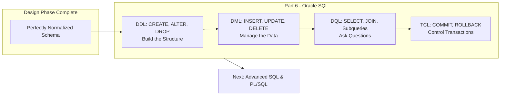
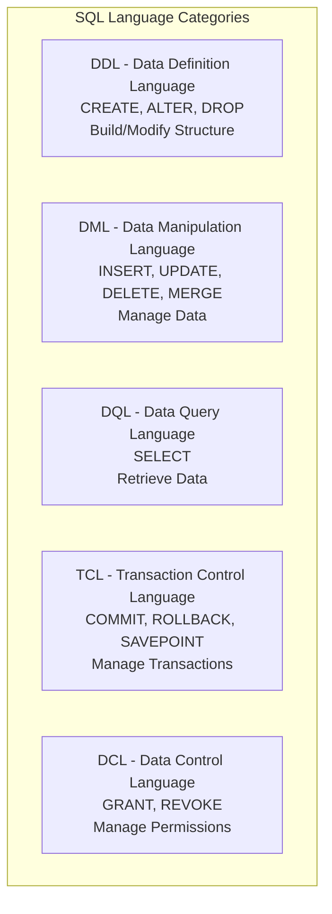
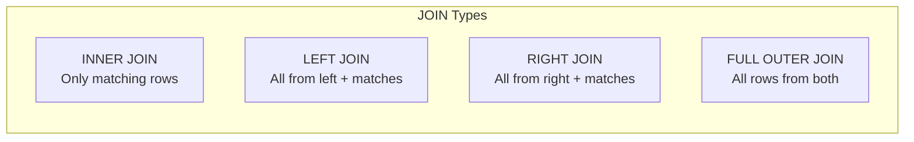
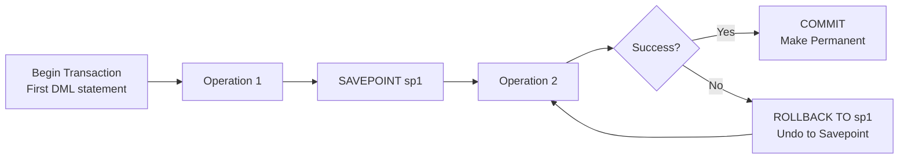
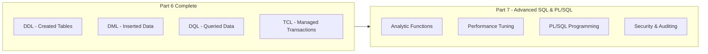

## The Big Picture Flow (Theory → Practice)



**Bridge**: We spent 5 parts designing the perfect database schema. Now we finally **build it**. SQL (Structured Query Language) is the language we use to talk to the database. Oracle SQL has its own personality—**knowing Oracle-specific syntax** is what separates a junior from a senior in enterprise environments.

---

## 1. What is Oracle SQL?

### 1. Big Picture
Oracle SQL is the implementation of the SQL standard used by Oracle Database—one of the most powerful and widely used enterprise RDBMS in the world. Banks, governments, and Fortune 500 companies run on Oracle.

### 2. Simple Explanation
Oracle SQL is like the **standard SQL you know, but with extra superpowers**. It has the same `SELECT`, `INSERT`, `UPDATE`, `DELETE` commands, but adds Oracle-specific data types, functions, and performance features designed for massive enterprise workloads.

### 3. Key Terms
- **SQL\*Plus**: Oracle's command-line interface for executing SQL.
- **SQL Developer**: Oracle's free GUI tool for database development.
- **PL/SQL**: Oracle's procedural extension to SQL (allows loops, conditions, functions).
- **MVCC (Multi-Version Concurrency Control)**: Oracle's mechanism for read consistency—every query sees a consistent snapshot of data, even while others are modifying it.

---

## 2. SQL Language Categories in Oracle

### 1. Big Picture
Oracle SQL is divided into **five language categories**, each serving a different purpose. Understanding this classification is crucial for both exams and real-world work.

### 2. Simple Explanation
Think of it like a toolbox with different drawers:



### 3. Key Terms

| Category | Commands | Purpose | Auto-Commit? |
| :--- | :--- | :--- | :--- |
| **DDL** | `CREATE`, `ALTER`, `DROP`, `TRUNCATE` | Define/modify database structure | **Yes** (implicit commit) |
| **DML** | `INSERT`, `UPDATE`, `DELETE`, `MERGE` | Add/change/delete data | **No** (needs explicit COMMIT) |
| **DQL** | `SELECT` | Retrieve data | N/A (read-only) |
| **TCL** | `COMMIT`, `ROLLBACK`, `SAVEPOINT` | Control transactions | N/A |
| **DCL** | `GRANT`, `REVOKE` | Manage user permissions | **Yes** |

---

## 3. Oracle Data Types

### 1. Big Picture
Choosing the right data type is like choosing the right container—use the wrong one and you waste space or lose data.

### 2. Simple Explanation
Oracle has its own set of data types. The most common ones you'll use daily:

| Data Type | Description | Example |
| :--- | :--- | :--- |
| **VARCHAR2(n)** | Variable-length string (max 4000 bytes). **Use this for text.** | `VARCHAR2(50)` → "John" |
| **CHAR(n)** | Fixed-length string (padded with spaces). Rarely used. | `CHAR(10)` → "John      " |
| **NUMBER(p,s)** | Numeric values. p = precision (total digits), s = scale (decimal places). | `NUMBER(10,2)` → 12345.67 |
| **DATE** | Date and time (accurate to the second). | `'01-JAN-2024'` |
| **TIMESTAMP** | Date with fractional seconds and timezone support. | `'01-JAN-2024 14:30:25.123'` |
| **CLOB** | Large text (up to 4GB). | Entire documents, JSON |
| **BLOB** | Binary data (up to 4GB). | Images, PDFs, audio |

### 3. Software Engineer Perspective
- **Always use `VARCHAR2`** over `CHAR`—it saves space and is more flexible.
- `NUMBER` without precision defaults to `NUMBER(38)`—be explicit.
- **Dates** in Oracle are tricky—always use `TO_DATE()` for safety, never rely on implicit conversion.

---

## 4. DDL – Data Definition Language

### 1. Big Picture
DDL is how we **create the skeleton** of our database—tables, constraints, indexes, and views.

### 2. Simple Explanation
Think of DDL as **architectural blueprints**. You design the rooms (tables), walls (columns), and doors (keys) before anyone moves in.

### 3. Key DDL Commands

#### CREATE TABLE

```sql
CREATE TABLE students (
    student_id    NUMBER(10)    PRIMARY KEY,
    first_name    VARCHAR2(50)  NOT NULL,
    last_name     VARCHAR2(50)  NOT NULL,
    email         VARCHAR2(100) UNIQUE,
    date_of_birth DATE,
    created_at    DATE          DEFAULT SYSDATE
);
```

**Key Points:**
- `PRIMARY KEY` ensures uniqueness + NOT NULL
- `UNIQUE` allows one NULL (Oracle treats NULLs as distinct)
- `NOT NULL` enforces mandatory values
- `DEFAULT SYSDATE` automatically populates with current date/time

#### ALTER TABLE

```sql
-- Add a new column
ALTER TABLE students ADD phone VARCHAR2(20);

-- Add a foreign key
ALTER TABLE enrollments 
ADD CONSTRAINT fk_student 
FOREIGN KEY (student_id) 
REFERENCES students(student_id);

-- Modify a column
ALTER TABLE students MODIFY email VARCHAR2(150);
```

#### DROP TABLE

```sql
-- Permanently remove table and all data
DROP TABLE students;

-- Remove table but keep structure for recovery (flashback)
DROP TABLE students PURGE;  -- Permanent deletion
```

### 4. Exam Perspective
- **DDL vs DML** difference is a classic question.
- **Implicit commit** in DDL—once you run `CREATE TABLE`, you can't roll it back.
- **Constraints** types: PRIMARY KEY, FOREIGN KEY, UNIQUE, CHECK, NOT NULL.

---

## 5. DML – Data Manipulation Language

### 1. Big Picture
DML is how we **populate and modify** the data inside our tables.

### 2. Simple Explanation
If DDL builds the house, DML is how you **move furniture in, rearrange it, and throw things out**.

### 3. INSERT – Adding Data

```sql
-- Basic INSERT (order must match table columns)
INSERT INTO students VALUES (101, 'Alice', 'Smith', 'alice@email.com', '01-JAN-2000', SYSDATE);

-- INSERT with column list (safer, explicit)
INSERT INTO students (student_id, first_name, last_name, email)
VALUES (102, 'Bob', 'Johnson', 'bob@email.com');

-- INSERT with DEFAULT and NULL
INSERT INTO students (student_id, first_name, last_name, email, date_of_birth)
VALUES (103, 'Carol', 'White', NULL, DEFAULT);

-- INSERT from another table (bulk insert)
INSERT INTO students_archive
SELECT * FROM students WHERE date_of_birth < '01-JAN-2000';
```

### 4. UPDATE – Modifying Data

```sql
-- Update specific rows
UPDATE students 
SET email = 'alice.new@email.com' 
WHERE student_id = 101;

-- Update multiple columns
UPDATE students 
SET last_name = 'Johnson-Smith', 
    date_of_birth = '15-FEB-2000'
WHERE student_id = 102;

-- Update using values from another table
UPDATE students s
SET s.email = (SELECT email FROM temp_students t WHERE t.student_id = s.student_id)
WHERE EXISTS (SELECT 1 FROM temp_students t WHERE t.student_id = s.student_id);
```

### 5. DELETE – Removing Data

```sql
-- Delete specific rows
DELETE FROM students WHERE student_id = 103;

-- Delete all rows (can be rolled back!)
DELETE FROM students;

-- TRUNCATE - faster, cannot be rolled back (DDL!)
TRUNCATE TABLE students;
```

### 6. MERGE – Upsert (Insert or Update)

```sql
-- If student exists, update; if not, insert
MERGE INTO students s
USING temp_students t
ON (s.student_id = t.student_id)
WHEN MATCHED THEN
    UPDATE SET s.email = t.email, s.last_name = t.last_name
WHEN NOT MATCHED THEN
    INSERT (student_id, first_name, last_name, email)
    VALUES (t.student_id, t.first_name, t.last_name, t.email);
```

### 7. Software Engineer Perspective
- **Always use column lists** in `INSERT`—it makes your code resilient to schema changes.
- **Always use `WHERE`** in `UPDATE` and `DELETE`—forgetting it updates/deletes **EVERYTHING**.
- **Test with `SELECT` first**: Write `SELECT * FROM students WHERE ...` before writing `DELETE`.
- **MERGE** is a lifesaver for ETL (Extract-Transform-Load) jobs.

---

## 6. DQL – Data Query Language (SELECT)

### 1. Big Picture
`SELECT` is the most used SQL command. It's how we **ask questions** of our data.

### 2. Simple Explanation
Think of `SELECT` as a **question** to the database: "Give me this data, filtered this way, sorted that way."

### 3. Basic SELECT

```sql
-- All columns, all rows
SELECT * FROM students;

-- Specific columns
SELECT student_id, first_name, last_name FROM students;

-- With filter
SELECT * FROM students WHERE date_of_birth > '01-JAN-2000';

-- With sorting
SELECT * FROM students ORDER BY last_name ASC, first_name DESC;

-- With aggregation
SELECT COUNT(*) AS total_students FROM students;
SELECT AVG(salary) AS avg_salary FROM employees;
```

### 4. JOINs – Combining Tables



```sql
-- INNER JOIN: Only students with enrollments
SELECT s.first_name, s.last_name, c.course_name, e.grade
FROM students s
INNER JOIN enrollments e ON s.student_id = e.student_id
INNER JOIN courses c ON e.course_id = c.course_id;

-- LEFT JOIN: All students, even those without enrollments
SELECT s.first_name, s.last_name, COUNT(e.course_id) AS courses_taken
FROM students s
LEFT JOIN enrollments e ON s.student_id = e.student_id
GROUP BY s.first_name, s.last_name;
```

### 5. Subqueries – Nested Questions

```sql
-- Single-row subquery (returns one value)
SELECT first_name, last_name
FROM students
WHERE date_of_birth = (SELECT MIN(date_of_birth) FROM students);

-- Multi-row subquery (returns multiple values)
SELECT first_name, last_name
FROM students
WHERE student_id IN (SELECT student_id FROM enrollments WHERE course_id = 101);

-- Correlated subquery (references outer query)
SELECT s.first_name, s.last_name
FROM students s
WHERE (SELECT COUNT(*) FROM enrollments e WHERE e.student_id = s.student_id) > 3;
```

### 6. Set Operators

```sql
-- UNION: Combine results, remove duplicates
SELECT student_id FROM enrollments WHERE course_id = 101
UNION
SELECT student_id FROM enrollments WHERE course_id = 102;

-- UNION ALL: Combine results, keep duplicates (faster)
SELECT student_id FROM enrollments WHERE course_id = 101
UNION ALL
SELECT student_id FROM enrollments WHERE course_id = 102;

-- INTERSECT: Only rows in both
SELECT student_id FROM enrollments WHERE course_id = 101
INTERSECT
SELECT student_id FROM enrollments WHERE course_id = 102;

-- MINUS: Rows in first but not second
SELECT student_id FROM enrollments WHERE course_id = 101
MINUS
SELECT student_id FROM enrollments WHERE course_id = 102;
```

### 7. Oracle-Specific Features

```sql
-- ROWNUM: Limit results (Oracle's way of pagination)
SELECT * FROM students WHERE ROWNUM <= 10;

-- ROW_NUMBER(): Ranking with pagination
SELECT * FROM (
    SELECT s.*, ROW_NUMBER() OVER (ORDER BY student_id) AS rn
    FROM students s
) WHERE rn BETWEEN 11 AND 20;

-- DECODE: Oracle's CASE alternative
SELECT first_name,
       DECODE(gender, 'M', 'Male', 'F', 'Female', 'Other') AS gender_label
FROM students;

-- Hierarchical queries (org charts, categories)
SELECT employee_id, manager_id, LEVEL
FROM employees
START WITH manager_id IS NULL
CONNECT BY PRIOR employee_id = manager_id;
```

---

## 7. TCL – Transaction Control

### 1. Big Picture
Transactions ensure that a group of operations **succeed together or fail together**—the foundation of data integrity.

### 2. Simple Explanation
Think of a transaction like a **bank transfer**: you debit account A and credit account B. If either fails, both must be undone. A transaction is that "all or nothing" unit.

### 3. Transaction Commands



```sql
-- Start a transaction (implicitly begins with first DML)
INSERT INTO accounts (account_id, balance) VALUES (101, 500);

-- Set a savepoint
SAVEPOINT before_transfer;

-- Perform operations
UPDATE accounts SET balance = balance - 200 WHERE account_id = 101;
UPDATE accounts SET balance = balance + 200 WHERE account_id = 102;

-- Check if everything is correct
-- If something is wrong:
ROLLBACK TO SAVEPOINT before_transfer;  -- Undo only the transfer

-- If everything is correct:
COMMIT;  -- Make it permanent

-- Rollback entire transaction (undo everything since last COMMIT)
ROLLBACK;  -- -- Undo all uncommitted changes
```

### 4. Key Transaction Properties (ACID)

| Property | Meaning | How Oracle Implements It |
| :--- | :--- | :--- |
| **Atomicity** | All or nothing | Undo segments store before-images for rollback |
| **Consistency** | Data remains valid | Constraints enforced automatically |
| **Isolation** | Transactions don't interfere | MVCC provides read consistency |
| **Durability** | Committed data persists | REDO logs ensure recovery after crash |

### 5. Software Engineer Perspective
- **Always use transactions** for operations that modify multiple tables.
- **Set savepoints** in long transactions to allow partial rollbacks.
- **Never auto-commit** in production code—control transactions explicitly.
- **DDL commits implicitly**—be careful mixing DDL and DML in the same transaction.

---

## 8. Oracle vs MySQL: Key Differences

### 1. Big Picture
As a software engineer, you'll likely work with multiple databases. Knowing Oracle-specific quirks saves you from painful debugging.

### 2. Comparison Table

| Feature | Oracle | MySQL |
| :--- | :--- | :--- |
| **String Type** | `VARCHAR2` | `VARCHAR` |
| **String Concatenation** | `||` (e.g., `'Hello' || ' World'`) | `CONCAT()` or `||` |
| **Date Literals** | `TO_DATE('01-JAN-2024', 'DD-MON-YYYY')` | `'2024-01-01'` |
| **Limit Results** | `ROWNUM <= 10` or `FETCH FIRST 10 ROWS ONLY` | `LIMIT 10` |
| **Auto-Increment** | `SEQUENCE` + `TRIGGER` | `AUTO_INCREMENT` |
| **Transaction Commit** | Implicit for DDL, explicit for DML | Depends on storage engine (InnoDB supports transactions) |
| **NULL in UNIQUE** | Multiple NULLs allowed | Multiple NULLs allowed (in most engines) |
| **Case Sensitivity** | **Case-insensitive** for object names | **Case-sensitive** on Linux |

### 3. Real World Example

```sql
-- Oracle
SELECT first_name || ' ' || last_name AS full_name
FROM students
WHERE ROWNUM <= 10;

-- MySQL
SELECT CONCAT(first_name, ' ', last_name) AS full_name
FROM students
LIMIT 10;
```

---

## 9. Software Engineer Perspective

### How We Use Oracle SQL Daily

1. **Schema Design**: Write `CREATE TABLE` with proper constraints.
2. **Data Migration**: Use `INSERT INTO ... SELECT` to move data.
3. **Reporting**: Write complex `SELECT` with joins, subqueries, and aggregations.
4. **ETL Jobs**: Use `MERGE` for upsert operations.
5. **Performance Tuning**: Use `EXPLAIN PLAN` to understand query execution.
6. **Transaction Management**: Wrap DML in transactions with `COMMIT`/`ROLLBACK`.

### Best Practices

- **Use bind variables** in application code (prevents SQL injection, improves performance).
- **Always use column lists** in `INSERT`.
- **Test `DELETE`/`UPDATE` with `SELECT` first**.
- **Use `EXPLAIN PLAN`** to optimize slow queries.
- **Never trust implicit date conversion**—use `TO_DATE()`.

---

## 10. Exam Perspective

### Frequently Asked Questions

| Question Type | What to Cover |
| :--- | :--- |
| **Define** | DDL, DML, DQL, TCL, DCL with examples |
| **Difference** | DDL vs DML, COMMIT vs ROLLBACK, DELETE vs TRUNCATE |
| **Write SQL** | CREATE TABLE, INSERT, UPDATE, DELETE, SELECT with JOINs |
| **Explain** | ACID properties, transaction management |
| **Oracle-specific** | VARCHAR2, ROWNUM, SEQUENCE, SYSDATE |

### Common Exam Questions

1. *"What is the difference between DDL and DML?"*
2. *"Write a SQL query to find students who have taken more than 5 courses."*
3. *"Explain the purpose of COMMIT and ROLLBACK with an example."*
4. *"What is a transaction? Explain ACID properties."*
5. *"Differentiate between DELETE and TRUNCATE."*

---

## 11. Common Mistakes

| Mistake | Why It's Wrong | The Fix |
| :--- | :--- | :--- |
| **Forgetting WHERE in UPDATE/DELETE** | Updates/deletes ALL rows | Always write WHERE, test with SELECT first |
| **Mixing DDL and DML** | DDL auto-commits, breaking transaction control | Keep DDL separate from transaction logic |
| **Not using TO_DATE()** | Implicit conversion fails with different NLS settings | Always use `TO_DATE('2024-01-01', 'YYYY-MM-DD')` |
| **Using CHAR instead of VARCHAR2** | Wastes space with padding | Use `VARCHAR2` for variable-length strings |
| **Forgetting COMMIT** | Data not persisted, lost on session end | Always COMMIT after successful DML |
| **Assuming MySQL syntax works** | Oracle has different syntax (ROWNUM vs LIMIT) | Learn Oracle-specific syntax |

---

## 12. Quick Revision Box

- **DDL** = Structure (`CREATE`, `ALTER`, `DROP`) – **auto-commits**
- **DML** = Data (`INSERT`, `UPDATE`, `DELETE`, `MERGE`) – **needs COMMIT**
- **DQL** = Query (`SELECT`) – read-only
- **TCL** = Transactions (`COMMIT`, `ROLLBACK`, `SAVEPOINT`)
- **DCL** = Permissions (`GRANT`, `REVOKE`)
- **Oracle Strings**: Use `VARCHAR2`, not `VARCHAR`
- **Oracle Dates**: Always use `TO_DATE()` for safety
- **Oracle Pagination**: `ROWNUM` or `FETCH FIRST`
- **Transactions**: All or nothing—COMMIT to save, ROLLBACK to undo

---

## Mindset Summary – Connecting to Part 7



- **SQL is your primary tool** as a database developer. Master it.
- **Oracle has quirks**—learn them, don't fight them.
- **Transactions are sacred**—always control them explicitly.
- **Test before you execute**—`SELECT` before `DELETE`, `SELECT` before `UPDATE`.

In **Part 7**, we'll go deeper into **advanced SQL**—analytic functions, performance tuning, indexes, and PL/SQL programming. This is where you move from "knows SQL" to "can optimize enterprise databases."

---
