## The Big Picture Flow (Where Are We?)

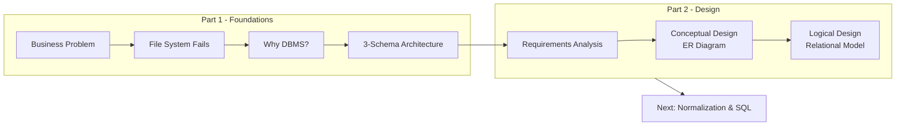

**Bridge**: We know *why* we need databases and the architecture that supports them. Now we learn *how* to design them. **ERD (Entity-Relationship Diagram)** is the blueprint – it translates business requirements into a visual data model that everyone (developers, stakeholders, DBAs) can understand before we write a single line of SQL. As Hoffer states in "Modern Database Management": *"The ER model is a detailed, logical representation of the data for an organization."*

---

## 1. The Database Design Process (Academic Foundation)

### 1. Big Picture
Designing a database without a plan is like building a skyscraper without an architect's drawing. You *will* end up with a mess. The design process ensures we capture the business rules correctly and create a structure that is **flexible**, **efficient**, and **maintainable**.

### 2. Simple Explanation
It's a 3-step zoom-in (mapping to the 3-schema architecture):
1.  **Conceptual (ERD)**: What data? High-level, no tech details. Maps to the **Conceptual Schema**.
2.  **Logical (Relational)**: How to organise it? Tables, columns, primary/foreign keys. Maps to the **Logical/Conceptual level** with implementation details.
3.  **Physical (Storage)**: Where and how to store it? Indexes, partitions, hardware. Maps to the **Internal Schema**.

This Part focuses on step 1 (Conceptual/ERD) and introduces step 2 through mapping rules.

### 3. Key Academic Definitions (Hoffer)
- **Entity**: A person, place, object, event, or concept in the user environment about which the organization wishes to maintain data.
- **Relationship**: An association between entities.
- **Attribute**: A property or characteristic of an entity or relationship.
- **Business Rule**: A statement that defines or constrains some aspect of the business. It is the foundation of ERD design.

### 4. Software Engineer Perspective
We start every project with **requirements gathering** (user stories, interviews). The ERD is our **contract with the business** – it validates that we understand the domain before we write code. Modern tools like **dbdiagram.io**, **Draw.io**, or **Lucidchart** allow us to version-control ERDs as code (DSL).

### 5. Exam Perspective
- **Define** the database design process phases.
- **Explain** why each phase is crucial.
- **Map** each phase to the 3-schema architecture.
- This is a fundamental question – be prepared for a 5-mark essay.

---

## 2. The Entity-Relationship (ER) Model – Core Components

### 1. Big Picture
The ER Model is a **visual language** to describe the structure of a database. It uses three core building blocks: **Entities** (nouns), **Attributes** (adjectives), and **Relationships** (verbs). It is the foundation of conceptual database design.

### 2. Simple Explanation
Think of an ERD as a **relationship map**:
- **Entities** are the "things" we store data about (e.g., **Student**).
- **Attributes** are the "details" (e.g., Name, Age).
- **Relationships** are the "connections" (e.g., Student **enrols in** Course).

### 3. The ER Model Overview

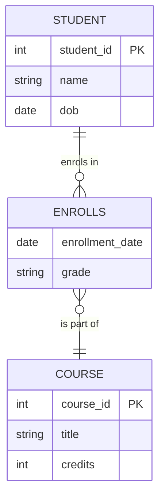

### 4. Key Terms (Academic)
- **Entity Type**: A collection of entities that share common properties (e.g., STUDENT).
- **Entity Instance**: A specific occurrence of an entity type (e.g., the student "John Smith").
- **Attribute Type**: A property of an entity type (e.g., Name).
- **Attribute Value**: A specific value for an attribute instance (e.g., "John").
- **Relationship Type**: An association between entity types.
- **Relationship Instance**: A specific occurrence of a relationship (e.g., John enrolled in CS101).

---

## 3. Entities & Entity Types – Advanced Classification

### 1. Big Picture
Entities are the **nouns** of your system. Identifying them correctly is the most critical step – miss an entity and your database is incomplete. Hoffer emphasizes that entities should be **independent** and **identifiable**.

### 2. Simple Explanation
An entity is a real-world object or concept that is distinguishable from others. It becomes a **table** later. There are two main types:

### 3. Strong vs Weak Entities

| Aspect | Strong Entity | Weak Entity |
| :--- | :--- | :--- |
| **Definition** | Exists independently. Has its own primary key. | Exists only because of another entity (owner). Has no primary key of its own. |
| **Identification** | Identified by its own attributes. | Identified by a **foreign key** + a **discriminator** (partial key). |
| **Example** | `Student` | `Dependent` (of an `Employee`) |
| **Notation** | Single rectangle | Double rectangle |
| **Existence** | Independent existence | Existence-dependent on owner |

### 4. Associative Entities (The "Bridge" Concept)

### 1. Big Picture
Sometimes a relationship has **attributes** of its own and participates in other relationships. An **associative entity** is an entity that represents a relationship between other entities, effectively making the relationship an entity itself.

### 2. Simple Explanation
Think of `Enrollment` – it's not just a relationship between `Student` and `Course`; it has attributes like `Grade`, `EnrollmentDate`, and may relate to other entities like `Instructor` (who taught that specific enrollment). This makes it an **associative entity**.

### 3. When to Use an Associative Entity (Hoffer's Rules)
1. The relationship has attributes of its own.
2. The relationship participates in other relationships.
3. The relationship has a many-to-many cardinality that needs resolution.

### 4. Visual Comparison

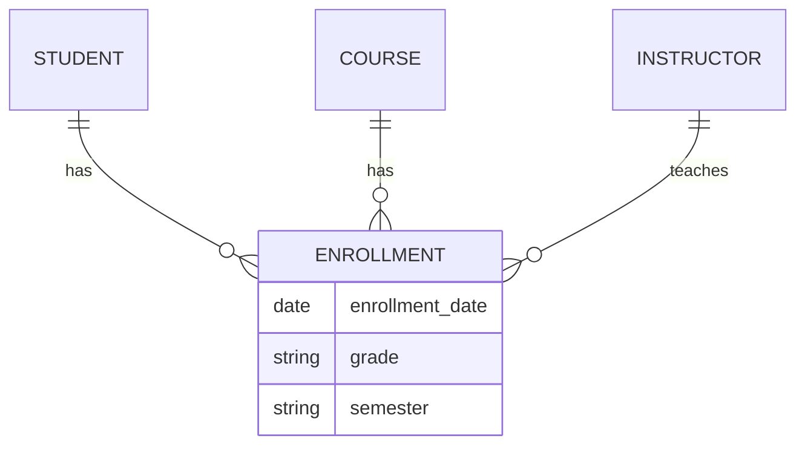

### 5. Software Engineer Perspective
In ORMs, associative entities map to **junction tables** with additional columns. For example, in Spring Boot JPA, an `@Entity` class `Enrollment` with `@ManyToOne` relationships to `Student` and `Course`, plus its own fields like `grade`.

### 6. Exam Perspective
- **Differentiate** strong vs weak entities.
- **Define** associative entities and explain when to use them.
- **Identify** weak entities in a given scenario.

---

## 4. Attributes – Advanced Classification

### 1. Big Picture
Attributes describe the properties of entities. Choosing the right types and structures prevents data anomalies and improves query performance. Hoffer classifies attributes into multiple categories based on structure and usage.

### 2. Simple Explanation
Attributes are like the **fields** in a form. We classify them to decide how they will be stored.

### 3. Comprehensive Attribute Taxonomy

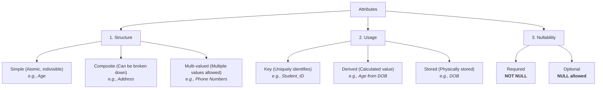

### 4. Detailed Attribute Classification

| Attribute Type | Description | Example | How to Store |
| :--- | :--- | :--- | :--- |
| **Simple (Atomic)** | Cannot be divided. | `Age`, `Salary` | Direct column |
| **Composite** | Can be divided into smaller parts. | `FullName` → `FirstName`, `LastName` | Split into multiple columns |
| **Multi-valued** | Holds multiple values. | `PhoneNumbers` (home, work, mobile) | Create separate table |
| **Derived** | Calculated from other data. | `Age` (from `DOB`) | **Do not store** – compute in query |
| **Stored** | Physically stored. | `DOB` | Direct column |
| **Key** | Uniquely identifies an entity. | `Student_ID` | Primary Key |
| **Optional** | NULL allowed. | `MiddleName` | Column with NULL allowed |

### 5. Real World Example
- **E-commerce**: `Product` has `Product_ID` (key), `Name` (simple), `Dimensions` (composite: height, width, depth), `Colors` (multi-valued), `Profit` (derived from price – cost).
- **Banking**: `Customer` has `Customer_ID` (key), `FullName` (composite), `Account_Type` (single-valued).

### 6. Software Engineer Perspective
- **Multi-valued** attributes are avoided in relational tables – we create separate tables for them (normalisation).
- **Derived** attributes are usually not stored; we calculate them in queries or application code to save storage and keep data consistent.
- **Composite** attributes are often split into separate fields for easier searching (e.g., search by last name).

### 7. Exam Perspective
- **List types** of attributes with examples.
- **Explain** which attributes are stored vs derived.
- **Question**: "Which type of attribute is 'Age'?" – Derived.
- **Key** is always underlined in ER diagrams.

### 8. Common Mistakes
- Storing derived attributes (bad practice) – leads to stale data.
- Forgetting to split multi-valued attributes – leads to repeating groups (violates 1NF).
- Confusing composite attributes with multi-valued attributes.

### 9. Quick Revision Box
- **Key** = unique identifier (underline it).
- **Composite** = split into smaller parts.
- **Multi-valued** = need a new table.
- **Derived** = compute, don't store.

---

## 5. Relationships & Cardinality Constraints

### 1. Big Picture
Relationships are the **verbs** that connect entities. The most critical part of ERD is getting the **cardinality** right – it defines the business rules (e.g., "One customer can have many orders"). Hoffer emphasizes that cardinality constraints are **maximum** constraints, while **modality** constraints are **minimum** constraints.

### 2. Simple Explanation
Cardinality defines the **maximum** number of relationships an entity can participate in. Modality defines the **minimum** (whether participation is mandatory or optional).

### 3. Cardinality Types (Binary Relationships)

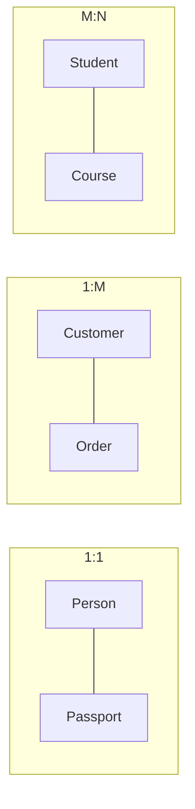

### 4. Cardinality vs Modality (Hoffer's Distinction)

| Constraint | What It Defines | Symbol (Chen) | Symbol (Crow's Foot) |
| :--- | :--- | :--- | :--- |
| **Cardinality (Maximum)** | Max number of relationships | `1`, `N`, `M` | `|` (one), < (many/fork) |
| **Modality (Minimum)** | Min number of relationships | Double line (total) vs Single line (partial) | Solid line (mandatory) vs Dashed line (optional) |

### 5. Participation Constraints (Modality)

| Participation | Meaning | Example |
| :--- | :--- | :--- |
| **Total Participation** | Every entity instance must participate in the relationship. | Every `Employee` must belong to a `Department`. |
| **Partial Participation** | Some entity instances may not participate. | Some `Employees` may not manage any `Projects`. |

### 6. Real World Example
- **University**: `Student` enrolls in `Course`.
    - Cardinality: M:N (many students to many courses).
    - Modality: Total participation for `Student` (every student must enroll in at least one course) and `Course` (every course must have at least one student).
- **Hospital**: `Patient` has `Appointment`.
    - Cardinality: 1:M (one patient can have many appointments).
    - Modality: Partial participation for `Patient` (a patient may not have any appointments yet).

### 7. Software Engineer Perspective
- **Cardinality** directly dictates **Foreign Key** placement.
- In 1:M, place the FK on the "Many" side (e.g., `Order` gets `customer_id`).
- In M:N, we must create a **junction table** (e.g., `Enrollment` with `student_id` and `course_id`). This junction table often gains its own attributes (like `grade`, `enrollment_date`).
- **Participation** affects whether a FK can be `NULL`. Total participation = `NOT NULL`.

### 8. Exam Perspective
- **Draw** cardinalities (Crow's Foot vs Chen notation).
- **Identify** cardinality from a given business rule.
- **State** why M:N is problematic and how to resolve it.
- **Explain** total vs partial participation with examples.

### 9. Common Mistakes
- Confusing **cardinality** (max) with **participation** (min).
- Trying to implement M:N directly as a single table.
- Forgetting that a relationship can have **attributes** (e.g., `Enrolment` has `Grade` – this becomes an attribute of the junction table).

---

## 6. Supertype/Subtype Hierarchies (Specialization & Generalization)

### 1. Big Picture
Real-world entities often have **hierarchies**. A `Manager` is an `Employee` with extra attributes. A `Car` and `Truck` are both `Vehicles`. The ER model extends to handle **inheritance** through supertype/subtype relationships.

### 2. Simple Explanation
- **Supertype**: The parent entity (generic).
- **Subtype**: The child entity (specific). It inherits all attributes of the supertype and adds its own.
- **Specialization**: Top-down process – splitting a supertype into subtypes.
- **Generalization**: Bottom-up process – combining subtypes into a supertype.

### 3. Visualizing Inheritance

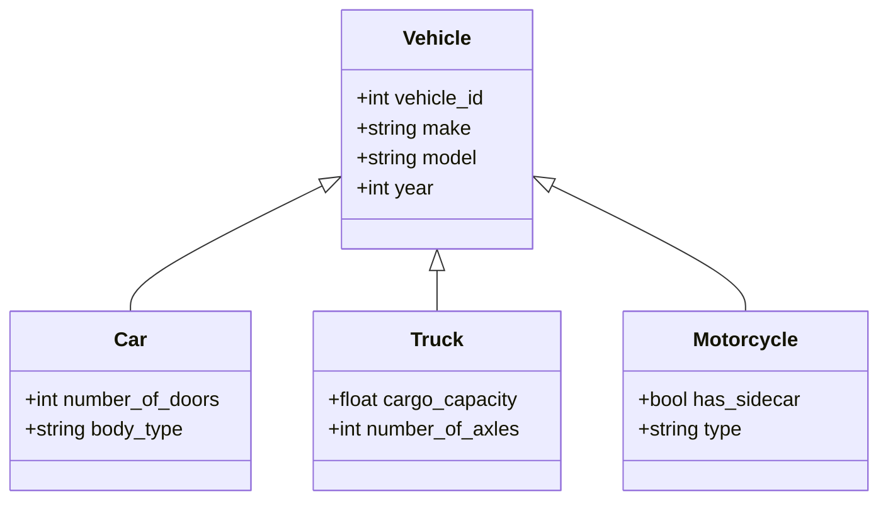

### 4. Disjointness & Completeness Constraints (Hoffer)

| Constraint | Symbol | Meaning | Example |
| :--- | :--- | :--- | :--- |
| **Disjoint** | `d` | An instance can belong to **only one** subtype. | `Employee` is either `Developer` or `Manager`, never both. |
| **Overlap** | `o` | An instance can belong to **multiple** subtypes. | `Person` can be both `Student` and `Employee`. |
| **Total** (Completeness) | Double line | Every supertype instance **must** be in at least one subtype. | Every `Vehicle` must be either a `Car` or `Truck`. |
| **Partial** | Single line | A supertype instance **may** not belong to any subtype. | A `Person` may not be a `Student` or `Employee`. |

### 5. Real World Example
- **Banking**: `Account` (supertype) → `SavingsAccount`, `CheckingAccount`, `FixedDepositAccount`.
    - **Disjoint** (an account is one type only).
    - **Total** (every account must be one of these).
- **University**: `Person` (supertype) → `Student`, `Faculty`, `Staff`.
    - **Overlap** (a student can also be staff – e.g., teaching assistant).
    - **Partial** (a visitor can be in the system but not a student/staff).

### 6. Software Engineer Perspective
This maps **directly** to OOP inheritance (extends/implements). In ORM (Hibernate, Entity Framework), we use `@Inheritance` strategies:
- **Single Table**: One table for supertype + all subtypes (discriminator column).
- **Joined Table**: Separate tables for supertype and each subtype (joined by FK).
- **Table per Class**: Separate table for each subtype (repeating supertype columns).

### 7. Exam Perspective
- **Define** specialization and generalization.
- **Explain** the difference between disjoint and overlap.
- **Explain** total vs partial participation in this context.
- **Identify** constraints from a given scenario.

### 8. Common Mistakes
- Confusing **disjoint** with **total** – they are independent constraints.
- Forgetting that **subtypes inherit all attributes** of the supertype – don't repeat them.
- Not handling the **discriminator attribute** (the attribute that tells which subtype an instance belongs to – e.g., `account_type`).

---

## 7. Advanced Relationship Types

### 1. Big Picture
Beyond simple binary relationships, real-world scenarios involve **recursive** connections, **ternary** relationships, and **aggregation**. These require careful modelling to capture business rules correctly.

### 2. Simple Explanation
- **Unary/Recursive**: Entity relates to itself (e.g., `Employee` manages `Employee`).
- **Binary**: Two entities relate (most common).
- **Ternary**: Three entities relate (e.g., `Doctor`, `Patient`, `Hospital` together form an `Appointment`).
- **Aggregation**: A relationship is treated as a higher-level entity.

### 3. Unary/Recursive Relationships

| Type | Description | Example | How to Map |
| :--- | :--- | :--- | :--- |
| **1:1 Recursive** | One instance relates to one other instance of the same type. | Person marries Person. | Add a FK to the same table (e.g., `spouse_id`). |
| **1:M Recursive** | One instance relates to many instances of the same type. | Employee manages Employee. | Add a FK `manager_id` to `Employee` table. |
| **M:N Recursive** | Many instances relate to many instances of the same type. | Product contains Product (Bill of Materials). | Junction table with two FKs to the same table. |

### 4. Recursive 1:M Example

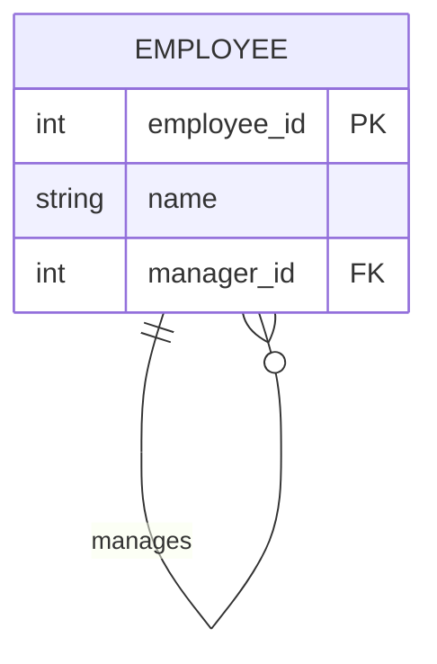

### 5. Ternary Relationships

### 1. Big Picture
Sometimes, an association involves **three** entities simultaneously. A ternary relationship is a relationship of degree 3.

### 2. Simple Explanation
Think of a `Project` assignment: a `Consultant` is assigned to a `Client` for a specific `Project`. The assignment involves all three entities together – you can't assign a consultant to a client without a project, nor to a project without a client.

### 3. Ternary Example

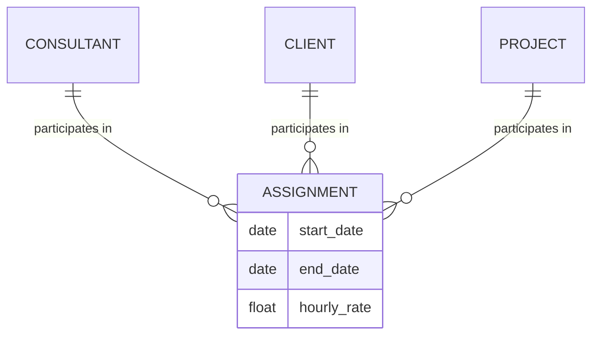

### 4. Aggregation (Relationship of Relationships)

### 1. Big Picture
Aggregation is used when a **relationship** needs to relate to another entity. It treats the relationship as a higher-level entity.

### 2. Simple Explanation
Consider `Employee` **works on** `Project`. The `Works_On` relationship has attributes like `hours`. Now, suppose we need to track which `Tool` was used for that specific assignment. The `Tool` is related to the `Works_On` relationship, not directly to `Employee` or `Project`. Aggregation lets us connect `Tool` to `Works_On`.

### 3. Aggregation Example

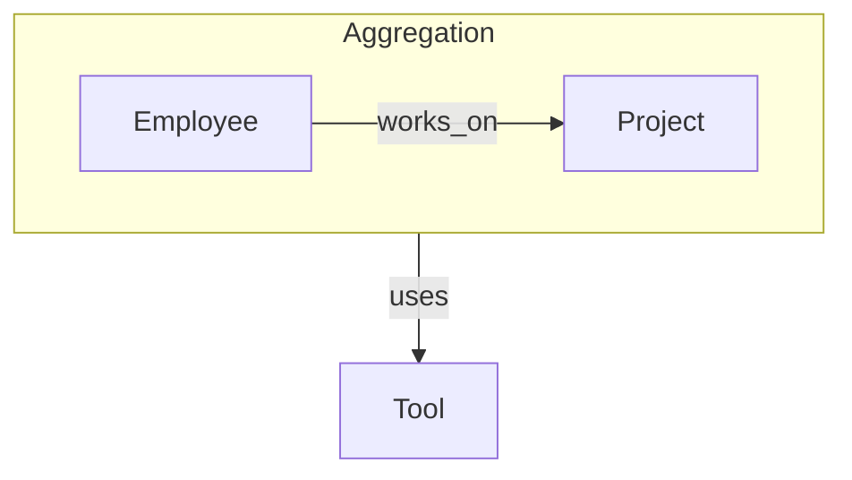

### 5. Software Engineer Perspective
- **Recursive relationships** are common in hierarchical data (org charts, product catalogs, category trees).
- **Ternary relationships** are rare but appear in complex scheduling and resource allocation.
- **Aggregation** is implemented by creating a table for the relationship (e.g., `Works_On`) and then a separate table linking it to the related entity (e.g., `Works_On_Tool`).

### 6. Exam Perspective
- **Define** recursive, ternary, and aggregation relationships.
- **Provide examples** of each.
- **Explain** how to map each to relational tables.

---

## 8. ERD Notations – Chen vs Crow's Foot

### 1. Big Picture
ERDs are useless if no one can read them. Standard notations ensure we communicate clearly. **Chen** is academic; **Crow's Foot** is industry standard (used in tools like Lucidchart, DataGrip, dbdiagram.io).

### 2. Simple Explanation
- **Chen**: Uses diamonds for relationships, ellipses for attributes. Very precise but gets messy for large diagrams.
- **Crow's Foot**: Uses lines with "crows' feet" (three-pronged forks) to indicate "many". Cleaner and more readable for large enterprise models.

### 3. Detailed Comparison

| Feature | Chen Notation | Crow's Foot Notation |
| :--- | :--- | :--- |
| **Entity** | Rectangle | Rectangle |
| **Relationship** | Diamond | Line with labels |
| **1 side** | '1' near entity | Single straight line (`|`) |
| **Many side** | 'N' or 'M' near entity | Three-pronged fork (`<` or `{`) |
| **Total Participation** | Double line | Solid line (vs dashed) |
| **Partial Participation** | Single line | Dashed line |
| **Key Attribute** | Underlined | Not shown (in PK section) |
| **Weak Entity** | Double rectangle | Not standard (use notes) |
| **Multi-valued Attribute** | Double ellipse | Not shown (converted) |

### 4. Crow's Foot Cardinality Symbols

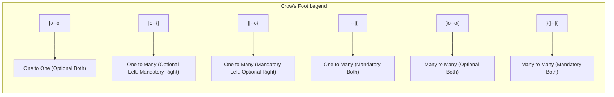

### 5. Reading Crow's Foot
- `|` = exactly one (mandatory)
- `o` = zero or one (optional)
- `{` or `<` = zero or many (optional many)
- `|{` or `|<` = one or many (mandatory many)

### 6. Software Engineer Perspective
We use **Crow's Foot** in design tools because it's intuitive for developers and stakeholders. We map:
- `|` (mandatory) → `NOT NULL` in SQL
- `o` (optional) → `NULL` in SQL
- `{` (many) → collection (List/Set in ORM)

### 7. Exam Perspective
- **Identify** cardinalities from a diagram.
- **Draw** a simple ERD given a scenario (Crow's Foot is usually accepted).
- **Translate** Chen to Crow's Foot or vice versa.

---

## 9. How to Draw an ERD – Step-by-Step Syntax

### 1. Big Picture
Facing a blank page is scary. This systematic process turns a messy business description into a clean ERD. This is the **practical procedure** for drawing and validating your diagram.

### 2. Step-by-Step Procedure

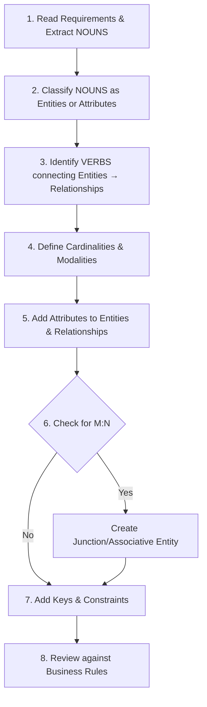

### 3. Detailed Procedure

#### Step 1: Identify Entities (Nouns)
- **What to look for**: Nouns in the business description.
- **Examples**: "A university wants to track **students**, the **courses** they take, and the **grades** they receive. Each **course** is taught by one **professor**."
- **Entities**: Student, Course, Professor.

#### Step 2: Identify Attributes
- **What to look for**: Properties of entities.
- **Examples**: Student (ID, Name, DOB), Course (Code, Title, Credits), Professor (ID, Name, Department).
- **Classify**: Simple vs Composite vs Multi-valued vs Derived.

#### Step 3: Identify Relationships (Verbs)
- **What to look for**: Verbs connecting entities.
- **Examples**: Student **takes** Course, Professor **teaches** Course.

#### Step 4: Determine Cardinality & Modality
- **For each relationship**, ask:
  - What is the maximum number on each side?
  - Is participation mandatory or optional?
- **Examples**: 
  - Student takes Course → M:N (many-to-many).
  - Professor teaches Course → 1:M (one professor teaches many courses).

#### Step 5: Add Keys & Constraints
- **Primary Key**: Unique identifier for each entity.
- **Foreign Key**: Will be added during mapping (logical design).

#### Step 6: Resolve M:N Relationships
- **Rule**: Any M:N relationship becomes an associative entity/junction table.
- **Example**: Student takes Course → Enrollment (StudentID, CourseID, Grade, Date).

#### Step 7: Review Against Business Rules
- **Validation**: Does every rule in the description map to a construct in the diagram?
- **Example**: "Every course must have at least one student" → Total participation of Course in Enrollment.

### 4. Notation Mapping Rules (ERD → Relational Schema)

| ER Construct | Relational Mapping Rule |
| :--- | :--- |
| **Strong Entity** | Create a table with all simple attributes. PK is the entity's key attribute. |
| **Composite Attribute** | Break it down into its constituent parts. |
| **Multi-valued Attribute** | Create a **separate table**. PK is the entity's PK + the attribute value. |
| **Derived Attribute** | **Do not store** – compute in query. |
| **1:1 Relationship** | Place PK of one side as FK in the other. Usually place on side with **total participation**. |
| **1:M Relationship** | Place PK of the "One" side as FK in the "Many" side table. |
| **M:N Relationship** | Create a **Junction Table**. Include PKs of both entities as composite PK + FKs. |
| **Supertype/Subtype** | Use Single Table, Joined Table, or Table per Class strategy. |
| **Recursive Relationship** | Add a FK to the same table (1:M) or create a junction table (M:N). |

### 5. Software Engineer Perspective
We use tools like **dbdiagram.io** (DSL-based) to define ERDs as code:

```
Table students {
  student_id int [pk]
  name varchar
  dob date
}

Table courses {
  course_id int [pk]
  title varchar
  credits int
}

Table enrollments {
  student_id int [ref: > students.student_id]
  course_id int [ref: > courses.course_id]
  grade varchar
  enrollment_date date
}
```

This approach is **version-controlled** and **reviewable** in pull requests.

---

## 10. Comprehensive Case Studies & Exam Solutions

### 1. Big Picture
The ultimate test of ERD proficiency is applying the theory to complex, real-world scenarios. These case studies simulate university exam questions and industry requirements, providing a complete walkthrough from business description to final ERD.

### 2. Case Study 1: Enterprise Hospital Management System

#### Raw Text Description (Business Rules)

> A large hospital wants to build a comprehensive information system to manage its operations. The hospital has multiple **departments** (e.g., Cardiology, Neurology, Pediatrics), each identified by a unique code and having a name, location, and budget. Each department is managed by exactly one **physician**, and a physician can manage at most one department.
>
> The hospital employs many **physicians** (identified by an employee ID) and **nurses**. For each physician, the system tracks their name, specialty, phone, and email. For nurses, it tracks their name, license number, shift preference, and unit assignment.
>
> **Patients** are admitted to the hospital with a unique patient ID, along with their name, date of birth, contact information, and emergency contact. A patient is admitted to exactly one department, but a department can have many patients at any time.
>
> A **visit** represents a patient's stay in the hospital. Each visit is identified by a visit number and has an admission date, discharge date, and a primary diagnosis. During a visit, a patient is assigned to a primary **physician** (the attending physician) and receives care from multiple **nurses** over the course of their stay. A nurse can be assigned to many visits, and a physician can be the primary for many visits.
>
> The hospital also tracks **medications** prescribed during a visit. Each medication is identified by a drug code, with a name, dosage, and manufacturer. A visit can have many medications prescribed, and a medication can be prescribed to many visits. For each prescription, the system must record the start date, end date, and frequency.

#### Step-by-Step Extraction Breakdown

##### Step 1: Identify Entities (Nouns)
- Department
- Physician
- Nurse
- Patient
- Visit
- Medication

##### Step 2: Identify Attributes
- Department: dept_code (PK), name, location, budget
- Physician: emp_id (PK), name, specialty, phone, email
- Nurse: emp_id (PK), name, license_number, shift_preference, unit
- Patient: patient_id (PK), name, dob, contact, emergency_contact
- Visit: visit_number (PK), admission_date, discharge_date, primary_diagnosis
- Medication: drug_code (PK), name, dosage, manufacturer

##### Step 3: Identify Relationships (Verbs)
1. Department **managed by** Physician → 1:1
2. Physician **works in** Department → M:1
3. Patient **admitted to** Department → M:1
4. Visit **involves** Patient → M:1
5. Visit **has** Physician (Primary) → M:1
6. Visit **has** Nurse → M:M (associative)
7. Visit **has** Medication → M:M (associative)

##### Step 4: Determine Cardinality & Modality
| Relationship | Cardinality | Modality |
| :--- | :--- | :--- |
| Department manages Physician | 1:1 | Total: Dept (must have manager) |
| Physician works in Department | M:1 | Total: Phys (must be in dept) |
| Patient admitted to Department | M:1 | Total: Patient (must be in dept) |
| Visit involves Patient | M:1 | Total: Visit (must have patient) |
| Visit has Primary Physician | M:1 | Total: Visit (must have primary) |
| Visit has Nurse | M:M | Partial: Both (optional) |
| Visit has Medication | M:M | Partial: Both (optional) |

##### Step 5: Resolve M:N with Associative Entities
- Visit has Nurse → `Visit_Nurse` (visit_number, nurse_emp_id, assigned_shift)
- Visit has Medication → `Prescription` (visit_number, drug_code, start_date, end_date, frequency)

##### Complete Mermaid ERD (Production Grade)

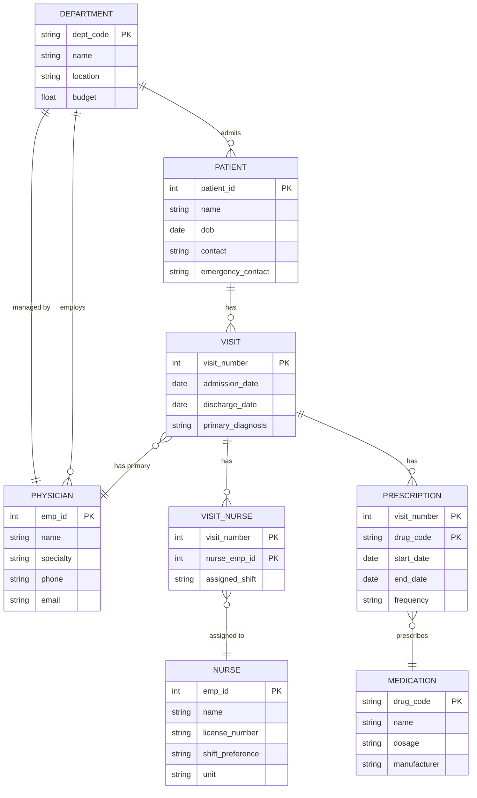

---

### 3. Case Study 2: International Supply Chain & Logistics Tracker

#### Raw Text Description (Business Rules)

> A global logistics company manages the movement of **goods** across its supply chain network. The system needs to track **warehouses**, **shipments**, **orders**, **customers**, and **carriers**.
>
> Each **warehouse** has a unique code, address, capacity, and contact person. A warehouse can be of two types: **Distribution Center** (which has additional dock doors and processing equipment) or **Fulfillment Center** (which has packaging lines and packing stations). A warehouse must be exactly one of these types.
>
> The company has many **customers** identified by a customer ID, with name, address, and credit limit. A customer can place many **orders**, but each order belongs to exactly one customer.
>
> Each **order** has an order number, order date, order status, and total amount. An order can consist of many **order lines**, each tracking a specific **product**, quantity, and unit price. A product can appear in many order lines across different orders.
>
> **Shipments** are created to deliver orders. A shipment can contain many orders, and an order can be split across multiple shipments (in case of partial fulfillment). Each shipment has a tracking number, ship date, delivery date, and shipping status.
>
> **Carriers** (like FedEx, DHL, UPS) are identified by a carrier ID, with name, contact, and service offerings. A shipment is assigned to exactly one carrier. A carrier can handle many shipments.

#### Step-by-Step Extraction Breakdown

##### Step 1: Identify Entities (Nouns)
- Warehouse (Supertype)
  - Distribution Center (Subtype)
  - Fulfillment Center (Subtype)
- Customer
- Order
- Product
- Order_Line (Associative Entity)
- Shipment
- Carrier

##### Step 2: Identify Attributes
- Warehouse: warehouse_code (PK), address, capacity, contact_person
- Distribution Center: dock_doors, processing_equipment
- Fulfillment Center: packaging_lines, packing_stations
- Customer: customer_id (PK), name, address, credit_limit
- Order: order_number (PK), order_date, order_status, total_amount
- Product: product_id (PK), name, weight, category
- Shipment: tracking_number (PK), ship_date, delivery_date, shipping_status
- Carrier: carrier_id (PK), name, contact, service_offerings

##### Step 3: Identify Relationships (Verbs)
1. Warehouse **is a** Distribution Center / Fulfillment Center → Supertype/Subtype
2. Customer **places** Order → 1:M
3. Order **has** Order_Line → 1:M
4. Order_Line **references** Product → M:1
5. Order **included in** Shipment → M:M (associative → Shipment_Order)
6. Shipment **assigned to** Carrier → M:1

##### Step 4: Determine Cardinality & Modality
| Relationship | Cardinality | Modality |
| :--- | :--- | :--- |
| Customer places Order | 1:M | Total: Order (must have customer) |
| Order has Order_Line | 1:M | Total: Order_Line (must belong to order) |
| Order_Line references Product | M:1 | Total: Order_Line (must have product) |
| Order included in Shipment | M:M | Partial: Both (orders may not be shipped yet) |
| Shipment assigned to Carrier | M:1 | Total: Shipment (must have carrier) |

##### Step 5: Resolve M:N with Associative Entities
- Order included in Shipment → `Shipment_Order` (tracking_number, order_number, shipment_date, delivery_confirmation)

##### Complete Mermaid ERD (Production Grade)

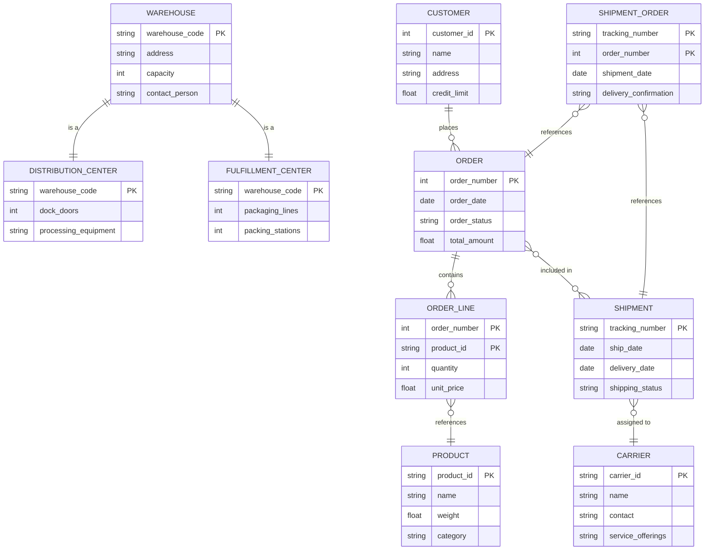

---

### 4. Exam-Style Questions for Practice

Based on the case studies above, here are typical exam questions:

1. **Question**: For the Hospital Management System, identify all weak entities and justify why they are weak.
   - **Answer**: `Visit_Nurse` and `Prescription` are weak entities because they depend on `Visit` for their existence.

2. **Question**: In the Supply Chain System, what is the associative entity and why is it needed?
   - **Answer**: `Shipment_Order` is the associative entity because `Order` and `Shipment` have a many-to-many relationship, and it stores attributes like `shipment_date` and `delivery_confirmation`.

3. **Question**: Explain the supertype/subtype relationship in the Supply Chain System and its constraints.
   - **Answer**: `Warehouse` is the supertype, with `DistributionCenter` and `FulfillmentCenter` as subtypes. It is **disjoint** (a warehouse is exactly one type) and **total** (every warehouse must be one of these types).

---

## Mindset Summary – Connecting to Part 3

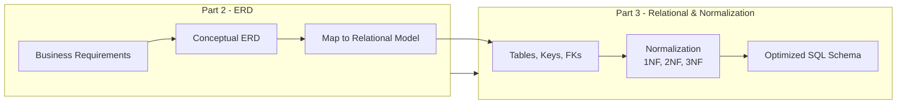

- **ERD is the bridge** between messy business requirements and a clean relational schema.
- **Entities** become **Tables**.
- **Attributes** become **Columns**.
- **Keys** become **Primary Keys**.
- **1:M Relationships** become **Foreign Keys**.
- **M:N Relationships** become **Junction Tables** (resolved during mapping).
- **Supertype/Subtype** → choose a mapping strategy (Single Table, Joined Table, etc.).
- **Associative Entities** → junction tables with additional attributes.

In Part 3, we will take this ERD and **map** it to actual relational tables, then apply **Normalization** to remove anomalies. As a software engineer, you will never skip the ERD step – it's your contract with the business that ensures you build the right thing before you code it.

---
